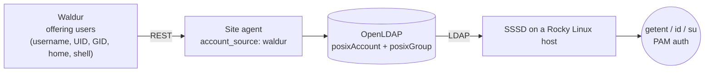

# Waldur → OpenLDAP → SSSD login demo

Shows the whole chain end to end: Waldur holds the POSIX identity, the site agent
writes it into an external OpenLDAP directory, and a Linux host resolves and
authenticates that user through SSSD.



The direction matters. The plugin's default mode (`account_source: ldap`) lets the
directory allocate UIDs and invents usernames itself, which hands the same person
different UIDs on two offerings of one provider. This demo runs the inverted mode,
where Waldur is authoritative — so a provider's offerings converge on **one**
directory entry per user.

## Run it

```bash
./ci/sssd-demo/run-demo.sh          # bring up, populate, verify
./ci/sssd-demo/run-demo.sh --down   # tear down
```

Needs Docker and `uv`. The first run pulls the Waldur image and takes a few
minutes; afterwards it is quick. Ports 8080, 389 and 15674 must be free.

## What it proves

```text
1. Waldur is the authority
   wauser4   uid=9001 gid=9001 home=/home/wauser4 shell=/bin/bash
2. The directory, populated by the agent
   uid: wauser4 / uidNumber: 9001 / gidNumber: 9001 / homeDirectory: /home/wauser4
3. NSS through SSSD
   wauser4:*:9001:9001:E2E User 4:/home/wauser4:/bin/bash
4. Login: session, home directory and shell
   user=wauser4 uid=9001 gid=9001 HOME=/home/wauser4 SHELL=/bin/bash cwd=/home/wauser4
5. PAM authentication through SSSD
   correct password -> Success
   wrong password   -> Authentication failure
```

The reconcile log is the part worth reading. The fixture gives one provider two
offerings against the same directory, and the second one reports:

```text
LDAP reconcile: 2 created, 0 updated, 0 skipped, 0 conflicts   # offering A
LDAP reconcile: 0 created, 0 updated, 0 skipped, 0 conflicts   # offering B
```

Offering B creates nothing: it converges on the entries offering A already wrote,
rather than allocating a second UID for the same person.

## Two honest limits

**The password is injected.** The agent writes `userPassword` only when
`generate_vpn_password` is enabled, and that value is random by design, so the
demo sets a known one with `ldappasswd` purely to exercise PAM. Steps 1–4 are the
shipped code path; only the credential in step 5 is simulated. In production the
password comes from `generate_vpn_password` or the offering's
`shared_user_password` — or you skip passwords and use SSH keys.

**SSH keys are not published.** The plugin writes no `sshPublicKey` attribute, so
`sss_ssh_authorizedkeys` (the mechanism the GLAuth setup uses for key-based login)
has nothing to serve on this path yet.

## Files

| File | Purpose |
|---|---|
| `run-demo.sh` | Entry point: stack, preset, reconcile, SSSD client, proof |
| `reconcile.py` | Drives `process_project_user_sync`, the agent's real reconcile path |
| `Dockerfile` | Rocky Linux 9 client with `sssd`/`sssd-ldap`, NSS and PAM wired by hand |
| `sssd.conf` | Points SSSD at the directory |

`sssd.conf` needs none of the attribute-mapping overrides the GLAuth setup
requires: the agent writes genuine `posixAccount` entries keyed on `uid`, so stock
`rfc2307` applies. That makes this path simpler to operate than the GLAuth one.
