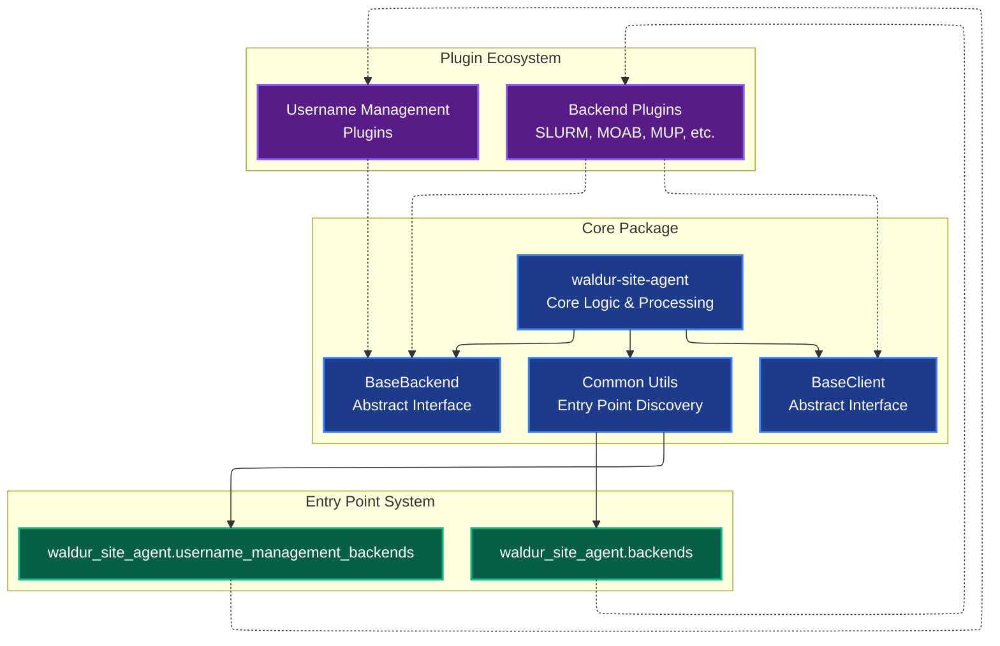
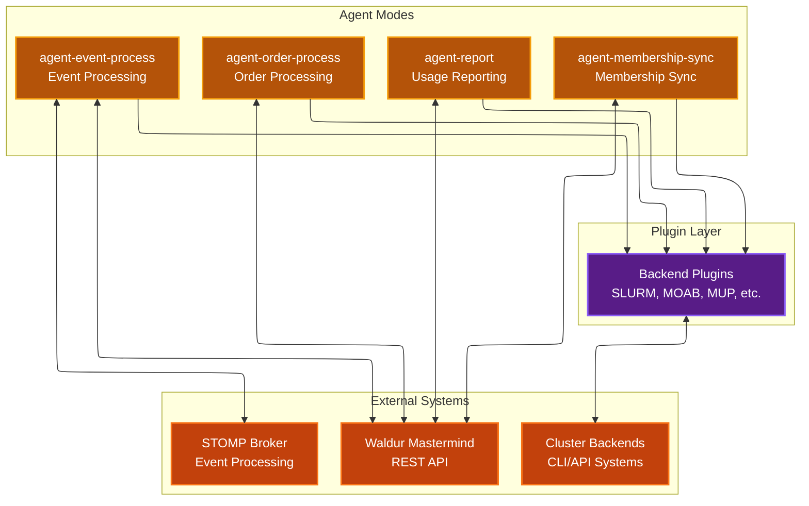
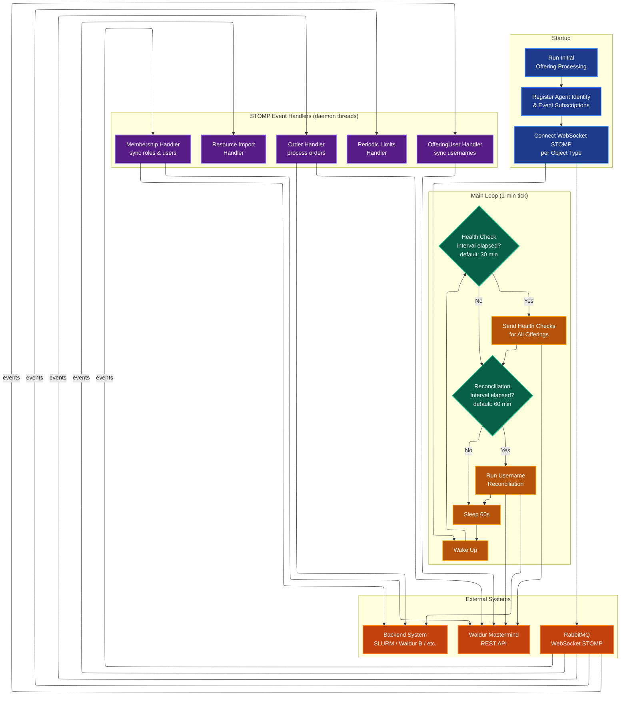

# Plugin Architecture

The Waldur Site Agent uses a pluggable backend system that allows
external developers to create custom backend plugins without modifying the core codebase.

## Core architecture & plugin system



## Agent modes & external systems



## Event processing architecture

The `event_process` mode uses WebSocket STOMP connections to receive real-time events from Waldur Mastermind
via RabbitMQ. The main loop combines event-driven processing with periodic reconciliation to ensure data
consistency even when STOMP messages are missed.

### Event processing flow



### Periodic reconciliation

Event-driven processing can miss updates due to transient STOMP disconnections or message loss.
The main loop includes a periodic reconciliation timer (default: 60 minutes, configurable via
`WALDUR_SITE_AGENT_RECONCILIATION_PERIOD_MINUTES` environment variable) that runs
`sync_offering_user_usernames()` for all STOMP-enabled offerings with a membership sync backend.

This reconciliation is lightweight — it only syncs usernames, not a full membership sync — and is
idempotent, so running it has no side effects when data is already consistent.

### STOMP subscription types

Each offering can subscribe to multiple object types depending on configuration:

- **ORDER**: Order processing events (requires `order_processing_backend`)
- **USER_ROLE**: Role grant/revoke events (requires `membership_sync_backend`)
- **RESOURCE**: Resource lifecycle events (requires `membership_sync_backend`)
- **SERVICE_ACCOUNT**: Service account events (requires `membership_sync_backend`)
- **COURSE_ACCOUNT**: Course account events (requires `membership_sync_backend`)
- **OFFERING_USER**: Offering user create/update events (requires `membership_sync_backend`)
- **IMPORTABLE_RESOURCES**: Resource import events (requires `resource_import_enabled`)
- **RESOURCE_PERIODIC_LIMITS**: Periodic limit updates (requires `periodic_limits.enabled`)

## Key plugin features

- **Automatic Discovery**: Plugins are automatically discovered via Python entry points
- **Modular Backends**: Each backend (SLURM, MOAB, MUP) is a separate plugin package
- **Independent Versioning**: Plugins can be versioned and distributed separately
- **Extensible**: External developers can create custom backends by implementing `BaseBackend`
- **Workspace Integration**: Seamless development with `uv workspace` dependencies
- **Multi-Backend Support**: Different backends for order processing, reporting, and membership sync

## Plugin structure

### Built-in plugin structure

```text
plugins/{backend_name}/
├── pyproject.toml              # Entry point registration
├── waldur_site_agent_{name}/   # Plugin implementation
│   ├── backend.py             # Backend class inheriting BaseBackend
│   ├── client.py              # Client for external system communication
│   └── parser.py              # Data parsing utilities (optional)
└── tests/                     # Plugin-specific tests
```

## Available plugins

### SLURM plugin (`waldur-site-agent-slurm`)

- **Communication**: CLI-based via `sacctmgr`, `sacct`, `scancel` commands
- **Components**: CPU, memory, GPU (TRES-based accounting)
- **Features**:
  - QoS management (downscale, pause, restore)
  - Home directory creation
  - Job cancellation
  - User limit management
- **Parser**: Complex SLURM output parsing with time/unit conversion
- **Client**: `SlurmClient` with command-line execution

### MOAB plugin (`waldur-site-agent-moab`)

- **Communication**: CLI-based via `mam-*` commands
- **Components**: Deposit-based accounting only
- **Features**:
  - Fund management
  - Account creation/deletion
  - Basic user associations
- **Parser**: Simple report line parsing for charges
- **Client**: `MoabClient` with MOAB Accounting Manager integration

### MUP plugin (`waldur-site-agent-mup`)

- **Communication**: HTTP REST API
- **Components**: Configurable limit-based components
- **Features**:
  - Project/allocation management
  - User creation and management
  - Research field mapping
  - Multi-component allocation support
- **Client**: `MUPClient` with HTTP authentication and comprehensive API coverage
- **Advanced**: Most sophisticated plugin with full user lifecycle management

### Waldur federation plugin (`waldur-site-agent-waldur`)

- **Communication**: HTTP REST API (Waldur-to-Waldur)
- **Components**: Configurable mapping with conversion factors (fan-out, fan-in)
- **Features**:
  - Non-blocking order creation with async completion tracking
  - Optional target STOMP subscriptions for instant order-completion notifications
  - Component type conversion between source and target offerings
  - Project tracking via `backend_id` mapping
  - User resolution via CUID, email, or username matching
  - Per-user usage reporting with reverse conversion
- **Client**: `WaldurClient` with `waldur_api_client` (httpx-based)
- **Advanced**: Supports both polling (`order_process`) and event-driven (`event_process`) modes

### Basic username management (`waldur-site-agent-basic-username-management`)

- **Purpose**: Provides base username management interface
- **Implementation**: Minimal placeholder implementation
- **Extensibility**: Template for custom username generation backends

## Creating custom plugins

For comprehensive plugin development instructions, including:

- Full `BaseBackend` and `BaseClient` method references
- Agent mode method matrix (which methods are called when)
- Usage report format specification with examples
- Unit conversion (`unit_factor`) explained
- Common pitfalls and debugging tips
- Testing guidance with mock patterns
- LLM-specific implementation checklist

See **[Plugin Development Guide](plugin-development-guide.md)**.

A ready-to-use plugin template is available at `docs/plugin-template/`.

## Plugin discovery mechanism

The core system automatically discovers plugins through Python entry points:

```python
from importlib.metadata import entry_points

BACKENDS = {
    entry_point.name: entry_point.load()
    for entry_point in entry_points(group="waldur_site_agent.backends")
}
```

This enables:

- **Zero-configuration discovery**: Plugins are found automatically when installed
- **Dynamic loading**: Plugin classes are loaded on-demand
- **Flexible deployment**: Different plugin combinations for different environments
- **Third-party integration**: External plugins work seamlessly with the core system

## Configuration integration

Plugins integrate through offering configuration:

```yaml
offerings:
  - name: "Example Offering"
    backend_type: "slurm"                    # Legacy setting
    order_processing_backend: "slurm"        # Order processing via SLURM
    reporting_backend: "custom-api"          # Custom reporting backend
    membership_sync_backend: "slurm"         # Membership sync via SLURM
    username_management_backend: "custom"    # Custom username generation
```

This allows:

- **Mixed backend usage**: Different backends for different operations
- **Gradual migration**: Transition between backends incrementally
- **Specialized backends**: Use purpose-built backends for specific tasks
- **Development flexibility**: Test new backends alongside production ones
