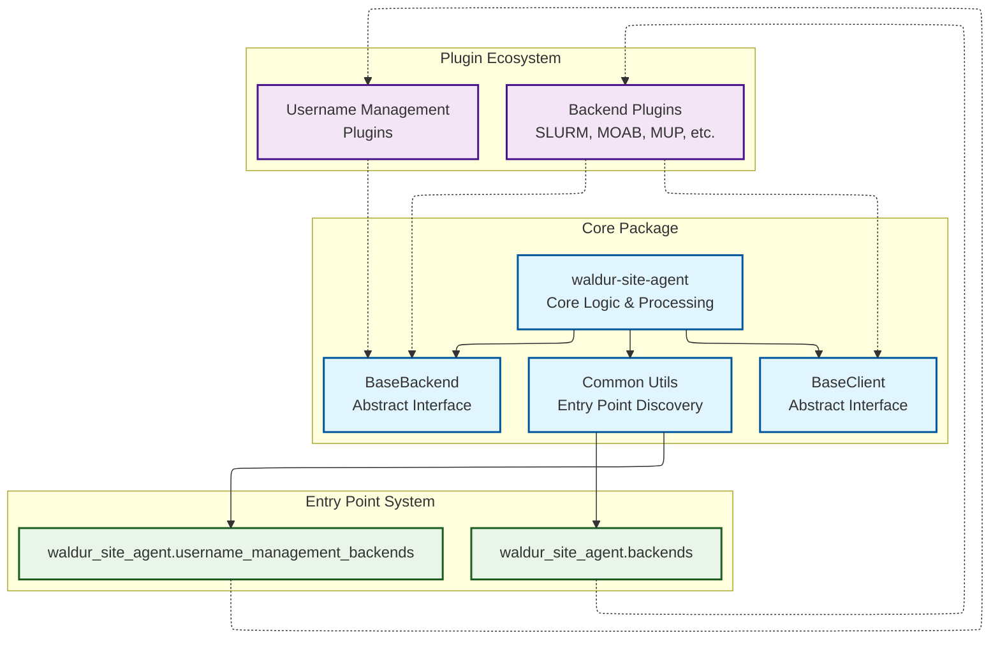
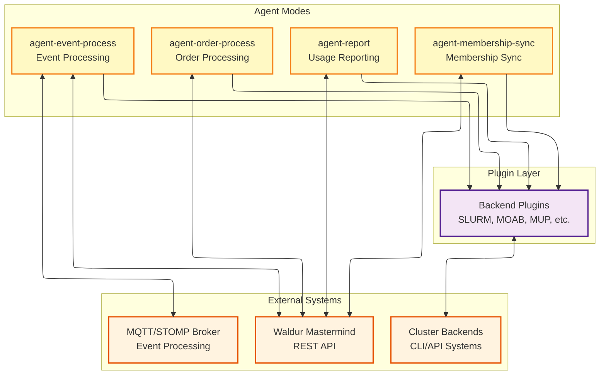

# Plugin Architecture

The Waldur Site Agent uses a pluggable backend system that allows
external developers to create custom backend plugins without modifying the core codebase.

## Core architecture & plugin system



## Agent modes & external systems



## Key plugin features

- **Automatic Discovery**: Plugins are automatically discovered via Python entry points
- **Modular Backends**: Each backend (SLURM, MOAB, MUP) is a separate plugin package
- **Independent Versioning**: Plugins can be versioned and distributed separately
- **Extensible**: External developers can create custom backends by implementing `BaseBackend`
- **Workspace Integration**: Seamless development with `uv workspace` dependencies
- **Multi-Backend Support**: Different backends for order processing, reporting, and membership sync

## Plugin structure

### Built-in plugin structure

```text
plugins/{backend_name}/
├── pyproject.toml              # Entry point registration
├── waldur_site_agent_{name}/   # Plugin implementation
│   ├── backend.py             # Backend class inheriting BaseBackend
│   ├── client.py              # Client for external system communication
│   └── parser.py              # Data parsing utilities (optional)
└── tests/                     # Plugin-specific tests
```

## Available plugins

### SLURM plugin (`waldur-site-agent-slurm`)

- **Communication**: CLI-based via `sacctmgr`, `sacct`, `scancel` commands
- **Components**: CPU, memory, GPU (TRES-based accounting)
- **Features**:
  - QoS management (downscale, pause, restore)
  - Home directory creation
  - Job cancellation
  - User limit management
- **Parser**: Complex SLURM output parsing with time/unit conversion
- **Client**: `SlurmClient` with command-line execution

### MOAB plugin (`waldur-site-agent-moab`)

- **Communication**: CLI-based via `mam-*` commands
- **Components**: Deposit-based accounting only
- **Features**:
  - Fund management
  - Account creation/deletion
  - Basic user associations
- **Parser**: Simple report line parsing for charges
- **Client**: `MoabClient` with MOAB Accounting Manager integration

### MUP plugin (`waldur-site-agent-mup`)

- **Communication**: HTTP REST API
- **Components**: Configurable limit-based components
- **Features**:
  - Project/allocation management
  - User creation and management
  - Research field mapping
  - Multi-component allocation support
- **Client**: `MUPClient` with HTTP authentication and comprehensive API coverage
- **Advanced**: Most sophisticated plugin with full user lifecycle management

### Basic username management (`waldur-site-agent-basic-username-management`)

- **Purpose**: Provides base username management interface
- **Implementation**: Minimal placeholder implementation
- **Extensibility**: Template for custom username generation backends

## Creating Custom Plugins

### Backend Plugin Development

1. **Create plugin package**:

   ```bash
   mkdir my-custom-backend
   cd my-custom-backend
   ```

2. **Setup pyproject.toml**:

   ```toml
   [project]
   name = "waldur-site-agent-mycustom"
   version = "0.1.0"
   dependencies = ["waldur-site-agent==0.1.0"]

   [project.entry-points."waldur_site_agent.backends"]
   mycustom = "waldur_site_agent_mycustom.backend:MyCustomBackend"
   ```

3. **Implement backend class**:

   ```python
   from waldur_site_agent.backend.backends import BaseBackend

   class MyCustomBackend(BaseBackend):
       def ping(self):
           # Health check implementation
           pass

       def _get_usage_report(self):
           # Usage reporting implementation
           pass

       # Implement other required methods...
   ```

4. **Install and register**:

   ```bash
   uv sync --all-packages
   ```

### Username management plugin development

1. **Entry point registration**:

   ```toml
   [project.entry-points."waldur_site_agent.username_management_backends"]
   custom_username = "your_project.backend.usernames:CustomUsernameManagementBackend"
   ```

2. **Implementation**:

   ```python
   from waldur_site_agent.backend.backends import AbstractUsernameManagementBackend

   class CustomUsernameManagementBackend(AbstractUsernameManagementBackend):
       def generate_username(self, user_data):
           # Custom username generation logic
           pass
   ```

3. **Configuration**:

   ```yaml
   offerings:
     - name: "My Offering"
       username_management_backend: "custom_username"
   ```

## Plugin discovery mechanism

The core system automatically discovers plugins through Python entry points:

```python
from importlib.metadata import entry_points

BACKENDS = {
    entry_point.name: entry_point.load()
    for entry_point in entry_points(group="waldur_site_agent.backends")
}
```

This enables:
- **Zero-configuration discovery**: Plugins are found automatically when installed
- **Dynamic loading**: Plugin classes are loaded on-demand
- **Flexible deployment**: Different plugin combinations for different environments
- **Third-party integration**: External plugins work seamlessly with the core system

## Configuration integration

Plugins integrate through offering configuration:

```yaml
offerings:
  - name: "Example Offering"
    backend_type: "slurm"                    # Legacy setting
    order_processing_backend: "slurm"        # Order processing via SLURM
    reporting_backend: "custom-api"          # Custom reporting backend
    membership_sync_backend: "slurm"         # Membership sync via SLURM
    username_management_backend: "custom"    # Custom username generation
```

This allows:
- **Mixed backend usage**: Different backends for different operations
- **Gradual migration**: Transition between backends incrementally
- **Specialized backends**: Use purpose-built backends for specific tasks
- **Development flexibility**: Test new backends alongside production ones
