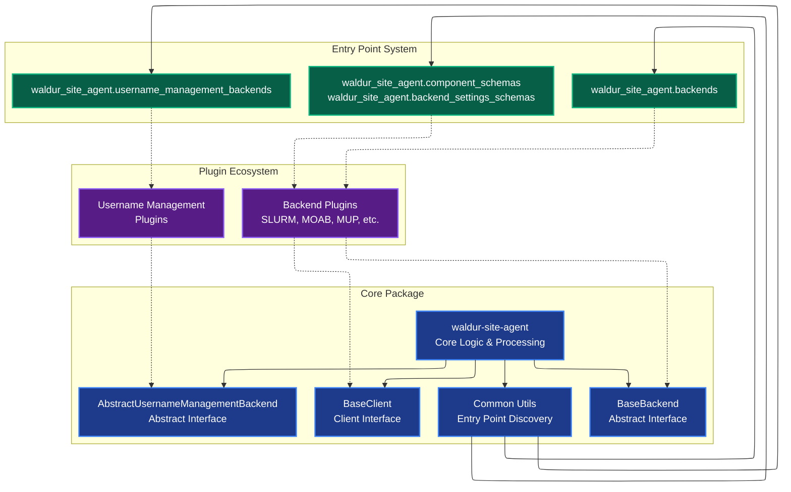
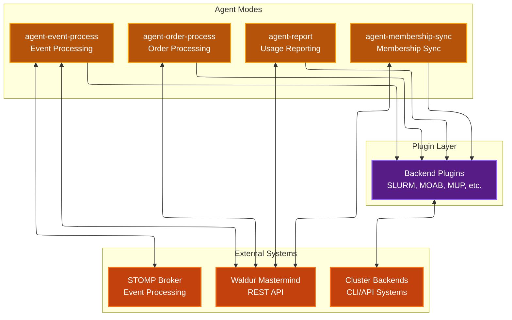
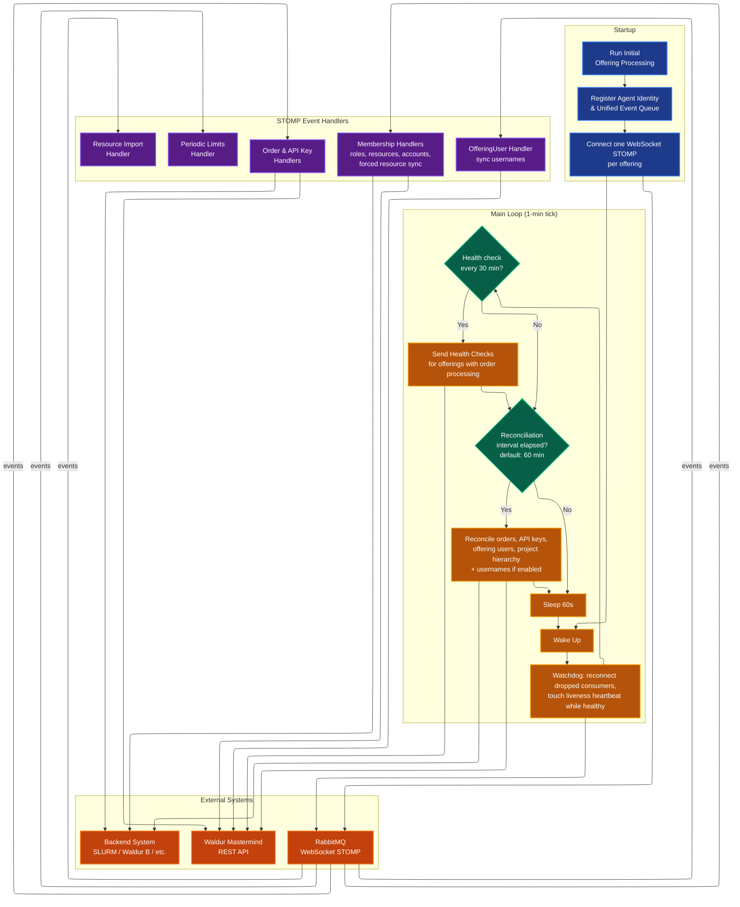

# Plugin Architecture

The Waldur Site Agent uses a pluggable backend system that allows
external developers to create custom backend plugins without modifying the core codebase.

## Core architecture & plugin system


```mermaid
---
config:
  layout: elk
---
graph TB
    subgraph "Core Package"
        WA[waldur-site-agent<br/>Core Logic & Processing]
        BB[BaseBackend<br/>Abstract Interface]
        BC[BaseClient<br/>Client Interface]
        UB[AbstractUsernameManagementBackend<br/>Abstract Interface]
        CU[Common Utils<br/>Entry Point Discovery]
    end

    subgraph "Plugin Ecosystem"
        PLUGINS[Backend Plugins<br/>SLURM, MOAB, MUP, etc.]
        UMANAGE[Username Management<br/>Plugins]
    end

    subgraph "Entry Point System"
        EP_BACKENDS[waldur_site_agent.backends]
        EP_USERNAME[waldur_site_agent.username_management_backends]
        EP_SCHEMAS[waldur_site_agent.component_schemas<br/>waldur_site_agent.backend_settings_schemas]
    end

    %% Core dependencies
    WA --> BB
    WA --> BC
    WA --> UB
    WA --> CU

    %% Plugin registration and discovery
    CU --> EP_BACKENDS
    CU --> EP_USERNAME
    CU --> EP_SCHEMAS
    EP_BACKENDS -.-> PLUGINS
    EP_USERNAME -.-> UMANAGE
    EP_SCHEMAS -.-> PLUGINS

    %% Plugin inheritance
    PLUGINS -.-> BB
    PLUGINS -.-> BC
    UMANAGE -.-> UB

    %% Styling - Dark mode compatible colors
    classDef corePackage fill:#1E3A8A,stroke:#3B82F6,stroke-width:2px,color:#FFFFFF
    classDef plugin fill:#581C87,stroke:#8B5CF6,stroke-width:2px,color:#FFFFFF
    classDef entrypoint fill:#065F46,stroke:#10B981,stroke-width:2px,color:#FFFFFF

    class WA,BB,BC,UB,CU corePackage
    class PLUGINS,UMANAGE plugin
    class EP_BACKENDS,EP_USERNAME,EP_SCHEMAS entrypoint
```

## Agent modes & external systems


```mermaid
---
config:
  layout: elk
---
graph TB
    subgraph "Agent Modes"
        ORDER[agent-order-process<br/>Order Processing]
        REPORT[agent-report<br/>Usage Reporting]
        SYNC[agent-membership-sync<br/>Membership Sync]
        EVENT[agent-event-process<br/>Event Processing]
    end

    subgraph "Plugin Layer"
        PLUGINS[Backend Plugins<br/>SLURM, MOAB, MUP, etc.]
    end

    subgraph "External Systems"
        WALDUR[Waldur Mastermind<br/>REST API]
        BACKENDS[Cluster Backends<br/>CLI/API Systems]
        STOMP[STOMP Broker<br/>Event Processing]
    end

    %% Agent mode usage of plugins
    ORDER --> PLUGINS
    REPORT --> PLUGINS
    SYNC --> PLUGINS
    EVENT --> PLUGINS

    %% External connections
    ORDER <--> WALDUR
    REPORT <--> WALDUR
    SYNC <--> WALDUR
    EVENT <--> WALDUR
    EVENT <--> STOMP
    PLUGINS <--> BACKENDS

    %% Styling - Dark mode compatible colors
    classDef agent fill:#B45309,stroke:#F59E0B,stroke-width:2px,color:#FFFFFF
    classDef plugin fill:#581C87,stroke:#8B5CF6,stroke-width:2px,color:#FFFFFF
    classDef external fill:#C2410C,stroke:#F97316,stroke-width:2px,color:#FFFFFF

    class ORDER,REPORT,SYNC,EVENT agent
    class PLUGINS plugin
    class WALDUR,BACKENDS,STOMP external
```

## Event processing architecture

The `event_process` mode uses WebSocket STOMP connections to receive real-time events from Waldur Mastermind
via RabbitMQ. The main loop combines event-driven processing with periodic reconciliation to ensure data
consistency even when STOMP messages are missed.

### Event processing flow


```mermaid
---
config:
  layout: elk
---
graph TB
    subgraph "Startup"
        INIT[Run Initial<br/>Offering Processing]
        REG[Register Agent Identity<br/>& Unified Event Queue]
        STOMP_CONN[Connect one WebSocket STOMP<br/>per offering]
    end

    subgraph "Main Loop (1-min tick)"
        TICK[Wake Up]
        WD[Watchdog: reconnect dropped consumers,<br/>touch liveness heartbeat while healthy]
        HC_CHECK{Health check<br/>every 30 min?}
        HC[Send Health Checks<br/>for offerings with order processing]
        RC_CHECK{Reconciliation<br/>interval elapsed?<br/>default: 60 min}
        RC[Reconcile orders, API keys,<br/>offering users, project hierarchy<br/>+ usernames if enabled]
        SLEEP[Sleep 60s]
    end

    subgraph "STOMP Event Handlers"
        ORDER_H[Order & API Key<br/>Handlers]
        MEMBER_H[Membership Handlers<br/>roles, resources, accounts,<br/>forced resource sync]
        OU_H[OfferingUser Handler<br/>sync usernames]
        IMPORT_H[Resource Import<br/>Handler]
        LIMITS_H[Periodic Limits<br/>Handler]
    end

    subgraph "External Systems"
        WALDUR[Waldur Mastermind<br/>REST API]
        RMQ[RabbitMQ<br/>WebSocket STOMP]
        BACKEND[Backend System<br/>SLURM / Waldur B / etc.]
    end

    %% Startup flow
    INIT --> REG --> STOMP_CONN

    %% Main loop
    STOMP_CONN --> TICK
    TICK --> WD --> HC_CHECK
    HC_CHECK -->|Yes| HC --> RC_CHECK
    HC_CHECK -->|No| RC_CHECK
    RC_CHECK -->|Yes| RC --> SLEEP
    RC_CHECK -->|No| SLEEP
    SLEEP --> TICK

    %% STOMP event handlers
    RMQ -->|events| ORDER_H
    RMQ -->|events| MEMBER_H
    RMQ -->|events| OU_H
    RMQ -->|events| IMPORT_H
    RMQ -->|events| LIMITS_H

    %% External connections
    ORDER_H --> WALDUR
    MEMBER_H --> WALDUR
    OU_H --> WALDUR
    HC --> WALDUR
    RC --> WALDUR
    RC --> BACKEND
    ORDER_H --> BACKEND
    MEMBER_H --> BACKEND
    STOMP_CONN --> RMQ
    WD --> RMQ

    %% Styling - Dark mode compatible colors
    classDef startup fill:#1E3A8A,stroke:#3B82F6,stroke-width:2px,color:#FFFFFF
    classDef loop fill:#B45309,stroke:#F59E0B,stroke-width:2px,color:#FFFFFF
    classDef handler fill:#581C87,stroke:#8B5CF6,stroke-width:2px,color:#FFFFFF
    classDef external fill:#C2410C,stroke:#F97316,stroke-width:2px,color:#FFFFFF
    classDef decision fill:#065F46,stroke:#10B981,stroke-width:2px,color:#FFFFFF

    class INIT,REG,STOMP_CONN startup
    class TICK,WD,HC,RC,SLEEP loop
    class ORDER_H,MEMBER_H,OU_H,IMPORT_H,LIMITS_H handler
    class WALDUR,RMQ,BACKEND external
    class HC_CHECK,RC_CHECK decision
```

Each STOMP-enabled offering registers **one** consumer queue (`consumer_<uuid>`) for its agent
identity and opens one WebSocket STOMP connection to it. Every event type the offering subscribes
to arrives on that queue; the payload's `object_type` picks the handler.

### Periodic reconciliation

Event-driven processing can miss updates — a dropped connection loses messages that were in flight.
The main loop therefore runs a reconciliation pass on its first tick and then every
`WALDUR_SITE_AGENT_RECONCILIATION_PERIOD_MINUTES` (default 60). It covers every offering in the
configuration, STOMP-enabled or not:

<!-- pyml disable-num-lines 7 line-length -->
| Step | Runs for offerings with | What it does |
| ---- | ----------------------- | ------------ |
| Order reconciliation | `order_processing_backend` | Re-processes orders stuck in `executing` or `pending-provider` for 30+ minutes |
| API key reconciliation | `order_processing_backend` and a backend that supports resource API keys | Re-issues API key commands whose reply never reached Waldur |
| Offering user reconciliation | `membership_sync_backend` | Retries username generation for offering users stuck in a pre-OK state; then runs the username backend's own reconcile and deletion sweep (that part also runs without a membership backend) |
| Project hierarchy sync | `membership_sync_backend` | Checks and corrects the backend account hierarchy |
| Username reconciliation | `username_reconciliation_enabled: true` | Pulls backend-assigned usernames back into Waldur |

Every step is idempotent: on an offering whose state is already consistent it changes nothing.
Health checks are sent on their own fixed 30-minute timer.

### STOMP connection watchdog and liveness

No STOMP connect is unbounded outside a listener's own reconnect loop: at startup each
offering gets three attempts (each limited to 30 s for the WebSocket handshake and the
broker's CONNECTED frame), and a queue that registered but could not connect is kept, so the
main loop always starts and later only reconnects it.

Each listener reconnects on its own after a disconnect, but gives up after ten attempts
(roughly ten minutes of exponential backoff). On every tick (60 s) the main loop's watchdog
makes one bounded attempt for any consumer still disconnected, and retries each missing
consumer of a STOMP-enabled offering separately — the offering's own queue and, for
federation, the target subscription — with backoff up to 15 minutes. A consumer only counts
as recovered after two consecutive ticks connected, so a queue the broker closes right after
connecting does not look healthy. When the broker reports the queue is gone (`NOT_FOUND`),
the listener registers it again before reconnecting.

While everything is connected the loop touches the liveness heartbeat as usual. Once the
offering's own consumer, or a transiently failing setup, has stayed down longer than
`WALDUR_SITE_AGENT_STOMP_UNHEALTHY_AFTER_MINUTES` (default 15, above the listener's own retry
window), the loop stops touching the heartbeat and an orchestrator restarts the agent. The
probe fails only once the heartbeat is older than its own maximum age
(`waldur_site_healthz --max-age`, default 300 s), so the time from the outage to a failed
probe is roughly the threshold plus five minutes, plus the probe's period × failure
threshold before the restart. The watchdog keeps retrying meanwhile; the heartbeat resumes
the tick the connection comes back.

What a restart cannot fix only logs at ERROR and never withholds the heartbeat: a federation
target's consumer (another Waldur's broker), and a setup refused with a 4xx other than 408/429
(for example a queue held by another user, 409), which is retried every 15 minutes.

### STOMP subscription types

Which object types an offering's queue receives depends on its configuration. "Membership events
on" below means `membership_sync_backend` is set and `stomp_membership_sync_enabled` is not
`false`.

<!-- pyml disable-num-lines 8 line-length -->
| Object type | Subscribed when |
| ----------- | --------------- |
| `order`, `resource_api_key_rotation` | `order_processing_backend` is set |
| `user_role`, `resource`, `service_account`, `course_account`, `offering_user`, `offering_resources_sync` | membership events on |
| `offering_user` only | no membership backend, `stomp_membership_sync_enabled` not `false`, and the username backend has reconcile hooks (LDAP, for example) |
| `service_provider_project_group` | `stomp_membership_sync_enabled` not `false` and the username backend writes project groups |
| `importable_resources` | `resource_import_enabled: true` |
| `resource_periodic_limits` | `backend_settings.periodic_limits.enabled: true` |

Leaving `membership_sync_backend` out of an `event_process` offering therefore turns membership sync
off for it; it does not fall back to polling. To poll membership while orders come over STOMP, set
`stomp_membership_sync_enabled: false` and run a `membership_sync` agent.

## Key plugin features

- **Automatic Discovery**: Plugins are automatically discovered via Python entry points
- **Modular Backends**: Each backend (SLURM, MOAB, MUP) is a separate plugin package
- **Independent Versioning**: Plugins can be versioned and distributed separately
- **Extensible**: External developers can create custom backends by implementing `BaseBackend`
- **Workspace Integration**: Seamless development with `uv workspace` dependencies
- **Multi-Backend Support**: Different backends for order processing, reporting, and membership sync

## Plugin structure

### Built-in plugin structure

```text
plugins/{backend_name}/
├── pyproject.toml              # Entry point registration
├── waldur_site_agent_{name}/   # Plugin implementation
│   ├── backend.py             # Backend class inheriting BaseBackend
│   ├── client.py              # Client for external system communication
│   └── parser.py              # Data parsing utilities (optional)
└── tests/                     # Plugin-specific tests
```

## Available plugins

The full list of plugin packages is the plugin table in the [README](../README.md#plugins). The
sections below describe a selection.

### SLURM plugin (`waldur-site-agent-slurm`)

- **Communication**: `sacctmgr` / `sacct` / `scancel` commands, or the `slurmrestd` REST API
  (`execution_mode: rest`)
- **Components**: CPU, memory, GPU (TRES-based accounting)
- **Features**:
  - QoS management (downscale, pause, restore)
  - Home directory creation
  - Job cancellation
  - User limit management
- **Parser**: Complex SLURM output parsing with time/unit conversion
- **Client**: `SlurmClient` with command-line execution

### MOAB plugin (`waldur-site-agent-moab`)

- **Communication**: CLI-based via `mam-*` commands
- **Components**: Deposit-based accounting only
- **Features**:
  - Fund management
  - Account creation/deletion
  - Basic user associations
- **Parser**: Simple report line parsing for charges
- **Client**: `MoabClient` with MOAB Accounting Manager integration

### MUP plugin (`waldur-site-agent-mup`)

- **Communication**: HTTP REST API
- **Components**: Configurable limit-based components
- **Features**:
  - Project/allocation management
  - User creation and management
  - Research field mapping
  - Multi-component allocation support
- **Client**: `MUPClient` with HTTP authentication and comprehensive API coverage
- **Advanced**: Most sophisticated plugin with full user lifecycle management

### Waldur federation plugin (`waldur-site-agent-waldur`)

- **Communication**: HTTP REST API (Waldur-to-Waldur)
- **Components**: Configurable mapping with conversion factors (fan-out, fan-in)
- **Features**:
  - Non-blocking order creation with async completion tracking
  - Optional target STOMP subscriptions for instant order-completion notifications
  - Component type conversion between source and target offerings
  - Project tracking via `backend_id` mapping
  - User resolution via CUID, email, or username matching
  - Per-user usage reporting with reverse conversion
- **Client**: `WaldurClient` with `waldur_api_client` (httpx-based)
- **Advanced**: Supports both polling (`order_process`) and event-driven (`event_process`) modes

### Basic username management (`waldur-site-agent-basic-username-management`)

- **Purpose**: Provides base username management interface
- **Implementation**: Minimal placeholder implementation
- **Extensibility**: Template for custom username generation backends

### Rancher plugin (`waldur-site-agent-rancher`)

- **Communication**: HTTP REST API (Rancher v3, direct)
- **Components**: Project resourceQuota cap (CPU / memory / storage)
- **Features**:
  - Direct project create / update / delete on a single Rancher cluster
  - Per-namespace resource quotas + namespace creation
  - Keycloak group membership sync via `keycloak-client` shared package
  - Membership sync + order processing modes both supported
- **Client**: `RancherClient` (httpx-based) talking to one cluster per
  offering (cluster_id is offering-level config)

### Rancher CRD-driven plugin (`waldur-site-agent-rancher-kc-crd`)

- **Communication**: Kubernetes API — writes `ManagedRancherProject`
  CRs that the [`rancher-keycloak-operator`](https://github.com/waldur/rancher-keycloak-operator)
  reconciles
- **Scope**: Membership sync only — no order processing, no usage
  reporting (the operator owns Rancher + Keycloak mutations)
- **Multi-cluster**: One offering can hold N Resources, each with its
  own `backend_id` = Rancher cluster ID. The plugin reads cluster_id
  per-Resource at CR-build time
- **Features**:
  - One CR per Waldur ResourceProject; operator translates to Rancher
    project + project-level resourceQuota.limit + Keycloak groups +
    PRTBs
  - Drives RP FSM (`Creating → OK` on operator phase=Ready,
    `→ Erred` on phase=Error) so the homeport UI reflects the
    downstream reconcile state
  - Per-RP Keycloak group naming so member-sync doesn't thrash a
    shared cluster-level group
- **Client**: thin `kubernetes` Python wrapper for `apply` / `get` /
  `list` / `delete` of CRs in one namespace
- **Pairs with**: operator `0.3.1`+ (recommended)

## Creating custom plugins

For comprehensive plugin development instructions, including:

- Full `BaseBackend` and `BaseClient` method references
- Agent mode method matrix (which methods are called when)
- Usage report format specification with examples
- Unit conversion (`unit_factor`) explained
- Common pitfalls and debugging tips
- Testing guidance with mock patterns
- LLM-specific implementation checklist

See **[Plugin Development Guide](plugin-development-guide.md)**.

A ready-to-use plugin template is available at `docs/plugin-template/`.

## Plugin discovery mechanism

`waldur_site_agent.common.utils` builds the backend registries from entry points when it is
imported:

```python
BACKENDS: dict[str, tuple[type[BaseBackend], str, str]] = {
    entry_point.name: (
        entry_point.load(),                      # backend class
        entry_point.dist.name if entry_point.dist else entry_point.name,  # distribution
        version(entry_point.dist.name) if entry_point.dist else "unknown",  # its version
    )
    for entry_point in entry_points(group="waldur_site_agent.backends")
}
```

`USERNAME_BACKENDS` is built the same way from `waldur_site_agent.username_management_backends`.
The settings and component schemas are discovered from their own groups when a configuration file
is loaded.

This means:

- **Zero-configuration discovery**: an installed plugin is found without any registration step.
- **Eager loading**: importing `common.utils` imports every installed backend plugin. A plugin
  module that imports `common.utils` at module level therefore creates an import cycle — import it
  inside the function that needs it.
- **Flexible deployment**: the set of available backends is whatever plugin packages are installed
  next to the core package.

## Configuration integration

Plugins integrate through offering configuration:

<!-- docs-check: skip -->

```yaml
offerings:
  - name: "Example Offering"
    backend_type: "slurm"                    # Selects the settings/component schemas
    order_processing_backend: "slurm"        # Order processing via SLURM
    reporting_backend: "custom-api"          # A third-party reporting backend
    membership_sync_backend: "slurm"         # Membership sync via SLURM
    username_management_backend: "custom"    # A third-party username backend
```

This allows:

- **Mixed backend usage**: Different backends for different operations
- **Gradual migration**: Transition between backends incrementally
- **Specialized backends**: Use purpose-built backends for specific tasks
- **Development flexibility**: Test new backends alongside production ones
