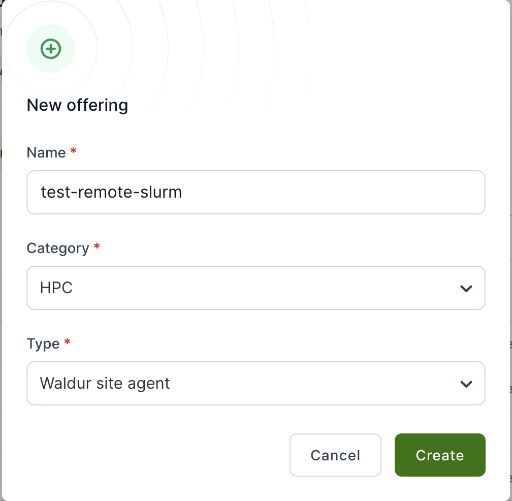
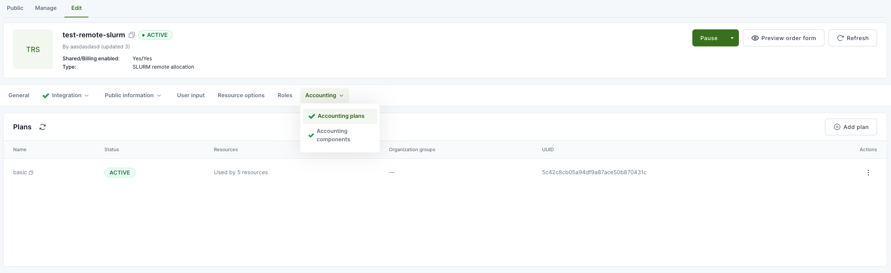
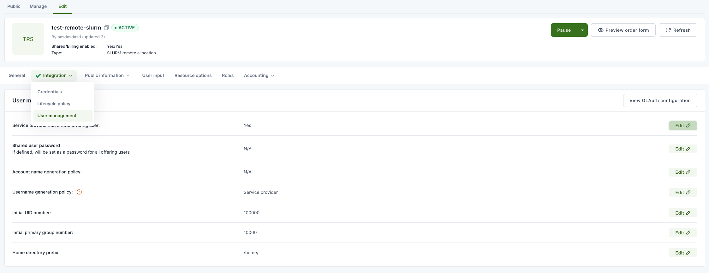
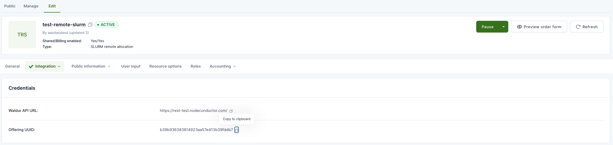

# Installation Guide

This guide covers the complete installation and setup process for Waldur Site Agent.

## Prerequisites

### Waldur Offering Configuration

Before installing the agent, you need to create and configure an offering in Waldur:

#### Create Offering

- Go to `Service Provider` section of your organization
- Open offering creation menu
- Input a name, choose a category
- Select `Waldur site agent` from the drop-down list
- Click `Create` button

   

#### Configure Accounting Plan

- Open the offering page, choose `Edit` tab
- Click `Accounting` section
- Choose `Accounting plans` from the drop-down list
- Click `Add plan` and input the necessary details

   

#### Enable User Management

- In the same page, click `Integration` section
- Choose `User management` from the drop-down list
- Set `Service provider can create offering user` option to `Yes`

   

#### Activate Offering

- Activate the offering using the big green button `Activate`

#### Get Offering UUID

- Copy the UUID from the `Integration -> Credentials` section
- You'll need this for the agent configuration file

   

## Installation

### OS-Specific Installation Guides

For detailed, platform-specific installation instructions:

- [Ubuntu 24.04 LTS](installation-ubuntu24.md) - **⭐ Recommended** - Complete guide for Ubuntu 24.04 LTS
  *(fully validated)*
- [Rocky Linux 9](installation-rocky9.md) - Complete guide for Rocky Linux 9.x *(validated)*

**Recommendation**: Ubuntu 24.04 LTS provides the best installation experience with Python 3.12, modern
development tools, and fastest setup time.

### Basic Installation

```bash
pip install waldur-site-agent
```

### Development Installation

For development or custom plugin work:

```bash
# Clone the repository
git clone https://github.com/waldur/waldur-site-agent.git
cd waldur-site-agent

# Install with uv
uv sync --all-packages

# Verify installation
uv run waldur_site_agent --help
```

## Configuration

### Create Configuration File

```bash
sudo mkdir -p /etc/waldur

sudo curl -L \
https://raw.githubusercontent.com/waldur/waldur-site-agent/main/examples/waldur-site-agent-config.yaml.example \
  -o /etc/waldur/waldur-site-agent-config.yaml
```

### Load Components

Load computing components into Waldur (required for offering setup):

```bash
waldur_site_load_components -c /etc/waldur/waldur-site-agent-config.yaml
```

### Create Home Directories (Optional)

If your backend requires home directory creation:

```bash
waldur_site_create_homedirs -c /etc/waldur/waldur-site-agent-config.yaml
```

## Plugin-Specific Requirements

### SLURM Plugin

- Requires access to SLURM command-line utilities (`sacct`, `sacctmgr`)
- Must run on a SLURM cluster head node
- User running the agent needs SLURM administrator privileges

### MOAB Plugin

- Requires access to MOAB command-line utilities (`mam-list-accounts`, `mam-create-account`)
- Must run on a MOAB cluster head node as root user
- Only supports `deposit` component type

### MUP Plugin

- Requires API access to MUP portal
- Needs valid API credentials in configuration

## Verification

Test your installation:

```bash
# Check agent help
waldur_site_agent --help

# Test configuration
waldur_site_diagnostics -c /etc/waldur/waldur-site-agent-config.yaml

# Run dry-run mode (if available)
waldur_site_agent -m order_process -c /etc/waldur/waldur-site-agent-config.yaml --dry-run
```

## Next Steps

After installation:

1. Configure your agent settings in `/etc/waldur/waldur-site-agent-config.yaml`
2. Set up systemd services for production deployment
3. Configure monitoring and logging

See the [Configuration Reference](configuration.md) and [Deployment Guide](deployment.md) for detailed next steps.
