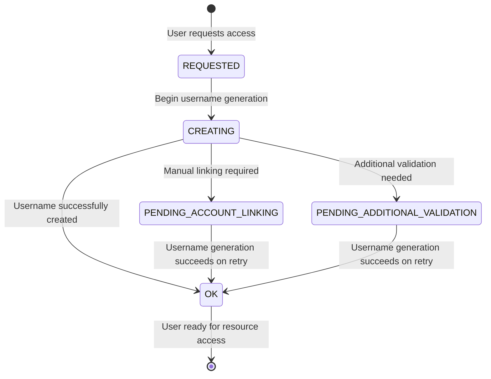

# Offering Users and Async User Creation

The Waldur Site Agent provides robust support for managing offering users with asynchronous username generation and
state management. This system enables non-blocking user processing and supports complex username generation scenarios
through a pluggable backend architecture.

## Overview

Offering users represent the relationship between Waldur users and marketplace offerings. The agent handles username
generation, state transitions, and integration with backend systems to ensure users can access provisioned resources.

## Async User Creation Workflow

### State Machine

The async user creation follows a state-based workflow that prevents blocking operations:



### State Descriptions

- **REQUESTED**: Initial state when user requests access to an offering
- **CREATING**: Transitional state during username generation process
- **OK**: Username successfully generated and user is ready for resource access
- **PENDING_ACCOUNT_LINKING**: Manual intervention required to link user accounts
- **PENDING_ADDITIONAL_VALIDATION**: Additional validation steps needed before proceeding

## Core Components

### Main Functions

#### `sync_offering_users()`

Entry point function that processes all offering users across configured offerings.

**Usage**:

```bash
uv run waldur_sync_offering_users -c config.yaml
```

**Behavior**:

- Iterates through all configured offerings
- Retrieves offering users from Waldur API
- Delegates processing to `update_offering_users()`

#### `update_offering_users()`

Core processing function that handles username generation and state transitions.

**Process**:
1. Checks offering's username generation policy
2. Processes users in REQUESTED state
3. Handles users in pending states (PENDING_ACCOUNT_LINKING, PENDING_ADDITIONAL_VALIDATION)
4. Manages state transitions and error handling

### Username Management Backend System

The agent uses a pluggable backend architecture for username generation, allowing custom implementations for different
identity providers and naming conventions.

#### Base Abstract Class

```python
from waldur_site_agent.backend.backends import AbstractUsernameManagementBackend

class CustomUsernameBackend(AbstractUsernameManagementBackend):
    def generate_username(self, offering_user: OfferingUser) -> str:
        """Generate new username based on offering user details."""
        # Custom logic here
        return generated_username

    def get_username(self, offering_user: OfferingUser) -> Optional[str]:
        """Retrieve existing username from local identity provider."""
        # Custom lookup logic here
        return existing_username
```

#### Plugin Registration

Register your backend via entry points in `pyproject.toml`:

```toml
[project.entry-points."waldur_site_agent.username_management_backends"]
custom_backend = "my_package.backend:CustomUsernameBackend"
```

#### Built-in Backends

- **base**: Basic username management backend (plugins/basic_username_management/)
- **UnknownUsernameManagementBackend**: Fallback backend when configuration is missing

## Configuration

### Offering Configuration

Configure username management per offering in your agent configuration:

```yaml
offerings:
  - name: "SLURM Cluster"
    waldur_api_url: "https://waldur.example.com/api/"
    waldur_api_token: "your-token"
    waldur_offering_uuid: "offering-uuid"
    backend_type: "slurm"
    username_management_backend: "custom_backend"  # References entry point name
    backend_settings:
      # ... other settings
```

### Prerequisites

1. **Service Provider Username Generation**: The offering must be configured
   with `username_generation_policy = SERVICE_PROVIDER` in Waldur
2. **Backend Plugin**: Appropriate username management backend must be installed and configured
3. **Permissions**: API token must have permissions to manage offering users

## Integration with Order Processing

The async user creation system is seamlessly integrated with the agent's order processing workflows:

### Automatic Processing

Username generation is automatically triggered during:
- Resource creation orders
- User addition to existing resources
- Membership synchronization operations

### Implementation in Processors

The `OfferingBaseProcessor` class provides `_update_offering_users()` method that:

1. Calls username generation for users with blank usernames
2. Refreshes offering user data after processing
3. Filters users to only include those with valid usernames for resource operations

**Example usage in order processing**:

```python
# Before adding users to a resource
offering_users = self._get_waldur_offering_users()
self._update_offering_users(offering_users)

# Refresh data after username generation
offering_users = self._get_waldur_offering_users()

# Use only users with valid usernames
valid_usernames = {
    user.username for user in offering_users
    if user.state == OfferingUserStateEnum.OK and user.username
}
```

## Error Handling

### Exception Types

The system defines specific exceptions for different error scenarios:

- **`OfferingUserAccountLinkingRequiredError`**: Raised when manual account linking is required
- **`OfferingUserAdditionalValidationRequiredError`**: Raised when additional validation steps are needed

### Error Recovery

When exceptions occur:
1. User state transitions to appropriate pending state
2. Error details are logged with context
3. Comment field is updated with error information
4. Processing continues for other users
5. Pending users are retried in subsequent runs

## Best Practices

### Username Backend Implementation

1. **Idempotent Operations**: Ensure `get_or_create_username()` can be called multiple times safely
2. **Error Handling**: Raise appropriate exceptions for recoverable errors
3. **Logging**: Include detailed logging for troubleshooting
4. **Validation**: Validate generated usernames meet backend system requirements

### Deployment Considerations

1. **Regular Sync**: Run `waldur_sync_offering_users` regularly via cron or systemd timer
2. **Monitoring**: Monitor pending user states for manual intervention needs
3. **Backup Strategy**: Consider username mapping backup for disaster recovery
4. **Testing**: Test username generation logic thoroughly before production deployment

## Troubleshooting

### Diagnostic Commands

```bash
# Check system health
uv run waldur_site_diagnostics -c config.yaml

# Manual user sync
uv run waldur_sync_offering_users -c config.yaml

# Check offering user states via API
curl -H "Authorization: Token YOUR_TOKEN" \
  "https://waldur.example.com/api/marketplace-offering-users/?offering_uuid=OFFERING_UUID"
```
