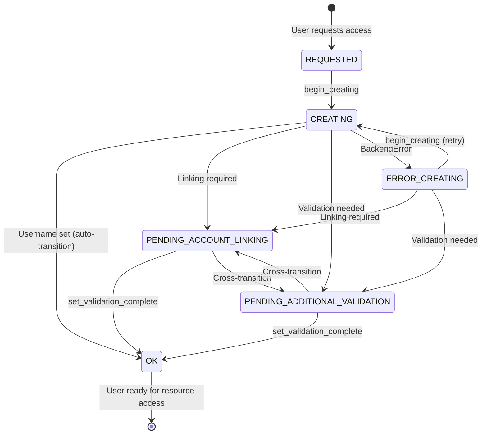

# Offering Users and Async User Creation

The Waldur Site Agent provides robust support for managing offering users with asynchronous username generation and
state management. This system enables non-blocking user processing and supports complex username generation scenarios
through a pluggable backend architecture.

## Overview

Offering users represent the relationship between Waldur users and marketplace offerings. The agent handles username
generation, state transitions, and integration with backend systems to ensure users can access provisioned resources.

## Async User Creation Workflow

### State Machine

The async user creation follows a state-based workflow that prevents blocking operations:



### State Descriptions

- **REQUESTED**: Initial state when user requests access to an offering
- **CREATING**: Transitional state during username generation process
- **OK**: Username successfully generated and user is ready for resource access
- **PENDING_ACCOUNT_LINKING**: Manual intervention required to link user accounts
- **PENDING_ADDITIONAL_VALIDATION**: Additional validation steps needed before proceeding
- **ERROR_CREATING**: Backend failure during username generation; retried on next sync cycle

## Core Components

### Main Functions

#### `sync_offering_users()`

Entry point function that processes all offering users across configured offerings.

**Usage**:

```bash
uv run waldur_sync_offering_users -c config.yaml
```

**Behavior**:

- Iterates through all configured offerings
- Retrieves offering users from Waldur API
- Delegates processing to `update_offering_users()`

#### `update_offering_users()`

Core processing function that handles username generation and state transitions.

**Process**:

1. Early validation checks (empty users list, username generation policy)
2. Username management backend validation (skips if UnknownUsernameManagementBackend)
3. Efficient user grouping by state (single pass through users)
4. Processes users in REQUESTED state via `_process_requested_users()`
5. Handles users in pending states via `_process_pending_users()`
6. Manages state transitions and centralized error handling

**New Architecture**: The function has been refactored into focused sub-functions:

- `_can_generate_usernames()`: Policy validation
- `_group_users_by_state()`: Efficient user categorization
- `_process_requested_users()`: Handle new username requests
- `_process_pending_users()`: Process retry scenarios
- `_update_user_username()`: Individual user processing
- `_handle_account_linking_error()`: Account linking error management
- `_handle_validation_error()`: Validation error management
- `_set_error_creating()`: Marks user as ERROR_CREATING after backend failures

### Username Management Backend System

The agent uses a pluggable backend architecture for username generation, allowing custom implementations for different
identity providers and naming conventions.

#### Backend Validation

The system now includes early validation to skip processing when no valid username management backend is available:

- **UnknownUsernameManagementBackend**: Fallback backend that returns empty usernames
- **Early Exit**: Processing is skipped if `UnknownUsernameManagementBackend` is detected
- **Performance Optimization**: Prevents unnecessary API calls when username generation isn't possible

#### Base Abstract Class

```python
from waldur_site_agent.backend.backends import AbstractUsernameManagementBackend

class CustomUsernameBackend(AbstractUsernameManagementBackend):
    def generate_username(self, offering_user: OfferingUser) -> str:
        """Generate new username based on offering user details."""
        # Custom logic here
        return generated_username

    def get_username(self, offering_user: OfferingUser) -> Optional[str]:
        """Retrieve existing username from local identity provider."""
        # Custom lookup logic here
        return existing_username

    def get_or_create_username(self, offering_user: OfferingUser) -> Optional[str]:
        """Get existing username or create new one if not found."""
        username = self.get_username(offering_user)
        if not username:
            username = self.generate_username(offering_user)
        return username
```

#### Plugin Registration

Register your backend via entry points in `pyproject.toml`:

```toml
[project.entry-points."waldur_site_agent.username_management_backends"]
custom_backend = "my_package.backend:CustomUsernameBackend"
```

#### Built-in Backends

- **base**: Basic username management backend (plugins/basic_username_management/)
- **UnknownUsernameManagementBackend**: Fallback backend when configuration is missing or invalid
  - Returns empty usernames for all requests
  - Triggers early exit from processing to improve performance
  - Used automatically when `username_management_backend` is not properly configured

## Configuration

### Offering Configuration

Configure username management per offering in your agent configuration:

```yaml
offerings:
  - name: "SLURM Cluster"
    waldur_api_url: "https://waldur.example.com/api/"
    waldur_api_token: "your-token"
    waldur_offering_uuid: "offering-uuid"
    backend_type: "slurm"
    username_management_backend: "custom_backend"  # References entry point name
    backend_settings:
      # ... other settings
```

### Prerequisites

1. **Service Provider Username Generation**: The offering must be configured
   with `username_generation_policy = SERVICE_PROVIDER` in Waldur
2. **Backend Plugin**: Appropriate username management backend must be installed and configured
3. **Permissions**: API token user must have **OFFERING.MANAGER** role on the offering
   (grants permissions to manage offering users, orders, and agent identities)

## Integration with Order Processing

The async user creation system is seamlessly integrated with the agent's order processing workflows:

### Automatic Processing

Username generation is automatically triggered during:

- Resource creation orders
- User addition to existing resources
- Membership synchronization operations

### Implementation in Processors

The `OfferingBaseProcessor` class provides `_update_offering_users()` method that:

1. Calls username generation for users with blank usernames
2. Refreshes offering user data after processing
3. Filters users to only include those with valid usernames for resource operations

**Example usage in order processing**:

```python
# Optimized processing with conditional refresh
offering_users = user_context["offering_users"]

# Only refresh if username generation actually occurred
if self._update_offering_users(offering_users):
    # Refresh local user_context cache
    user_context_new = self._fetch_user_context_for_resource(waldur_resource.uuid.hex)
    user_context.update(user_context_new)

# Use only users with valid usernames
valid_usernames = {
    user.username for user in user_context["offering_users"]
    if user.state == OfferingUserState.OK and user.username
}
```

**Performance Improvements**:

- Conditional refresh only when usernames are actually updated
- Early validation prevents unnecessary processing
- Efficient user state grouping reduces multiple iterations
- Backend validation prevents wasted API calls

## Error Handling

### Exception Types

The system defines specific exceptions for different error scenarios:

- **`OfferingUserAccountLinkingRequiredError`**: Raised when manual account linking is required
- **`OfferingUserAdditionalValidationRequiredError`**: Raised when additional validation steps are needed
- **`BackendError`**: Generic backend failure; triggers ERROR_CREATING state transition
- **Other exceptions** (e.g. `ValueError`, `HTTPError`): Logged but do **not** trigger any state
  transition — the user silently stays in their current state. Plugin developers should wrap backend
  failures as `BackendError` to ensure the error state is reflected in Waldur.

Both linking/validation exceptions support an optional `comment_url` parameter to provide links to
forms, documentation, or other resources needed for error resolution.

### Error Recovery

When exceptions occur during username generation:

1. User state transitions to appropriate pending or error state
2. Error details are logged with context
3. Comment field is updated with error message and comment_url field with any provided URL
4. Processing continues for other users
5. Pending and error users are retried in subsequent runs

**State transition handling by current user state:**

- **REQUESTED → CREATING**: The agent first transitions the user to CREATING, then calls the backend.
  If the backend raises a linking/validation error, the user transitions to the appropriate PENDING state.
  If a `BackendError` occurs, the user transitions to ERROR_CREATING.
- **CREATING / ERROR_CREATING**: If the backend raises `OfferingUserAccountLinkingRequiredError` or
  `OfferingUserAdditionalValidationRequiredError`, the user transitions to `PENDING_ACCOUNT_LINKING`
  or `PENDING_ADDITIONAL_VALIDATION` respectively. If a `BackendError` occurs, the user transitions
  to ERROR_CREATING so that admins can see the failure. On the next cycle, ERROR_CREATING users
  are moved back to CREATING via `begin_creating` and retried.
- **PENDING_ACCOUNT_LINKING**: If the backend still raises `OfferingUserAccountLinkingRequiredError`,
  the user stays in the current state (no redundant API call). If the backend raises
  `OfferingUserAdditionalValidationRequiredError`, the user cross-transitions to
  PENDING_ADDITIONAL_VALIDATION.
- **PENDING_ADDITIONAL_VALIDATION**: If the backend still raises
  `OfferingUserAdditionalValidationRequiredError`, the user stays in the current state.
  If the backend raises `OfferingUserAccountLinkingRequiredError`, the user cross-transitions
  to PENDING_ACCOUNT_LINKING.
- **PENDING_* → OK**: When username generation succeeds for a PENDING user, `set_validation_complete`
  is called (which clears service provider comments) before setting the username.

## Username Reconciliation in Event Processing Mode

When the agent runs in `event_process` mode, offering user username synchronization is primarily driven
by real-time STOMP events. However, transient STOMP disconnections or message loss can cause missed
updates. To address this, the main event loop includes a periodic reconciliation timer.

### How it works

- **Interval**: Defaults to 60 minutes, configurable via `WALDUR_SITE_AGENT_RECONCILIATION_PERIOD_MINUTES`
- **Scope**: Only runs for offerings with both `stomp_enabled: true` and a `membership_sync_backend`
- **Operation**: Calls `sync_offering_user_usernames()` which compares usernames between source and
  target offerings and patches any mismatches
- **Idempotent**: Safe to run at any frequency — no side effects when data is already consistent
- **Lightweight**: Only syncs usernames, not a full membership reconciliation

### Reconciliation interval setting

```yaml
# Environment variable (default: 60 minutes)
WALDUR_SITE_AGENT_RECONCILIATION_PERIOD_MINUTES=60
```

## Best Practices

### Username Backend Implementation

1. **Idempotent Operations**: Ensure `get_or_create_username()` can be called multiple times safely
2. **Error Handling**: Raise appropriate exceptions for recoverable errors
3. **Logging**: Include detailed logging for troubleshooting
4. **Validation**: Validate generated usernames meet backend system requirements
5. **Performance Considerations**: Implement efficient lookup mechanisms to avoid blocking operations
6. **Backend Validation**: Return empty strings when username generation is not supported

### Deployment Considerations

1. **Regular Sync**: Run `waldur_sync_offering_users` regularly via cron or systemd timer
2. **Monitoring**: Monitor pending user states for manual intervention needs
3. **Backup Strategy**: Consider username mapping backup for disaster recovery
4. **Testing**: Test username generation logic thoroughly before production deployment
5. **Backend Configuration**: Ensure proper
   `username_management_backend` configuration to avoid
   UnknownUsernameManagementBackend fallback
6. **Performance Tuning**: Monitor processing times and adjust batch sizes if needed
7. **Error Recovery**: Set up alerting for persistent pending states that may require manual intervention

## Troubleshooting

### Diagnostic Commands

```bash
# Check system health
uv run waldur_site_diagnostics -c config.yaml

# Manual user sync
uv run waldur_sync_offering_users -c config.yaml

# Check offering user states via API
curl -H "Authorization: Token YOUR_TOKEN" \
  "https://waldur.example.com/api/marketplace-offering-users/?offering_uuid=OFFERING_UUID"
```
