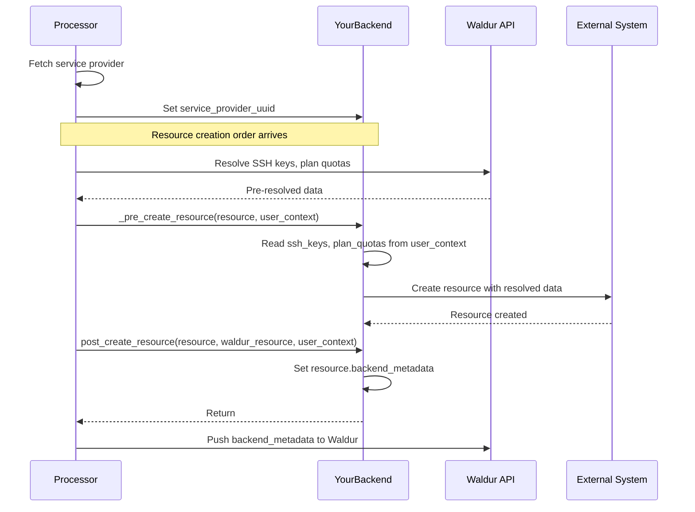

# Plugin Development Guide

This guide covers everything needed to build a custom backend plugin for
Waldur Site Agent. It is written for both human developers and LLM-based
code generators.

## Waldur Mastermind concepts

Before implementing a plugin, understand how Waldur Mastermind concepts
map to plugin operations.

| Waldur concept | Description | Plugin relevance |
|---|---|---|
| **Offering** | Service catalog entry | Config block per offering; picks backend plugin |
| **Resource** | Allocation from an offering | CRUD via `BaseBackend`; keyed by `backend_id` |
| **Order** | Create/update/terminate request | Triggers `order_process` mode |
| **Component** | Measurable dimension (CPU, RAM) | Defined in `backend_components` config |
| **OfferingUser** | User linked to an offering | Username backend generates usernames |
| **billing_type** | `usage` or `limit` | Metered vs quota accounting |
| **backend_id** | Resource ID on the backend | Generated by `_get_resource_backend_id` |

## Architecture overview

A plugin consists of two main classes:

- **Backend** (inherits `BaseBackend`): Orchestrates high-level operations
  (create resource, collect usage, manage users).
- **Client** (inherits `BaseClient`): Handles low-level communication with
  the external system (CLI commands, API calls).

```mermaid
graph TB
    WM[Waldur Mastermind<br/>REST API] <-->|Orders, Resources,<br/>Usage, Keys| SA[Site Agent Core<br/>Processor]
    SA -->|user_context<br/>(ssh_keys, plan_quotas)| BE[YourBackend<br/>BaseBackend]
    BE --> CL[YourClient<br/>BaseClient]
    CL --> EXT[External System<br/>CLI / API]
    BE -.->|backend_metadata| SA

    classDef waldur fill:#1E3A8A,stroke:#3B82F6,stroke-width:2px,color:#FFFFFF
    classDef core fill:#065F46,stroke:#10B981,stroke-width:2px,color:#FFFFFF
    classDef plugin fill:#581C87,stroke:#8B5CF6,stroke-width:2px,color:#FFFFFF
    classDef external fill:#92400E,stroke:#F59E0B,stroke-width:2px,color:#FFFFFF

    class WM waldur
    class SA core
    class BE,CL plugin
    class EXT external
```

## BaseBackend method reference

### Abstract methods (must implement)

#### `ping(raise_exception: bool = False) -> bool`

- **Mode**: All (health check)
- **Purpose**: Verify backend connectivity.
- **No-op**: Return `False`.

#### `diagnostics() -> bool`

- **Mode**: Diagnostics CLI
- **Purpose**: Log diagnostic info and return health status.
- **No-op**: Log a message, return `True`.

#### `list_components() -> list[str]`

- **Mode**: Diagnostics
- **Purpose**: Return component types available on the backend.
- **No-op**: Return `[]`.

#### `_get_usage_report(resource_backend_ids: list[str]) -> dict`

- **Mode**: `report`, `membership_sync`
- **Purpose**: Collect usage data for resources.
- **Return format**:

```python
{
    "resource_backend_id_1": {
        "TOTAL_ACCOUNT_USAGE": {"cpu": 1000, "mem": 2048},
        "user1": {"cpu": 500, "mem": 1024},
        "user2": {"cpu": 500, "mem": 1024},
    }
}
```

- **Key rules**:
  - Component keys must match `backend_components` config keys.
  - Values must be in Waldur units (after `unit_factor` conversion).
  - `TOTAL_ACCOUNT_USAGE` is required and must equal the sum of per-user values.
- **No-op**: Return `{}`.

#### `_collect_resource_limits(waldur_resource) -> tuple[dict, dict]`

- **Mode**: `order_process` (resource creation)
- **Purpose**: Convert Waldur limits to backend limits and back.
- **Returns**: `(backend_limits, waldur_limits)` where `backend_limits` has
  values multiplied by `unit_factor`.
- **No-op**: Return `({}, {})`.

#### `_pre_create_resource(waldur_resource, user_context=None) -> None`

- **Mode**: `order_process` (resource creation)
- **Purpose**: Set up prerequisites before resource creation (e.g., parent accounts).
- **`user_context`** contains pre-resolved data: `ssh_keys` (UUID → public key),
  `plan_quotas` (component → value), `team`, `offering_users`.
- **No-op**: Use `pass`.

#### `downscale_resource(resource_backend_id: str) -> bool`

- **Mode**: `membership_sync`
- **Purpose**: Restrict resource capabilities (e.g., set restrictive QoS).
- **No-op**: Return `True`.

#### `pause_resource(resource_backend_id: str) -> bool`

- **Mode**: `membership_sync`
- **Purpose**: Prevent all usage of the resource.
- **No-op**: Return `True`.

#### `restore_resource(resource_backend_id: str) -> bool`

- **Mode**: `membership_sync`
- **Purpose**: Restore resource to normal operation.
- **No-op**: Return `True`.

#### `get_resource_metadata(resource_backend_id: str) -> dict`

- **Mode**: `membership_sync`
- **Purpose**: Return backend-specific metadata for Waldur.
- **No-op**: Return `{}`.

### Hook methods (override as needed)

These have default implementations in `BaseBackend`. Override only when your
backend needs custom behavior.

| Method | Default | When to override |
|---|---|---|
| `post_create_resource` | No-op | Post-creation setup; set `resource.backend_metadata` to push data to Waldur |
| `_pre_delete_resource` | No-op | Pre-deletion cleanup (cancel jobs) |
| `_pre_delete_user_actions` | No-op | Per-user cleanup before removal |
| `process_existing_users` | No-op | Process existing users (homedirs) |
| `check_pending_order` | Returns `True` | Non-blocking order creation (see below) |
| `setup_target_event_subscriptions` | Returns `[]` | STOMP subscriptions to target systems |

### Non-blocking order creation (optional)

Backends that create resources via remote APIs can use non-blocking order
creation. Instead of blocking until the remote operation completes, the backend
returns immediately with a `pending_order_id` in `BackendResourceInfo`.

The core processor then:

1. Sets the source order's `backend_id` to the `pending_order_id`
2. Keeps the order in `EXECUTING` state
3. On subsequent polling cycles, calls `check_pending_order(backend_id)` to check completion
4. When `check_pending_order()` returns `True`, marks the source order as `DONE`

#### `check_pending_order(order_backend_id: str) -> bool`

- **Default**: Returns `True` (no async orders, always "complete")
- **Override when**: Your backend uses non-blocking resource creation
- **Returns**: `True` if the remote order completed, `False` if still pending
- **Raises**: `BackendError` if the remote order failed or was cancelled

Example (Waldur federation plugin):

```python
def check_pending_order(self, order_backend_id: str) -> bool:
    target_order = self.client.get_order(UUID(order_backend_id))
    if target_order.state == OrderState.DONE:
        return True
    if target_order.state in {OrderState.ERRED, OrderState.CANCELED}:
        raise BackendError(f"Target order failed: {target_order.state}")
    return False  # Still pending
```

#### `setup_target_event_subscriptions(source_offering, user_agent, global_proxy) -> list`

- **Default**: Returns `[]` (no target subscriptions)
- **Override when**: Your backend supports STOMP events from a target system
- **Returns**: List of `StompConsumer` tuples for lifecycle management
- **Called by**: `event_process` mode during STOMP setup

## BaseClient method reference

All methods below are abstract and must be implemented.

| Method | Signature | Purpose |
|---|---|---|
| `list_resources` | `() -> list[ClientResource]` | List all resources on backend |
| `get_resource` | `(resource_id) -> ClientResource or None` | Get single resource or None |
| `create_resource` | `(name, description, organization, parent_name=None) -> str` | Create resource |
| `delete_resource` | `(name) -> str` | Delete resource |
| `set_resource_limits` | `(resource_id, limits_dict) -> str or None` | Set limits (backend units) |
| `get_resource_limits` | `(resource_id) -> dict[str, int]` | Get limits (backend units) |
| `get_resource_user_limits` | `(resource_id) -> dict[str, dict[str, int]]` | Per-user limits |
| `set_resource_user_limits` | `(resource_id, username, limits_dict) -> str` | Set per-user limits |
| `get_association` | `(user, resource_id) -> Association or None` | Check user-resource link |
| `create_association` | `(username, resource_id, default_account=None) -> str` | Create user-resource link |
| `delete_association` | `(username, resource_id) -> str` | Remove user-resource link |
| `get_usage_report` | `(resource_ids) -> list` | Raw usage data from backend |
| `list_resource_users` | `(resource_id) -> list[str]` | List usernames for resource |

**Important**: `BaseClient` also provides `execute_command(command, silent=False)`
for running CLI commands with error handling. Use it for CLI-based backends.

## Agent mode method matrix

This table shows which `BaseBackend` methods are called by each agent mode.

| Method | order_process | report | membership_sync | event_process |
|---|---|---|---|---|
| `ping` | startup | startup | startup | startup |
| `create_resource` / `create_resource_with_id` | CREATE order | - | - | CREATE event |
| `_pre_create_resource` | CREATE order | - | - | CREATE event |
| `post_create_resource` | CREATE order | - | - | CREATE event |
| `_collect_resource_limits` | CREATE order | - | - | CREATE event |
| `check_pending_order` | CREATE order (async) | - | - | CREATE event (async) |
| `set_resource_limits` | UPDATE order | - | - | UPDATE event |
| `delete_resource` | TERMINATE order | - | - | TERMINATE event |
| `_pre_delete_resource` | TERMINATE order | - | - | TERMINATE event |
| `pull_resource` / `pull_resources` | CREATE order | usage pull | sync cycle | various events |
| `_get_usage_report` | - | usage pull | sync cycle | - |
| `add_users_to_resource` | post-create | - | user sync | role events |
| `remove_users_from_resource` | - | - | user sync | role events |
| `add_user` / `remove_user` | - | - | role changes | role events |
| `downscale_resource` | - | - | status sync | - |
| `pause_resource` | - | - | status sync | - |
| `restore_resource` | - | - | status sync | - |
| `get_resource_metadata` | - | - | status sync | - |
| `setup_target_event_subscriptions` | - | - | - | STOMP setup |
| `list_resources` | - | import | - | import event |
| `get_resource_limits` | - | import | - | import event |
| `get_resource_user_limits` | - | - | limits sync | - |
| `set_resource_user_limits` | - | - | limits sync | - |
| `process_existing_users` | - | - | user sync | - |

## Usage report format specification

The `_get_usage_report` method must return data in this exact structure:

```python
{
    "<resource_backend_id>": {
        "TOTAL_ACCOUNT_USAGE": {
            "<component_key>": <int_value>,  # Sum of all per-user values
            ...
        },
        "<username_1>": {
            "<component_key>": <int_value>,
            ...
        },
        "<username_2>": {
            "<component_key>": <int_value>,
            ...
        },
    },
    "<another_resource_backend_id>": { ... },
}
```

### Rules

1. **Component keys** must exactly match those in the `backend_components` YAML config.
2. **Values** must be integers in Waldur units (i.e., divide raw backend values
   by `unit_factor`).
3. **`TOTAL_ACCOUNT_USAGE`** is a required key and must equal the sum of all
   per-user values for each component.
4. If a resource has no usage, return
   `{"TOTAL_ACCOUNT_USAGE": {"cpu": 0, "mem": 0, ...}}`.
5. If usage reporting is not supported, return `{}` (empty dict).

### Example: SLURM CPU and memory

Given config:

```yaml
backend_components:
  cpu:
    unit_factor: 60000
    measured_unit: "k-Hours"
  mem:
    unit_factor: 61440
    measured_unit: "gb-Hours"
```

If SLURM reports 120000 cpu-minutes and 122880 MB-minutes for user1:

```python
{
    "hpc_my_allocation": {
        "TOTAL_ACCOUNT_USAGE": {"cpu": 2, "mem": 2},
        "user1": {"cpu": 2, "mem": 2},
    }
}
```

Calculation: `120000 / 60000 = 2`, `122880 / 61440 = 2`.

## `supports_decreasing_usage` class attribute

Set this to `True` on your backend class if usage values can decrease between
reports (e.g., a storage backend reporting current disk usage rather than
accumulated compute time).

```python
class MyStorageBackend(BaseBackend):
    supports_decreasing_usage = True
```

When `False` (default), the reporting processor skips updates where the new
usage value is lower than the previously reported value, treating it as a
data anomaly.

## Decision matrix for no-op implementations

If your backend does not support a certain operation, use these return values:

| Method | No-op return | Meaning |
|---|---|---|
| `ping` | `False` | Backend has no health check |
| `diagnostics` | `True` | Diagnostics not implemented but OK |
| `list_components` | `[]` | No component discovery |
| `_get_usage_report` | `{}` | No usage reporting |
| `_collect_resource_limits` | `({}, {})` | No limits support |
| `_pre_create_resource` | `pass` | No pre-creation setup |
| `downscale_resource` | `True` | No downscaling concept |
| `pause_resource` | `True` | No pausing concept |
| `restore_resource` | `True` | No restore concept |
| `get_resource_metadata` | `{}` | No metadata |

## Annotated YAML configuration

```yaml
offerings:
  - name: "My Custom Offering"          # Human-readable name for logging

    # Waldur Mastermind connection
    waldur_api_url: "https://waldur.example.com/api/"
    waldur_api_token: "your-api-token"   # Service provider token
    waldur_offering_uuid: "uuid-here"    # UUID from Waldur offering page

    # Backend selection (entry point names from pyproject.toml)
    order_processing_backend: "mycustom"       # For create/update/terminate
    reporting_backend: "mycustom"              # For usage reporting
    membership_sync_backend: "mycustom"        # For user sync
    username_management_backend: "base"        # Username generation

    # Legacy setting (used if per-mode backends not specified)
    backend_type: "mycustom"

    # Event processing (optional)
    stomp_enabled: false

    # Backend-specific settings (passed to __init__ as backend_settings)
    backend_settings:
      default_account: "root"            # Default parent account
      customer_prefix: "cust_"           # Prefix for customer-level accounts
      project_prefix: "proj_"            # Prefix for project-level accounts
      allocation_prefix: "alloc_"        # Prefix for allocation-level accounts

    # Component definitions (passed to __init__ as backend_components)
    backend_components:
      cpu:
        limit: 100                       # Default limit in Waldur units
        measured_unit: "k-Hours"         # Display unit in Waldur UI
        unit_factor: 60000               # Waldur-to-backend conversion factor
        accounting_type: "usage"         # "usage" = metered, "limit" = quota
        label: "CPU"                     # Display label in Waldur UI
        # Optional Waldur offering component fields:
        # description: "CPU time"        # Component description
        # min_value: 0                   # Minimum allowed value
        # max_value: 10000               # Maximum allowed value
        # max_available_limit: 5000      # Maximum available limit
        # default_limit: 100             # Default limit value
        # limit_period: "month"          # "annual", "month", "quarterly", "total"
        # article_code: "CPU-001"        # Billing article code
        # is_boolean: false              # Boolean (on/off) component
        # is_prepaid: false              # Prepaid billing
      storage:
        limit: 1000
        measured_unit: "GB"
        unit_factor: 1
        accounting_type: "limit"
        label: "Storage"
```

### `unit_factor` explained

The `unit_factor` converts between Waldur display units and backend-native units:

- `backend_value = waldur_value * unit_factor`
- `waldur_value = backend_value / unit_factor`

Examples:

- CPU k-Hours to SLURM cpu-minutes: `unit_factor = 60000` (60 min x 1000)
- GB-Hours to SLURM MB-minutes: `unit_factor = 61440` (60 min x 1024 MB)
- GB to GB (no conversion): `unit_factor = 1`

## Entry point registration

Register your plugin in `pyproject.toml`:

```toml
[project]
name = "waldur-site-agent-mycustom"
version = "0.1.0"
dependencies = ["waldur-site-agent>=0.7.0"]

[project.entry-points."waldur_site_agent.backends"]
mycustom = "waldur_site_agent_mycustom.backend:MyCustomBackend"

# Optional: component schema validation
[project.entry-points."waldur_site_agent.component_schemas"]
mycustom = "waldur_site_agent_mycustom.schemas:MyCustomComponentSchema"

# Optional: backend settings schema validation
[project.entry-points."waldur_site_agent.backend_settings_schemas"]
mycustom = "waldur_site_agent_mycustom.schemas:MyCustomBackendSettingsSchema"
```

The entry point name (e.g., `mycustom`) is what users put in
`backend_type` or `order_processing_backend` in the config YAML.

## Processor-plugin data flow

Plugins **never** have direct access to the Waldur API client. Instead,
the core processor pre-resolves any Waldur data the plugin might need and
passes it via `user_context`. Plugins return metadata to Waldur by setting
`resource.backend_metadata`.

### Pre-resolved data in `user_context`

The processor enriches the `user_context` dict before calling backend
methods. Plugins read from it without making API calls:

| Key | Type | Contents |
|---|---|---|
| `team` | `list[dict]` | Team members with usernames |
| `offering_users` | `list[dict]` | Offering users |
| `ssh_keys` | `dict[str, str]` | Mapping of SSH key UUID → public key text |
| `plan_quotas` | `dict[str, int]` | Plan component quotas (component key → value) |

### Returning metadata via `backend_metadata`

To push metadata back to Waldur (e.g., access credentials, connection
endpoints), set `resource.backend_metadata` in `post_create_resource`:

```python
def post_create_resource(self, resource, waldur_resource, user_context=None):
    # ... create credentials, gather endpoints ...
    resource.backend_metadata = {
        "username": "admin",
        "password": generated_password,
        "endpoint": "https://service.example.com",
    }
    # The processor pushes this to Waldur automatically
```

### Data flow



### Example: resolving an SSH key UUID from `user_context`

When a resource attribute contains a UUID reference (e.g., an SSH key UUID
from the order form), look it up in the pre-resolved `ssh_keys` dict:

```python
from uuid import UUID

class MyBackend(BaseBackend):
    @staticmethod
    def _resolve_ssh_key(key_value: str, ssh_keys: dict[str, str]) -> str:
        """Resolve SSH key from pre-resolved context.

        If key_value is a UUID, look it up. Otherwise treat as raw key text.
        """
        try:
            key_uuid = UUID(key_value.strip())
        except ValueError:
            return key_value  # Raw public key text, use as-is

        return ssh_keys.get(str(key_uuid), "") or ssh_keys.get(key_uuid.hex, "")

    def _pre_create_resource(self, waldur_resource, user_context=None):
        user_context = user_context or {}
        ssh_keys = user_context.get("ssh_keys", {})
        raw_key = waldur_resource.attributes.get("ssh_public_key", "")
        resolved_key = self._resolve_ssh_key(raw_key, ssh_keys)
        # Use resolved_key for resource setup ...
```

### Design principles

- **Plugins must not import `waldur_api_client`** for runtime API calls.
  All Waldur data should come via `user_context` or `BaseBackend` attributes.
- **`service_provider_uuid`** is still set on `BaseBackend` by the processor
  and can be read by plugins for constructing backend-side identifiers.
- **Handle missing context gracefully** — `user_context` may be `None` or
  missing keys in unit tests. Always default to `{}` or empty values.

## Common pitfalls

### 1. Unit factor direction

The `unit_factor` converts **from Waldur units to backend units** by multiplication.
When reporting usage back, you must **divide** by `unit_factor`. Getting this
backwards causes limits to be set at 1/60000th of the intended value
or usage to be reported 60000x too high.

### 2. Missing TOTAL_ACCOUNT_USAGE

The `_get_usage_report` return dict **must** include a `"TOTAL_ACCOUNT_USAGE"` key
for each resource. If missing, the core will substitute zeros, and reported
usage will appear as zero in Waldur.

### 3. Entry point not discovered

Common causes:

- Package not installed (`uv sync --all-packages`)
- Entry point group name misspelled (must be `"waldur_site_agent.backends"`)
- Entry point value points to wrong class or module

Debug with:

```python
from importlib.metadata import entry_points
print(list(entry_points(group="waldur_site_agent.backends")))
```

### 4. Forgetting super().__init__()

Your backend `__init__` **must** call `super().__init__(backend_settings, backend_components)`.
This sets up `self.backend_settings`, `self.backend_components`, and
`self.client`. Then assign your own client:

```python
def __init__(self, backend_settings, backend_components):
    super().__init__(backend_settings, backend_components)
    self.backend_type = "mycustom"
    self.client = MyCustomClient()
```

### 5. Returning wrong types from client methods

- `get_resource` must return `None` (not raise) when resource is absent.
- `get_association` must return `None` (not raise) when no association exists.
- `list_resources` must return `list[ClientResource]`, not raw dicts.

### 6. Component key mismatch

Component keys in `_get_usage_report` must exactly match the keys in
`backend_components` config. If config has `"cpu"` but you report `"CPU"`,
the usage will be silently ignored.

## Testing guidance

### What to test per mode

| Mode | Test focus |
|---|---|
| `order_process` | `create_resource`, `delete_resource`, limit conversion |
| `report` | `_get_usage_report` format, unit conversion math |
| `membership_sync` | `add_user`, `remove_user`, pause/restore |
| All | `ping`, error handling, edge cases |

### Mock patterns

Mock the client to avoid needing a real backend:

```python
from unittest.mock import MagicMock, patch
from waldur_site_agent.backend.structures import ClientResource, Association

def test_create_resource():
    backend = MyCustomBackend(
        backend_settings={"default_account": "root", "allocation_prefix": "test_"},
        backend_components={"cpu": {"unit_factor": 60000, "limit": 10}},
    )
    backend.client = MagicMock()
    backend.client.get_resource.return_value = None  # Resource doesn't exist yet
    backend.client.create_resource.return_value = "created"

    # ... test resource creation
```

### Fixtures

```python
import pytest

@pytest.fixture
def backend_settings():
    return {
        "default_account": "root",
        "customer_prefix": "c_",
        "project_prefix": "p_",
        "allocation_prefix": "a_",
    }

@pytest.fixture
def backend_components():
    return {
        "cpu": {
            "limit": 10,
            "measured_unit": "k-Hours",
            "unit_factor": 60000,
            "accounting_type": "usage",
            "label": "CPU",
        },
    }

@pytest.fixture
def backend(backend_settings, backend_components):
    b = MyCustomBackend(backend_settings, backend_components)
    b.client = MagicMock()
    return b
```

### Key assertions

```python
# Usage report format
report = backend._get_usage_report(["alloc_1"])
assert "TOTAL_ACCOUNT_USAGE" in report["alloc_1"]
assert all(k in report["alloc_1"]["TOTAL_ACCOUNT_USAGE"]
           for k in backend.backend_components)

# Limit conversion
backend_limits, waldur_limits = backend._collect_resource_limits(mock_resource)
assert backend_limits["cpu"] == waldur_limits["cpu"] * 60000
```

## LLM implementation checklist

When implementing a new backend plugin with an LLM, follow these steps in order:

1. **Read existing plugins**: Study `plugins/slurm/` and `plugins/mup/` for patterns.
2. **Copy the template**: Start from `docs/plugin-template/` and rename.
3. **Implement `__init__`**: Call `super().__init__()`, set `backend_type`, create client.
4. **Implement `BaseClient` methods**: Start with `get_resource`, `create_resource`,
   `delete_resource`, `list_resources`.
5. **Implement `BaseBackend` abstract methods**: Start with `ping`, then
   `_pre_create_resource`, then `_collect_resource_limits`, then `_get_usage_report`.
6. **Handle unit conversion**: Verify `unit_factor` math in both directions.
7. **Write tests**: Mock the client, test each abstract method.
8. **Register entry points**: Add to `pyproject.toml`.
9. **Test integration**: Install with `uv sync --all-packages` and run
   `waldur_site_diagnostics`.
10. **Verify**: Run `uv run pytest` and `pre-commit run --all-files`.

### Files to study

- `waldur_site_agent/backend/backends.py` - Base classes with all abstract methods
- `waldur_site_agent/backend/clients.py` - Base client class
- `waldur_site_agent/backend/structures.py` - Data structures (`ClientResource`,
  `Association`, `BackendResourceInfo` with `pending_order_id` for async orders
  and `backend_metadata` for returning data to Waldur)
- `plugins/slurm/waldur_site_agent_slurm/backend.py` - Reference implementation
  (CLI-based)
- `plugins/mup/waldur_site_agent_mup/backend.py` - Reference implementation
  (API-based)

### Common mistakes to avoid

- Do not forget `super().__init__(backend_settings, backend_components)`.
- Do not return raw dicts from `list_resources`; return `ClientResource` objects.
- Do not raise exceptions from `get_resource` when resource is absent; return `None`.
- Do not forget the `"TOTAL_ACCOUNT_USAGE"` key in usage reports.
- Do not confuse Waldur units with backend units in `_collect_resource_limits`.
- Do not hardcode component keys; read them from `self.backend_components`.
