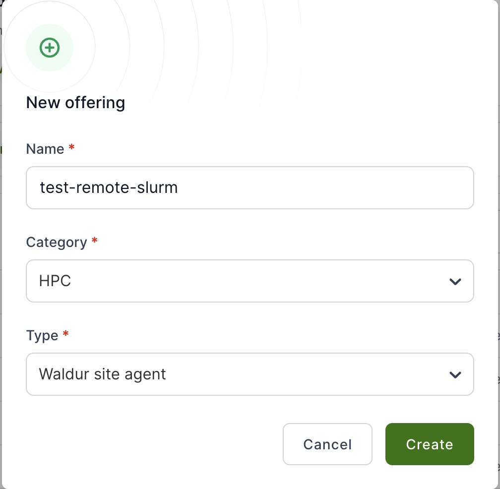
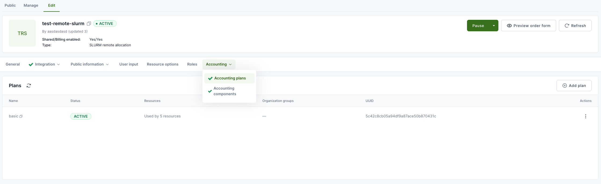
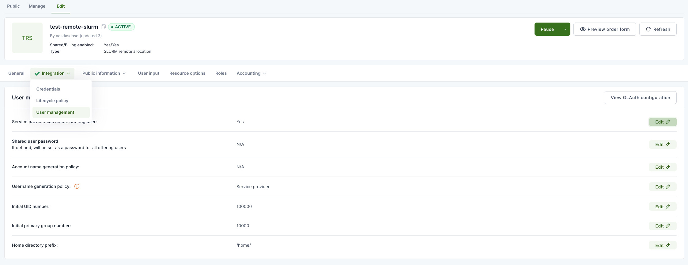
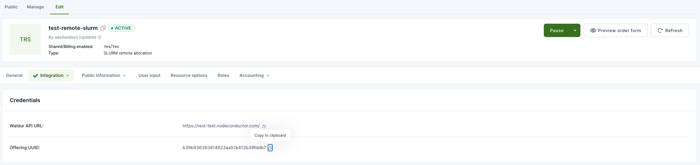

# Quickstart

The fastest path from a fresh install to a running, verified agent. This page deliberately skips
options and edge cases — it links out to the full [Configuration Reference](configuration.md) and
[Deployment Guide](deployment.md) for everything beyond a first working setup. Written around the
SLURM backend, since it's the most common first deployment; other backends follow the same shape
with a different `backend_type` and `backend_settings` block (see your plugin's README under
[`plugins/`](../plugins/)).

Budget about 15-20 minutes if the offering side is already set up in Waldur.

## 1. Create the offering in Waldur

- Go to the `Service Provider` section of your organization, open offering creation, pick a name
  and category, and select `Waldur site agent` from the type drop-down.

  

- On the offering's `Edit` tab, open `Accounting` → `Accounting plans`, add a plan.

  

- Still on `Edit`, open `Integration` → `User management`, set `Service provider can create
  offering user` to `Yes`.

  

- Activate the offering with the green `Activate` button.
- Copy the offering UUID from `Integration` → `Credentials` — you'll need it below.

  

- Create a dedicated **agent account** — a Waldur login that exists only for the agent to
  authenticate with, not a real person's. As a staff user, go to the `Support` workspace →
  `User management` → `Users` → `Create user`, and work through the wizard: set a `username` and
  `email`, and set (or generate) a `Password` on the Account step — leave it blank and the account
  ends up passwordless. Leave `Staff` and `Support` unchecked; offering-level access, granted next,
  is all this account needs.

- Grant that account the **OFFERING.MANAGER** role on this specific offering — not a customer-wide
  role. On the offering's `Team` tab, use `Add` to invite the account with the `OFFERING.MANAGER`
  role. This is the minimum the agent needs and nothing more: it covers order approval, usage
  reporting, and resource state/backend-metadata updates. It's unrelated to the
  `GET_SERVICE_PROVIDER_API_SECRET_CODE` permission mentioned in step 3 below — that one's only
  needed by a *human* using the UI config generator, not by the agent's own token.

- Create an API token for the agent account. You'll need it below too. Log in as that account,
  open the avatar menu in the top-right corner → **Profile** → **API token** tab, then click the
  eye icon to reveal and copy the token.

  That page also has a **Token lifetime** setting (10/30 min, 1/2/12 hours, or indefinite) — it's
  extended automatically on each successful API call, but the agent runs unattended and can go
  quiet for stretches (initial setup, a paused service, sparse polling intervals) that outlast any
  timed option. **Set it to indefinite** — anything shorter will eventually expire and break the
  agent's auth. The UI warns that an indefinite token can be used by anyone who has it until it's
  changed, so treat it like any other long-lived service credential: keep it out of version
  control and out of shell history.

## 2. Install the agent

```bash
pip install waldur-site-agent
```

Starting from a bare server instead of an existing Python environment? Use the
[Ubuntu 24.04](installation-ubuntu24.md) or [Rocky Linux 9](installation-rocky9.md) guide — they
cover OS packages and the SLURM CLI tools the agent shells out to.

## 3. Write a minimal config

### Option A: generate it from Waldur (SLURM only, recommended)

For SLURM offerings, skip hand-writing YAML entirely. On the same `Integration` → `Credentials`
page from step 1, open `Actions` → `Generate Site Agent Config`. It builds a config from your
*actual* offering — `name`, `waldur_api_url`, `waldur_offering_uuid`, all three `*_backend`
fields, `backend_settings`, and `backend_components` (including your real plan components, not a
generic example) are filled in for you. Only `waldur_api_token` comes back as a placeholder
(`<YOUR_API_TOKEN_HERE>`) — swap in the token from step 1. Copy or download the result as
`waldur-site-agent-config.yaml`.

You need the `GET_SERVICE_PROVIDER_API_SECRET_CODE` permission on the customer to see this
action — if it's missing from the `Actions` menu, that's usually why.

### Option B: write it by hand

Only the fields below are required to get a SLURM offering running. Everything else in the
[full example](../examples/waldur-site-agent-config.yaml.example) (multi-offering setups, LDAP,
prepaid billing, QoS management, home directory quotas, ...) can wait until this is working.

```bash
sudo mkdir -p /etc/waldur
sudo tee /etc/waldur/waldur-site-agent-config.yaml <<'EOF'
timezone: "UTC"
offerings:
  - name: "My SLURM Cluster"
    waldur_api_url: "https://waldur.example.com/api/"   # REQUIRED
    waldur_api_token: "your-token-here"                 # REQUIRED, OFFERING.MANAGER role
    waldur_offering_uuid: "your-offering-uuid-here"      # REQUIRED
    order_processing_backend: "slurm"
    membership_sync_backend: "slurm"
    reporting_backend: "slurm"
    backend_type: "slurm"
    backend_settings:
      default_account: "root"
      customer_prefix: "hpc_"
      project_prefix: "hpc_"
      allocation_prefix: "hpc_"
    backend_components:
      cpu:
        measured_unit: "k-Hours"
        unit_factor: 60000
        accounting_type: "usage"
        label: "CPU"
EOF
```

Swap in real values for the three lines marked `REQUIRED`. `default_account` must already exist
in `sacctmgr` — the agent doesn't create it for you.

Either way, wherever the file ends up, remember to save it at
`/etc/waldur/waldur-site-agent-config.yaml` (or update the `-c` path in the commands below to
match).

## 4. Load offering components into Waldur

This pushes the `backend_components` block above (the `cpu` component here) into the offering as
a billable plan component. Without this step the offering has nothing to charge for.

```bash
waldur_site_load_components -c /etc/waldur/waldur-site-agent-config.yaml
```

## 5. Check your setup before you touch systemd

```bash
waldur_site_diagnostics -c /etc/waldur/waldur-site-agent-config.yaml
```

This confirms the Waldur side: the API is reachable, your token authenticates and has the right
role, the offering UUID resolves, and the components you just loaded are visible. **It does not
check backend connectivity** — it won't tell you whether the agent can actually reach and command
your SLURM cluster. If you're on the SLURM backend, run the deeper, backend-aware check after
placing at least one test order (step 7):

```bash
waldur_site_diagnose_slurm_account -c /etc/waldur/waldur-site-agent-config.yaml
```

Other backends (MOAB, MUP, Rancher, LDAP, ...) don't have an equivalent backend-side check yet —
for those, the first real run in step 7 is your first signal.

## 6. Enable it for real

Follow [Deployment → Systemd Service Setup](deployment.md#systemd-service-setup) to install and
start the four services (`order_process`, `report`, `membership_sync`, and either polling or
event-based, your choice). Come back here once they're running.

## 7. Verify end-to-end

Place a small test order against your offering in the Waldur marketplace, then:

```bash
# Watch the order get picked up and the SLURM account get created
journalctl -u waldur-agent-order-process.service -f

# Confirm the account actually exists on the cluster
sacctmgr show account <expected-account-name>
```

The resource should move to `OK` in Waldur and the account should exist in `sacctmgr` with the
prefix/limits from your config. If it doesn't, see
[Deployment → Troubleshooting](deployment.md#troubleshooting) — that section is ordered to match
the failure modes you'll hit at each step above, starting with `waldur_site_diagnostics`.
