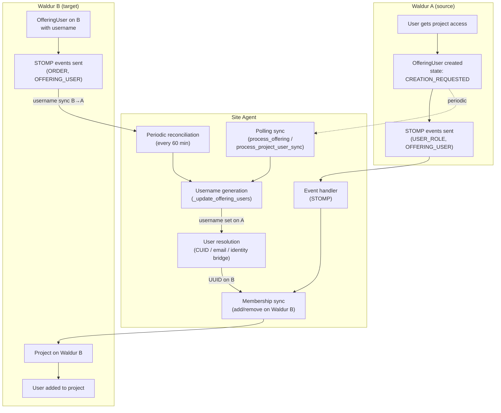
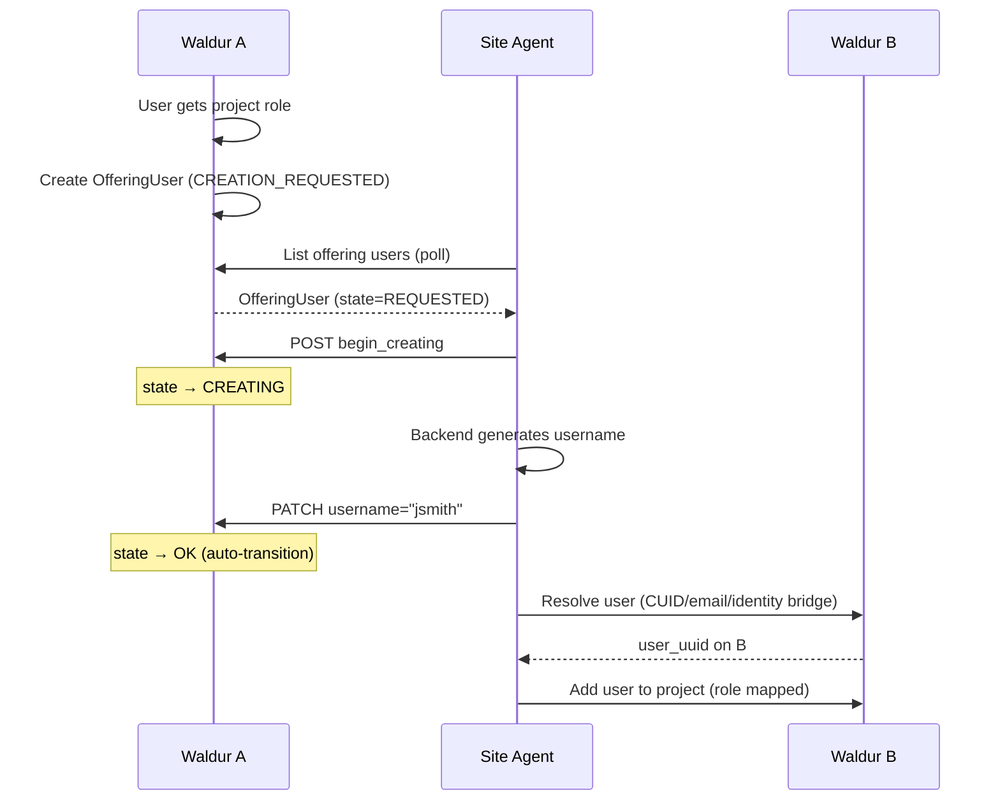
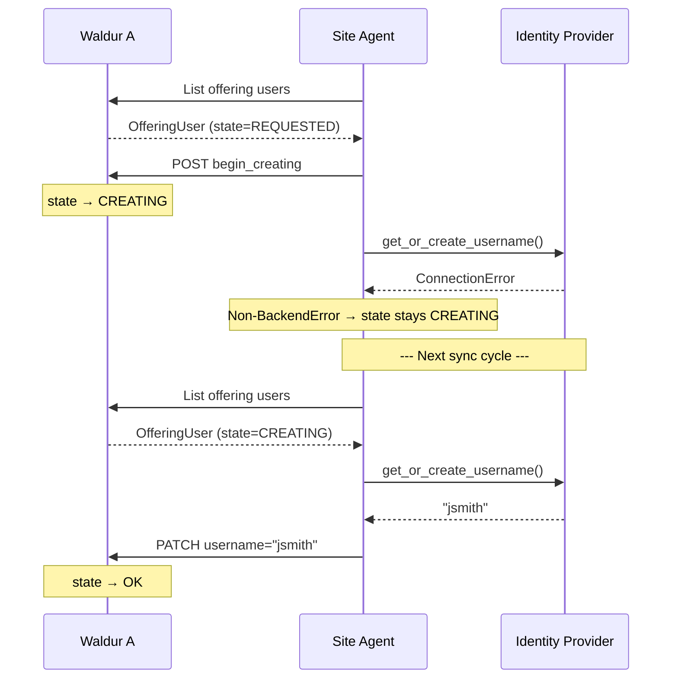
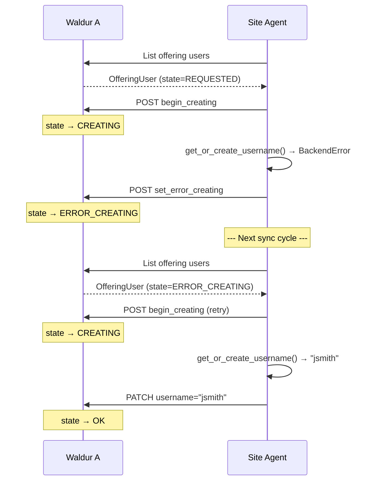
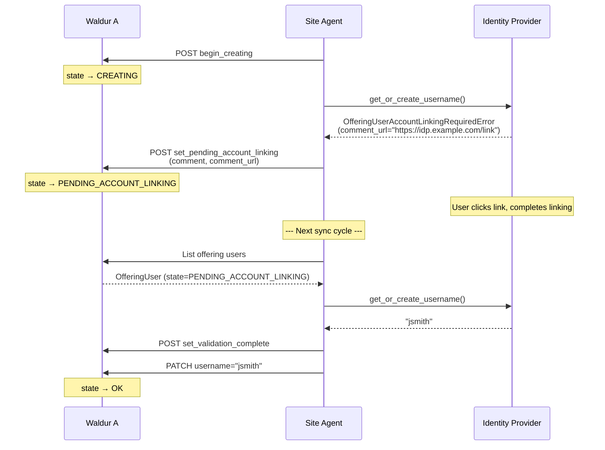
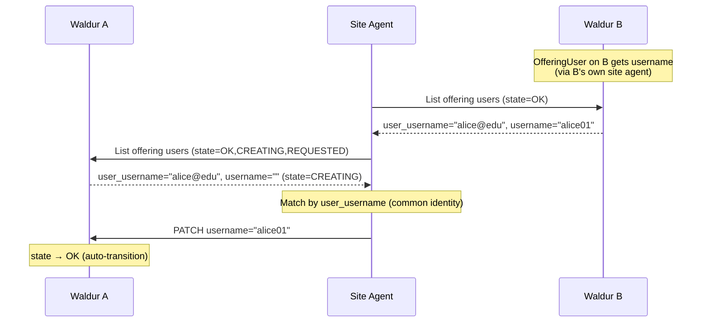
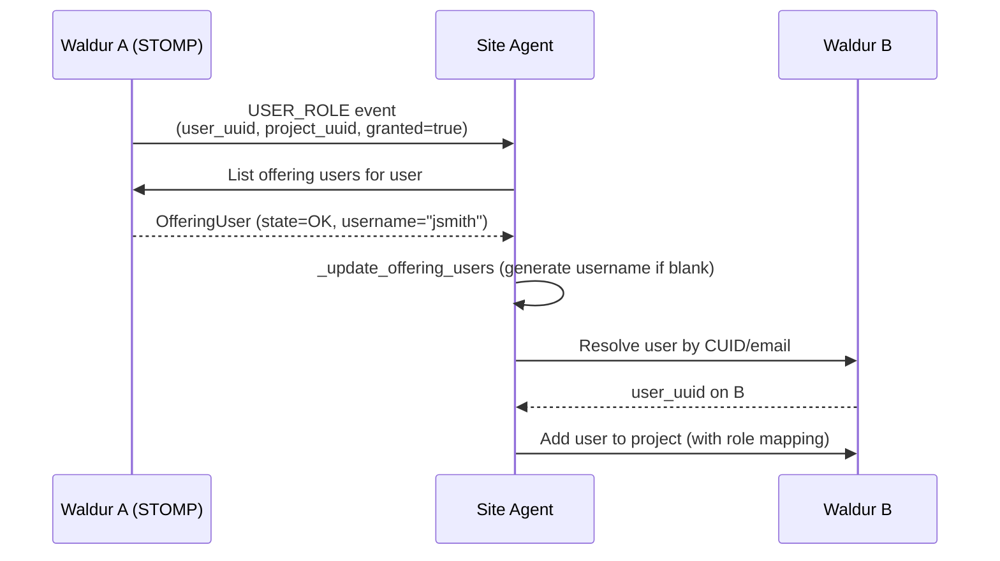
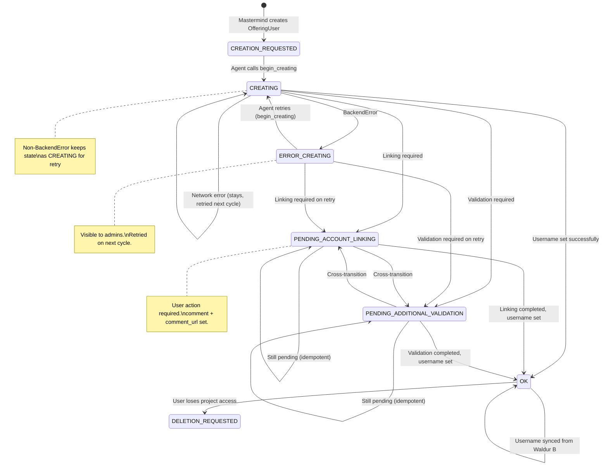

# Waldur Plugin: Offering User Sync

This document covers offering user synchronization in the **Waldur federation plugin**
(`plugins/waldur/`), where the site agent bridges two Waldur instances (A and B).
For the generic offering user state machine and username management backend system,
see [offering-users.md](offering-users.md).

## Architecture

In a Waldur federation, Waldur A is the consumer-facing marketplace and Waldur B
hosts the actual resources. The site agent runs between them:

```text
┌──────────────┐         ┌──────────────┐         ┌──────────────┐
│   Waldur A   │◄───────►│  Site Agent   │◄───────►│   Waldur B   │
│  (source)    │  REST   │  (waldur     │  REST   │  (target)    │
│              │  STOMP  │   plugin)    │  STOMP  │              │
└──────────────┘         └──────────────┘         └──────────────┘
```

The agent manages three concerns for offering users:

1. **Username generation** — create an account username on the service provider side
2. **User resolution** — map a Waldur A user identity to a Waldur B user UUID
3. **Project membership** — add/remove resolved users to Waldur B projects

## Sync Flows Overview



## Case 1: Happy Path — Username Generation Succeeds

The most common case. A user joins a project, gets an OfferingUser, and the agent
generates a username on the first sync cycle.



## Case 2: Username Generation Fails — Network Error

The backend is unreachable (e.g., identity provider down). The user stays in CREATING
and is retried on every subsequent sync cycle until the backend recovers.



## Case 3: Username Generation Fails — Backend Error

The backend returns a structured error (e.g., SLURM account limit reached).
The user transitions to ERROR_CREATING so admins can see the failure. On the
next cycle, the agent retries via `begin_creating`.



## Case 4: Account Linking Required

The identity provider requires the user to manually link their account
(e.g., accept terms, verify institutional affiliation). The OfferingUser moves
to PENDING_ACCOUNT_LINKING with a service provider comment and URL pointing
to the linking form.



If the user has not completed linking yet, the backend raises
`OfferingUserAccountLinkingRequiredError` again. The agent detects the user
is already in PENDING_ACCOUNT_LINKING and skips the redundant API call (idempotent).

## Case 5: Additional Validation Required

Similar to account linking, but for a different kind of manual verification
(e.g., admin approval of institutional affiliation, compliance check).
Uses `OfferingUserAdditionalValidationRequiredError`.

The flow is identical to Case 4, with `PENDING_ADDITIONAL_VALIDATION` instead of
`PENDING_ACCOUNT_LINKING`.

Cross-transitions are also possible: a user in PENDING_ACCOUNT_LINKING may transition
to PENDING_ADDITIONAL_VALIDATION (or vice versa) if the backend reports a different
requirement on retry.

## Case 6: Waldur B Username Sync (Federation)

In the Waldur federation plugin, usernames may come from Waldur B rather than being
generated locally. The flow uses `sync_offering_user_usernames()` to pull usernames
from Waldur B's offering users and write them to Waldur A's offering users.



This sync runs in two modes:

- **STOMP-driven**: When a Waldur B offering user is created/updated with a username,
  the `make_target_offering_user_handler` triggers an immediate sync.
- **Periodic reconciliation**: Every 60 minutes (configurable), catches any updates
  missed due to STOMP disconnections.

## Case 7: Event-Driven User Addition (STOMP)

When a user role change event arrives via STOMP, the agent processes it in real time
without waiting for the next polling cycle.



If the offering user has **no username** (e.g., still in CREATING state),
the event handler returns early without adding the user to Waldur B. The user
will be added on a subsequent polling cycle after username generation completes.

## Case 8: Offering User Attribute Forwarding

When a new offering user is created or attributes change, the STOMP event handler
forwards user attributes to the membership sync backend (e.g., the identity bridge).
This ensures user profiles are pushed to Waldur B even before username generation.

```text
STOMP OFFERING_USER "create" event (username="", attributes={...})
  → _forward_user_attributes_to_backend()
  → backend.update_user_attributes(username="", attributes)
```

This path does **not** trigger username generation — that only happens via the
polling-based membership sync.

## Recovery in `event_process` Mode

In `event_process` mode, the full membership sync (`process_offering()`) only
runs **once at startup**. After that, user changes are handled by STOMP events.
Two periodic reconciliation functions cover gaps:

| Function | Condition | What it does |
|----------|-----------|-------------|
| `run_periodic_offering_user_reconciliation()` | `membership_sync_backend` set | Retries stuck users |
| `run_periodic_username_reconciliation()` | `username_reconciliation_enabled` | Syncs usernames B→A |

Both run on the reconciliation timer (default: every 60 minutes).

### Waldur federation: `username_reconciliation_enabled` is required

In the waldur federation plugin, the identity bridge username backend
**does not generate usernames** — it pushes user profiles to Waldur B and
returns an empty string. The actual username is assigned by Waldur B's
service provider and must be **pulled back** via `sync_offering_user_usernames()`.

This means:

- `run_periodic_offering_user_reconciliation()` alone is **insufficient** for
  the waldur plugin — it pushes profiles to identity bridge (useful) but
  cannot assign usernames.
- `run_periodic_username_reconciliation()` is the function that actually
  pulls usernames from Waldur B and writes them to Waldur A, triggering
  the auto-transition to OK.
- **Without `username_reconciliation_enabled: true`**, users that get stuck
  after startup will not self-heal until the agent is restarted.

```yaml
# Required for waldur federation deployments
offerings:
  - name: "Federated HPC"
    username_reconciliation_enabled: true  # <-- enables periodic B→A sync
    membership_sync_backend: "waldur"
    # ...
```

### Non-federation plugins (SLURM, MOAB, etc.)

For plugins where the username backend generates usernames locally (e.g.,
the `base` backend or FreeIPA), `run_periodic_offering_user_reconciliation()`
is sufficient. It retries `update_offering_users()` which calls
`get_or_create_username()` on the local backend. No
`username_reconciliation_enabled` setting is needed.

### Thread safety

STOMP callbacks run in **receiver threads** (separate from the main loop).
Both the periodic reconciliation and STOMP handlers can call
`_update_offering_users()` on the same user concurrently. This is safe
because:

- **No double creation**: OfferingUsers are created by Mastermind, not the
  agent. The `(offering, user)` unique constraint prevents duplicates.
- **`begin_creating()` on wrong state**: Returns HTTP 400 (FSM validation).
  Caught by the exception handler, logged, processing continues.
- **Double PATCH with same username**: Idempotent (last-write-wins, same value).
- **PATCH with empty username**: `_update_user_username()` returns `False` when
  the backend returns `""` — no API call is made.

## Processing Entry Points

| Entry Point | Trigger | What It Does | Username Generation? |
|-------------|---------|--------------|---------------------|
| `process_offering()` | Polling (cron / main loop) | Full sync of all resources and users | Yes |
| `process_project_user_sync()` | STOMP USER_ROLE event (no user_uuid) | Full user sync for one project | Yes |
| `process_user_role_changed()` | STOMP USER_ROLE event (with user_uuid) | Add/remove one user | Yes |
| `on_offering_user_message_stomp()` | STOMP OFFERING_USER from A | Forward attributes | No |
| `make_target_offering_user_handler()` | STOMP OFFERING_USER from B | Sync usernames B→A | No |
| `run_periodic_username_reconciliation()` | Timer (every 60 min) | Sync usernames B→A | No |
| `run_periodic_offering_user_reconciliation()` | Timer (every 60 min) | Retry stuck users | Yes |

## State Lifecycle Summary



## Troubleshooting

### User stuck in CREATING

**Cause**: Username generation failed with a non-`BackendError` exception (e.g.,
`ConnectionError`, `TimeoutError`). The state stays CREATING so it will be retried
on the next sync cycle.

**Check**: Agent logs for the offering user UUID — look for `get_or_create_username` errors.

**Resolution**: Fix the underlying connectivity issue. The agent will auto-recover on the
next cycle.

### User stuck in ERROR_CREATING

**Cause**: Username generation failed with a `BackendError`. The state is set to
ERROR_CREATING so admins can see the failure.

**Check**: The error details in the agent log and the service provider comment on
the offering user in Waldur.

**Resolution**: Fix the backend issue. The agent will retry via `begin_creating` →
`get_or_create_username` on the next cycle.

### User stuck in PENDING_ACCOUNT_LINKING / PENDING_ADDITIONAL_VALIDATION

**Cause**: The identity provider requires manual user action (linking, verification).

**Check**: The `service_provider_comment` and `service_provider_comment_url` fields on
the offering user in Waldur. These contain instructions and a link for the user.

**Resolution**: The user must complete the required action. The agent will detect
completion on the next sync cycle and transition to OK.

### Username not synced from Waldur B

**Cause**: The offering user on Waldur B doesn't have a username yet, user identity
matching failed, or `username_reconciliation_enabled` is not set.

**Check**:
1. Is `username_reconciliation_enabled: true` in the offering config?
   Without it, periodic B→A username sync does not run.
2. Does the offering user exist on Waldur B? Check with the target API.
3. Is the Waldur B offering user in OK state with a username?
4. Do the `user_username` fields match between A and B?

**Resolution**: Ensure `username_reconciliation_enabled: true` is set for
waldur federation offerings. Ensure consistent identity (CUID/email) across
instances. If using identity bridge, verify `identity_bridge_source` is
configured correctly.
