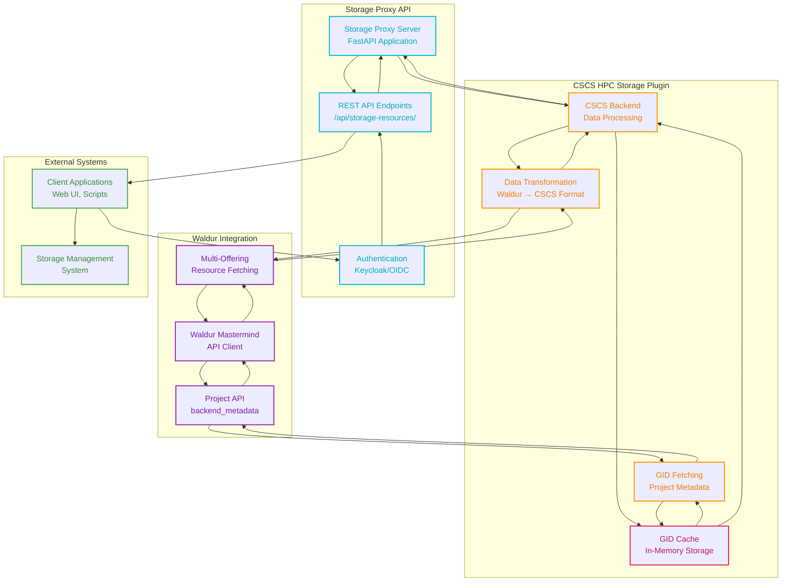
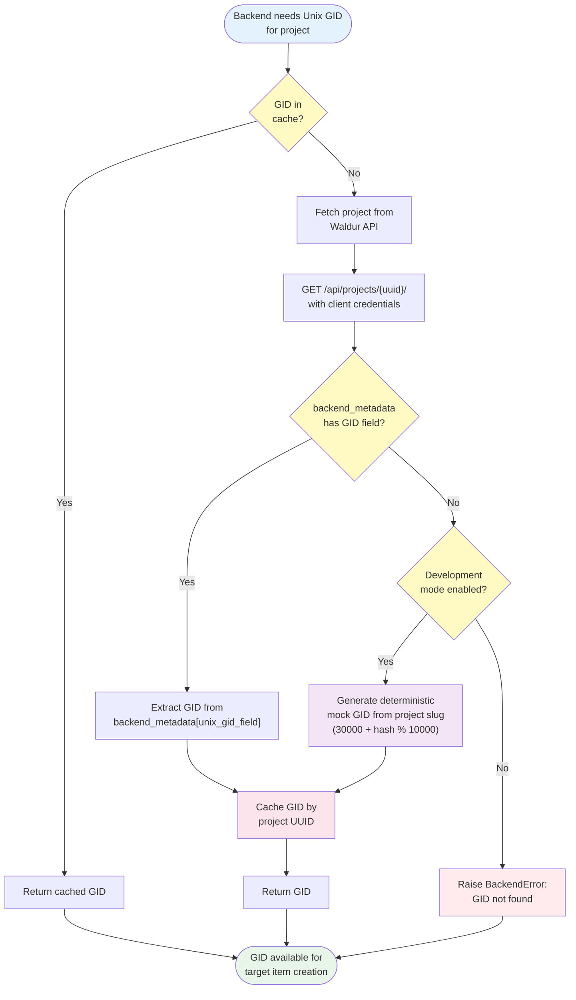

# CSCS HPC Storage Backend

A Waldur Site Agent backend plugin for managing CSCS HPC Storage systems. This backend provides a REST API proxy to
access storage resource information from Waldur.

## Overview

The CSCS HPC Storage backend provides a REST API proxy that serves storage resource information from Waldur
Mastermind. The proxy translates Waldur resource data into CSCS-specific JSON format for consumption by external web
servers and storage management systems.

## Features

- **REST API Proxy**: Provides HTTP API access to storage resource information from Waldur
- **Multi-offering support**: Aggregates resources from multiple storage system offerings (capstor, vast, iopsstor)
- **Hierarchical storage structure**: Maps Waldur offering customer → resource customer → resource project to
  storage tenant → customer → project
- **Configurable quotas**: Automatic inode quota calculation based on storage size
- **UNIX GID from Waldur API**: Fetches project Unix GID values from Waldur project metadata
- **GID caching**: Project GID values are cached in memory until server restart to reduce API calls
- **Configurable GID field**: Specify custom backend_metadata field name for Unix GID lookup
- **Mock data support**: Development/testing mode with generated target item data and fallback GID values
- **Flexible configuration**: Customizable file system types and quota coefficients
- **API Filtering**: Supports filtering by storage system, data type, status, and pagination

## Configuration

### Backend Settings

```yaml
backend_settings:
  storage_file_system: "lustre"               # Storage file system type
  inode_soft_coefficient: 1.33                # Multiplier for soft inode limits
  inode_hard_coefficient: 2.0                 # Multiplier for hard inode limits
  use_mock_target_items: false                # Enable mock data for development
  unix_gid_field: "unix_gid"                  # Field name in project backend_metadata for Unix GID (default: "unix_gid")
  development_mode: false                     # Enable development mode with fallback mock GID values
```

### Backend Components

```yaml
backend_components:
  storage:
    measured_unit: "TB"                       # Storage unit (terabytes)
    accounting_type: "limit"                  # Accounting type for quotas
    label: "Storage"                          # Display label in Waldur
    unit_factor: 1                           # Conversion factor (TB to TB)
```

### Storage Systems Configuration

The storage proxy supports multiple storage systems through offering slug mapping:

```yaml
# Storage systems configuration - maps storage_system names to offering slugs
# The API will fetch resources from all configured offering slugs
storage_systems:
  capstor: "capstor"                          # CAPSTOR storage system
  vast: "vast"                                # VAST storage system
  iopsstor: "iopsstor"                        # IOPSSTOR storage system
```

## Architecture

The CSCS HPC Storage backend provides a REST API proxy that serves storage resource information:



### API Usage

**Start the storage proxy server:**

```bash
DEBUG=true DISABLE_AUTH=true PYTHONUNBUFFERED=1 \
WALDUR_CSCS_STORAGE_PROXY_CONFIG_PATH=/path/to/config.yaml \
uv run uvicorn \
plugins.cscs-hpc-storage.\
waldur_site_agent_cscs_hpc_storage.waldur_storage_proxy.main:app \
--host 0.0.0.0 --port 8080 --reload
```

**Query storage resources:**

```bash
curl "http://0.0.0.0:8080/api/storage-resources/"
curl "http://0.0.0.0:8080/api/storage-resources/?storage_system=capstor"
curl "http://0.0.0.0:8080/api/storage-resources/?storage_system=vast&data_type=users"
```

## Data Mapping

### Waldur to Storage Hierarchy

The three-tier hierarchy maps specific Waldur resource attributes to storage organization levels:

#### Tenant Level Mapping

**Target Type:** `tenant`

**Waldur Source Attributes:**

- `resource.provider_slug`
- `resource.provider_name`
- `resource.offering_uuid`

**Generated Fields:**

- `itemId`: `str(resource.offering_uuid)`
- `key`: `resource.provider_slug`
- `name`: `resource.provider_name`
- `parentItemId`: `null`

#### Customer Level Mapping

**Target Type:** `customer`

**Waldur Source Attributes:**

- `resource.customer_slug`
- `customer_info.name` (from API)
- `customer_info.uuid` (from API)

**Generated Fields:**

- `itemId`: deterministic UUID from customer data
- `key`: `resource.customer_slug`
- `name`: `customer_info.name`
- `parentItemId`: tenant `itemId`

#### Project Level Mapping

**Target Type:** `project`

**Waldur Source Attributes:**

- `resource.project_slug`
- `resource.project_name`
- `resource.uuid`
- `resource.limits`

**Generated Fields:**

- `itemId`: `str(resource.uuid)`
- `key`: `resource.project_slug`
- `name`: `resource.project_name`
- `parentItemId`: customer `itemId`
- `quotas`: from `resource.limits`

#### Key Mapping Details

- **Tenant level**: Uses the **offering owner** information (`provider_slug`, `provider_name`)
- **Customer level**: Uses the **resource customer** information (`customer_slug`) with details fetched from Waldur API
- **Project level**: Uses the **resource project** information (`project_slug`, `project_name`) with resource-specific data

### Mount Point Generation

The storage proxy generates hierarchical mount points for three levels of storage organization:

#### Hierarchical Structure

Mount points are generated at three levels:

1. **Tenant Level**: `/{storage_system}/{data_type}/{tenant}`
2. **Customer Level**: `/{storage_system}/{data_type}/{tenant}/{customer}`
3. **Project Level**: `/{storage_system}/{data_type}/{tenant}/{customer}/{project}`

#### Examples

**Tenant Mount Point:**

```text
/capstor/store/cscs
```

**Customer Mount Point:**

```text
/capstor/store/cscs/university-physics
```

**Project Mount Point:**

```text
/capstor/store/cscs/university-physics/climate-sim
```

#### Path Components

Where each component is derived from Waldur resource data:

- `storage_system`: From offering slug (`waldur_resource.offering_slug`)
- `data_type`: Storage data type (e.g., `store`, `users`, `scratch`, `archive`)
- `tenant`: Offering customer slug (`waldur_resource.provider_slug`)
- `customer`: Resource customer slug (`waldur_resource.customer_slug`)
- `project`: Resource project slug (`waldur_resource.project_slug`)

#### Hierarchical Relationships

The three-tier hierarchy provides parent-child relationships:

- **Tenant entries** have `parentItemId: null` (top-level)
- **Customer entries** reference their parent tenant via `parentItemId`
- **Project entries** reference their parent customer via `parentItemId`

### Resource Attributes

The backend extracts the following attributes from `waldur_resource.attributes.additional_properties`:

| Attribute | Type | Required | Default | Description |
|-----------|------|----------|---------|-------------|
| `permissions` | string | No | `"775"` | Octal permissions for storage access (e.g., `"2770"`, `"755"`) |
| `storage_data_type` | string | No | `"store"` | Storage data type classification. Determines target type mapping |

**Storage System Source:**

- The `storageSystem` value comes from the `offering_slug` field, not from resource attributes
- Each offering represents a different storage system (e.g., offering with slug "capstor" = capstor storage system)

**Validation Rules:**

- All attributes must be strings if provided (non-string values raise `TypeError`)
- Unknown `storage_data_type` values fall back to `"project"` target type with warning
- Empty or missing attributes use their respective default values

**Storage Data Type Mapping:**

The `storage_data_type` attribute determines the target structure in the generated JSON:

- **Project targets**: `"store"`, `"archive"` → target type `"project"`
  - Fields: `status`, `name`, `unixGid`, `active`
- **User targets**: `"users"`, `"scratch"` → target type `"user"`
  - Fields: `status`, `email`, `unixUid`, `primaryProject`, `active`

## API Filtering

The storage proxy API supports filtering capabilities to query specific storage resources:

### API Endpoint

```http
GET /api/storage-resources/
```

### Filter Parameters

| Parameter | Type | Required | Description | Allowed Values |
|-----------|------|----------|-------------|----------------|
| `storage_system` | enum | No | Filter by storage system | `capstor`, `vast`, `iopsstor` |
| `data_type` | string | No | Filter by data type | `users`, `scratch`, `store`, `archive` |
| `status` | string | No | Filter by status | `pending`, `removing`, `active`, `error` |
| `state` | ResourceState | No | Filter by Waldur resource state | `Creating`, `OK`, `Erred` |
| `page` | integer | No | Page number (≥1) | `1`, `2`, `3` |
| `page_size` | integer | No | Items per page (1-500) | `50`, `100`, `200` |
| `debug` | boolean | No | Return raw Waldur data for debugging | `true`, `false` |

### Example API Calls

**Get all storage resources:**

```bash
curl "/api/storage-resources/"
```

**Filter by storage system:**

```bash
curl "/api/storage-resources/?storage_system=capstor"
```

**Filter by storage system and data type:**

```bash
curl "/api/storage-resources/?storage_system=vast&data_type=users"
```

**Filter by storage system, data type, and status:**

```bash
curl "/api/storage-resources/?storage_system=iopsstor&data_type=store&status=active"
```

**Paginated results with filters:**

```bash
curl "/api/storage-resources/?storage_system=capstor&page=2&page_size=50"
```

**Debug mode for troubleshooting:**

```bash
curl "/api/storage-resources/?storage_system=capstor&debug=true"
```

### Filter Behavior

- **Optional filtering**: All filters are optional and applied only when provided
- **Value validation**: `storage_system` only accepts: `capstor`, `vast`, `iopsstor`
- **Default behavior**: Without filters, returns resources from all configured storage systems
- **Exact matching**: All filters use exact string matching (case-sensitive)
- **Combine filters**: Multiple filters are combined with AND logic
- **Empty results**: Non-matching filters return empty result arrays
- **Post-serialization filtering**: Filters are applied after JSON transformation to ensure consistent
  behavior across single and multi-offering queries

#### Filter Implementation Details

The filtering system processes resources in the following sequence:

1. **Resource fetching**: Resources are retrieved from Waldur API using offering slugs
2. **JSON serialization**: Raw Waldur resources are transformed to CSCS JSON format
3. **Filter application**: Filters (`data_type`, `status`) are applied to serialized JSON objects
4. **Pagination**: Results are paginated based on filtered resource count

This approach ensures that filters work consistently whether querying a single storage system or
multiple storage systems simultaneously.

### Error Responses

**Invalid storage_system value:**

```json
{
  "detail": [{
    "type": "enum_validation",
    "loc": ["query", "storage_system"],
    "msg": "Invalid storage_system value.",
    "ctx": {
      "allowed_values": ["capstor", "vast", "iopsstor"],
      "help": "Use: ?storage_system=capstor or ?storage_system=vast or ?storage_system=iopsstor"
    }
  }]
}
```

**Empty storage_system parameter:**

```json
{
  "detail": [{
    "type": "enum_validation",
    "loc": ["query", "storage_system"],
    "msg": "storage_system cannot be empty.",
    "ctx": {
      "allowed_values": ["capstor", "vast", "iopsstor"],
      "help": "Use ?storage_system=capstor (not just ?storage_system=)"
    }
  }]
}
```

### Debug Mode

When `debug=true` is specified, the API returns raw Waldur data without translation to the CSCS
storage JSON format. This is useful for troubleshooting and understanding the source data.

**Debug Response Format:**

```json
{
  "status": "success",
  "debug_mode": true,
  "agent_offering_config": {
    "uuid": "...",
    "api_url": "...",
    "backend_type": "cscs-hpc-storage",
    "backend_settings": {...},
    "backend_components": {...}
  },
  "waldur_offering_details": {
    "uuid": "...",
    "name": "CSCS Storage Offering",
    "slug": "capstor",
    "description": "CSCS Storage System",
    "type": "cscs-hpc-storage",
    "state": "Active",
    "category_title": "Storage",
    "customer_name": "CSCS",
    "customer_slug": "cscs",
    "options": {...},
    "attributes": {...},
    "components": {...},
    "created": "2024-01-01T00:00:00Z",
    "modified": "2024-01-01T00:00:00Z"
  },
  "raw_resources": {
    "resources": [
      {
        "uuid": "abc123...",
        "name": "Storage Resource Name",
        "slug": "resource-slug",
        "state": "OK",
        "customer_slug": "customer",
        "customer_name": "Customer Name",
        "project_slug": "project",
        "project_name": "Project Name",
        "offering_slug": "capstor",
        "offering_type": "cscs-hpc-storage",
        "limits": {"storage": 100},
        "attributes": {
          "permissions": "775",
          "storage_data_type": "store"
        },
        "backend_metadata": {},
        "created": "2024-01-01T00:00:00Z",
        "modified": "2024-01-01T00:00:00Z"
      }
    ],
    "pagination": {
      "current": 1,
      "limit": 100,
      "offset": 0,
      "pages": 1,
      "total": 1
    },
    "filters_applied": {
      "storage_system": "capstor",
      "data_type": null,
      "status": null,
      "state": null
    }
  }
}
```

**Debug Mode Features:**

- **Separate configurations**: Shows both agent's offering config and live Waldur offering details
- **Agent offering config**: Configuration from the agent's YAML file (excludes `secret_options`)
- **Waldur offering details**: Complete live offering data from Waldur API with all available attributes
- **Complete attribute exposure**: All `ProviderOfferingDetails` attributes are included dynamically
- **Raw resource data**: Unprocessed Waldur resource data with all fields
- **Filter transparency**: Shows which filters were applied to the results
- **Security**: Only `secret_options` is explicitly excluded for security
- **Smart serialization**: Automatically handles UUIDs, dates, and complex nested objects
- **Error handling**: Shows errors if offering lookup fails, continues with other attributes
- **Useful for debugging**: Compare agent config vs Waldur state, see all available offering data

## Recent Improvements

### Storage Hierarchy Mapping Update

The storage hierarchy mapping has been updated to better align with multi-tenant storage architectures:

- **Tenant level**: Now uses `provider_slug` (the customer who owns the offering)
- **Customer level**: Now uses `customer_slug` (the customer using the resource)
- **Project level**: Now uses `project_slug` (the project containing the resource)
- **Rationale**: This mapping provides clearer organizational boundaries in multi-tenant environments

### Multi-Offering Storage System Support

The storage proxy now supports aggregating resources from multiple storage system offerings:

- **Configurable storage systems**: Map storage system names to Waldur offering slugs
- **Unified API responses**: Single endpoint returns resources from all configured storage systems
- **Consistent filtering**: Filters work across all storage systems or can target specific ones
- **Resource aggregation**: Resources from multiple offerings are combined and properly paginated

### UNIX GID Fetching from Waldur API

The backend fetches Unix GID values for projects directly from Waldur's project metadata:



**Key Features:**

- **Direct Waldur API integration**: Uses `projects_retrieve` endpoint to fetch project details
- **Configurable field name**: The `unix_gid_field` setting
  (default: `"unix_gid"`) specifies which field in `backend_metadata` contains the GID
- **In-memory caching**: Project GID values are cached by UUID until server restart to minimize API calls
- **Development mode fallback**: When `development_mode: true`, generates deterministic mock GID values if not found in metadata
- **Production error handling**: In production mode, raises `BackendError` if GID is not found in project metadata
- **Automatic cache key management**: Uses project UUID as cache key for consistent lookups

**Configuration:**

```yaml
backend_settings:
  unix_gid_field: "unix_gid"          # Field name in project.backend_metadata (default: "unix_gid")
  development_mode: false             # Enable fallback to mock GID values (default: false)
```

**Project Metadata Structure:**

The backend expects the Unix GID to be stored in the project's `backend_metadata`:

```json
{
  "uuid": "project-uuid-here",
  "name": "My Project",
  "backend_metadata": {
    "unix_gid": 30042
  }
}
```

**Custom Field Example:**

If your Waldur deployment uses a different field name:

```yaml
backend_settings:
  unix_gid_field: "custom_gid_field"
```

Then the backend will look for:

```json
{
  "backend_metadata": {
    "custom_gid_field": 30042
  }
}
```

### Data Type Filtering Fix

Resolved data_type filtering issues that affected multi-storage-system queries:

- **Root cause**: Filtering was applied before JSON serialization in multi-offering queries
- **Solution**: Unified filtering approach applied after JSON serialization across all query types
- **Behavior**: Consistent filtering whether querying single or multiple storage systems
- **Impact**: `data_type` parameter now works correctly in all scenarios

## Troubleshooting

### Common Issues

**Data type filtering not working:**

- Ensure you're using lowercase values: `data_type=archive` not `data_type=Archive`
- Check that the storage system has resources with the specified data type
- Use `debug=true` to inspect raw data and verify data type values

**GID not found errors:**

- Ensure project has `backend_metadata` with the configured GID field
- Check field name matches `unix_gid_field` setting (default: `"unix_gid"`)
- Enable `development_mode: true` for testing with mock GID values
- Verify project UUID is correct in resource data

**GID cache not working:**

- Cache statistics available via backend's `get_gid_cache_stats()` method
- Cache persists until server restart (no TTL-based expiration)
- Mock values are used in development mode when GID is not found in metadata

**Empty filter results:**

- Verify filter values match exactly (case-sensitive)
- Use `debug=true` to see available values in raw data
- Check that storage system configuration matches offering slugs

### Performance Considerations

- **GID caching**: Reduces Waldur API calls by caching project GIDs by UUID until server restart
- **Multi-offering efficiency**: Single API call to Waldur with comma-separated offering slugs
- **Pagination**: Applied after filtering to ensure accurate page counts
- **Lazy GID fetching**: GIDs are only fetched when creating storage resource JSON, not during initial resource listing

## Related Plugins

### Compute & HPC Plugins

- [SLURM Plugin](../slurm/README.md) - SLURM cluster management
- [MOAB Plugin](../moab/README.md) - MOAB cluster management
- [MUP Plugin](../mup/README.md) - MUP portal integration

### Container & Cloud Plugins

- [OpenShift/OKD Plugin](../okd/README.md) - OpenShift and OKD container platform management
- [Harbor Plugin](../harbor/README.md) - Harbor container registry management

### Storage Plugins

- [Croit S3 Plugin](../croit-s3/README.md) - Croit S3 storage management

### Accounting Plugins

- [CSCS DWDI Plugin](../cscs-dwdi/README.md) - CSCS DWDI accounting integration

### Utility Plugins

- [Basic Username Management Plugin](../basic_username_management/README.md) - Username generation and management
