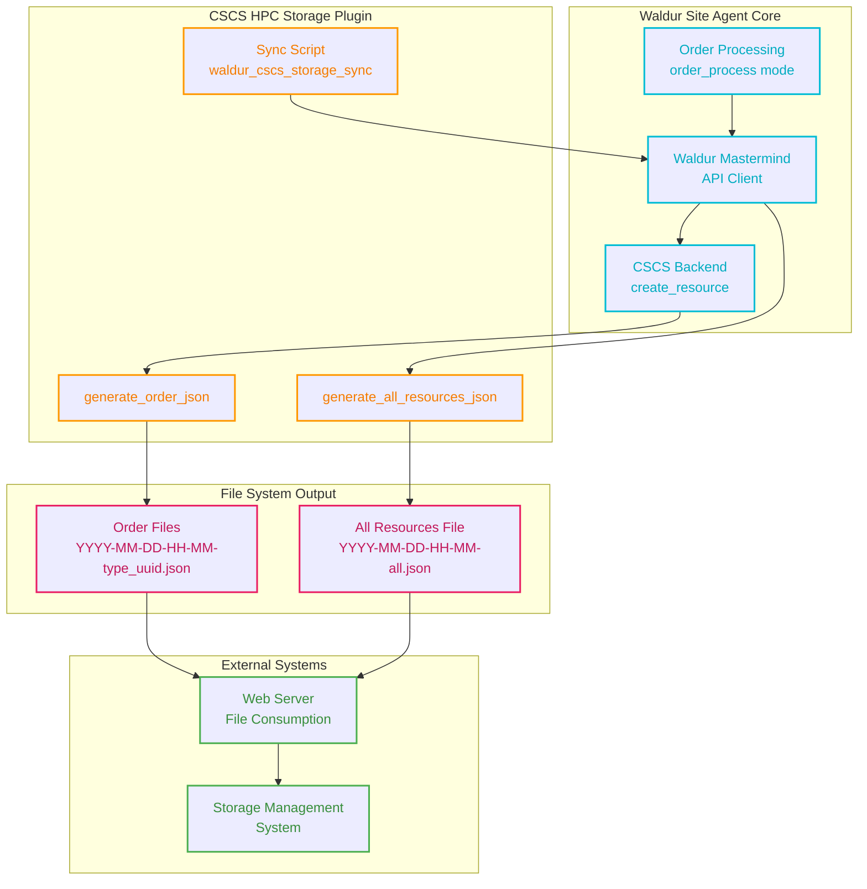

# CSCS HPC Storage Backend

A Waldur Site Agent backend plugin for managing CSCS HPC Storage systems. This backend generates JSON
files for storage resource provisioning instead of directly interfacing with storage systems.

## Overview

The CSCS HPC Storage backend is designed as a drop-in replacement for existing CSCS storage integrations.
It generates two types of JSON files that can be consumed by external web servers or storage management systems:

1. **All storage resources**: `YYYY-MM-DD-HH-MM-all.json` - Contains all storage resources for the offering
2. **Specific orders**: `YYYY-MM-DD-HH-MM-{order_type}_{order_uuid}.json` - Contains only the resources from specific orders

## Features

- **File-based output**: Generates JSON files instead of direct system integration
- **Hierarchical storage structure**: Maps Waldur organization → customer → project to storage
  tenant → customer → project
- **Configurable quotas**: Automatic inode quota calculation based on storage size
- **Mock data support**: Development/testing mode with generated target item data
- **Flexible configuration**: Customizable file system types, output directories, and quota coefficients

## Configuration

### Backend Settings

```yaml
backend_settings:
  output_directory: "cscs-storage-orders/"     # Output directory for JSON files
  storage_file_system: "lustre"               # Storage file system type
  inode_soft_coefficient: 1.33                # Multiplier for soft inode limits
  inode_hard_coefficient: 2.0                 # Multiplier for hard inode limits
  use_mock_target_items: false                # Enable mock data for development
```

### Backend Components

```yaml
backend_components:
  storage:
    measured_unit: "TB"                       # Storage unit (terabytes)
    accounting_type: "limit"                  # Accounting type for quotas
    label: "Storage"                          # Display label in Waldur
    unit_factor: 1                           # Conversion factor (TB to TB)
```

## Architecture

The CSCS HPC Storage backend follows a dual-path architecture that separates individual order processing from bulk
resource synchronization:



### Processing Flows

**Individual Order Processing:**
1. Waldur Site Agent processes orders in `order_process` mode
2. Backend `create_resource()` method generates specific order JSON files
3. Files contain single resource data for immediate processing

**Bulk Resource Synchronization:**
1. Separate sync script (`waldur_cscs_storage_sync`) runs independently
2. Fetches all resources from Waldur API for configured offerings
3. Generates comprehensive `all.json` files with complete resource lists
4. Supports dry-run mode and selective offering synchronization

### Usage

**Run sync script for all offerings:**

```bash
uv run waldur_cscs_storage_sync --config /path/to/config.yaml
```

**Run sync script for specific offering:**

```bash
uv run waldur_cscs_storage_sync --config /path/to/config.yaml --offering-uuid <uuid>
```

**Dry-run mode:**

```bash
uv run waldur_cscs_storage_sync --config /path/to/config.yaml --dry-run --verbose
```

## Data Mapping

### Waldur to Storage Hierarchy

- **Waldur Organization** → **Storage Tenant** (customer_slug)
- **Waldur Project** → **Storage Customer** (project_slug)
- **Waldur Resource** → **Storage Project** (resource_slug)

### Mount Point Generation

Mount points follow the pattern: `/{storage_system}/store/{tenant}/{customer}/{project}`

Example: `/capstor/store/university/physics-dept/climate-sim`

Where:
- `storage_system`: From offering slug (`waldur_resource.offering_slug`)
- `tenant`: Waldur customer slug (`waldur_resource.customer_slug`)
- `customer`: Waldur project slug (`waldur_resource.project_slug`)
- `project`: Waldur resource slug (`waldur_resource.slug`)

### Resource Attributes

The backend extracts the following attributes from `waldur_resource.attributes.additional_properties`:

| Attribute | Type | Required | Default | Description |
|-----------|------|----------|---------|-------------|
| `permissions` | string | No | `"775"` | Octal permissions for storage access (e.g., `"2770"`, `"755"`) |
| `storage_data_type` | string | No | `"store"` | Storage data type classification. Determines target type mapping |

**Storage System Source:**
- The `storageSystem` value comes from the `offering_slug` field, not from resource attributes
- Each offering represents a different storage system (e.g., offering with slug "capstor" = capstor storage system)

**Validation Rules:**
- All attributes must be strings if provided (non-string values raise `TypeError`)
- Unknown `storage_data_type` values fall back to `"project"` target type with warning
- Empty or missing attributes use their respective default values

**Storage Data Type Mapping:**

The `storage_data_type` attribute determines the target structure in the generated JSON:

- **Project targets**: `"store"`, `"archive"` → target type `"project"`
  - Fields: `status`, `name`, `unixGid`, `active`
- **User targets**: `"users"`, `"scratch"` → target type `"user"`
  - Fields: `status`, `email`, `unixUid`, `primaryProject`, `active`

## API Filtering

The storage proxy API supports filtering capabilities to query specific storage resources:

### API Endpoint

```http
GET /api/storage-resources/
```

### Filter Parameters

| Parameter | Type | Required | Description | Allowed Values |
|-----------|------|----------|-------------|----------------|
| `storage_system` | enum | **Yes** | Filter by storage system | `capstor`, `vast`, `iopsstor` |
| `data_type` | string | No | Filter by data type | `users`, `scratch`, `store`, `archive` |
| `status` | string | No | Filter by status | `pending`, `removing`, `active`, `error` |
| `state` | ResourceState | No | Filter by Waldur resource state | `Creating`, `OK`, `Erred` |
| `page` | integer | No | Page number (≥1) | `1`, `2`, `3` |
| `page_size` | integer | No | Items per page (1-500) | `50`, `100`, `200` |
| `debug` | boolean | No | Return raw Waldur data for debugging | `true`, `false` |

### Example API Calls

**Filter by storage system (required):**

```bash
curl "/api/storage-resources/?storage_system=capstor"
```

**Filter by storage system and data type:**

```bash
curl "/api/storage-resources/?storage_system=vast&data_type=users"
```

**Filter by storage system, data type, and status:**

```bash
curl "/api/storage-resources/?storage_system=iopsstor&data_type=store&status=active"
```

**Paginated results with filters:**

```bash
curl "/api/storage-resources/?storage_system=capstor&page=2&page_size=50"
```

**Debug mode for troubleshooting:**

```bash
curl "/api/storage-resources/?storage_system=capstor&debug=true"
```

### Filter Behavior

- **Required filtering**: `storage_system` parameter is mandatory
- **Value validation**: `storage_system` only accepts: `capstor`, `vast`, `iopsstor`
- **Optional filtering**: Other filters are applied only when provided
- **Exact matching**: All filters use exact string matching (case-sensitive)
- **Combine filters**: Multiple filters are combined with AND logic
- **Empty results**: Non-matching filters return empty result arrays

### Error Responses

**Missing storage_system parameter:**

```json
{
  "detail": [{
    "type": "missing",
    "loc": ["query", "storage_system"],
    "msg": "storage_system is mandatory.",
    "ctx": {
      "allowed_values": ["capstor", "vast", "iopsstor"],
      "help": "Add ?storage_system=<system_name> to your request"
    }
  }]
}
```

**Invalid storage_system value:**

```json
{
  "detail": [{
    "type": "enum_validation",
    "loc": ["query", "storage_system"],
    "msg": "Invalid storage_system value.",
    "ctx": {
      "allowed_values": ["capstor", "vast", "iopsstor"],
      "help": "Use: ?storage_system=capstor or ?storage_system=vast or ?storage_system=iopsstor"
    }
  }]
}
```

**Empty storage_system parameter:**

```json
{
  "detail": [{
    "type": "enum_validation",
    "loc": ["query", "storage_system"],
    "msg": "storage_system cannot be empty.",
    "ctx": {
      "allowed_values": ["capstor", "vast", "iopsstor"],
      "help": "Use ?storage_system=capstor (not just ?storage_system=)"
    }
  }]
}
```

### Debug Mode

When `debug=true` is specified, the API returns raw Waldur data without translation to the CSCS
storage JSON format. This is useful for troubleshooting and understanding the source data.

**Debug Response Format:**

```json
{
  "status": "success",
  "debug_mode": true,
  "agent_offering_config": {
    "uuid": "...",
    "api_url": "...",
    "backend_type": "cscs-hpc-storage",
    "backend_settings": {...},
    "backend_components": {...}
  },
  "waldur_offering_details": {
    "uuid": "...",
    "name": "CSCS Storage Offering",
    "slug": "capstor",
    "description": "CSCS Storage System",
    "type": "cscs-hpc-storage",
    "state": "Active",
    "category_title": "Storage",
    "customer_name": "CSCS",
    "customer_slug": "cscs",
    "options": {...},
    "attributes": {...},
    "components": {...},
    "created": "2024-01-01T00:00:00Z",
    "modified": "2024-01-01T00:00:00Z"
  },
  "raw_resources": {
    "resources": [
      {
        "uuid": "abc123...",
        "name": "Storage Resource Name",
        "slug": "resource-slug",
        "state": "OK",
        "customer_slug": "customer",
        "customer_name": "Customer Name",
        "project_slug": "project",
        "project_name": "Project Name",
        "offering_slug": "capstor",
        "offering_type": "cscs-hpc-storage",
        "limits": {"storage": 100},
        "attributes": {
          "permissions": "775",
          "storage_data_type": "store"
        },
        "backend_metadata": {},
        "created": "2024-01-01T00:00:00Z",
        "modified": "2024-01-01T00:00:00Z"
      }
    ],
    "pagination": {
      "current": 1,
      "limit": 100,
      "offset": 0,
      "pages": 1,
      "total": 1
    },
    "filters_applied": {
      "storage_system": "capstor",
      "data_type": null,
      "status": null,
      "state": null
    }
  }
}
```

**Debug Mode Features:**
- **Separate configurations**: Shows both agent's offering config and live Waldur offering details
- **Agent offering config**: Configuration from the agent's YAML file (excludes `secret_options`)
- **Waldur offering details**: Complete live offering data from Waldur API with all available attributes
- **Complete attribute exposure**: All `ProviderOfferingDetails` attributes are included dynamically
- **Raw resource data**: Unprocessed Waldur resource data with all fields
- **Filter transparency**: Shows which filters were applied to the results
- **Security**: Only `secret_options` is explicitly excluded for security
- **Smart serialization**: Automatically handles UUIDs, dates, and complex nested objects
- **Error handling**: Shows errors if offering lookup fails, continues with other attributes
- **Useful for debugging**: Compare agent config vs Waldur state, see all available offering data
