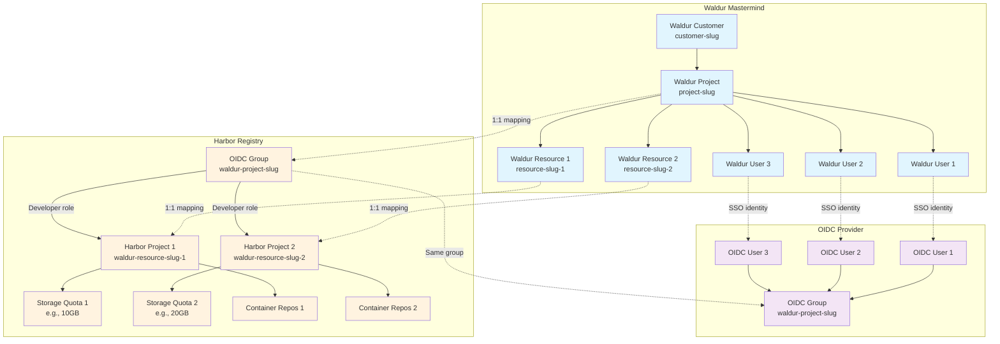

# Harbor Container Registry Plugin for Waldur Site Agent

This plugin provides **production-ready** integration between Waldur Mastermind and Harbor container registry,
enabling automated management of Harbor projects, storage quotas, and OIDC-based access control.

## Features

- **✅ Automated Project Management**: Creates Harbor projects for each Waldur resource
- **✅ Storage Quota Management**: Configurable storage limits with usage tracking
- **✅ OIDC Integration**: Automatic OIDC group creation and assignment for access control
- **✅ Usage Reporting**: Reports container storage usage back to Waldur for billing
- **✅ Robot Account Authentication**: Uses Harbor robot accounts for API operations
- **✅ Production Ready**: All operations tested and working with Harbor API v2.0

## Architecture & Mapping

### Waldur ↔ Harbor Resource Mapping



### Key Mapping Rules

1. **Waldur Resource** → **Harbor Project** (1:1)
   - Each Waldur resource creates a separate Harbor project
   - Provides complete isolation between different registry resources
   - Project names: `{allocation_prefix}{resource_slug}`

2. **Waldur Project** → **OIDC Group** (1:1)
   - One OIDC group per Waldur project for access control
   - All project team members get access to ALL Harbor projects within the Waldur project
   - Group names: `{oidc_group_prefix}{project_slug}`

3. Storage Management
   - Each Harbor project gets individual storage quota
   - Quotas set based on Waldur resource limits
   - Usage reported back to Waldur for billing

## Installation

1. Install the plugin alongside waldur-site-agent:

```bash
# From the workspace root
uv sync --all-packages
```

1. Configure the plugin in your waldur-site-agent configuration file

## Configuration

Add the Harbor backend configuration to your `waldur-site-agent-config.yaml`:

```yaml
offerings:
  harbor-registry:
    backend_type: harbor
    backend_settings:
      # Harbor instance URL
      harbor_url: "https://harbor.example.com"

      # Robot account credentials (ensure robot has sufficient permissions)
      robot_username: "robot$waldur-agent"
      robot_password: "your-robot-password-here"

      # Default storage quota in GB for new projects
      default_storage_quota_gb: 10

      # Naming prefixes
      oidc_group_prefix: "waldur-"      # OIDC groups: waldur-{project_slug}
      allocation_prefix: "waldur-"      # Harbor projects: waldur-{resource_slug}

      # Harbor project role for OIDC groups
      # 1=Admin, 2=Developer (recommended), 3=Guest, 4=Maintainer
      project_role_id: 2

    backend_components:
      storage:
        measured_unit: "GB"
        accounting_type: "limit"
        label: "Container Storage"
        unit_factor: 1

    # Waldur API settings
    api_url: "https://waldur.example.com/api/"
    api_token: "your-waldur-api-token"

    # Offering UUID in Waldur
    offering_uuid: "harbor-offering-uuid"
```

### Robot Account Permissions

**Critical**: The Harbor robot account must have the following permissions:
- ✅ **Project creation** (`POST /api/v2.0/projects`)
- ✅ **Project deletion** (`DELETE /api/v2.0/projects/{id}`) - **REQUIRED for proper resource lifecycle**
- ✅ **Quota management** (`GET/PUT /api/v2.0/quotas`)
- ✅ **User group management** (`GET/POST /api/v2.0/usergroups`)
- ✅ **Project member management** (`GET/POST/DELETE /api/v2.0/projects/{id}/members`)

**✅ Verified**: All operations including project deletion are working with proper system-level robot account permissions.

## Harbor Setup

### 1. Create Robot Account

1. Login to Harbor as admin
2. Navigate to Administration → Robot Accounts
3. Create a new robot account with **system-level permissions**:
   - **Level**: System (not project-specific)
   - **Permissions**:
     - Project: Create, Read, Update, **Delete**
     - Resource: Create, Read, Update
     - Member: Create, Read, Update, Delete
     - Quota: Read, Update
4. Save the credentials for configuration

**Note**: The robot account needs **system-level** permissions to delete projects.
Project-level robot accounts cannot delete their own projects.

### 2. Configure OIDC Authentication

1. Navigate to Administration → Configuration → Authentication
2. Set Auth Mode to "OIDC"
3. Configure OIDC provider settings:
   - OIDC Endpoint: Your identity provider URL
   - OIDC Client ID: Harbor client ID in your IdP
   - OIDC Client Secret: Harbor client secret
   - OIDC Scope: `openid,email,profile,groups`
   - Group Claim Name: `groups` (or your IdP's group claim)

### 3. Configure Storage Quotas

1. Navigate to Administration → Configuration → System Settings
2. Set appropriate global storage quota limits
3. Individual project quotas will be managed by the agent

## Usage

### Running the Agent

```bash
# Process orders (create/delete Harbor projects)
uv run waldur_site_agent -m order_process -c config.yaml

# Report usage back to Waldur
uv run waldur_site_agent -m report -c config.yaml

# Synchronize memberships (OIDC group management)
uv run waldur_site_agent -m membership_sync -c config.yaml
```

### Systemd Service

Create a systemd service for automated operation:

```ini
[Unit]
Description=Waldur Harbor Agent - Order Processing
After=network.target

[Service]
Type=simple
User=waldur
ExecStart=/usr/local/bin/waldur_site_agent -m order_process -c /etc/waldur/harbor-config.yaml
Restart=on-failure
RestartSec=60

[Install]
WantedBy=multi-user.target
```

## API Operations

The plugin implements the following Harbor API operations:

### ✅ Project Management (Fully Working)

- ✅ Create project with minimal payload
- ✅ Get project details and metadata
- ✅ List all projects
- ✅ **Delete project (complete resource lifecycle)**

### ✅ Storage Quota Management (Fully Working)

- ✅ Set project storage quotas
- ✅ Update project storage quotas
- ✅ Query current quota usage
- ✅ Report storage consumption for billing

### ✅ OIDC Group Management (Fully Working)

- ✅ Create OIDC groups
- ✅ Assign groups to projects with specified roles (Admin/Developer/Guest/Maintainer)
- ✅ List existing user groups
- ✅ Search for specific groups

### ✅ Usage Reporting (Fully Working)

- ✅ Query project storage usage via quota API
- ✅ Report repository counts
- ✅ Track storage consumption for Waldur billing
- ✅ Get project metadata and statistics

### 🔄 Supported Waldur Operations

- ✅ **order_process**: Create/update Harbor projects and quotas
- ✅ **report**: Report storage usage back to Waldur
- ✅ **membership_sync**: Manage OIDC group memberships
- ✅ **diagnostics**: Health checks and connectivity testing

## Testing

Run the test suite:

```bash
# Run all Harbor plugin tests
uv run pytest plugins/harbor/tests/ -v

# Run with coverage
uv run pytest plugins/harbor/tests/ --cov=waldur_site_agent_harbor
```

## Troubleshooting

### ✅ Known Issues & Solutions

#### 1. **CSRF Token Errors (SOLVED)**

**Symptom**: `403 Forbidden - CSRF token not found in request`

**Root Cause**: Harbor's session-based authentication requires CSRF tokens for persistent sessions.

**✅ Solution**: The plugin now uses direct HTTP requests with authentication tuples instead of
persistent sessions, which bypasses CSRF requirements entirely.

**Technical Details**:

```python
# OLD (caused CSRF issues)
session = requests.Session()
session.headers.update({"Authorization": "Basic ..."})
response = session.post(url, json=data)

# NEW (works perfectly)
auth = (username, password)
response = requests.post(url, auth=auth, json=data)
```

#### 2. **Robot Account Permissions**

**Symptoms**:
- Can list projects but cannot create them
- Can create projects but cannot set quotas
- Cannot create OIDC groups

**✅ Solution**: Ensure robot account has system-level permissions:
1. Login to Harbor as admin
2. Go to Administration → Robot Accounts
3. Edit your robot account
4. Grant these **system-level** permissions:
   - **Project**: Create, Read, Update, **Delete**
   - **Resource**: Create, Read, Update
   - **Member**: Create, Read, Update, Delete
   - **Quota**: Read, Update

**Critical**: Without project deletion permissions, Harbor projects will accumulate when Waldur resources
are terminated, leading to storage waste and potential quota issues.

### Common Issues

1. Authentication Failures
   - ✅ Verify robot account credentials in configuration
   - ✅ Test connectivity: `curl -u "robot\$user:pass" https://harbor.example.com/api/v2.0/health`
   - ✅ Ensure Harbor API v2.0 is enabled

2. OIDC Group Issues
   - ✅ Verify OIDC configuration in Harbor (Administration → Configuration → Authentication)
   - ✅ Check group claim configuration (`groups` is common)
   - ✅ Ensure OIDC provider is properly configured

3. Storage Quota Problems
   - ✅ Check global quota settings in Harbor (Administration → Configuration → System Settings)
   - ✅ Verify project-specific quotas: `curl -u "robot\$user:pass" https://harbor.example.com/api/v2.0/quotas`
   - ✅ Monitor Harbor system storage availability

### Debugging

#### Enable Debug Logging

```yaml
# In waldur-site-agent config
logging:
  level: DEBUG
  format: "%(asctime)s - %(name)s - %(levelname)s - %(message)s"
```

#### Test Harbor Client Directly

```python
from waldur_site_agent_harbor.client import HarborClient

client = HarborClient("https://harbor.example.com", "robot$user", "password")

# Test connectivity
print("Ping:", client.ping())

# List projects
projects = client.list_resources()
print("Projects:", [p.name for p in projects])

# Test permissions
try:
    # This should work if permissions are correct
    group_id = client.create_user_group("test-group")
    print("Group created:", group_id)
except Exception as e:
    print("Permission issue:", e)
```

#### Check Logs

```bash
# For systemd deployments
journalctl -u waldur-harbor-agent -f --since "1 hour ago"

# For direct execution
tail -f /var/log/waldur-site-agent.log
```

### Verification Commands

Test robot account permissions manually:

```bash
# Test authentication
curl -u "robot\$username:password" https://harbor.example.com/api/v2.0/health

# Test project listing
curl -u "robot\$username:password" https://harbor.example.com/api/v2.0/projects

# Test quota access
curl -u "robot\$username:password" https://harbor.example.com/api/v2.0/quotas

# Test group management
curl -u "robot\$username:password" https://harbor.example.com/api/v2.0/usergroups

# Test project deletion permissions (CRITICAL)
# First create a test project
curl -X POST -H "Content-Type: application/json" \
  -u "robot\$username:password" \
  -d '{"project_name":"deletion-test","metadata":{"public":"false"}}' \
  https://harbor.example.com/api/v2.0/projects

# Then try to delete it (should return 200/204, not 403)
# Get project ID first, then delete
curl -X DELETE -u "robot\$username:password" \
  https://harbor.example.com/api/v2.0/projects/{project_id}
```

### Expected Results

- ✅ **200/201** for creation operations
- ✅ **200** for read operations
- ✅ **200/204** for update operations
- ✅ **200/204** for deletion operations
- ❌ **403 Forbidden** indicates insufficient permissions

## Development

### Project Structure

```text
plugins/harbor/
├── waldur_site_agent_harbor/
│   ├── __init__.py
│   ├── backend.py       # HarborBackend implementation
│   ├── client.py        # Harbor API client
│   └── exceptions.py    # Custom exceptions
├── tests/
│   ├── test_harbor_backend.py
│   └── test_harbor_client.py
├── pyproject.toml
└── README.md
```

### Adding New Features

1. Extend the `HarborClient` class for new API operations
2. Update `HarborBackend` to utilize new client methods
3. Add corresponding tests
4. Update documentation

## License

This plugin is part of the Waldur Site Agent project and follows the same licensing terms.

## Support

For issues and questions:
- Create an issue in the Waldur Site Agent repository
- Contact the OpenNode team
