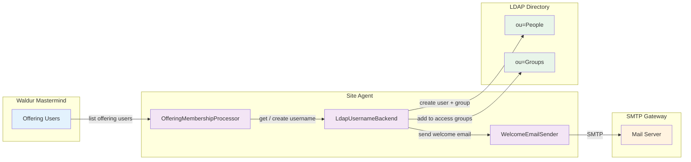
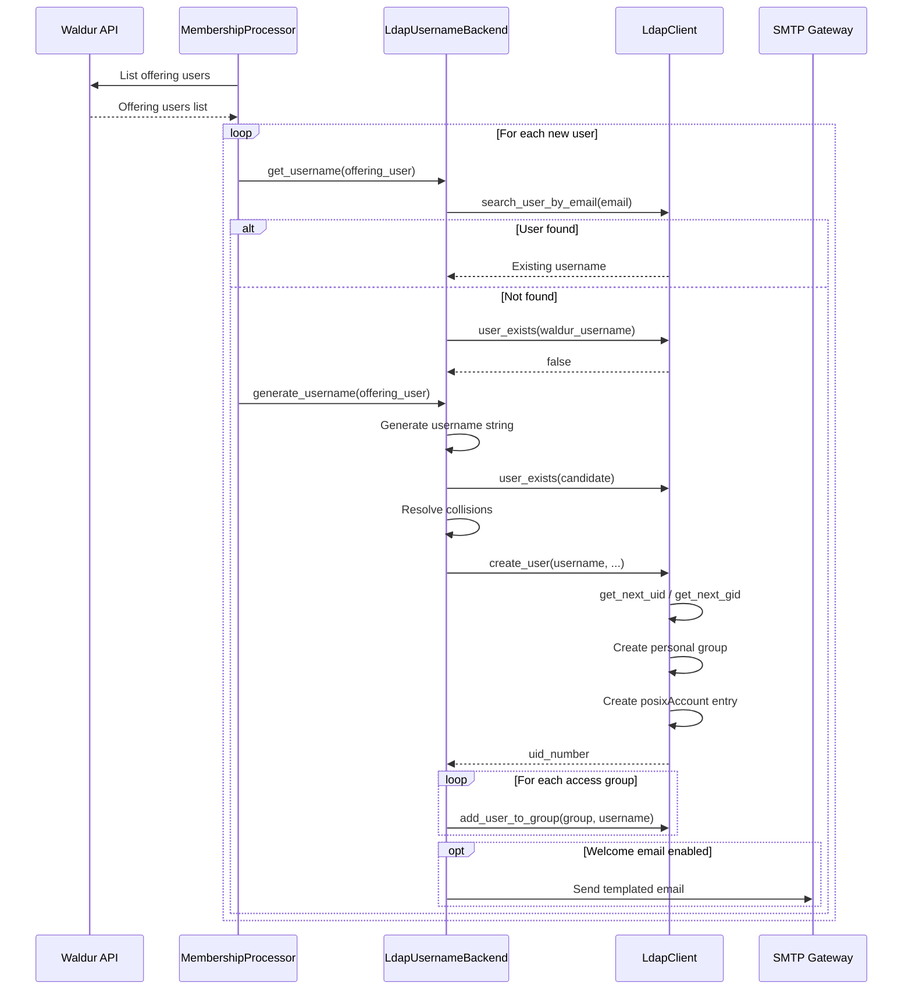
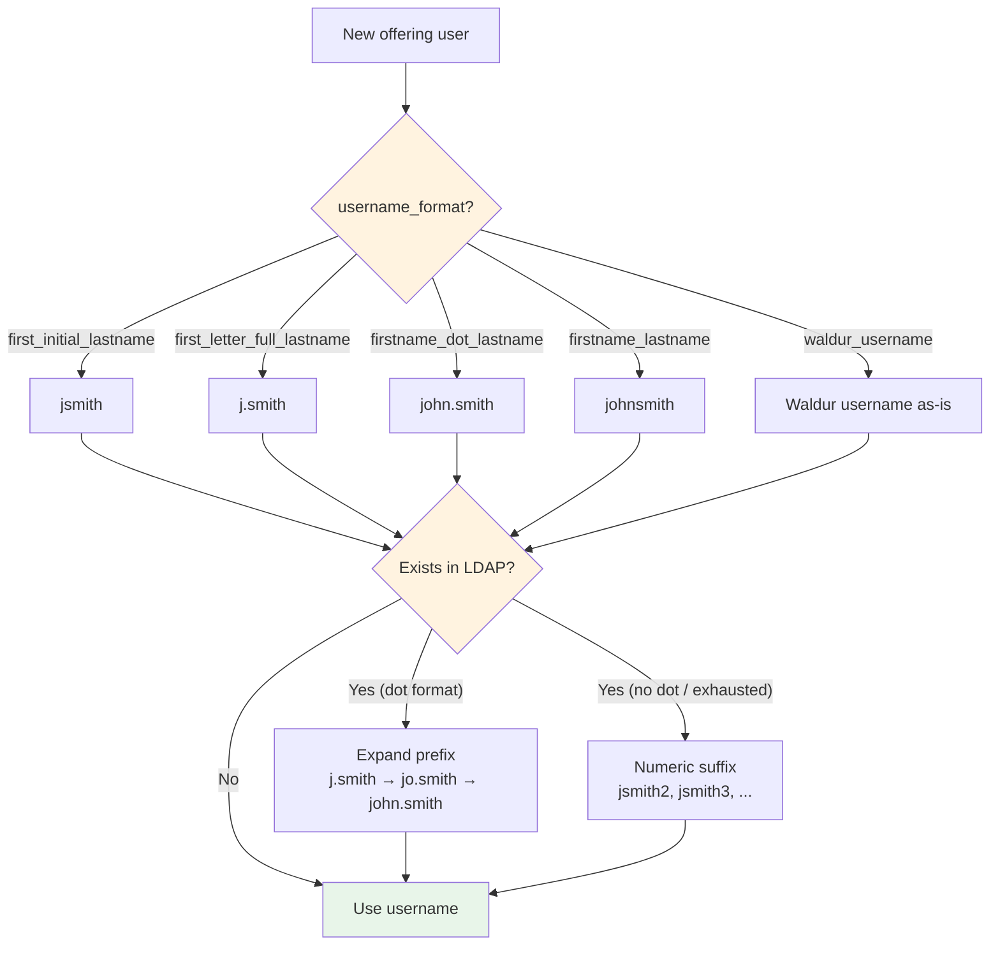
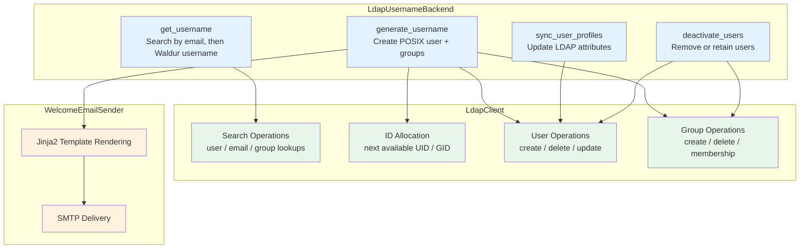

# LDAP Username Management Plugin for Waldur Site Agent

Provisions POSIX users and groups in an LDAP directory when Waldur offering
members need local accounts on an HPC site. Handles the full user lifecycle:
account creation, access group membership, optional VPN password generation,
and welcome email delivery.

## Overview



## Features

- **POSIX User Provisioning**: Creates `posixAccount` entries with personal groups,
  auto-allocated UID/GID from configurable ranges
- **Username Generation**: Multiple strategies — `first_initial_lastname` (`jsmith`),
  `first_letter_full_lastname` (`j.smith`), `firstname_dot_lastname` (`john.smith`),
  `firstname_lastname` (`johnsmith`), or passthrough `waldur_username`
- **Collision Resolution**: Expands first-name prefix before falling back to numeric
  suffixes (`j.smith` → `jo.smith` → `john.smith` → `j.smith2`)
- **Access Groups**: Automatically adds new users to configured LDAP groups
  (e.g., VPN access, GPU access) with `memberUid` or `member` (DN-based) attributes
- **VPN Password Generation**: Optional cryptographically random password stored in
  `userPassword` attribute
- **Welcome Email**: Templated email via SMTP with account credentials, delivered
  on user creation (opt-in)
- **Profile Sync**: Updates LDAP attributes (`givenName`, `sn`, `cn`, `mail`) from
  Waldur user profiles
- **User Deactivation**: Configurable removal or retention of LDAP entries when
  users leave the offering

## Architecture

### User Provisioning Flow



### Username Generation Strategy



### Component Overview



## Configuration

### Minimal Example

```yaml
offerings:
  - name: "HPC Cluster"
    waldur_api_url: "https://waldur.example.com/api/"
    waldur_api_token: "your-token"
    waldur_offering_uuid: "offering-uuid"
    username_management_backend: "ldap"
    backend_type: "slurm"
    backend_settings:
      ldap:
        uri: "ldap://ldap.example.com"
        bind_dn: "cn=admin,dc=example,dc=com"
        bind_password: "admin-password"
        base_dn: "dc=example,dc=com"
```

### Full Example (with welcome email and access groups)

```yaml
offerings:
  - name: "HPC Cluster"
    waldur_api_url: "https://waldur.example.com/api/"
    waldur_api_token: "your-token"
    waldur_offering_uuid: "offering-uuid"
    username_management_backend: "ldap"
    backend_type: "slurm"
    backend_settings:
      ldap:
        # Connection
        uri: "ldap://ldap.example.com"
        bind_dn: "cn=admin,dc=example,dc=com"
        bind_password: "admin-password"
        base_dn: "dc=example,dc=com"
        use_starttls: false

        # Directory structure
        people_ou: "ou=People"
        groups_ou: "ou=Groups"

        # ID allocation ranges
        uid_range_start: 10000
        uid_range_end: 65000
        gid_range_start: 10000
        gid_range_end: 65000

        # User defaults
        default_login_shell: "/bin/bash"
        default_home_base: "/home"

        # Username generation
        username_format: "first_letter_full_lastname"  # produces j.smith

        # User lifecycle
        remove_user_on_deactivate: false
        generate_vpn_password: true

        # Access groups — new users are automatically added
        access_groups:
          - name: "vpnusrgroup"
            attribute: "memberUid"       # UID-based membership
          - name: "cluster-users"
            attribute: "member"          # DN-based membership

        # Welcome email (opt-in)
        welcome_email:
          smtp_host: "smtp.example.com"
          smtp_port: 587
          smtp_username: "noreply@example.com"
          smtp_password: "smtp-password"
          use_tls: true
          from_address: "noreply@example.com"
          from_name: "HPC Support"
          subject: "Your {{ username }} account is ready"
          template_path: "templates/welcome-email.txt.j2"
```

### LDAP Settings Reference

| Setting | Required | Default | Description |
|---------|----------|---------|-------------|
| `uri` | Yes | -- | LDAP server URI (e.g., `ldap://ldap.example.com`) |
| `bind_dn` | Yes | -- | DN to bind as (e.g., `cn=admin,dc=example,dc=com`) |
| `bind_password` | Yes | -- | Password for bind DN |
| `base_dn` | Yes | -- | Base DN for the directory |
| `use_starttls` | No | `false` | Use STARTTLS for connection security |
| `people_ou` | No | `ou=People` | OU for user entries |
| `groups_ou` | No | `ou=Groups` | OU for group entries |
| `uid_range_start` | No | `10000` | Start of UID allocation range |
| `uid_range_end` | No | `65000` | End of UID allocation range |
| `gid_range_start` | No | `10000` | Start of GID allocation range |
| `gid_range_end` | No | `65000` | End of GID allocation range |
| `default_login_shell` | No | `/bin/bash` | Default login shell for new users |
| `default_home_base` | No | `/home` | Base path for home directories |
| `username_format` | No | `first_initial_lastname` | Username generation strategy (see below) |
| `remove_user_on_deactivate` | No | `false` | Delete LDAP entry on deactivation |
| `generate_vpn_password` | No | `false` | Generate random VPN password on creation |
| `access_groups` | No | `[]` | LDAP groups to add new users to |
| `welcome_email` | No | -- | SMTP settings for welcome email (disabled when absent) |

### Username Formats

| Format | Example | Description |
|--------|---------|-------------|
| `first_initial_lastname` | `jsmith` | First initial + full last name |
| `first_letter_full_lastname` | `j.smith` | First initial + dot + full last name |
| `firstname_dot_lastname` | `john.smith` | Full first name + dot + full last name |
| `firstname_lastname` | `johnsmith` | Full first name + full last name |
| `waldur_username` | *(as-is)* | Use the Waldur username without transformation |

Names are normalized: diacritics removed (`Müller` → `muller`), non-alphanumeric
characters stripped. The `waldur_username` format bypasses normalization.

### Welcome Email Settings

| Setting | Required | Default | Description |
|---------|----------|---------|-------------|
| `smtp_host` | Yes | -- | SMTP server hostname |
| `smtp_port` | No | `587` | SMTP server port |
| `smtp_username` | No | -- | SMTP auth username (omit for unauthenticated relay) |
| `smtp_password` | No | -- | SMTP auth password |
| `use_tls` | No | `true` | Use STARTTLS (port 587) |
| `use_ssl` | No | `false` | Use implicit SSL (port 465) |
| `timeout` | No | `30` | SMTP connection timeout in seconds |
| `from_address` | Yes | -- | Sender email address |
| `from_name` | No | -- | Sender display name |
| `subject` | No | `Your new account has been created` | Subject line (Jinja2 template) |
| `template_path` | Yes | -- | Path to Jinja2 email body template (absolute or relative to CWD) |

### Welcome Email Template Variables

The following variables are available in the Jinja2 template:

| Variable | Description |
|----------|-------------|
| `username` | The generated POSIX username |
| `vpn_password` | VPN password (empty string if `generate_vpn_password` is false) |
| `first_name` | User's first name from Waldur |
| `last_name` | User's last name from Waldur |
| `email` | User's email address |
| `home_directory` | Full home directory path (e.g., `/home/jsmith`) |
| `login_shell` | Configured login shell (e.g., `/bin/bash`) |
| `uid_number` | Allocated UID number |

Example templates are provided in `examples/`:
- `welcome-email.txt.j2` — plain text
- `welcome-email.html.j2` — HTML

### Access Group Configuration

Each access group entry supports:

| Field | Required | Default | Description |
|-------|----------|---------|-------------|
| `name` | Yes | -- | LDAP group name (e.g., `vpnusrgroup`) |
| `attribute` | No | `memberUid` | Membership attribute: `memberUid` (UID) or `member` (DN) |

### LDAP Object Classes

Default object classes can be overridden per deployment:

| Setting | Default | Description |
|---------|---------|-------------|
| `user_object_classes` | See below | Object classes for user entries |
| `user_group_object_classes` | See below | Object classes for personal user groups |
| `project_group_object_classes` | `posixGroup`, `top` | Object classes for project groups |

Defaults:

- **user_object_classes**: `inetOrgPerson`, `ldapPublicKey`,
  `organizationalPerson`, `person`, `posixAccount`, `top`
- **user_group_object_classes**: `groupOfNames`, `nsMemberOf`,
  `organizationalUnit`, `posixGroup`, `top`

## Plugin Structure

```text
plugins/ldap/
├── pyproject.toml                        # Package metadata + entry points
├── README.md
├── examples/
│   ├── welcome-email.txt.j2             # Plain text email template
│   └── welcome-email.html.j2            # HTML email template
├── waldur_site_agent_ldap/
│   ├── __init__.py
│   ├── backend.py                       # LdapUsernameBackend
│   ├── client.py                        # LdapClient (ldap3-based)
│   ├── email_sender.py                  # WelcomeEmailSender (SMTP + Jinja2)
│   └── schemas.py                       # Pydantic validation schemas
└── tests/
    ├── __init__.py
    └── test_email_sender.py             # Email sender unit tests (9 tests)
```

### Entry Points

```toml
[project.entry-points."waldur_site_agent.username_management_backends"]
ldap = "waldur_site_agent_ldap.backend:LdapUsernameBackend"

[project.entry-points."waldur_site_agent.backend_settings_schemas"]
ldap = "waldur_site_agent_ldap.schemas:LdapBackendSettingsSchema"
```

## Testing

```bash
# Run unit tests
.venv/bin/python -m pytest plugins/ldap/tests/ -v

# Run LDAP E2E tests (requires running LDAP + SLURM emulator + Waldur)
WALDUR_E2E_TESTS=true \
WALDUR_E2E_LDAP_CONFIG=ci/e2e-ci-config-ldap.yaml \
WALDUR_E2E_PROJECT_A_UUID=<uuid> \
.venv/bin/python -m pytest plugins/slurm/tests/e2e/test_e2e_ldap.py -v
```

### E2E Test Coverage

The LDAP E2E tests (`plugins/slurm/tests/e2e/test_e2e_ldap.py`) cover:

| Test Class | Tests | Focus |
|------------|-------|-------|
| `TestLdapResourceLifecycle` | 3 | Create, update limits, terminate SLURM resource with LDAP integration |
| `TestLdapMembershipSync` | 5 | User provisioning, project groups, access groups, SLURM associations |
| `TestLdapUsageReporting` | 3 | Usage injection and verification with component mapper |
| `TestLdapBackwardCompatibility` | 2 | Passthrough vs conversion component mapping |
| `TestLdapWelcomeEmail` | 5 | Email sending, credential delivery, recipient validation |
