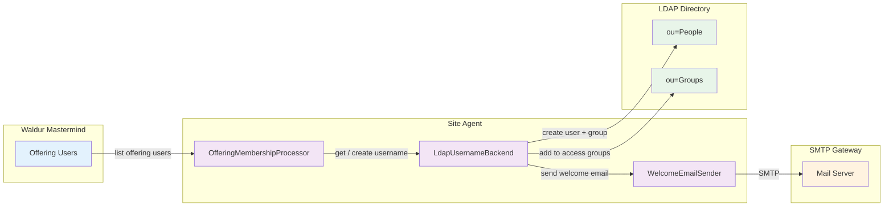
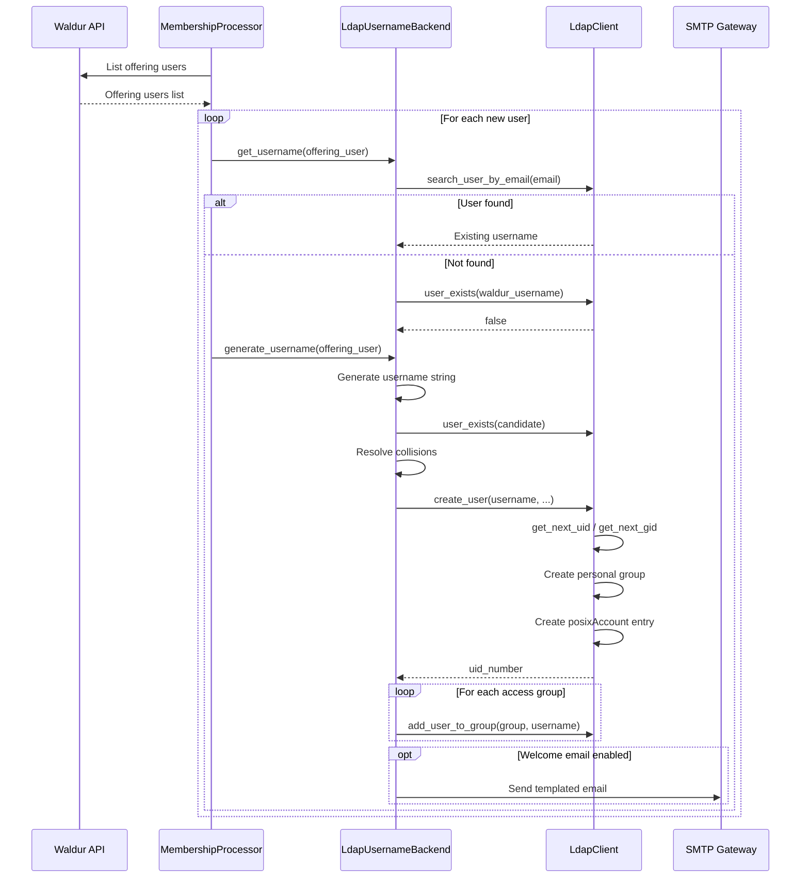
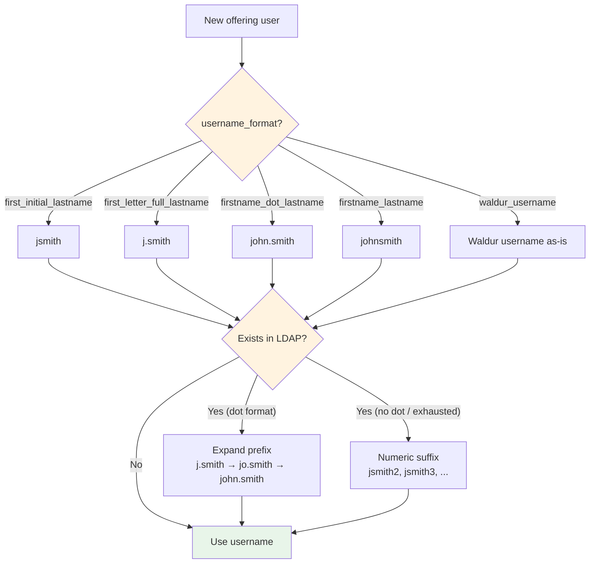
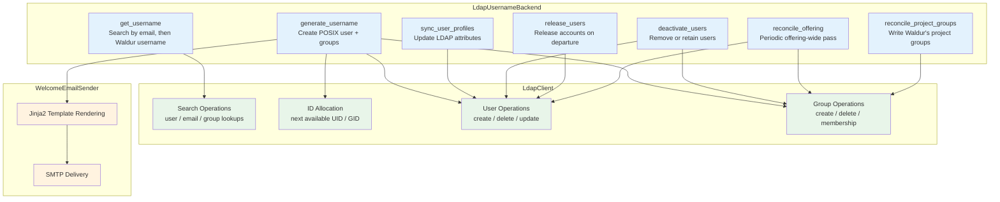

# LDAP Username Management Plugin for Waldur Site Agent

Provisions POSIX users and groups in an LDAP directory when Waldur offering
members need local accounts on an HPC site. Handles the full user lifecycle:
account creation, access group membership, optional VPN password generation,
and welcome email delivery.

## At a glance

| Entry point | Group | Role |
|---|---|---|
| `ldap` | `waldur_site_agent.username_management_backends` | username management |
| `ldap` | `waldur_site_agent.backend_settings_schemas` | schema of the `ldap:` block (see below) |

Select it with `username_management_backend: "ldap"` on an offering whose processing
backend (usually `slurm`) needs POSIX accounts. It generates and looks up usernames,
creates and updates LDAP accounts and groups, syncs profiles, and releases accounts on
departure; it does not process orders or report usage itself.

## Overview


```mermaid
graph LR
    subgraph "Waldur Mastermind"
        OU[Offering Users]
    end

    subgraph "Site Agent"
        PROC[OfferingMembershipProcessor]
        BACK[LdapUsernameBackend]
        EMAIL[WelcomeEmailSender]
    end

    subgraph "LDAP Directory"
        PEOPLE[ou=People]
        GROUPS[ou=Groups]
    end

    subgraph "SMTP Gateway"
        SMTP[Mail Server]
    end

    OU -->|"list offering users"| PROC
    PROC -->|"get / create username"| BACK
    BACK -->|"create user + group"| PEOPLE
    BACK -->|"add to access groups"| GROUPS
    BACK -->|"send welcome email"| EMAIL
    EMAIL -->|"SMTP"| SMTP

    classDef waldur fill:#e3f2fd
    classDef agent fill:#f3e5f5
    classDef ldap fill:#e8f5e9
    classDef mail fill:#fff3e0

    class OU waldur
    class PROC,BACK,EMAIL agent
    class PEOPLE,GROUPS ldap
    class SMTP mail
```

## Features

- **POSIX User Provisioning**: Creates `posixAccount` entries with personal groups,
  auto-allocated UID/GID from configurable ranges
- **Username Generation**: Multiple strategies — `first_initial_lastname` (`jsmith`),
  `first_letter_full_lastname` (`j.smith`), `firstname_dot_lastname` (`john.smith`),
  `firstname_lastname` (`johnsmith`), or passthrough `waldur_username`
- **Collision Resolution**: Expands first-name prefix before falling back to numeric
  suffixes (`j.smith` → `jo.smith` → `john.smith` → `j.smith2`)
- **Access Groups**: Automatically adds new users to configured LDAP groups
  (e.g., VPN access, GPU access) with `memberUid` or `member` (DN-based) attributes
- **VPN Password Generation**: Optional cryptographically random password stored in
  `userPassword` attribute
- **Welcome Email**: Templated email via SMTP with account credentials, delivered
  on user creation (opt-in)
- **Profile Sync**: Updates LDAP attributes (`givenName`, `sn`, `cn`, `mail`) from
  Waldur user profiles
- **User Deactivation**: Configurable removal or retention of LDAP entries when
  users leave the offering

## Architecture

### User Provisioning Flow


```mermaid
sequenceDiagram
    participant W as Waldur API
    participant P as MembershipProcessor
    participant B as LdapUsernameBackend
    participant L as LdapClient
    participant S as SMTP Gateway

    P->>W: List offering users
    W-->>P: Offering users list

    loop For each new user
        P->>B: get_username(offering_user)
        B->>L: search_user_by_email(email)
        alt User found
            L-->>B: Existing username
        else Not found
            B->>L: user_exists(waldur_username)
            L-->>B: false
            P->>B: generate_username(offering_user)
            B->>B: Generate username string
            B->>L: user_exists(candidate)
            B->>B: Resolve collisions
            B->>L: create_user(username, ...)
            L->>L: get_next_uid / get_next_gid
            L->>L: Create personal group
            L->>L: Create posixAccount entry
            L-->>B: uid_number

            loop For each access group
                B->>L: add_user_to_group(group, username)
            end

            opt Welcome email enabled
                B->>S: Send templated email
            end
        end
    end
```

### Username Generation Strategy


```mermaid
graph TB
    START[New offering user] --> FORMAT{username_format?}

    FORMAT -->|first_initial_lastname| FI["jsmith"]
    FORMAT -->|first_letter_full_lastname| FL["j.smith"]
    FORMAT -->|firstname_dot_lastname| FD["john.smith"]
    FORMAT -->|firstname_lastname| FN["johnsmith"]
    FORMAT -->|waldur_username| WU["Waldur username as-is"]

    FI --> UNIQUE
    FL --> UNIQUE
    FD --> UNIQUE
    FN --> UNIQUE
    WU --> UNIQUE

    UNIQUE{Exists in LDAP?}
    UNIQUE -->|No| DONE[Use username]
    UNIQUE -->|"Yes (dot format)"| EXPAND["Expand prefix<br/>j.smith → jo.smith → john.smith"]
    UNIQUE -->|"Yes (no dot / exhausted)"| SUFFIX["Numeric suffix<br/>jsmith2, jsmith3, ..."]

    EXPAND --> DONE
    SUFFIX --> DONE

    classDef decision fill:#fff3e0
    classDef result fill:#e8f5e9

    class FORMAT,UNIQUE decision
    class DONE result
```

### Component Overview


```mermaid
graph TB
    subgraph "LdapUsernameBackend"
        GET[get_username<br/>Search by email, then Waldur username]
        GEN[generate_username<br/>Create POSIX user + groups]
        SYNC[sync_user_profiles<br/>Update LDAP attributes]
        DEACT[deactivate_users<br/>Remove or retain users]
        REL[release_users<br/>Release accounts on departure]
        RECON[reconcile_offering<br/>Periodic offering-wide pass]
        RPG[reconcile_project_groups<br/>Write Waldur's project groups]
    end

    subgraph "LdapClient"
        SEARCH[Search Operations<br/>user / email / group lookups]
        IDALLOC[ID Allocation<br/>next available UID / GID]
        USEROP[User Operations<br/>create / delete / update]
        GROUPOP[Group Operations<br/>create / delete / membership]
    end

    subgraph "WelcomeEmailSender"
        RENDER[Jinja2 Template Rendering]
        SEND[SMTP Delivery]
    end

    GET --> SEARCH
    GEN --> IDALLOC
    GEN --> USEROP
    GEN --> GROUPOP
    GEN --> RENDER
    RENDER --> SEND
    SYNC --> USEROP
    DEACT --> USEROP
    DEACT --> GROUPOP
    REL --> USEROP
    RECON --> USEROP
    RECON --> GROUPOP
    RPG --> GROUPOP

    classDef backend fill:#e3f2fd
    classDef client fill:#e8f5e9
    classDef email fill:#fff3e0

    class GET,GEN,SYNC,DEACT,REL,RECON,RPG backend
    class SEARCH,IDALLOC,USEROP,GROUPOP client
    class RENDER,SEND email
```

## Configuration

### Minimal Example

```yaml
offerings:
  - name: "HPC Cluster"
    waldur_api_url: "https://waldur.example.com/api/"
    waldur_api_token: "your-token"
    waldur_offering_uuid: "offering-uuid"
    username_management_backend: "ldap"
    backend_type: "slurm"
    order_processing_backend: "slurm"
    membership_sync_backend: "slurm"
    reporting_backend: "slurm"
    backend_settings:
      default_account: "root"
      customer_prefix: "c_"
      project_prefix: "p_"
      allocation_prefix: "a_"
      ldap:
        uri: "ldap://ldap.example.com"
        bind_dn: "cn=admin,dc=example,dc=com"
        bind_password: "admin-password"
        base_dn: "dc=example,dc=com"
```

### Full Example (with welcome email and access groups)

```yaml
offerings:
  - name: "HPC Cluster"
    waldur_api_url: "https://waldur.example.com/api/"
    waldur_api_token: "your-token"
    waldur_offering_uuid: "offering-uuid"
    username_management_backend: "ldap"
    backend_type: "slurm"
    order_processing_backend: "slurm"
    membership_sync_backend: "slurm"
    reporting_backend: "slurm"
    backend_settings:
      default_account: "root"
      customer_prefix: "c_"
      project_prefix: "p_"
      allocation_prefix: "a_"
      ldap:
        # Connection
        uri: "ldap://ldap.example.com"
        bind_dn: "cn=admin,dc=example,dc=com"
        bind_password: "admin-password"
        base_dn: "dc=example,dc=com"
        use_starttls: false

        # Directory structure
        people_ou: "ou=People"
        groups_ou: "ou=Groups"

        # ID allocation ranges
        uid_range_start: 10000
        uid_range_end: 65000
        gid_range_start: 10000
        gid_range_end: 65000

        # User defaults
        default_login_shell: "/bin/bash"
        default_home_base: "/home"

        # Username generation
        username_format: "first_letter_full_lastname"  # produces j.smith

        # User lifecycle
        remove_user_on_deactivate: false
        generate_vpn_password: true

        # Access groups — new users are automatically added
        access_groups:
          - name: "vpnusrgroup"
            attribute: "memberUid"       # UID-based membership
          - name: "cluster-users"
            attribute: "member"          # DN-based membership

        # Welcome email (opt-in)
        welcome_email:
          smtp_host: "smtp.example.com"
          smtp_port: 587
          smtp_username: "noreply@example.com"
          smtp_password: "smtp-password"
          use_tls: true
          from_address: "noreply@example.com"
          from_name: "HPC Support"
          subject: "Your {{ username }} account is ready"
          template_path: "templates/welcome-email.txt.j2"
```

### LDAP Settings Reference

| Setting | Required | Default | Description |
|---------|----------|---------|-------------|
| `uri` | Yes | -- | LDAP server URI (e.g., `ldap://ldap.example.com`) |
| `bind_dn` | Yes | -- | DN to bind as (e.g., `cn=admin,dc=example,dc=com`) |
| `bind_password` | Yes | -- | Password for bind DN |
| `base_dn` | Yes | -- | Base DN for the directory |
| `use_starttls` | No | `false` | Use STARTTLS for connection security |
| `people_ou` | No | `ou=People` | OU for user entries |
| `groups_ou` | No | `ou=Groups` | OU for personal and access groups; unused without either |
| `uid_range_start` | No | `10000` | Start of UID allocation range |
| `uid_range_end` | No | `65000` | End of UID allocation range |
| `gid_range_start` | No | `10000` | Start of GID allocation range |
| `gid_range_end` | No | `65000` | End of GID allocation range |
| `default_login_shell` | No | `/bin/bash` | Default login shell for new users |
| `default_home_base` | No | `/home` | Base path for home directories |
| `account_source` | No | `ldap` | Who owns username/UID/GID: `ldap` (this agent) or `waldur` (see below) |
| `on_missing_posix_ids` | No | `error` | `error` or `skip` when Waldur holds no ids (waldur mode) |
| `on_posix_mismatch` | No | `report` | `report`, `adopt` or `fail` on an id disagreement (waldur mode) |
| `username_format` | No | `first_initial_lastname` | Username strategy (see below); rejected in waldur mode |
| `waldur_username_attribute` | No | -- | Attribute for the Waldur username; the rename key (`employeeNumber`) |
| `remove_user_on_deactivate` | No | per `account_source` | Release the entry once no live account remains; see below |
| `on_departure` | No | per `account_source` | `disable` (park, keep ids) or `delete`; see below |
| `generate_vpn_password` | No | `false` | Generate random VPN password on creation |
| `access_groups` | No | `[]` | LDAP groups to add new users to |
| `personal_groups` | No | `true` | Personal group per account; `false` needs waldur mode |
| `project_groups` | No | -- | Write Waldur's project groups ([below](#project-groups-from-waldur)) |
| `welcome_email` | No | -- | SMTP settings for welcome email (disabled when absent) |

## Waldur-authoritative mode

By default this plugin owns the identity: it derives a username from the user's
name and allocates a UID and GID by scanning the directory for free numbers.
That breaks down as soon as **one directory serves several offerings of the same
service provider** — each offering allocates independently, so the same person
ends up with two UIDs behind one DN and one home directory, and two site agents
fight over the entry.

Waldur already solves this on its side: a `PosixIdPool` attached to the service
provider gives each user one UID and one primary GID across every offering that
resolves to it. Setting `account_source: waldur` makes the agent *write those
values* rather than invent its own.

```yaml
backend_settings:
  ldap:
    uri: "ldap://ldap.example.com"
    bind_dn: "cn=admin,dc=example,dc=com"
    bind_password: "admin-password"
    base_dn: "dc=example,dc=com"

    account_source: "waldur"
    on_posix_mismatch: "report"   # report | adopt | fail
    on_missing_posix_ids: "error" # error | skip
```

In this mode the agent takes `username`, `uidnumber`, `primarygroup`,
`home_directory` and `login_shell` from the offering user and writes them into
the directory. `username_format` is rejected (Waldur names the accounts), and
`uid_range_*` is ignored for user accounts. The offering's
`username_generation_policy` must be anything **other** than `service_provider`
— under that policy Waldur expects the agent to assign names, which is the
opposite of what this mode does.

Provisioning runs as a **reconcile loop** on every membership cycle, over the
full account list rather than only newly-requested ones, so an entry that was
deleted or edited out of band is repaired on the next pass.

### What happens in each case

| Directory state | Action |
|---|---|
| No entry, UID free | Create the entry, its personal group, and any access-group memberships |
| Entry matches Waldur | Nothing |
| Home directory, shell, name or mail differ | Rewritten to match Waldur |
| `uidNumber` or `gidNumber` differ | Governed by `on_posix_mismatch` |
| The entry carries another person's key (see below) | Error, the entry is left alone — always |
| The wanted UID is held by the same account under its old name | Renamed (see below) |
| The wanted UID is held by a *different* entry | Error, the account is left alone — always |
| Another entry shares the email address | Warning, and the account is created anyway |

**The key.** The agent ties an entry to its Waldur account by a stable key: the
person's Waldur username, written to `waldur_username_attribute`.

> **The attribute is reserved for the agent.** It writes and rewrites it, so it
> must hold nothing else. `employeeNumber` (an `inetOrgPerson` attribute, no
> schema change) is the usual choice; a site that keeps HR data in
> `employeeNumber` must pick another attribute.

The key comes from the offering user's `user_username`, which Waldur returns
only when the offering exposes usernames (its user attribute configuration; on
by default). If it does not, the agent writes no keys, recognises no renames,
and says so once per offering.

- **Stamping.** The key is written when the agent creates an entry, and onto an
  existing entry only when its `uid` and `uidNumber` match the account (so a
  directory adopted from before gets its keys on the first cycle). On that same
  id match a different value is **rewritten** -- the person's Waldur username
  changed -- unless the old value is another current account's Waldur username;
  each rewrite is logged with the old and new value. On every other path (drift,
  a held UID, a name match without the `uidNumber`, the rename lookup) a
  different value is a collision: logged, nothing written. The key is never
  written as a second copy of a key another entry carries.
- **Gating.** An entry carrying a key that is not this account's is never
  updated, re-enabled, adopted or renumbered for it, whatever its ids say.

**Renames.** When Waldur's POSIX username for an account has no entry yet, the
agent looks for the entry carrying the account's key. If there is exactly one,
under another `uid`, with this account's `uidNumber`, it is moved in place
(`modrdn uid=<old>` to `uid=<new>`): `uidNumber` stays, `homeDirectory` and the
profile follow Waldur, the personal group is renamed with it, access-group
memberships move, and project groups follow from Waldur's member lists, all in
the same cycle. Renames run before the other accounts of the batch, and the old
entry is re-read just before the move.

The steps are ordered so that a failure at any point is finished by a later
cycle and leaves nothing behind:

1. the old name is recorded on the entry (a `description` value
   `waldur-site-agent:renamed-from=<old>`), the new name is added to every
   group in `groups_ou` that lists the old one, and the personal group is
   renamed -- nobody has lost access yet;
2. `modrdn uid=<old>` to `uid=<new>`;
3. the old name's memberships are removed, then the record.

A failure before step 2 is retried as a rename next cycle (the entry still
carries the key under the old name); a failure in step 3 leaves the record,
and the next cycle finishes the cleanup from it. If the old name has meanwhile
been given to another entry, its memberships are left to that entry.

**Refusals** (reported as a collision with the reason, nothing written): two
entries carry the key; the key's entry has another `uidNumber`; the UID is held
by an entry with a missing or different key (another person, even one with the
same mail); the POSIX name and the Waldur username changed at once, so nothing
ties the old entry to the account.

Without `waldur_username_attribute`, renames are never followed: the agent says
so once, and a renamed account is reported as a collision until its entry is
renamed by hand. The decision is the same on the periodic pass and on a single
STOMP account event; when both race, the one that loses accepts the other's
rename only if the new entry carries the account's `uidNumber` and key.

The agent does not move files: a home directory path that embeds the old name
needs moving by the site.

With `stomp_enabled: true` and no membership backend (an LDAP-only offering),
the agent subscribes to offering-user events for the LDAP backend, so account
changes reach the directory without waiting for the periodic reconcile.

`on_posix_mismatch` decides only the id-disagreement row:

- **`report`** (default) logs a before/after diff and changes nothing.
  Renumbering a live account orphans every file it owns, so this is a human
  decision.
- **`adopt`** rewrites the entry and its personal group to Waldur's ids. Intended
  for a one-shot migration. **Afterwards you must `chown -R` the affected files
  from the old ids to the new ones** — nothing else will.
- **`fail`** raises instead of logging.

None of the three can move an account onto a UID another entry already holds.
LDAP does not enforce `uidNumber` uniqueness, so such a write would succeed and
leave two accounts owning the same files; that row is refused before policy is
consulted.

An account Waldur holds no ids for is never given a locally-invented one: that
would reintroduce the double allocation this mode exists to remove. Attach a
POSIX ID pool to the service provider, or turn POSIX accounts off for the
offering.

### When a user leaves

> **Upgrading: the departure sweep now runs every period, for every offering.**
> In `event_process` mode the periodic reconcile hands every offering user Waldur
> has put in a deletion state to the teardown on each cycle -- also on
> offerings with a membership backend (SLURM, say), where it previously ran
> only on cycles that also retried a stuck username. On the first cycle after
> the upgrade it therefore tears down, at once, every deletion Waldur queued up
> in the meantime; the log line `Departure sweep for <offering>: N offering
> user(s) in a deletion state` says how many. Review the pending deletions in
> Waldur before upgrading if that matters.

Dropping the SLURM association is the resource backend's job. Releasing the
directory entry is this plugin's, and in this mode it is **on by default**:
`remove_user_on_deactivate` follows `account_source`, so under `waldur` an
unset value means *release*. A departed user who keeps a working POSIX login
on the cluster is exactly the gap this exists to close. Set
`remove_user_on_deactivate: false` explicitly to leave entries untouched (the
account is then logged as retained and Waldur is left waiting).

What *release* does is `on_departure`:

```yaml
backend_settings:
  ldap:
    account_source: "waldur"
    on_departure: "disable"   # disable (default here) | delete
```

- **`disable`** (default under `waldur`) parks the entry. The DN, `uidNumber`,
  `gidNumber` and personal group stay exactly as they are; the account is made
  unusable by setting `loginShell` to `/usr/sbin/nologin`, adding the
  `shadowAccount` class with `shadowExpire: 1` (an expiry in the past), and
  dropping every group membership it still holds in access and project groups,
  `memberUid` and DN-style `member` alike. A membership that cannot be dropped
  fails the release instead: parking the entry while a group still lists it
  would report a teardown that left the access in place. A group that does not
  exist is not such a case — it grants nothing, and a typo'd or not-yet-created
  access group must not block a departure. A missing groups *container* is,
  though: a wrong `groups_ou` makes every lookup answer "no such object", so a
  sweep would come back empty and the release would report success having
  removed nothing. The agent checks the container before tolerating that answer.
  The agent records
  `description: waldur-site-agent:disabled` so a later reconcile
  can tell its own parked entries from ones an operator disabled by hand.
  This is the default because a uid must never be reused while files owned by
  it exist: keeping the entry keeps `ls -l` honest and keeps the pool's
  reservation and the directory in agreement.
- **`delete`** (default under `ldap`, the historical meaning of
  `remove_user_on_deactivate`) removes the entry, its personal group and its
  access-group memberships.

For `disable` to lock the account out, sssd on the nodes must honour the shadow
expiry — add to the `[domain/...]` section of `sssd.conf`:

```ini
ldap_account_expire_policy = shadow
```

**Coming back.** Waldur re-mints the same username for a returning person (it
derives from the pool uid, which the provider-wide account keeps), so the
reconcile sees a live offering user whose entry exists but is parked. It
re-enables it in place — restores `loginShell` from Waldur, drops `shadowExpire`
and the marker, re-adds the configured `access_groups` — rather than failing on
`UID_TAKEN` or "entry exists". Project group membership comes back with the
SLURM association. An entry an operator disabled by hand (no marker) is treated
as an ordinary profile update, as before.

Because one directory serves every offering of the provider, "the user left
this offering" is not enough to act on. Before releasing, the plugin asks
Waldur for the person's other accounts on the same provider and keeps the
entry enabled if any account **with the same username** is still live — `OK`,
requested, creating or pending, restricted or not. A differently-named account
on a sibling offering is a separate entry and does not count. The check runs
against Waldur, never against the directory; a failed lookup keeps the entry.

The trigger is Waldur's own deletion request: the offering user must be in
`Requested deletion`, which Waldur sets when the person leaves their last
project on an offering that has `offering_user_auto_deletion` enabled. Without
that option the offering user stays `OK` and the entry is kept. The agent
notices the state on the next membership cycle (and immediately on the
offering-user `update` event under STOMP) and runs the deletion flow: SLURM
associations first, then this plugin's release, then core walks the offering
user through `Deleting` to `Deleted` so Waldur can release the provider-wide
identity behind it.

| Waldur says | Directory action |
|---|---|
| Same-named account still live on any offering of the provider | Kept, enabled |
| Only accounts in deletion states (or none) remain | Parked (`disable`) or removed (`delete`) |
| Entry already parked / absent (another offering's agent got there first) | Nothing to do |
| Lookup fails, or the offering user carries no `user_uuid` | Kept; raises, retried next cycle |

In the first three rows the offering user is then marked `Deleted` in Waldur; in
the last, core marks it `Error deleting` so the failure is visible until it goes.

Under `account_source: ldap` nothing changes unless `remove_user_on_deactivate`
is set to `true`, in which case the same provider-wide check applies and
`on_departure` defaults to `delete`.

### Step-by-step setup

The Waldur side — creating the POSIX ID pool, choosing the username policy and
prefix, enabling POSIX accounts and offering-user auto-deletion, and reading an
offering user's uid and username back — is documented with screenshots in the
Waldur user guide under *Managing POSIX ID pools* and *Waldur-authoritative
accounts in OpenLDAP*. What follows is the agent and cluster side.

1. **Prepare the directory.** The agent creates user entries, personal groups
   and project groups; it does not create OUs or its own bind account. Create
   `ou=People` and `ou=Groups` under the base DN and a bind DN with write access
   to both. Make sure the `nis` schema is loaded (`posixAccount`, `posixGroup`,
   `shadowAccount`). If access groups are `groupOfNames`, also create the
   stand-in member (`cn=nobody,<base_dn>` by default, `empty_group_member_dn`).

2. **Pick a project-group GID range** that does not overlap the pool's GID range
   (see below). The pool numbers people; `gid_range_*` numbers project groups.

3. **Configure one `ldap` block and share it** between every offering of the
   provider that uses the directory:

    ```yaml
    .ldap: &ldap_settings
      uri: "ldaps://ldap.example.org"
      bind_dn: "cn=waldur-agent,dc=example,dc=org"
      bind_password: "<secret>"
      base_dn: "dc=example,dc=org"
      people_ou: "ou=People"
      groups_ou: "ou=Groups"
      account_source: "waldur"
      on_missing_posix_ids: "error"   # error | skip
      on_posix_mismatch: "report"     # report | adopt | fail
      on_departure: "disable"         # disable (default here) | delete
      gid_range_start: 20000          # project groups only; keep clear of the pool
      gid_range_end: 29999
      access_groups:
        - name: "cluster-users"

    offerings:
      - name: "Cluster A"
        waldur_api_url: "https://waldur.example.org/api/"
        waldur_api_token: "<token>"
        waldur_offering_uuid: "<offering A uuid>"
        backend_type: "slurm"
        username_management_backend: "ldap"
        order_processing_backend: "slurm"
        reporting_backend: "slurm"
        membership_sync_backend: "slurm"
        backend_settings:
          default_account: "root"
          customer_prefix: "c_"
          project_prefix: "p_"
          allocation_prefix: "a_"
          ldap: *ldap_settings
      - name: "Cluster B"
        # identical apart from the name and the offering uuid
        waldur_api_url: "https://waldur.example.org/api/"
        waldur_api_token: "<token>"
        waldur_offering_uuid: "<offering B uuid>"
        backend_type: "slurm"
        username_management_backend: "ldap"
        order_processing_backend: "slurm"
        reporting_backend: "slurm"
        membership_sync_backend: "slurm"
        backend_settings:
          default_account: "root"
          customer_prefix: "c_"
          project_prefix: "p_"
          allocation_prefix: "a_"
          ldap: *ldap_settings
    ```

    Leave out `username_format` (rejected in this mode) and `uid_range_*`
    (ignored for user accounts).

4. **Point SSSD on the nodes at the directory**, and let it honour the shadow
   expiry the `disable` departure mode relies on:

    ```ini
    [domain/ldap]
    id_provider = ldap
    ldap_uri = ldaps://ldap.example.org
    ldap_search_base = dc=example,dc=org
    ldap_user_search_base = ou=People,dc=example,dc=org
    ldap_group_search_base = ou=Groups,dc=example,dc=org
    ldap_schema = rfc2307
    ldap_account_expire_policy = shadow
    ```

5. **Run a membership-sync cycle and verify each layer.** The first cycle logs
   `LDAP reconcile: N created, ...`; then:

    ```bash
    # Directory: one entry, ids as allocated in Waldur
    ldapsearch -x -H ldaps://ldap.example.org -b ou=People,dc=example,dc=org \
      '(uid=hpc_100001)' uidNumber gidNumber homeDirectory loginShell
    # Node: SSSD resolves it
    getent passwd hpc_100001 && id hpc_100001
    # Cluster: the association exists
    sacctmgr -P show association where user=hpc_100001 format=account,user
    ```

    Run the same checks after the second cluster's agent has had a cycle: the
    entry must be unchanged, with the same uid — that is what the shared pool
    buys.

6. **Watch a departure and a return** (see the section above for what happens).
   The log lines to expect are `Processing deletion of offering user ...`,
   `Disabled LDAP user ...` (or `Deleted LDAP user ...`), `Marked offering user
   ... DELETED in Waldur`, and on return `Re-enabled LDAP user ... (uid N)`.

| Symptom | Fix |
|---|---|
| `Waldur returned no POSIX attributes ...` | Enable **Manage POSIX/LDAP account**; attach a pool to the provider |
| `Offering user X has no UID/primary GID in Waldur` | Predates the pool: re-save it, or `on_missing_posix_ids: skip` |
| `UID N is already held by LDAP user Y` | Pool overlaps existing entries: move the range, or `adopt` once |
| Departed user can still log in | SSSD needs `ldap_account_expire_policy = shadow` |
| Account stays *Requested deletion* | A teardown step keeps failing (see `Teardown of offering user ... failed`) |

### Project group GIDs are still allocated locally

Only *user* accounts and their personal groups come from Waldur. Project and role
group GIDs written by the resource backend (the SLURM plugin's per-resource
groups) are still allocated from `gid_range_start`..`gid_range_end`. Project
groups kept per project, with GIDs Waldur allocates, are a separate feature:
see [Project groups from Waldur](#project-groups-from-waldur).

> **These ranges must not overlap the offering's POSIX ID pool.** LDAP does not
> enforce `gidNumber` uniqueness, so an overlap silently produces two groups
> sharing a GID and files whose ownership is ambiguous. The agent cannot read the
> pool's bounds, so it warns at startup with the range it is configured with, but
> it cannot check this for you.

### A note on settings validation

The agent core validates `backend_settings` against the schemas of the offering's
`backend_type` and its `*_backend` roles — not its `username_management_backend`.
The usual deployment pairs this plugin with `slurm`, whose schema allows unknown
keys, so this plugin's schema is never applied by core. The plugin therefore
validates its own `ldap:` block at construction, and a bad value fails the
backend rather than being silently ignored.

### Username Formats

| Format | Example | Description |
|--------|---------|-------------|
| `first_initial_lastname` | `jsmith` | First initial + full last name |
| `first_letter_full_lastname` | `j.smith` | First initial + dot + full last name |
| `firstname_dot_lastname` | `john.smith` | Full first name + dot + full last name |
| `firstname_lastname` | `johnsmith` | Full first name + full last name |
| `waldur_username` | *(as-is)* | Use the Waldur username without transformation |

Names are normalized: diacritics removed (`Müller` → `muller`), non-alphanumeric
characters stripped. The `waldur_username` format bypasses normalization.

### Welcome Email Settings

| Setting | Required | Default | Description |
|---------|----------|---------|-------------|
| `smtp_host` | Yes | -- | SMTP server hostname |
| `smtp_port` | No | `587` | SMTP server port |
| `smtp_username` | No | -- | SMTP auth username (omit for unauthenticated relay) |
| `smtp_password` | No | -- | SMTP auth password |
| `use_tls` | No | `true` | Use STARTTLS (port 587) |
| `use_ssl` | No | `false` | Use implicit SSL (port 465) |
| `timeout` | No | `30` | SMTP connection timeout in seconds |
| `from_address` | Yes | -- | Sender email address |
| `from_name` | No | -- | Sender display name |
| `subject` | No | `Your new account has been created` | Subject line (Jinja2 template) |
| `template_path` | Yes | -- | Path to Jinja2 email body template (absolute or relative to CWD) |

### Welcome Email Template Variables

The following variables are available in the Jinja2 template:

| Variable | Description |
|----------|-------------|
| `username` | The generated POSIX username |
| `vpn_password` | VPN password (empty string if `generate_vpn_password` is false) |
| `first_name` | User's first name from Waldur |
| `last_name` | User's last name from Waldur |
| `email` | User's email address |
| `home_directory` | Full home directory path (e.g., `/home/jsmith`) |
| `login_shell` | Configured login shell (e.g., `/bin/bash`) |
| `uid_number` | Allocated UID number |

Example templates are provided in `examples/`:
- `welcome-email.txt.j2` — plain text
- `welcome-email.html.j2` — HTML

### Access Group Configuration

Each access group entry supports:

| Field | Required | Default | Description |
|-------|----------|---------|-------------|
| `name` | Yes | -- | LDAP group name (e.g., `vpnusrgroup`) |
| `attribute` | No | `memberUid` | Membership attribute: `memberUid` (UID) or `member` (DN) |

### LDAP Object Classes

Default object classes can be overridden per deployment:

| Setting | Default | Description |
|---------|---------|-------------|
| `user_object_classes` | See below | Object classes for user entries |
| `user_group_object_classes` | See below | Object classes for personal user groups |
| `project_group_object_classes` | `posixGroup`, `top` | Object classes for project groups |

Defaults:

- **user_object_classes**: `inetOrgPerson`,
  `organizationalPerson`, `person`, `posixAccount`, `top`
- **user_group_object_classes**: `groupOfNames`, `nsMemberOf`,
  `organizationalUnit`, `posixGroup`, `top`

`nsMemberOf` is a 389 Directory Server class. On OpenLDAP, set
`user_group_object_classes` (for example `["top", "posixGroup"]`), or turn
`personal_groups` off: with the default, every personal group, and so every new
account, is rejected.

## Project groups from Waldur

Waldur keeps one group per project at each service provider: a name (the
project slug at creation, never renamed), a GID from the provider's POSIX ID
pools, and the usernames of the project's members who hold an account at the
provider. With `project_groups.enabled` the agent writes those groups into the
directory and lists them in the entries that grant cluster access, so a new
project's members can use a cluster without anyone editing the directory.

### Example layout

A classic RFC 2307 (nis schema) directory, where `posixGroup` is structural and
allows `memberUid` only:

```text
dc=example,dc=org
  ou=users       uid=<name>     inetOrgPerson + posixAccount, gidNumber = primary GID
  ou=projects    cn=<group>     top + posixGroup, gidNumber = Waldur's GID, memberUid = members
  ou=clusters    cn=<cluster>   groupOfNames, member = DN of each project group in use on the offering
  ou=bind_users  service binds
```

```yaml
backend_settings:
  ldap:
    uri: "ldaps://ldap.example.org"
    bind_dn: "cn=waldur-agent,ou=bind_users,dc=example,dc=org"
    bind_password: "secret"
    base_dn: "dc=example,dc=org"
    people_ou: "ou=users"
    account_source: "waldur"
    personal_groups: false          # primary GIDs come from Waldur, no ou=Groups needed
    project_groups:
      enabled: true
      ou: "ou=projects"
      object_classes: ["top", "posixGroup"]
      member_attribute: "memberUid"   # or "member": user DNs, for rfc2307bis directories
      membership: "sync"              # or "add_only"
      on_gid_mismatch: "report"       # or "adopt"
      organization_description: "organization={slug}"   # optional
      parents:
        - dn: "cn=alps,ou=clusters,dc=example,dc=org"
          attribute: "member"
```

| Setting | Default | Description |
|---------|---------|-------------|
| `enabled` | `false` | Write the project groups |
| `ou` | `ou=projects` | OU, relative to `base_dn`, the groups are written under; it must exist |
| `object_classes` | `["top", "posixGroup"]` | Classes of a new group; a memberless `groupOfNames` gets the stand-in |
| `member_attribute` | `memberUid` | `memberUid` writes usernames; `member` writes `uid=<name>,<people_ou>,<base_dn>` |
| `membership` | `sync` | `sync` adds and removes members to match Waldur; `add_only` never removes one |
| `on_gid_mismatch` | `report` | Same-named entry with another GID: `report` keeps the GID, `adopt` renumbers |
| `managed_marker` | `waldur-managed` | Extra `description` value on every group the agent creates or adopts |
| `organization_description` | unset | Organization `description` value, e.g. `organization={slug}` |
| `parents` | `[]` | Entries that list the DN of each group whose project has a resource on the offering |
| `parents[].dn` | -- | Full DN of the entry |
| `parents[].attribute` | `member` | Attribute that holds the group DNs |
| `parents[].offering_uuids` | this offering | Offerings whose projects the entry lists (for a shared entry) |

### What one cycle does

The pass runs on the agent's periodic cycle, after the account reconcile: the
periodic reconcile of `event_process` mode (every
`WALDUR_SITE_AGENT_RECONCILIATION_PERIOD_MINUTES`, also with STOMP off) and each
`membership_sync` pass. It runs even when the offering has no offering users
left, so parent entries are still cleaned up. Single-user events do not run it.

With STOMP on, the offering also subscribes to Waldur's
`service_provider_project_group` events: a group numbered, renumbered or
deleted, or project groups switched on or off for the provider. An event runs
the same pass a few seconds later, so a project's new group reaches the
directory without waiting for the periodic cycle. Events arriving close
together -- an import, a backfill numbering every group -- share one pass. The
pass always covers every group, never just the one an event names, since which
groups a parent lists is decided across all of them; and it never overlaps the
periodic pass on the same offering. Opting out with
`stomp_membership_sync_enabled: false` also drops this subscription.

It reads the provider's groups from Waldur
(`GET /api/marketplace-service-provider-project-groups/?provider_offering_uuid=<offering>`,
all pages, oldest first, following next-page links only to the configured
Waldur server). From the directory it reads, in one paged search each, the
project OU, every `gidNumber` under `base_dn`, every `posixGroup` under
`base_dn`, and the people OU (with `account_source: waldur`, or with
`member_attribute: member`). A search that ends in anything but success -- a
size, time or administrative limit -- aborts the pass rather than shrinking it.
Then, for each group:

| Directory state | Action |
|-----------------|--------|
| No entry, GID and name free | Create it with Waldur's name, GID, members and the marker |
| No entry, GID or name held (see below) | Report every cycle; nothing written, not added to parents |
| Entry with the same name and GID | Adopt it: add the marker, reconcile members and parents |
| Same name, another GID, `report` | Report every cycle; the GID stays, members and parents are reconciled |
| Same name, another GID, `adopt` | Rewrite `gidNumber` to Waldur's, unless it is held (then as `report`) |
| Waldur has no GID for the group | Skip it and log; its DN in a parent is left as it is |

A GID is **held** when any entry under `base_dn` carries it as `gidNumber`,
users' primary GIDs included. A name is **held** when a `posixGroup` of that
`cn` exists outside the project OU (a personal group, say), since NSS would
then see two groups of one name. The fix for either is in Waldur: `set_gid` to
a free value, or adopt the directory's GID -- adopting works only when the
group's name in Waldur equals the directory entry's `cn`, since that is what the
agent matches on.

`adopt` is for one moment only: after the files owned by the old GID have been
`chgrp`-ed to Waldur's. Renumbering a group any earlier orphans them, which is
why `report` is the default.

Every group the agent creates or adopts gets one extra `description` value,
`managed_marker` (`waldur-managed` by default). The operator's own description
values stay; `description` is multi-valued and allowed on `posixGroup`.

With `organization_description` set, each group also carries one value naming
its project's organization, rendered from the template with the organization
slug (`organization={slug}` writes `organization=cscs`). It is kept in sync on
every pass: added to existing and adopted groups, and replaced when the slug
changes or the project moves to another organization. The agent finds its own
value by the template's text around `{slug}`, so it never touches another
description value or the marker. A bare `{slug}` has no such text: the agent
then adds the current slug but never removes an old one, and warns once. A group
whose project is gone keeps the value it has.

Each parent is made to list the DNs of the groups whose project has a resource
on the parent's offerings. A DN is only ever removed when it lies under the
project OU, and then:

- for a group Waldur lists, when its project has no resource on the parent's
  offerings, or the group could not be written because its GID or name is held
  (a write that fails for any other reason this cycle leaves the DN as it is);
- for a group Waldur no longer lists (an offering moved to another provider,
  say), only when its entry carries the marker.

An unmarked group under the project OU that Waldur does not list (a hand-made
`benchmarking` group, say) is never removed, nor is any DN from outside the
project OU. A `groupOfNames` that would lose its
last member gets `empty_group_member_dn` in the same modify.

Group entries are never deleted: their GIDs stay reserved in Waldur.

The directory is left untouched for the cycle when Waldur cannot be read (an
HTTP error, an unreachable server, a failure on any page), when it lists no
groups at all (the endpoint lists every group the provider ever had, so an
empty answer is treated as broken), or when the listing changed while it was
being paged through.

Members:

- With `account_source: waldur`, a member is listed only once their account has
  an entry under `people_ou` that the account pass matched to it: with
  `waldur_username_attribute` set, the entry must carry a key, and an account
  that pass could not reconcile cleanly (a UID or key collision, drift left
  under `report`, a failed write) is not named in any group. Without the key
  attribute, only the last part applies.
- With `membership: add_only`, a user who is renamed in Waldur keeps the old
  username in the group alongside the new one; only `sync` swaps them.
- With `member_attribute: member`, the same holds in either mode: a DN must name
  an entry.

Two offerings of one provider on one directory see the same groups with the
same GIDs and members: the first agent creates a group, the second adopts it.
If they share a parent entry, list both offerings in `parents[].offering_uuids`
on both; otherwise each would take out the groups the other adds, and the
entry flaps every cycle. The agent warns once when offerings in its
configuration point at one parent DN with different effective sets (both
unset, or only one of them set).

The agent never allocates a project group GID; to pin or move one, use Waldur's
adopt and `set_gid` actions on the provider project group.

### Personal groups

`personal_groups: true` (the default) keeps the historical layout: every account
gets `cn=<username>` in `groups_ou` with the account's primary GID. With `false`,
accounts are created and renumbered with the primary GID from Waldur and no
group entry, deletion leaves any group of the same name alone, and `groups_ou`
is only consulted for `access_groups` and the departure sweep, which skips it
when the OU does not exist. It requires `account_source: waldur`.

## Plugin Structure

`waldur_site_agent_ldap/` holds the username backend (`backend.py`), the welcome email
sender (`email_sender.py`), the Waldur-authoritative reconcile pass (`reconcile.py`),
project-group writing (`project_groups.py`) and the settings schema (`schemas.py`); the
LDAP connection itself comes from the shared [ldap-client](../ldap-client/README.md)
package. Welcome email templates are in `examples/`, unit tests in `tests/`.

### Entry Points

```toml
[project.entry-points."waldur_site_agent.username_management_backends"]
ldap = "waldur_site_agent_ldap.backend:LdapUsernameBackend"

[project.entry-points."waldur_site_agent.backend_settings_schemas"]
ldap = "waldur_site_agent_ldap.schemas:LdapBackendSettingsSchema"
```

## Testing

```bash
# Run unit tests (from the plugin directory, so its entry points resolve)
cd plugins/ldap && uv run pytest tests/ -v

# Run LDAP E2E tests (requires running LDAP + SLURM emulator + Waldur)
WALDUR_E2E_TESTS=true \
WALDUR_E2E_LDAP_CONFIG=ci/e2e-ci-config-ldap.yaml \
WALDUR_E2E_PROJECT_A_UUID=<uuid> \
uv run pytest tests/e2e/test_e2e_ldap.py -v   # from plugins/slurm
```

### E2E Test Coverage

The LDAP E2E tests (`plugins/slurm/tests/e2e/test_e2e_ldap.py`) cover:

| Test Class | Focus |
|------------|-------|
| `TestLdapResourceLifecycle` | Create, update limits, terminate SLURM resource with LDAP integration |
| `TestLdapMembershipSync` | User provisioning, project groups, access groups, SLURM associations |
| `TestLdapUsageReporting` | Usage injection and verification with component mapper |
| `TestLdapBackwardCompat` | Passthrough vs conversion component mapping |
| `TestLdapWelcomeEmail` | Email sending, credential delivery, recipient validation |
| `TestLdapWaldurAuthoritative` | `account_source: waldur` — accounts and ids from Waldur, reconcile, departure |
| `TestLdapProviderProjectGroups` | Project groups written from Waldur's provider project groups |
