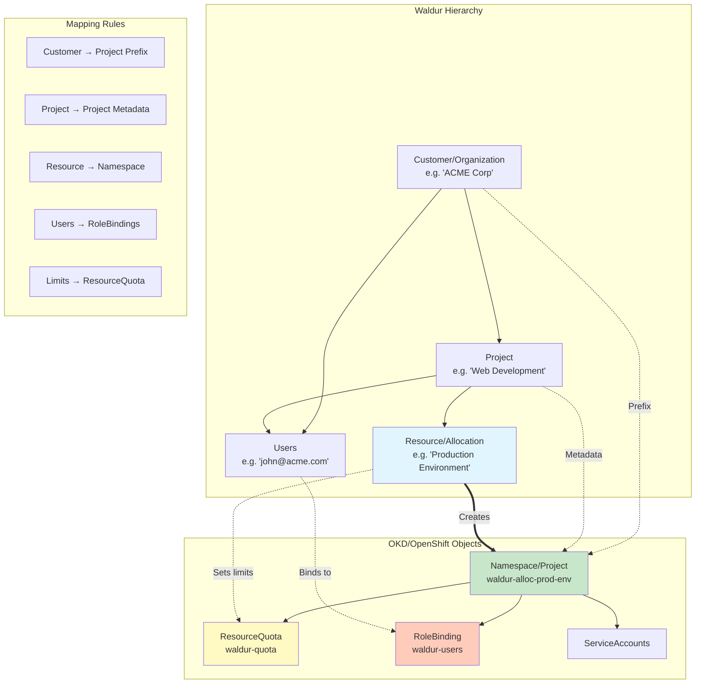

# Waldur Site Agent OKD Plugin

This plugin enables Waldur Site Agent to manage OKD/OpenShift projects and resources, providing integration between
Waldur and OKD/OpenShift clusters.

## Features

- Automatic project/namespace creation for Waldur resources
- Resource quota management (CPU, memory, storage, pod limits)
- User access control through RoleBindings
- Resource usage reporting
- Project lifecycle management (create, pause, restore, delete)

## Installation

Install the plugin alongside the core waldur-site-agent package:

```bash
# Using uv (recommended)
uv sync --extra okd

# Or using pip
pip install -e plugins/okd
```

## Configuration

Create a configuration file (see `examples/okd-config.yaml` for a complete example):

```yaml
backend_type: okd
backend_settings:
  api_url: https://api.okd.example.com:8443
  token: your-service-account-token
  verify_cert: true
  namespace_prefix: waldur-
  default_role: edit

backend_components:
  cpu:
    measured_unit: Core
    accounting_type: limit
  memory:
    measured_unit: GB
    accounting_type: limit
  storage:
    measured_unit: GB
    accounting_type: limit
  pods:
    measured_unit: Count
    accounting_type: limit
```

### Authentication Token Management

The plugin supports multiple authentication methods with automatic token refresh:

#### Static Token (Simple)

For testing or when manually managing tokens:

```yaml
backend_settings:
  api_url: https://api.okd.example.com:8443
  token: sha256~your-static-token-here
  verify_cert: true
```

#### Service Account Token (Production Recommended)

For production deployments with automatic token refresh:

```yaml
backend_settings:
  api_url: https://api.okd.example.com:8443
  verify_cert: true
  token_config:
    token_type: service_account
    service_account_path: /var/run/secrets/kubernetes.io/serviceaccount
```

#### File-Based Token Refresh

When tokens are managed by external systems:

```yaml
backend_settings:
  api_url: https://api.okd.example.com:8443
  verify_cert: true
  token_config:
    token_type: file
    token_file_path: /etc/okd-tokens/current-token
```

#### OAuth Token Refresh (Future)

Framework ready for OAuth-based authentication:

```yaml
backend_settings:
  api_url: https://api.okd.example.com:8443
  verify_cert: true
  token_config:
    token_type: oauth
    oauth_config:
      client_id: your-oauth-client-id
      client_secret: your-oauth-client-secret
      refresh_token: your-refresh-token
      token_endpoint: https://oauth.okd.example.com/oauth/token
```

## Waldur to OKD Object Mapping

The plugin maps Waldur organizational hierarchy to OKD/OpenShift projects and namespaces:



### Object Mapping Details

#### 1. Namespace Creation

Waldur resources are mapped to OKD namespaces with a hierarchical naming convention:

| Waldur Object | OKD Namespace Pattern | Example |
|---------------|----------------------|---------|
| Customer Resource | `{prefix}org-{customer_slug}` | `waldur-org-acme` |
| Project Resource | `{prefix}proj-{project_slug}` | `waldur-proj-webdev` |
| Allocation Resource | `{prefix}alloc-{allocation_slug}` | `waldur-alloc-prod-env` |

#### 2. Resource Quotas

Waldur resource limits are translated to Kubernetes ResourceQuotas:

| Waldur Component | OKD ResourceQuota Field | Example |
|-----------------|------------------------|---------|
| CPU (Cores) | `requests.cpu`, `limits.cpu` | `4` cores |
| Memory (GB) | `requests.memory`, `limits.memory` | `16Gi` |
| Storage (GB) | `requests.storage` | `100Gi` |
| Pod Count | `pods` | `50` |

#### 3. User Access Mapping

Waldur user roles are mapped to OpenShift RoleBindings:

| Waldur Role | OpenShift ClusterRole | Permissions |
|------------|----------------------|-------------|
| Owner | `admin` | Full namespace administration |
| Manager | `edit` | Create/modify resources |
| Member | `view` | Read-only access |

#### 4. Metadata and Annotations

Waldur metadata is preserved in OKD annotations:

```yaml
metadata:
  name: waldur-alloc-prod-env
  annotations:
    waldur.com/customer-uuid: "123e4567e89b12d3a456426614174000"
    waldur.com/project-uuid: "456e7890f12c34d5b678537825285111"
    waldur.com/resource-uuid: "789a0123g34h56i7j890648936396222"
    waldur.com/customer-name: "ACME Corp"
    waldur.com/project-name: "Web Development"
  labels:
    waldur.com/managed: "true"
    waldur.com/customer: "acme"
    waldur.com/project: "webdev"
```

## OKD/OpenShift Setup

### Authentication Requirements

The plugin requires a service account token with specific permissions to manage OKD/OpenShift
resources. The token must have cluster-level permissions to create and manage projects, namespaces,
resource quotas, and role bindings.

#### Required Permissions

The service account needs the following permissions:

- **Project Management**: Create, delete, and modify OpenShift projects
- **Namespace Management**: Manage Kubernetes namespaces and their metadata
- **Resource Quota Management**: Create and modify resource quotas for namespace limits
- **Role Binding Management**: Assign users to projects with appropriate roles
- **Resource Monitoring**: Query resource usage and project status

### 1. Create Service Account

Create a service account for the Waldur Site Agent:

```bash
# Create service account in the desired namespace
oc create serviceaccount waldur-site-agent -n waldur-system

# Alternative: Use the default namespace
oc create serviceaccount waldur-site-agent -n default
```

### 2. Grant Permissions

Create a ClusterRole with necessary permissions:

```yaml
apiVersion: rbac.authorization.k8s.io/v1
kind: ClusterRole
metadata:
  name: waldur-site-agent
rules:
  # OpenShift project management
  - apiGroups: ["project.openshift.io"]
    resources: ["projects", "projectrequests"]
    verbs: ["create", "delete", "get", "list", "patch", "update"]

  # Kubernetes namespace and resource quota management
  - apiGroups: [""]
    resources: ["namespaces", "resourcequotas"]
    verbs: ["create", "delete", "get", "list", "patch", "update"]

  # User access management through role bindings
  - apiGroups: ["rbac.authorization.k8s.io"]
    resources: ["rolebindings"]
    verbs: ["create", "delete", "get", "list", "patch", "update"]

  # Resource monitoring and usage reporting
  - apiGroups: [""]
    resources: ["pods", "services", "persistentvolumeclaims"]
    verbs: ["get", "list"]

  # API discovery for cluster connectivity checks
  - apiGroups: [""]
    resources: [""]
    verbs: ["get"]
```

Bind the role to the service account:

```bash
# Bind the cluster role to the service account
oc adm policy add-cluster-role-to-user waldur-site-agent -z waldur-site-agent -n waldur-system

# Alternative: Using oc create command
oc create clusterrolebinding waldur-site-agent \
  --clusterrole=waldur-site-agent \
  --serviceaccount=waldur-system:waldur-site-agent
```

### 3. Get Service Account Token

#### For Production Deployment (Recommended)

Create a long-lived token for production use:

```bash
# OpenShift 4.11+ (recommended for production)
oc create token waldur-site-agent \
  --namespace=waldur-system \
  --duration=8760h \
  --bound-object-kind=Secret \
  --bound-object-name=waldur-site-agent-token

# Create a secret-bound token for enhanced security
oc apply -f - <<EOF
apiVersion: v1
kind: Secret
metadata:
  name: waldur-site-agent-token
  namespace: waldur-system
  annotations:
    kubernetes.io/service-account.name: waldur-site-agent
type: kubernetes.io/service-account-token
EOF

# Get the token from the secret
oc get secret waldur-site-agent-token -n waldur-system -o jsonpath='{.data.token}' | base64 -d
```

#### For Development/Testing

Create a temporary token for testing:

```bash
# OpenShift 4.x (24 hour expiration)
oc create token waldur-site-agent --namespace=waldur-system

# OpenShift 3.x (legacy method)
oc sa get-token waldur-site-agent -n waldur-system
```

#### Token Validation

Verify the token has correct permissions:

```bash
# Test basic API access
curl -k -H "Authorization: Bearer YOUR_TOKEN" \
  "https://your-okd-api:6443/api/v1"

# Test project creation permissions
curl -k -H "Authorization: Bearer YOUR_TOKEN" \
  -H "Content-Type: application/json" \
  "https://your-okd-api:6443/apis/project.openshift.io/v1/projectrequests" \
  -X POST -d '{
    "kind": "ProjectRequest",
    "apiVersion": "project.openshift.io/v1",
    "metadata": {"name": "test-waldur-permissions"},
    "displayName": "Test Permissions"
  }'

# Clean up test project
oc delete project test-waldur-permissions
```

## Usage

Run the agent with your configuration:

```bash
waldur_site_agent -m event_process -c okd-config.yaml
```

### Supported Modes

- `order_process`: Process orders from Waldur to create/modify OKD projects
- `report`: Report resource usage from OKD to Waldur
- `membership_sync`: Synchronize user memberships between Waldur and OKD
- `event_process`: Process events via STOMP (if configured)

### Event Processing Configuration

For real-time event processing, configure STOMP settings in your configuration file:

```yaml
# Event processing mode configuration
agent_mode: event_process

# STOMP configuration for event processing
event_processing:
  stomp_host: your-stomp-broker.example.com
  stomp_port: 61613
  stomp_username: waldur-agent
  stomp_password: your-secure-password
  stomp_destination: /queue/waldur.events
  stomp_ssl: true
  stomp_heartbeat: 10000  # milliseconds
```

## Resource Management

### Quotas

Resource quotas are automatically created for each project based on Waldur resource allocations.
The quotas enforce both request and limit constraints for:

- **CPU cores**: Managed through `requests.cpu` and `limits.cpu`
- **Memory**: Managed through `requests.memory` and `limits.memory`
- **Storage**: Managed through persistent volume claims
- **Pod count**: Maximum number of pods in the namespace

### User Access

Users from Waldur are automatically granted access to OKD projects through RoleBindings. The plugin
maps Waldur roles to OpenShift ClusterRoles for fine-grained access control.

## Testing

Run the plugin tests:

```bash
# Run all OKD plugin tests
uv run pytest plugins/okd/tests/

# Run specific test
uv run pytest plugins/okd/tests/test_okd_backend.py::TestOkdBackend::test_create_resource
```

## Troubleshooting

### Token Refresh Behavior

The plugin automatically handles token expiration and refresh:

- **Automatic Detection**: Monitors for 401/403 authentication errors
- **Refresh Triggers**: Automatically refreshes tokens before expiration (5 minutes buffer)
- **Fallback Handling**: Gracefully handles token refresh failures
- **Retry Logic**: Automatically retries failed requests with refreshed tokens

#### Token Refresh Flow

1. **Initial Request**: Uses current token for API calls
2. **Failure Detection**: Detects 401 Unauthorized responses
3. **Token Refresh**: Invalidates current token and loads new one
4. **Request Retry**: Retries the original request with the new token
5. **Error Handling**: Reports refresh failures with detailed error messages

### Authentication Issues

If authentication fails:

1. **Verify Token Validity**:

   ```bash
   # Test token directly
   curl -k -H "Authorization: Bearer YOUR_TOKEN" \
     "https://your-okd-api:6443/api/v1"
   ```

2. **Check Token Expiration**:

   ```bash
   # Decode JWT token (if using JWT format)
   echo "YOUR_TOKEN" | cut -d'.' -f2 | base64 -d | jq .exp
   ```

3. **Validate Service Account Permissions**:

   ```bash
   # Check if service account exists
   oc get serviceaccount waldur-site-agent -n waldur-system

   # Verify cluster role binding
   oc get clusterrolebinding waldur-site-agent
   ```

### Connection Issues

If the agent cannot connect to the OKD cluster:

1. Verify the API URL is correct and accessible
2. Check the service account token is valid and not expired
3. For self-signed certificates, set `verify_cert: false`
4. Ensure network connectivity to the cluster

### Permission Errors

If operations fail with permission errors:

1. Verify the service account has the required ClusterRole permissions
2. Check the ClusterRoleBinding is correctly configured
3. Ensure the token has not expired (check logs for 401 errors)
4. Validate that the service account namespace exists

### Token Refresh Issues

If automatic token refresh fails:

1. **File-based tokens**: Ensure the token file path is readable and contains valid token
2. **Service account tokens**: Verify the service account path is mounted correctly
3. **Static tokens**: Replace expired static tokens manually
4. **OAuth tokens**: Check OAuth configuration and refresh token validity

### Debug Mode

Enable debug logging for detailed token management information:

```bash
# Set log level to DEBUG in configuration
log_level: DEBUG

# Or use environment variable
WALDUR_LOG_LEVEL=DEBUG waldur_site_agent -m order_process -c okd-config.yaml
```

### Diagnostics

Run diagnostics to verify configuration:

```bash
# Standard diagnostics
waldur_site_diagnostics -c okd-config.yaml
```

## Development

### Plugin Structure

```text
plugins/okd/
├── waldur_site_agent_okd/
│   ├── __init__.py
│   ├── backend.py       # Main backend implementation
│   ├── client.py        # OKD API client with SSL handling
│   └── token_manager.py # Authentication token management
├── tests/
│   └── test_okd_backend.py
├── examples/
│   ├── okd-config.yaml
│   └── okd-config-with-token-refresh.yaml
├── pyproject.toml
└── README.md
```

#### Key Components

- **`backend.py`**: Main plugin implementation extending `BaseBackend`
- **`client.py`**: OKD API client with SSL adapter and authentication integration
- **`token_manager.py`**: Comprehensive token management system supporting:
  - Static tokens for testing
  - File-based token refresh
  - Service account token mounting
  - OAuth refresh framework (future)
- **Test scripts**: Validation and testing utilities for development

### Adding New Features

1. Extend the `OkdClient` class for new API operations
2. Update the `OkdBackend` class to use new client methods
3. Add tests for new functionality
4. Update configuration examples if needed

## License

This plugin is part of the Waldur Site Agent project and follows the same license terms.
