# OpenNebula Plugin for Waldur Site Agent

This plugin provides OpenNebula resource management for Waldur Site Agent.
It supports two independent offering modes:

- **VDC mode**: Virtual Data Centers with groups, quotas, networking, and
  optional user account creation
- **VM mode**: Virtual Machines instantiated within an existing VDC, sized
  by plan quotas with resize on plan switch

Each mode is configured as a separate Waldur offering with its own
`resource_type` setting.

## Features

### VDC Management

- **VDC Provisioning**: Each Waldur resource maps to one OpenNebula VDC + group
- **Quota Enforcement**: CPU, RAM, storage, and floating IP limits via group quotas
- **Usage Reporting**: Current resource usage from OpenNebula group quota counters
- **Idempotent Operations**: Create operations handle retries gracefully
  (e.g. after connection resets)
- **User Account Creation** (optional): Creates an OpenNebula user with VDC
  group membership, credentials displayed in Waldur Homeport via `backend_metadata`

### VM Management

- **Plan-Based Sizing**: VM specs (vCPU, RAM, disk) come from Waldur plan quotas
  (FIXED billing components), not from user-specified limits
- **VM Provisioning**: Instantiates VMs from templates within a parent VDC
- **VM Resize**: Plan switch triggers automatic resize (poweroff, resize
  CPU/RAM, grow disk, resume)
- **SSH Key Injection**: Resolves SSH keys from Waldur service provider keys
- **Scheduling**: Optional `SCHED_REQUIREMENTS` for cluster placement
- **Usage Reporting**: Reports current VM allocation (vCPU, RAM, disk)
- **Independent Offering**: VM mode is a separate offering, not auto-created

### Networking (Optional)

When the Waldur offering includes networking configuration in `plugin_options`,
VDC creation automatically provisions:

- **VXLAN Network**: Internal tenant network with auto-allocated or
  user-specified subnet
- **Virtual Router**: VNF appliance with internal + external NICs for NAT/DHCP
- **Security Groups**: Default inbound rules (SSH, ICMP, etc.)
- **Subnet Allocation**: Stateless next-available subnet allocation from a
  configured pool

### Concept Mapping

| Waldur / OpenStack Concept | OpenNebula Equivalent | Auto-Created with VDC? |
|---|---|---|
| Tenant / Project | VDC + Group | Yes |
| Internal Network + Subnet | VXLAN VNet + Address Range | Yes (if configured) |
| Router + External Gateway | Virtual Router (VNF appliance) | Yes (if configured) |
| Security Group | Security Group | Yes (if rules provided) |
| Nova/Cinder/Neutron Quotas | Group Quotas | Yes |
| Floating IP | SDNAT4 via Virtual Router | Quota tracked, not auto-assigned |

## Installation

The OpenNebula plugin is included in the Waldur Site Agent workspace.
For general installation instructions, see the main
[Installation Guide](../../docs/installation.md).

### Dependencies

- **pyone** (>= 6.8.0): Python bindings for the OpenNebula XML-RPC API
- **OpenNebula** (>= 6.x): Target OpenNebula instance with XML-RPC enabled
- **VNF Appliance** (optional): Service Virtual Router template for networking

## Configuration

### VDC Offering Configuration

The agent YAML only needs API credentials. Component metadata
(`backend_components`) is automatically synced from the Waldur offering
at startup via `extend_backend_components()`.

```yaml
offerings:
  - name: "OpenNebula VDC"
    backend_type: "opennebula"
    backend_settings:
      api_url: "http://opennebula-host:2633/RPC2"
      credentials: "oneadmin:password"
      create_opennebula_user: true  # optional: create ONE user per VDC
    backend_components: {}
```

### VM Offering Configuration

VM offerings reference a parent VDC and a VM template. VM specs are
defined by Waldur plan quotas (FIXED components), not by resource limits.

```yaml
offerings:
  - name: "OpenNebula VM"
    backend_type: "opennebula"
    backend_settings:
      api_url: "http://opennebula-host:2633/RPC2"
      credentials: "oneadmin:password"
      resource_type: "vm"
      parent_vdc_backend_id: "my-vdc-1"
      template_id: 0
    backend_components: {}
```

VM specs come from the Waldur plan's component quotas. Define plans with
FIXED billing components:

| Component | Description | Example values |
|---|---|---|
| `vcpu` | Virtual CPUs | Small: 1, Medium: 2, Large: 4 |
| `vm_ram` | Memory in MB | Small: 512, Medium: 2048, Large: 8192 |
| `vm_disk` | Disk in MB | Small: 5120, Medium: 10240, Large: 51200 |

### Backend Settings Reference

| Key | Required | Default | Description |
|---|---|---|---|
| `api_url` | Yes | - | OpenNebula XML-RPC endpoint |
| `credentials` | Yes | - | `username:password` authentication string |
| `zone_id` | No | `0` | OpenNebula zone ID |
| `cluster_ids` | No | `[]` | List of cluster IDs for VDC/VM placement |
| `resource_type` | No | `vdc` | `vdc` or `vm` -- determines offering mode |
| `create_opennebula_user` | No | `false` | Create an OpenNebula user per VDC |
| `parent_vdc_backend_id` | No | - | Parent VDC name (VM mode only) |
| `template_id` | No | - | VM template ID (VM mode only) |
| `sched_requirements` | No | - | OpenNebula scheduling expression |

Settings can also be provided via the Waldur offering's `plugin_options`,
which take precedence over `backend_settings` for `parent_vdc_backend_id`,
`template_id`, `cluster_ids`, and `sched_requirements`.

### Waldur Offering Configuration

Infrastructure settings and user options are configured in the Waldur
offering, not in the agent YAML. This keeps secrets minimal on the agent
side and allows provider admins to manage infrastructure config from the
Waldur UI.

#### VDC Offering Components

Configured by the provider in the Waldur offering. Defines the resource
limits available to users.

```yaml
components:
  cpu:
    measured_unit: "cores"
    unit_factor: 1
    accounting_type: "limit"
  ram:
    measured_unit: "MB"
    unit_factor: 1
    accounting_type: "limit"
  storage:
    measured_unit: "MB"
    unit_factor: 1
    accounting_type: "limit"
  floating_ip:
    measured_unit: "IPs"
    unit_factor: 1
    accounting_type: "limit"
```

#### VM Offering Components

VM offerings use FIXED billing components. The component keys define
which values the agent reads from plan quotas. No `unit_factor` is
needed (default 1).

```yaml
components:
  vcpu:
    measured_unit: "cores"
    accounting_type: "fixed"
  vm_ram:
    measured_unit: "MB"
    accounting_type: "fixed"
  vm_disk:
    measured_unit: "MB"
    accounting_type: "fixed"
```

#### Offering Plugin Options (Networking)

Set in the Waldur offering's `plugin_options`. Flows to the agent via
`waldur_resource.offering_plugin_options`. Required only if networking
should be auto-provisioned with VDC creation.

```yaml
plugin_options:
  zone_id: 0
  cluster_ids: [0, 100]
  external_network_id: 10
  vxlan_phydev: "eth0"
  virtual_router_template_id: 8
  default_dns: "8.8.8.8"
  internal_network_base: "10.0.0.0"
  internal_network_prefix: 8
  subnet_prefix_length: 24
  security_group_defaults:
    - direction: "INBOUND"
      protocol: "TCP"
      range: "22:22"
    - direction: "INBOUND"
      protocol: "ICMP"
      type: "8"
```

| Key | Required | Default | Description |
|---|---|---|---|
| `external_network_id` | Yes* | - | Provider network ID for router uplink |
| `virtual_router_template_id` | Yes* | - | VNF appliance VM template ID |
| `zone_id` | No | `0` | OpenNebula zone for VNet/VDC assignment |
| `cluster_ids` | No | `[]` | Clusters for VNet/VM placement |
| `vxlan_phydev` | No | `eth0` | Physical interface for VXLAN tunnels |
| `default_dns` | No | `8.8.8.8` | DNS server for tenant networks |
| `internal_network_base` | No | `10.0.0.0` | Base address for subnet pool |
| `internal_network_prefix` | No | `8` | Prefix length of the subnet pool |
| `subnet_prefix_length` | No | `24` | Prefix length per tenant subnet |
| `security_group_defaults` | No | `[]` | Default inbound rules for new VDCs |
| `sched_requirements` | No | - | ONE scheduling expression for VMs/VRs |

*Required for networking. If `external_network_id` or
`virtual_router_template_id` is absent, VDCs are created without networking.

#### Offering Order Options (User Inputs)

Optional fields presented to users at order time. Flows to the agent via
`waldur_resource.attributes`.

```yaml
options:
  order:
    - key: "subnet_cidr"
      label: "Internal Subnet CIDR"
      type: "string"
      required: false
    - key: "ssh_public_key"
      label: "SSH Public Key"
      type: "string"
      required: false
```

| Key | Description |
|---|---|
| `subnet_cidr` | User-specified subnet (e.g. `192.168.50.0/24`). Auto-allocated if empty. |
| `ssh_public_key` | SSH public key or Waldur SSH key UUID. Injected into VMs. |

### Data Flow

```text
Waldur Mastermind (single source of truth)
+-- components --> backend_components (auto-synced at startup)
+-- plans --> plan quotas (VM specs for FIXED components)
+-- plugin_options --> waldur_resource.offering_plugin_options
|   (zone, clusters, external net, VR template, subnet pool, SG rules)
+-- options --> waldur_resource.attributes
    (subnet_cidr, ssh_public_key, template_id)

Agent YAML (minimal -- secrets only)
+-- backend_settings.api_url
+-- backend_settings.credentials
+-- backend_settings.resource_type  (vdc or vm)
+-- backend_components: {}  (auto-populated from Waldur)
```

## VDC Lifecycle

```mermaid
flowchart TD
    subgraph create ["Creation (order_process)"]
        C1[Create Group] --> C2[Create VDC]
        C2 --> C3[Add Group to VDC]
        C3 --> C4[Add Clusters to VDC]
        C4 --> C5[Set Group Quotas]
        C5 --> NET{Networking<br/>configured?}
        NET -- Yes --> N1[Allocate Subnet]
        NET -- No --> USR
        N1 --> N2[Create VXLAN VNet]
        N2 --> N3[Add VNet to VDC]
        N3 --> N4[Create Virtual Router]
        N4 --> N5[Instantiate VR VM]
        N5 --> N6[Create Security Group]
        N6 --> USR{create_opennebula<br/>_user?}
        USR -- Yes --> U1["Create ONE User<br/>(core auth driver)"]
        USR -- No --> DONE
        U1 --> U2[Set Primary Group]
        U2 --> U3["Store Password<br/>in User TEMPLATE"]
        U3 --> U4["Push Credentials<br/>to Waldur backend_metadata"]
        U4 --> DONE([VDC Ready])
    end

    subgraph delete ["Deletion (order_process)"]
        D0{create_opennebula<br/>_user?} -- Yes --> D1[Delete ONE User]
        D0 -- No --> D2
        D1 --> D2[Delete Virtual Router]
        D2 --> D3[Delete VXLAN VNet]
        D3 --> D4[Delete Security Group]
        D4 --> D5[Delete VDC]
        D5 --> D6[Delete Group]
    end

    subgraph report ["Usage Reporting (report)"]
        R1["Read Group Quota Usage<br/>(CPU_USED, MEMORY_USED,<br/>SIZE_USED, LEASES_USED)"]
        R1 --> R2["Convert with unit_factor"]
        R2 --> R3["Push to Waldur<br/>component_usages"]
    end
```



### Rollback on Failure

If any networking step fails, previously created networking resources are
cleaned up in reverse order before the error is propagated. The VDC and
group are then also rolled back by the base framework.

### User Account Creation

When `create_opennebula_user: true` is set in `backend_settings`, VDC
creation also provisions an OpenNebula user account with username
`{vdc_name}_admin` and a random password.

The user gets OpenNebula permissions automatically through VDC group
membership -- no explicit ACLs are needed.

#### Credential Display

Credentials (`opennebula_username`, `opennebula_password`) are pushed to
Waldur immediately after creation via `backend_metadata`. They appear in
Homeport on the resource detail page.

#### Password Persistence

The password is stored in the OpenNebula user's TEMPLATE as
`WALDUR_PASSWORD`. On agent restart, `get_resource_metadata()` re-reads
credentials from the ONE user TEMPLATE, so they survive across agent
restarts without any external state.

#### Deletion

When the VDC is terminated, the associated OpenNebula user is deleted
before the VDC and group are removed.

#### Password Reset

The backend exposes `reset_vdc_user_password(resource_backend_id)` which
generates a new password and updates both OpenNebula auth and TEMPLATE.
This is currently a backend-only method; the Mastermind/Homeport trigger
mechanism will be added in a future release.

## VM Lifecycle

```mermaid
flowchart TD
    subgraph create ["Creation (order_process)"]
        P1["Resolve Plan Quotas<br/>(vcpu, vm_ram, vm_disk)"]
        P1 --> P2["Resolve SSH Key<br/>(attributes or Waldur SP keys)"]
        P2 --> P3["Resolve template_id<br/>& parent_vdc_backend_id"]
        P3 --> V1["Instantiate VM from Template<br/>with CPU/RAM/disk overrides"]
        V1 --> V2[Assign VM to Parent VDC Group]
        V2 --> V3["Wait for RUNNING<br/>(poll 5s, timeout 300s)"]
        V3 --> V4["Store Metadata<br/>(IP, template_id, parent VDC)"]
        V4 --> DONE([VM Running])
    end

    subgraph resize ["Plan Switch / Resize (order_process)"]
        S1["Waldur Plan Switch Order"]
        S1 --> S2["Core Processor Resolves<br/>New Plan Quotas as Limits"]
        S2 --> S3["Backend Extracts<br/>vcpu, vm_ram, vm_disk"]
        S3 --> S4["Poweroff-Hard VM"]
        S4 --> S5["Resize CPU & RAM<br/>(one.vm.resize, enforce=False)"]
        S5 --> S6{Disk grow<br/>needed?}
        S6 -- Yes --> S7["Grow Disk<br/>(one.vm.diskresize)"]
        S6 -- No --> S8
        S7 --> S8[Resume VM]
        S8 --> S9["Wait for RUNNING"]
        S9 --> RDONE([VM Resized])

        S5 -. "on failure" .-> SF[Resume VM]
    end

    subgraph delete ["Deletion (order_process)"]
        D1["Terminate-Hard VM"]
    end

    subgraph report ["Usage Reporting (report)"]
        R1["Read VM Template<br/>(VCPU, MEMORY, DISK/SIZE)"]
        R1 --> R2["Push to Waldur<br/>component_usages"]
    end
```



### Resize Notes

- Disk **shrink is not supported** -- only grow. If the new plan has a
  smaller disk, the disk resize step is skipped.
- The resize uses `enforce=False` to skip OpenNebula group quota checks
  since Waldur is the authority for resource allocation.
- If the resize fails after poweroff, the VM is **automatically resumed**
  to avoid leaving it in a powered-off state.

### VM Usage Reporting

VM usage reports the current allocation (not actual utilization):

| Component | Source | Description |
|---|---|---|
| `vcpu` | `TEMPLATE/VCPU` | Virtual CPUs assigned |
| `vm_ram` | `TEMPLATE/MEMORY` | Memory assigned (MB) |
| `vm_disk` | `TEMPLATE/DISK/SIZE` | Total disk size (MB) |

This is appropriate for FIXED billing -- charge based on what's
provisioned, not what's consumed.

## Quota Management

### Component Mapping (VDC Mode)

Waldur component keys map to OpenNebula quota sections:

| Waldur Component | OpenNebula Quota | Section |
|---|---|---|
| `cpu` | `VM/CPU` | VM |
| `ram` | `VM/MEMORY` | VM |
| `storage` | `DATASTORE/SIZE` | Datastore |
| `floating_ip` | `NETWORK/LEASES` | Network |

### Unit Conversion

Values are converted between Waldur and OpenNebula units using
`unit_factor`:

- **Waldur to OpenNebula**: `waldur_value * unit_factor = backend_value`
- **OpenNebula to Waldur**: `backend_value / unit_factor = waldur_value`

With `unit_factor: 1` (default), values pass through unchanged.

### Usage Reporting (VDC)

VDC usage reports reflect **current** resource consumption (VMs running
now), not accumulated historical usage. The backend sets
`supports_decreasing_usage = True` to indicate that usage values can
decrease when VMs are stopped or deleted.

## Architecture

### Component Overview

```text
plugins/opennebula/
+-- waldur_site_agent_opennebula/
|   +-- backend.py          # OpenNebulaBackend (BaseBackend subclass)
|   +-- client.py           # OpenNebulaClient (BaseClient subclass)
+-- tests/
|   +-- conftest.py          # Shared fixtures
|   +-- test_backend.py      # 239 unit tests
|   +-- test_integration.py  # 20 integration tests (real OpenNebula)
+-- pyproject.toml           # Package config + entry point
```

### Backend (backend.py)

`OpenNebulaBackend` extends `BaseBackend` and implements:

- `ping()` / `diagnostics()` -- connectivity checks
- `list_components()` -- configured component types
- `_pre_create_resource()` -- VDC: network config; VM: plan quotas +
  template resolution
- `_create_backend_resource()` -- VDC: creates group/VDC/networking;
  VM: instantiates from template
- `post_create_resource()` -- creates OpenNebula user, pushes credentials
- `_pre_delete_resource()` -- deletes OpenNebula user before VDC removal
- `set_resource_limits()` -- VDC: group quotas; VM: resize
  (poweroff/resize/resume)
- `_collect_resource_limits()` -- converts Waldur limits with unit_factor
- `_get_usage_report()` -- VDC: group quota usage; VM: current allocation
- `get_resource_metadata()` -- VNet/VR metadata and user credentials
- `reset_vdc_user_password()` -- resets user password (action scaffold)
- `downscale_resource()` / `pause_resource()` / `restore_resource()` --
  no-ops

### Client (client.py)

`OpenNebulaClient` wraps pyone and implements:

- **VDC/Group CRUD**: create, delete, list, get (idempotent creates)
- **Quota management**: build/parse quota templates, set/get limits
  and usage
- **VM operations**: create, terminate, resize, get usage, wait for state
- **Network helpers**: VXLAN VNet, Virtual Router, Security Group CRUD
- **Subnet allocation**: stateless next-available from configured pool
- **User management**: create, delete, get credentials, reset password
- **Orchestration**: `_setup_networking()` / `_teardown_networking()`
- **Naming convention**: `{backend_id}_internal`,
  `{backend_id}_router`, `{backend_id}_default`

## Usage

### Running the Agent

```bash
# Resource provisioning (create/delete VDCs and VMs)
uv run waldur_site_agent -m order_process -c config.yaml

# Usage reporting (quota counters / VM allocation to Waldur)
uv run waldur_site_agent -m report -c config.yaml
```

## Testing

### Running Unit Tests

```bash
# All unit tests (239 tests)
uv run pytest plugins/opennebula/tests/test_backend.py -v

# With coverage
uv run pytest plugins/opennebula/tests/ --cov=waldur_site_agent_opennebula

# Specific test class
uv run pytest plugins/opennebula/tests/test_backend.py::TestVDCCreateWithNetworking -v
```

### Running Integration Tests

Integration tests run against a real OpenNebula instance and are gated
by environment variables:

```bash
OPENNEBULA_INTEGRATION_TESTS=true \
OPENNEBULA_API_URL="http://opennebula-host:2633/RPC2" \
OPENNEBULA_CREDENTIALS="oneadmin:password" \
OPENNEBULA_CLUSTER_IDS="0,100" \
OPENNEBULA_VM_TEMPLATE_ID="0" \
uv run pytest plugins/opennebula/tests/test_integration.py -v
```

| Variable | Required | Description |
|---|---|---|
| `OPENNEBULA_INTEGRATION_TESTS` | Yes | Set to `true` to enable |
| `OPENNEBULA_API_URL` | Yes | XML-RPC endpoint |
| `OPENNEBULA_CREDENTIALS` | Yes | Admin credentials (`user:pass`) |
| `OPENNEBULA_CLUSTER_IDS` | No | Comma-separated cluster IDs |
| `OPENNEBULA_VM_TEMPLATE_ID` | No | VM template ID for instantiation |

The integration tests exercise the full VDC lifecycle: create VDC, set
quotas, create user, authenticate as user, instantiate VM, verify usage,
reset password, and clean up.

### Test Structure

```text
tests/test_backend.py (239 unit tests)
+-- TestOpenNebulaClientQuotaTemplate      # Quota template building
+-- TestOpenNebulaClientParseQuotaUsage    # Usage parsing from group info
+-- TestOpenNebulaClientParseQuotaLimits   # Limits parsing from group info
+-- TestOpenNebulaClientOperations         # VDC/group CRUD + rollback
+-- TestOpenNebulaBackendInit              # Constructor + empty components
+-- TestOpenNebulaBackendMethods           # ping, limits, usage, no-ops
+-- TestOpenNebulaClientSubnetAllocation   # Next-available subnet logic
+-- TestOpenNebulaClientNetworkOps         # VNet, VR, SG CRUD
+-- TestVDCCreateWithNetworking            # Full orchestration + rollback
+-- TestVDCDeleteWithNetworking            # Reverse teardown
+-- TestOpenNebulaBackendNetworkConfig     # plugin_options parsing
+-- TestQuotaTemplateWithFloatingIP        # Network quota section
+-- TestOpenNebulaClientVMOperations       # VM create, terminate, get
+-- TestOpenNebulaBackendVMInit            # VM backend constructor
+-- TestOpenNebulaBackendVMCreation        # VM create from plan quotas
+-- TestOpenNebulaBackendVMDeletion        # VM terminate
+-- TestOpenNebulaBackendVMUsage           # VM usage reporting
+-- TestOpenNebulaBackendVMMetadata        # VM metadata (IP, template)
+-- TestOpenNebulaClientUserManagement     # User CRUD (create, delete, creds)
+-- TestOpenNebulaVDCUserCreation          # VDC user creation integration
+-- TestPasswordResetScaffold              # Password reset backend method
+-- TestIdempotencyRetryPaths              # Connection reset retry handling
+-- TestVDCCreationEdgeCases               # VDC edge cases
+-- TestNetworkingEdgeCases                # Networking edge cases
+-- TestVDCDeletionEdgeCases               # Deletion edge cases
+-- TestVDCLimitUpdateEdgeCases            # Quota update edge cases
+-- TestVDCUsageReportEdgeCases            # Usage report edge cases
+-- TestVMCreationEdgeCases                # VM creation edge cases
+-- TestVMDeletionEdgeCases                # VM deletion edge cases
+-- TestVMUsageReportEdgeCases             # VM usage edge cases
+-- TestVMMetadataEdgeCases                # VM metadata edge cases
+-- TestPingAndConfigEdgeCases             # Connectivity edge cases
+-- TestSSHKeyResolution                   # SSH key from attributes/UUID
+-- TestWaitForVMRunning                   # VM state polling
+-- TestSchedRequirements                  # SCHED_REQUIREMENTS injection
+-- TestOpenNebulaClientVMResize           # VM resize (poweroff/resize/resume)
+-- TestOpenNebulaBackendVMResize          # Backend resize dispatch

tests/test_integration.py (20 integration tests, gated)
+-- TestVDCLifecycle                       # Full lifecycle: create -> VM -> cleanup
+-- TestIdempotentCreate                   # Idempotent VDC and user creation
```

### Code Quality

```bash
# Linting
pre-commit run ruff --all-files

# Type checking
pre-commit run mypy --all-files

# All checks
pre-commit run --all-files
```

## Troubleshooting

### Connection Reset Errors

OpenNebula XML-RPC servers may reset TCP connections under load.
The client handles this via idempotent create operations: if a resource
is created but the response is lost, subsequent retries detect the
existing resource and reuse it.

For production deployments, consider configuring HTTP-level retry on
the transport layer (e.g. via a requests Session with urllib3 Retry).

### VR Instantiation Fails

```text
Cannot get IP/MAC lease from virtual network
```

This means the Virtual Router cannot obtain an IP from the specified
network. Check that:

- The external network has available IP leases in its address range
- The internal VXLAN network's AR includes the gateway IP
- The VNF appliance template ID is correct and the image is available

### Networking Not Created

If VDCs are created without networking when you expect it, verify that
the Waldur offering `plugin_options` contains both `external_network_id`
and `virtual_router_template_id`. Both are required to trigger networking
provisioning.

### Quota Mismatch

If reported limits don't match expected values, check the `unit_factor`
in the offering component configuration. The default is `1` (no
conversion). Values flow as:
`waldur_value * unit_factor = opennebula_quota_value`.

### VM Resize Fails

If a plan switch order fails during resize, check:

- The VM must be in ACTIVE or POWEROFF state
- Disk shrink is not supported (only grow)
- The agent logs will show the specific OpenNebula error

If resize fails after poweroff, the VM is automatically resumed.
