# OpenNebula Keycloak SAML Integration Setup Guide

This guide covers setting up the OpenNebula site-agent plugin with Keycloak SAML
integration for VDC user management. When enabled, the plugin automatically creates
Keycloak groups and OpenNebula SAML-mapped groups for each VDC, allowing users to
log in to Sunstone via SSO.

## Architecture

```text
Waldur                  Site Agent              OpenNebula          Keycloak
  │                        │                       │                   │
  │ create VDC order       │                       │                   │
  ├───────────────────────>│                       │                   │
  │                        │ create VDC + group    │                   │
  │                        ├──────────────────────>│                   │
  │                        │                       │                   │
  │                        │ create KC groups      │                   │
  │                        ├──────────────────────────────────────────>│
  │                        │ vdc_{slug}/{admin,user,cloud}            │
  │                        │                       │                   │
  │                        │ create ONE groups     │                   │
  │                        │ with SAML_GROUP +     │                   │
  │                        │ FIREEDGE template     │                   │
  │                        ├──────────────────────>│                   │
  │                        │                       │                   │
  │                        │ write mapping file    │                   │
  │                        ├──────────────────────>│                   │
  │                        │ keycloak_groups.yaml  │                   │
  │                        │                       │                   │
  │ add user to project    │                       │                   │
  ├───────────────────────>│                       │                   │
  │                        │ add user to KC group  │                   │
  │                        ├──────────────────────────────────────────>│
  │                        │                       │                   │
  │                        │          User logs in via SAML            │
  │                        │          ┌────────────┼──────────────────>│
  │                        │          │  SAML assertion (groups)       │
  │                        │          │<───────────┼──────────────────┤│
  │                        │          │  map group │→ ONE group       │
  │                        │          │  via keycloak_groups.yaml     │
  │                        │          └────────────┘                   │
```

## Prerequisites

1. **OpenNebula 6.8+** with FireEdge and SAML auth driver enabled
2. **Keycloak** (any recent version) accessible from both the site-agent and the OpenNebula frontend
3. **waldur-site-agent** with the `opennebula` and `keycloak-client` plugins installed

## Step 1: Configure Keycloak

### 1.1 Create a Realm

Create a Keycloak realm for OpenNebula (e.g., `opennebula`). This realm will hold all users and VDC groups.

### 1.2 Create a SAML Client

In the realm, create a SAML client:

| Setting | Value |
|---------|-------|
| Client ID | `opennebula-sp` |
| Client Protocol | `saml` |
| Valid Redirect URIs | `https://<sunstone-host>/fireedge/api/auth/acs` |
| Name ID Format | `username` |

### 1.3 Configure Group Membership Mapper

Add a SAML protocol mapper to include group membership in the assertion:

| Setting | Value |
|---------|-------|
| Mapper Type | Group list |
| Name | `member` |
| SAML Attribute Name | `member` |
| Full group path | ON |
| Single Group Attribute | ON |

### 1.4 Create Test Users

Create users in the `opennebula` realm (e.g., `testuser1`, `admin1`). Set passwords for each.

### 1.5 Create an Admin Service Account

The site-agent needs admin access to the Keycloak API.
Use the built-in `admin` user in the `master` realm,
or create a dedicated service account with group management permissions.

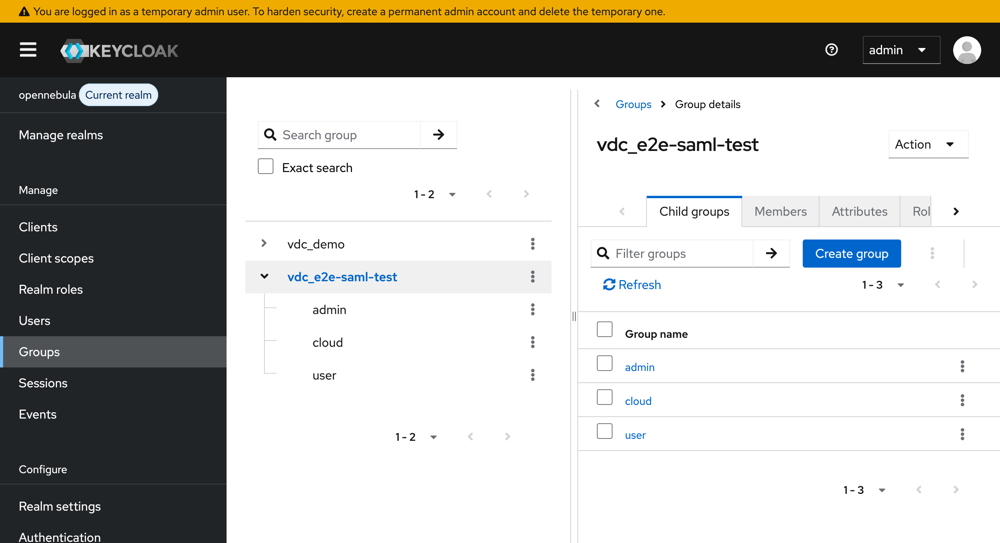
*Keycloak admin console showing VDC groups created by the site-agent*

## Step 2: Configure OpenNebula SAML Auth Driver

### 2.1 Edit `/etc/one/auth/saml_auth.conf`

```yaml
:sp_entity_id: 'opennebula-sp'
:acs_url: 'https://<sunstone-host>/fireedge/api/auth/acs'
:identity_providers:
  :keycloak:
    :issuer: 'https://<keycloak-host>/keycloak/realms/opennebula'
    :idp_cert: '<paste IDP signing certificate here>'
    :user_field: 'NameID'
    :group_field: 'member'
    :mapping_generate: false
    :mapping_key: 'SAML_GROUP'
    :mapping_mode: 'keycloak'
    :mapping_timeout: 300
    :mapping_filename: 'keycloak_groups.yaml'
    :mapping_default: 1
```

Key settings:
- **`mapping_generate: false`** — the site-agent manages the mapping file, not OpenNebula
- **`mapping_key: 'SAML_GROUP'`** — matches the template attribute set on ONE groups
- **`mapping_mode: 'keycloak'`** — uses Keycloak group paths for matching
- **`mapping_filename`** — must match `saml_mapping_file` in the agent config

### 2.2 Get the IDP Certificate

Export the signing certificate from Keycloak:
- Realm Settings > Keys > RS256 > Certificate

Or fetch from the SAML metadata endpoint:

```text
https://<keycloak-host>/keycloak/realms/opennebula/protocol/saml/descriptor
```

## Step 3: Configure the Site Agent

### 3.1 Agent Configuration

```yaml
offerings:
  - name: "opennebula-vdc"
    uuid: "<offering-uuid>"
    backend_type: "opennebula"

    backend:
      api_url: "http://<opennebula-host>:2633/RPC2"
      credentials: "oneadmin:<password>"
      zone_id: 0
      cluster_ids: [0, 100]
      resource_type: "vdc"

      # Keycloak SAML integration
      keycloak_enabled: true
      keycloak:
        keycloak_url: "https://<keycloak-host>/keycloak/"
        keycloak_realm: "opennebula"
        keycloak_user_realm: "master"
        client_id: "admin-cli"
        keycloak_username: "admin"
        keycloak_password: "<admin-password>"
        keycloak_ssl_verify: true

      # Must match mapping_filename in saml_auth.conf
      saml_mapping_file: "/var/lib/one/keycloak_groups.yaml"

      # Default role when adding users without explicit role
      default_user_role: "user"

    components:
      cpu:
        type: "cpu"
        name: "CPU Cores"
        measured_unit: "cores"
        billing_type: "limit"
        unit_factor: 1
      ram:
        type: "ram"
        name: "RAM"
        measured_unit: "MB"
        billing_type: "limit"
        unit_factor: 1
      storage:
        type: "storage"
        name: "Storage"
        measured_unit: "MB"
        billing_type: "limit"
        unit_factor: 1
```

See [`examples/opennebula-config-saml.yaml`](../../examples/opennebula-config-saml.yaml) for a complete example.

### 3.2 VDC Roles (Optional)

The default roles are `admin`, `user`, and `cloud`. Each role creates:
- A Keycloak child group under `vdc_{slug}/{role_name}`
- An OpenNebula group `{slug}-{suffix}` with SAML_GROUP and FIREEDGE template attributes

Override defaults in `backend_settings.vdc_roles`:

```yaml
vdc_roles:
  - name: "admin"
    one_group_suffix: "admins"
    default_view: "groupadmin"
    views: "groupadmin,user,cloud"
    group_admin: true
  - name: "user"
    one_group_suffix: "users"
    default_view: "user"
    views: "user"
  - name: "cloud"
    one_group_suffix: "cloud"
    default_view: "cloud"
    views: "cloud"
```

## Step 4: Create the OpenNebula VDC Offering in Waldur

### 4.1 Register the Organization as a Service Provider

Navigate to **Organizations** and select the organization that will provide
the OpenNebula VDC service. Go to the **Edit** tab and click
**Service provider** in the sidebar.

If the organization is not yet registered as a service provider,
click **Enable service provider profile**.

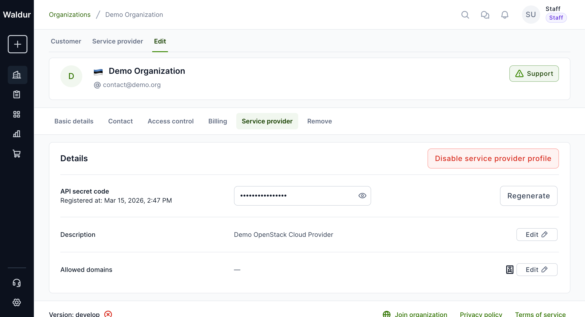
*Organization settings showing the Service provider configuration*

### 4.2 Create the VDC Offering

Switch to the **Service provider** tab at the top, then navigate to
**Marketplace > Offerings**. Click **Add** to create a new offering.

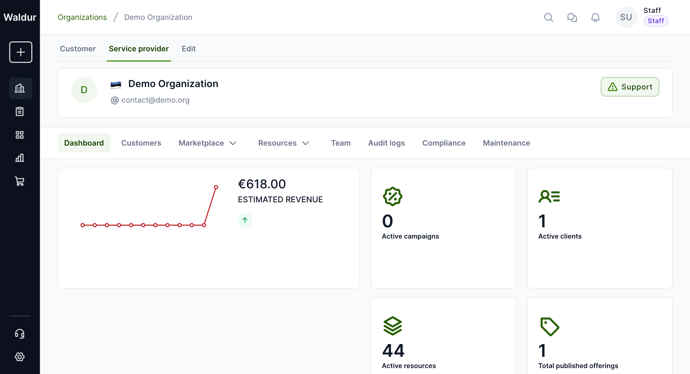
*Service provider dashboard showing active offerings and resources*

In the creation dialog, fill in:

| Field | Value |
|-------|-------|
| Name | `OpenNebula VDC` |
| Category | `Private Clouds` (or create a new VDC-specific category) |
| Type | `Waldur site agent` |

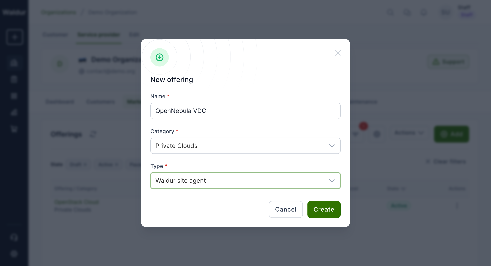
*New offering dialog with name, category, and type selected*

### 4.3 Configure Offering Details

After creation, you'll be taken to the offering editor.
The offering UUID shown in the URL is what you'll use in the
site-agent config (`waldur_offering_uuid`).

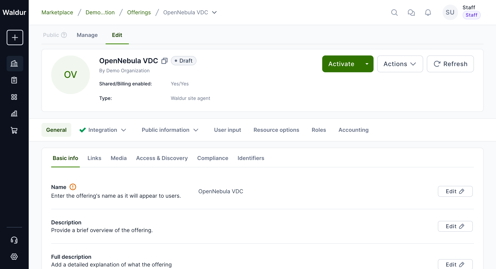
*Offering editor showing the newly created OpenNebula VDC offering in Draft state*

### 4.4 Add the Sunstone Endpoint

Navigate to **Public information > Endpoints** and click **Add endpoint**.
This endpoint will be displayed to users on the offering page,
giving them a direct link to the OpenNebula Sunstone UI.

| Field | Value |
|-------|-------|
| Name | `OpenNebula Sunstone` |
| URL | `https://lab-1910.opennebula.cloud` (your Sunstone URL) |

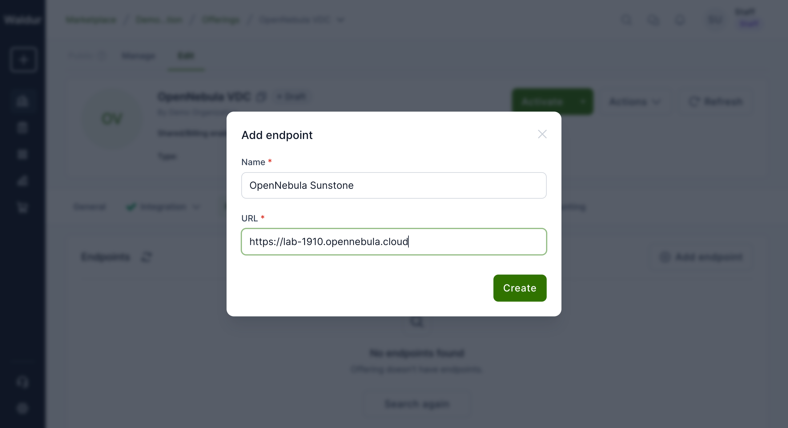
*Adding the Sunstone endpoint URL*

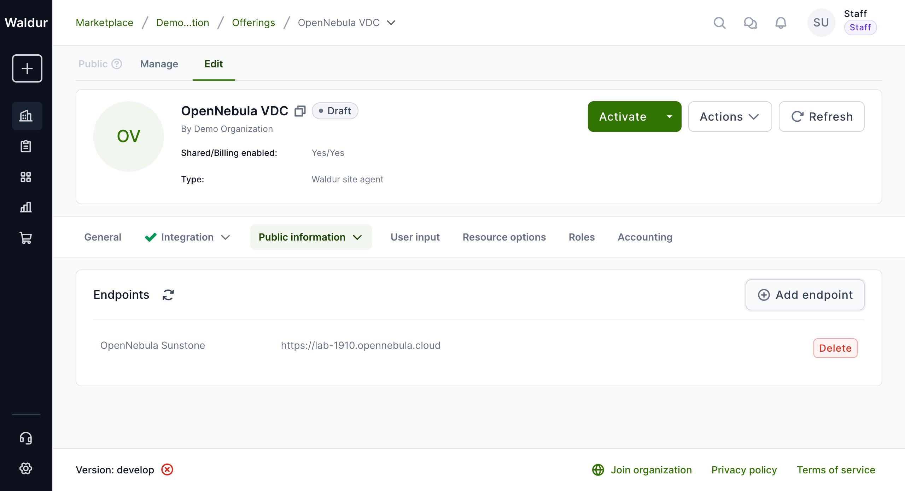
*Endpoint successfully added to the offering*

### 4.5 Load Accounting Components from the Site Agent

Components (CPU, RAM, Storage) are defined in the site agent configuration
under `backend_components`. Use `waldur_site_load_components` to push them
into Waldur:

```bash
waldur_site_load_components -c opennebula-saml-agent-config.yaml
```

This creates the offering components with the correct types, units, and
limits. Then create plans (e.g., Small VDC, Medium VDC) via the
**Accounting** tab in the offering editor.

### 4.6 Activate the Offering

Once the offering is configured, click **Activate** to publish it to the
marketplace. Users will then be able to order VDCs through the Waldur
self-service portal.

## Step 5: End-to-End Walkthrough

This section demonstrates the complete flow from ordering a VDC in Waldur to logging in to Sunstone.

### 5.1 Site Agent Configuration

Create a configuration file for the site agent that matches the offering
created in Step 4. The key fields are `waldur_offering_uuid`
(from the offering URL) and the `keycloak` settings.

See [`opennebula-saml-agent-config.yaml`](opennebula-saml-agent-config.yaml) for the full example.

### 5.2 Order a VDC in the Marketplace

Navigate to **Marketplace** in Waldur and find the "OpenNebula VDC" offering. Click **Add resource**.

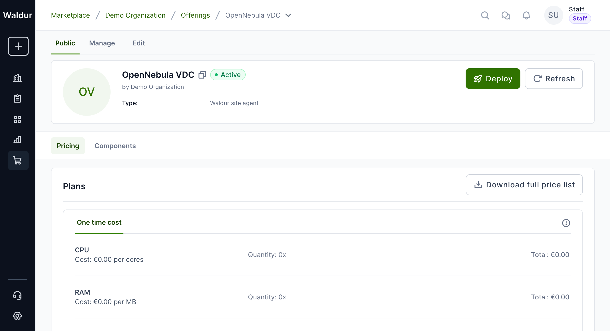
*OpenNebula VDC offering visible in the marketplace*

Fill in the order form:
- **Organization**: Select your organization
- **Project**: Select or create a project (e.g., "OpenNebula SAML Demo")
- **Plan**: Select a plan (e.g., "Small VDC")
- **Allocation name**: Enter a name for the VDC (e.g., `demo-saml-vdc`)

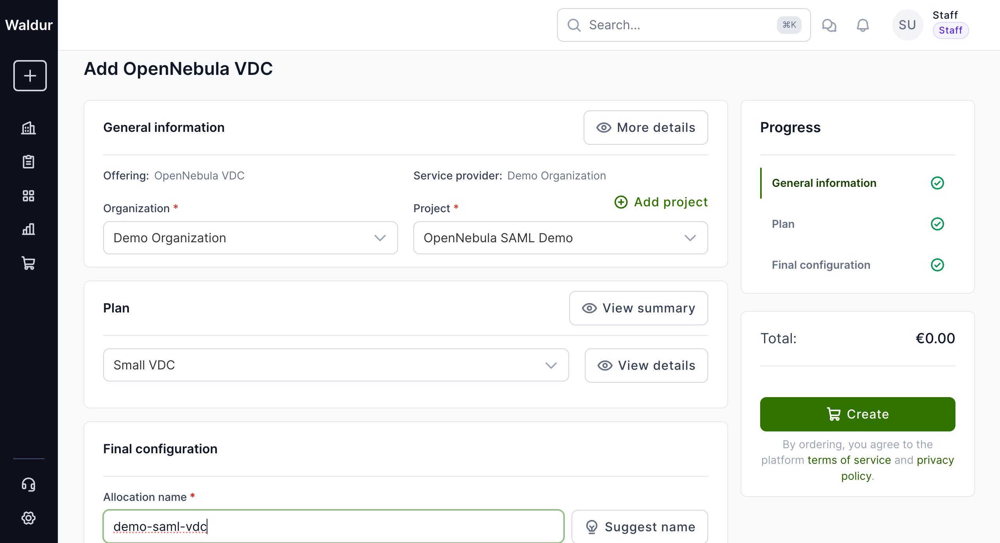
*Order form with project, plan, and allocation name filled in*

Click **Create** and confirm. The order will be placed in `pending-provider` state.

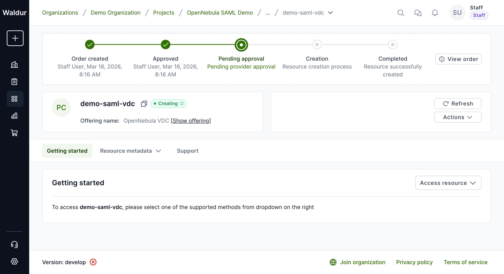
*Order submitted and awaiting site agent processing*

### 5.3 Process the Order with the Site Agent

Start the site agent (or let the polling loop run). The agent will:

1. Poll Waldur for pending orders
2. Approve the order
3. Create the VDC + group in OpenNebula
4. Create Keycloak groups (`vdc_{name}/admin`, `vdc_{name}/user`, `vdc_{name}/cloud`)
5. Create ONE groups with SAML templates
6. Update the SAML mapping file
7. Set the backend ID and mark the order as done

```bash
# Process orders (creates VDCs, Keycloak groups, SAML mappings)
waldur_site_agent -m order_process -c opennebula-saml-agent-config.yaml

# Sync user memberships (adds/removes users from Keycloak groups)
waldur_site_agent -m membership_sync -c opennebula-saml-agent-config.yaml
```

**Example output** from a successful order processing run:

```text
INFO: Using opennebula-saml-agent-config.yaml as a config source
INFO: Waldur site agent version: 0.9.9
INFO: Running agent in order_process mode
INFO: Using opennebula backend (waldur-site-agent-opennebula, version 0.9.9)
INFO: Initialized Keycloak client for realm: opennebula
INFO: Keycloak integration enabled
INFO: Processing offering OpenNebula VDC (6a0a1626-...)
INFO: Processing order demo-saml-vdc (abde010d-...) type Create, state pending-provider
INFO: Approving the order
INFO: Creating resource demo-saml-vdc
INFO: Creating OpenNebula group 'demo-saml'
INFO: Creating OpenNebula VDC 'demo-saml'
INFO: Adding group 237 to VDC 194
INFO: Adding clusters (zone 0) to VDC 194
INFO: Created Keycloak parent group: vdc_demo-saml-vdc
INFO: Created Keycloak child group: vdc_demo-saml-vdc/admin
INFO: Created Keycloak child group: vdc_demo-saml-vdc/user
INFO: Created Keycloak child group: vdc_demo-saml-vdc/cloud
INFO: Created ONE group 'demo-saml-vdc-admins' (ID=238) with SAML mapping to /vdc_demo-saml-vdc/admin
INFO: Created ONE group 'demo-saml-vdc-users' (ID=239) with SAML mapping to /vdc_demo-saml-vdc/user
INFO: Created ONE group 'demo-saml-vdc-cloud' (ID=240) with SAML mapping to /vdc_demo-saml-vdc/cloud
INFO: Updated SAML mapping file with 3 entries
INFO: Resource backend id is set to demo-saml
INFO: Marking order as done
INFO: The order has been successfully processed
```

The resource appears in the project:

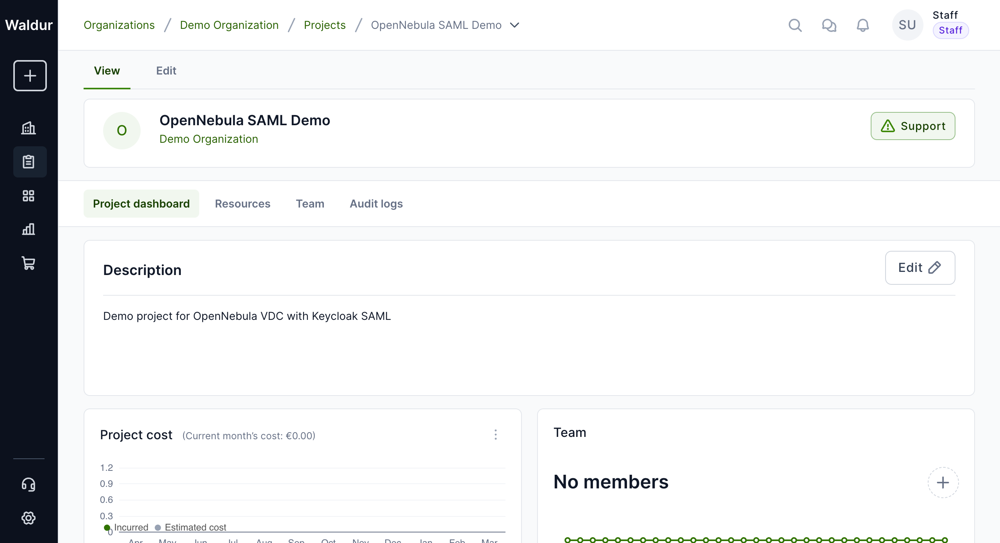
*VDC resource created and visible in the project*

### 5.4 Add a Keycloak User to the Project

Add a user (who exists in Keycloak) to the Waldur project as a member.
This can be done via the project's **Team** tab or via the API.

On the next membership sync cycle, the site agent will call `add_user()`
which adds the user to the correct Keycloak group (`vdc_{name}/user`).

```bash
# Run membership sync (typically on a schedule or as a separate agent instance)
waldur_site_agent -m membership_sync -c opennebula-saml-agent-config.yaml
```

**Example output** from membership sync:

```text
INFO: Processing offering OpenNebula VDC (6a0a1626-...)
INFO: Syncing user list for resource demo-saml-vdc
INFO: Adding user testuser1 to VDC demo-saml-vdc with role user
INFO: Added user 0f329cb6-... to group 2efcd37b-...
INFO: Added user testuser1 to Keycloak group vdc_demo-saml-vdc/user
```

### 5.5 Verify Sunstone Access

After the site agent syncs the membership, the user can log in to Sunstone
via SAML. The group switcher will now show the new VDC alongside any
existing ones.

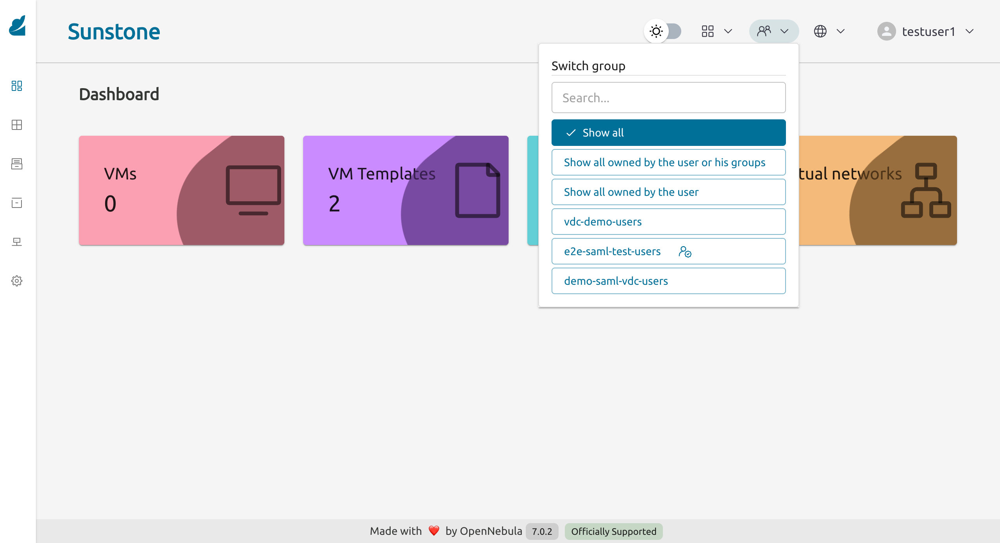
*testuser1 can see three VDC groups after being added to a new project*

## Step 6: Verify the Integration

### 6.1 Sunstone Login Page

Navigate to Sunstone. The login page shows a "Sign In with SAML service" link at the bottom.

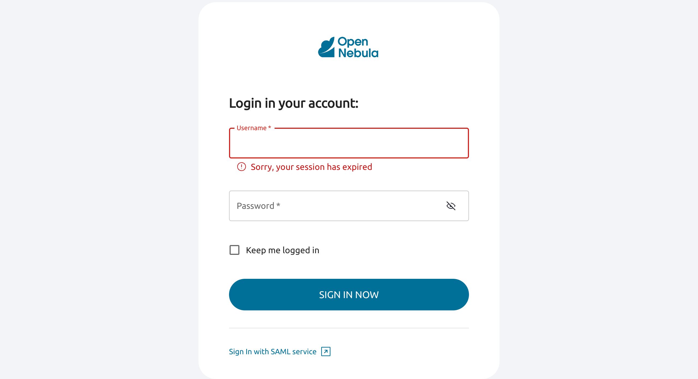

### 6.2 Keycloak SAML Login

Clicking the SAML link redirects to the Keycloak login page for the `opennebula` realm.

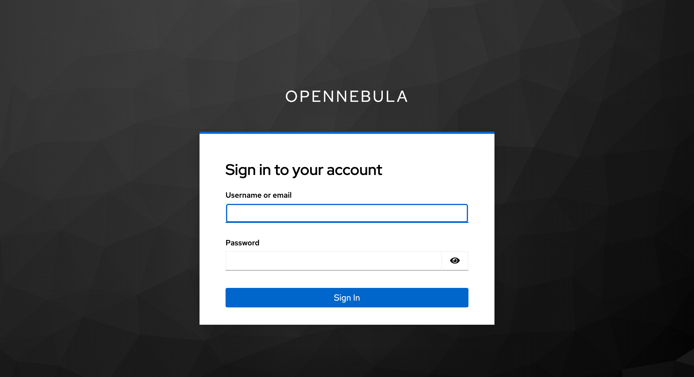

### 6.3 Sunstone Dashboard

After successful SAML login, the user lands on the Sunstone dashboard with the correct FireEdge view matching their role.

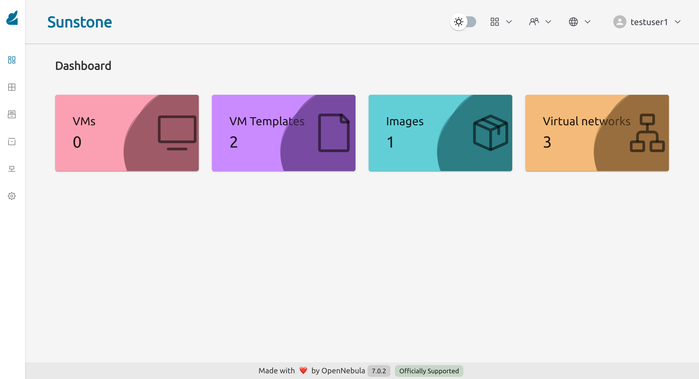

### 6.4 Group Switcher

Users assigned to multiple VDCs can switch between them using the group switcher in the top bar.


*testuser1 can see both `vdc-demo-users` and `e2e-saml-test-users` groups*

## How It Works

### VDC Creation

When the site-agent creates a VDC with `keycloak_enabled: true`:

1. Creates the OpenNebula VDC, base group, and clusters (standard flow)
2. Creates a Keycloak parent group `vdc_{slug}`
3. Creates Keycloak child groups `admin`, `user`, `cloud` under the parent
4. Creates OpenNebula groups `{slug}-admins`, `{slug}-users`, `{slug}-cloud`
5. Sets `SAML_GROUP` and `FIREEDGE` template attributes on each ONE group
6. Adds all ONE groups to the VDC
7. Writes the mapping file (`keycloak_groups.yaml`) with KC group path -> ONE group ID entries

### User Management

When a user is added to a Waldur project that has a VDC:

1. Site-agent calls `add_user(resource, username, role="user")`
2. Finds the user in Keycloak by username
3. Adds the user to the `vdc_{slug}/user` Keycloak group
4. On next SAML login, OpenNebula reads the SAML assertion's `member` attribute
5. Matches the Keycloak group path against `keycloak_groups.yaml`
6. Places the user in the corresponding ONE group with the correct FireEdge view

### VDC Deletion

When a VDC is terminated:

1. Deletes ONE SAML groups (`{slug}-admins`, `{slug}-users`, `{slug}-cloud`)
2. Deletes Keycloak child groups, then parent group
3. Removes entries from the mapping file
4. Deletes the VDC and base group (standard flow)

## SAML Mapping File Format

The mapping file is a YAML dictionary mapping Keycloak group paths to OpenNebula group IDs:

```yaml
---
"/vdc_demo/admin": "202"
"/vdc_demo/user": "203"
"/vdc_demo/cloud": "204"
"/vdc_my-project/admin": "210"
"/vdc_my-project/user": "211"
"/vdc_my-project/cloud": "212"
```

The site-agent writes this file atomically (via temp file + rename) and merges new entries with existing ones.

## Running Integration Tests

```bash
OPENNEBULA_INTEGRATION_TESTS=true \
OPENNEBULA_API_URL="http://<host>:2633/RPC2" \
OPENNEBULA_CREDENTIALS="oneadmin:<password>" \
OPENNEBULA_CLUSTER_IDS="0,100" \
KEYCLOAK_URL="https://<host>/keycloak/" \
KEYCLOAK_REALM="opennebula" \
KEYCLOAK_ADMIN_USERNAME="admin" \
KEYCLOAK_ADMIN_PASSWORD="<password>" \
KEYCLOAK_TEST_USERNAME="testuser1" \
uv run pytest plugins/opennebula/tests/test_saml_integration_e2e.py -v
```

The integration test suite (`test_saml_integration_e2e.py`) runs 21 ordered tests covering the full lifecycle:

| # | Test | Verifies |
|---|------|----------|
| 01 | Connectivity | ONE + Keycloak reachable |
| 02 | Keycloak init | Client created successfully |
| 03 | Create VDC | VDC + KC groups + ONE groups created |
| 04-06 | KC groups | Parent + 3 children exist |
| 07-09 | ONE groups | SAML_GROUP template, FIREEDGE views, VDC membership |
| 10 | Mapping file | Contains correct entries |
| 11 | Quotas | VDC quotas set |
| 12-13 | Add user | User in correct KC group (user + admin roles) |
| 14 | Remove user | User removed from all role groups |
| 15 | User not found | BackendError raised |
| 16-20 | Delete VDC | Full cleanup (KC groups, ONE groups, mappings, VDC) |
| 21 | Idempotent | Second create reuses existing groups |

## Troubleshooting

### SAML login fails with "Invalid credentials"

- Verify the user exists in the Keycloak `opennebula` realm (not `master`)
- Check that the user has a password set

### User doesn't see the correct VDC after login

- Check that the user is in the correct Keycloak group (`vdc_{slug}/{role}`)
- Verify the mapping file on the ONE server contains the correct entries
- Check that the ONE group has `SAML_GROUP` set: `onegroup show <id>`
- The `mapping_timeout` in `saml_auth.conf` controls how often the mapping file is re-read (default 300s)

### Keycloak client init fails with 401

- The `keycloak_user_realm` must be set to `master` if the admin user is in the master realm
- Verify admin credentials work: `curl -X POST .../realms/master/protocol/openid-connect/token`

### Groups created but user not mapped

- Ensure `mapping_generate: false` in `saml_auth.conf`
- Ensure `mapping_key: 'SAML_GROUP'` matches the template attribute name
- Ensure `mapping_mode: 'keycloak'` is set
- Check that the SAML client has a "Group list" protocol mapper with attribute name `member`
