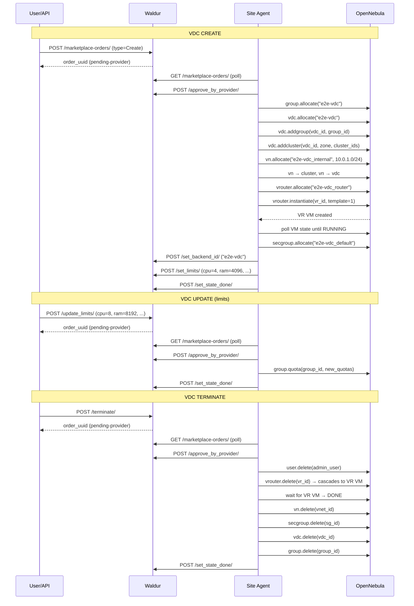
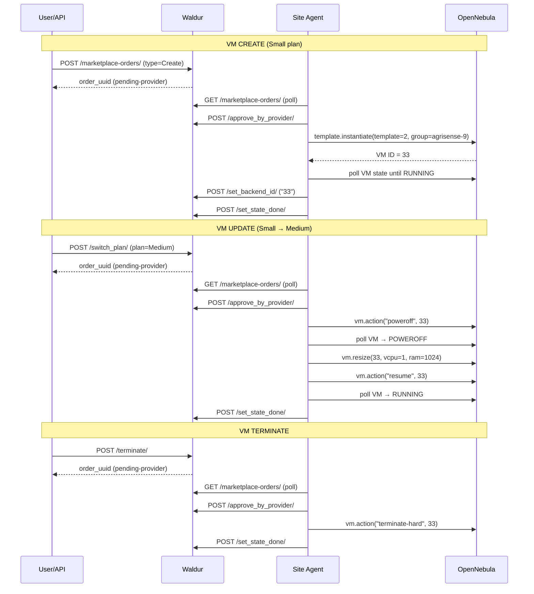

# OpenNebula Plugin E2E Integration Test Report

**Date**: 2026-02-17
**Branch**: `feature/opennebula-plugin`
**Agent version**: waldur-site-agent-opennebula 0.7.0
**Waldur version**: 8.0.3+20.g73e8d5a42

## Environment

| Component | Detail |
|---|---|
| OpenNebula API | `http://lab-1910.opennebula.cloud:2633/RPC2` |
| OpenNebula Sunstone | `https://lab-1910.opennebula.cloud/` |
| Waldur API | `http://localhost:8000/api/` |
| VDC Offering UUID | `26767d945b3b44d7966ea7562a6e70d3` |
| VM Offering UUID | `32f2b0ddb15d42e2b86d10b7668014cc` |
| Config file | `opennebula-test-config.yaml` |

## Test Summary

| # | Operation | Resource | Result | Duration |
|---|---|---|---|---|
| 1 | CREATE | VDC `e2e-vdc` | PASS | ~35s |
| 2 | UPDATE | VDC `e2e-vdc` (limits x2) | PASS | ~1s |
| 3 | TERMINATE | VDC `e2e-vdc` | PASS | ~3s |
| 4 | CREATE | VM `e2e-test-vm` (Small plan) | PASS | ~11s |
| 5 | UPDATE | VM `e2e-test-vm` (Small → Medium) | PASS | ~11s |
| 6 | TERMINATE | VM `e2e-test-vm` | PASS | <1s |

## VDC Lifecycle

### VDC Order Flow



### Test 1: VDC CREATE

**Input:**

| Field | Value |
|---|---|
| Order type | Create |
| Resource name | `e2e-vdc` |
| Project | Protein Structure Prediction |
| Plan | Default |
| Limits | cpu=4, ram=4096 MB, storage=20480 MB, floating_ip=2 |

**OpenNebula resources created:**

| Resource | Name | ID |
|---|---|---|
| Group | `e2e-vdc` | 201 |
| VDC | `e2e-vdc` | 184 |
| VNet | `e2e-vdc_internal` | 56 |
| Virtual Router | `e2e-vdc_router` | 27 |
| VR VM | `e2e-vdc_router_vm` | 32 |
| Security Group | `e2e-vdc_default` | 105 |

**VR VM state transitions:**

```text
STATE=1 LCM_STATE=0  (PENDING)
STATE=3 LCM_STATE=1  (ACTIVE/LCM_INIT)
STATE=3 LCM_STATE=2  (ACTIVE/BOOT)
STATE=3 LCM_STATE=3  (ACTIVE/RUNNING) ← success
```

**Result:**

| Field | Value |
|---|---|
| Order state | done |
| Resource state | OK |
| Backend ID | `e2e-vdc` |
| Waldur limits | cpu=4, ram=4096, storage=20480, floating_ip=2 |

### Test 2: VDC UPDATE (Limits)

**Input:**

| Field | Value |
|---|---|
| Order type | Update |
| API endpoint | `POST /marketplace-resources/{uuid}/update_limits/` |
| New limits | cpu=8, ram=8192 MB, storage=40960 MB, floating_ip=4 |

**Result:**

| Field | Before | After |
|---|---|---|
| cpu | 4 | 8 |
| ram | 4096 | 8192 |
| storage | 20480 | 40960 |
| floating_ip | 2 | 4 |
| Order state | — | done |

**Agent log excerpt:**

```text
The limits for e2e-vdc were updated successfully
  from {'cpu': 4, 'ram': 4096, 'storage': 20480, 'floating_ip': 2}
  to   {'cpu': 8, 'ram': 8192, 'storage': 40960, 'floating_ip': 4}
```

### Test 3: VDC TERMINATE

**Input:**

| Field | Value |
|---|---|
| Order type | Terminate |
| API endpoint | `POST /marketplace-resources/{uuid}/terminate/` |

**OpenNebula resources deleted (in order):**

| Step | Resource | Name | ID |
|---|---|---|---|
| 1 | Admin user | `e2e-vdc_admin` | 13 |
| 2 | VR (+ VM) | `e2e-vdc_router` | 27 |
| 3 | VNet | `e2e-vdc_internal` | 56 |
| 4 | Security Group | `e2e-vdc_default` | 105 |
| 5 | VDC | (already deleted) | — |
| 6 | Group | `e2e-vdc` | 201 |

**Result:**

| Field | Value |
|---|---|
| Order state | done |
| Resource state | Terminated |

## VM Lifecycle

### VM Order Flow



### Test 4: VM CREATE

**Input:**

| Field | Value |
|---|---|
| Order type | Create |
| Resource name | `e2e-test-vm` |
| Project | Protein Structure Prediction |
| Plan | Small (1 vCPU, 512 MB RAM, 2 GB disk) |
| Template ID | 2 (from backend_settings) |
| Parent VDC | `agrisense-9` |

**VM state transitions:**

```text
STATE=1 LCM_STATE=0  (PENDING)
STATE=3 LCM_STATE=2  (ACTIVE/BOOT)
STATE=3 LCM_STATE=3  (ACTIVE/RUNNING) ← success at 07:31:03
```

**Result:**

| Field | Value |
|---|---|
| Order state | done |
| Resource state | OK |
| Backend ID | `33` (numeric OpenNebula VM ID) |
| Plan | Small (1 vCPU, 512 MB RAM, 2 GB disk) |
| OpenNebula VM ID | 33 |
| VDC group | `agrisense-9` |

### Test 5: VM UPDATE (Plan Change / Resize)

**Input:**

| Field | Value |
|---|---|
| Order type | Update (switch_plan) |
| API endpoint | `POST /marketplace-resources/{uuid}/switch_plan/` |
| Old plan | Small (1 vCPU, 512 MB RAM, 2 GB disk) |
| New plan | Medium (1 vCPU, 1 GB RAM, 5 GB disk) |

**Resize sequence:**

```text
1. Poweroff VM 33
2. Wait for POWEROFF state (STATE=8) — reached at 07:36:11
3. Resize: vcpu=1, ram=1024 MB
4. Resume VM 33
5. Wait for RUNNING — STATE=3 LCM_STATE=20 (BOOT)
6. STATE=3 LCM_STATE=3 (RUNNING) — reached at 07:36:16
```

**Result:**

| Field | Before | After |
|---|---|---|
| Plan | Small | Medium |
| vCPU | 1 | 1 |
| RAM | 512 MB | 1024 MB |
| Disk | 2048 MB | 5120 MB |
| Order state | — | done |
| VM state | OK | OK |

### Test 6: VM TERMINATE

**Input:**

| Field | Value |
|---|---|
| Order type | Terminate |
| API endpoint | `POST /marketplace-resources/{uuid}/terminate/` |

**Result:**

| Field | Value |
|---|---|
| Action | `vm.action("terminate-hard", 33)` |
| Order state | done |
| Resource state | Terminated |
| Agent log | `Terminated VM ID 33` |

## Open Questions

1. **VDC backend_id should be numeric group ID** — Currently the VDC backend_id
   stores the group name (e.g. `e2e-vdc`). For consistency with the VM backend_id
   (which uses the numeric OpenNebula VM ID), the VDC should use the numeric
   OpenNebula group ID. This eliminates group pool scans for every operation.

2. **VDC teardown ordering** — The current teardown deletes VR first, then waits
   for VR VMs to reach DONE before deleting VNet. Should there be a retry/backoff
   for the VNet deletion instead of (or in addition to) the explicit wait?

3. **Plan-based VM limits** — The VM offering uses FIXED component plans (Small,
   Medium, Large) so `limits` in the Waldur resource stays empty. The plan quotas
   drive the resize. Should the agent also set `limits` on the resource to reflect
   the actual VM specs after creation/resize?

4. **Disk resize** — The resize flow handles CPU and RAM but disk resize via
   `vm.diskresize` can fail on some storage backends. What is the expected behavior
   when disk shrink is requested (currently logged as warning and skipped)?

5. **Error recovery for partial VDC creation** — If VR VM fails to reach RUNNING
   during VDC creation, the rollback deletes VR, VNet, but the group and VDC
   objects remain. Should the rollback also clean up group and VDC?

## Configuration Used

```yaml
# VDC offering
backend_settings:
  api_url: "http://lab-1910.opennebula.cloud:2633/RPC2"
  credentials: "oneadmin:***"
  zone_id: 0
  cluster_ids: [0, 100]
  create_opennebula_user: true
  external_network_id: 45
  virtual_router_template_id: 1
  vn_mad: "bridge"
  subnet_prefix_length: 24
  security_group_defaults:
    - direction: INBOUND, protocol: TCP, range: "22:22"
    - direction: INBOUND, protocol: ICMP, type: "8"

# VM offering
backend_settings:
  api_url: "http://lab-1910.opennebula.cloud:2633/RPC2"
  credentials: "oneadmin:***"
  zone_id: 0
  cluster_ids: [0, 100]
  resource_type: "vm"
  template_id: 2
  parent_vdc_backend_id: "agrisense-9"
  sched_requirements: "HYPERVISOR=kvm"
```
