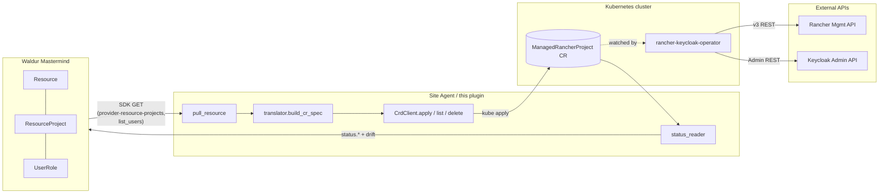
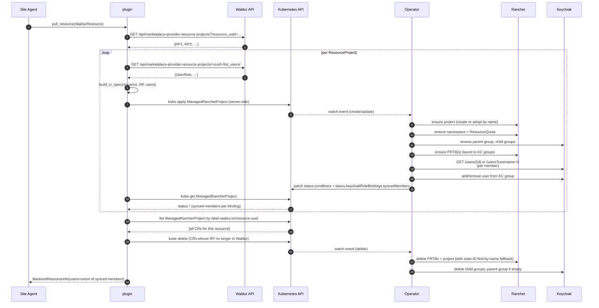

# waldur-site-agent-rancher-kc-crd

CRD-driven Rancher + Keycloak membership-sync plugin for Waldur Site
Agent. Translates Waldur `Resource` + `ResourceProject` + `UserRole`
state into `ManagedRancherProject` Custom Resources; the
`rancher-keycloak-operator` running inside the target Kubernetes
cluster owns the actual Rancher project + Keycloak group lifecycle.

## Expected operator

This plugin only writes CRs — it relies on
[`waldur/rancher-keycloak-operator`][operator-github] to be running
in the target Kubernetes cluster. That operator owns the
`ManagedRancherProject` and `RancherProjectInventory` CRD definitions
and is the only thing that talks to Rancher and Keycloak APIs.

Minimum operator version compatible with the current plugin: **`0.3.0`**.
**Recommended: `0.3.1`+** — earlier 0.3.x bug-fixes a metadata-sync gap
where description / organization / projectSlug changes never reached
Rancher after the initial create. The plugin no longer emits
`spec.namespace`, which `0.2.x` operators relied on for namespace
creation; earlier versions also miss audit fields and the
stale-project-ID cleanup fallback that the plugin assumes.

The operator's helm chart lives in its own repo under
`helm/rancher-keycloak-operator/`; install instructions are in the
[Setup](#setup) section below.

[operator-github]: https://github.com/waldur/rancher-keycloak-operator

## Scope

**`membership_sync_backend` only.** This plugin handles user-to-project
role bindings. It does not provision or terminate Rancher clusters,
does not process orders, and does not report usage. Order processing
and reporting are out of scope; if the offering needs them they have
to be wired through other backends.

**Cluster pre-exists.** Each Waldur Resource's `backend_id` is its
Rancher cluster ID; this plugin does not stand up Rancher clusters.

**Opt-in per offering.** Set
`membership_sync_backend: rancher-kc-crd` on the offering's
site-agent config to route its membership sync through this plugin.

---

## Architecture



The plugin's responsibilities stop at writing CRs and reading their
status. The operator owns:

- creating / adopting Rancher projects, namespaces, and resource quotas
- creating Keycloak parent + child groups and binding them to the
  Rancher project via `ProjectRoleTemplateBinding` (PRTB) with
  `groupPrincipalId: keycloakoidc_group://<group-name>`
- adding/removing users to/from Keycloak groups based on
  `spec.keycloak.roleBindings[].members[]`
- cascading cleanup on CR delete (`@kopf.on.delete`)

---

## Sequence: end-to-end membership sync

This is what happens on a single `pull_resource` call (i.e. one
membership-sync cycle per Resource the offering owns).



**Key invariants:**

- **Idempotent at every step.** Re-applying the same CR yields the
  same Rancher project and Keycloak groups. Re-syncing with the same
  user set is a no-op on the Rancher/Keycloak side.
- **One CR per ResourceProject**, named
  `<resource.slug>-<rp.uuid[:8]>`. Stable across renames.
- **Orphan pruning by label.** CRs are stamped with
  `metadata.labels.waldur.io/resource-uuid`; on each sync the plugin
  computes the set of expected CR names from the *current* Waldur RP
  list, then deletes any label-matching CR outside that set.
- **Lookup-only for users.** The operator never creates Keycloak
  users; it only binds existing ones. Users absent from Keycloak get
  a `WARNING User <id> not found in Keycloak` and are skipped (the
  PRTB and the group are still created — they're just empty for that
  user).

---

## Sequence: orphan-CR pruning

```mermaid
sequenceDiagram
    autonumber
    participant SA as Site Agent
    participant W as Waldur
    participant K as Kubernetes
    participant OP as Operator
    participant R as Rancher
    participant KC as Keycloak

    Note over SA: pull_resource() loop completes;<br/>2 CRs applied for RP1, RP2
    SA->>W: GET resource-projects?resource_uuid=…
    W-->>SA: [RP1] (RP2 was deleted in Waldur)
    SA->>K: list mrp -l waldur.io/resource-uuid=…
    K-->>SA: [CR_RP1, CR_RP2]
    Note over SA: expected={CR_RP1}<br/>found={CR_RP1, CR_RP2}<br/>orphans={CR_RP2}
    SA->>K: kube delete CR_RP2
    K-->>OP: watch event (delete + finalizer hold)
    OP->>R: delete PRTBs for RP2's project
    OP->>KC: remove members from KC groups
    OP->>KC: delete KC child groups
    OP->>KC: delete KC parent group (if empty)
    OP->>R: delete Rancher project
    alt stored project ID is stale (e.g. project recreated externally with new ID)
        OP->>R: DELETE /v3/projects/<stored_id> -> 404
        OP->>R: GET /v3/projects?clusterId=…&name=<projectName>
        R-->>OP: {id: <current_id>}
        OP->>R: DELETE /v3/projects/<current_id> -> 200
    end
    OP->>K: remove finalizer (CR fully gone)
```

**Why pruning lives in the plugin, not the operator:** the operator
doesn't know about Waldur — the Waldur RP list is the source of
truth, and only the plugin sees both sides. The label selector keeps
pruning safe: CRs without the label (manually-created, or from a
different source) are never touched.

---

## Sequence: cleanup on stale `rancherProjectId`

When a Rancher project is externally deleted and recreated between
two operator reconciles, the CR's `status.rancherProjectId` points
at a non-existent ID. The cleanup falls back to finding the live
project by `clusterId+projectName`:

```mermaid
sequenceDiagram
    autonumber
    participant U as User / Test
    participant K as Kubernetes
    participant OP as Operator
    participant R as Rancher

    Note over U: status.rancherProjectId = p-OLD<br/>(actual Rancher project: p-NEW, same name)
    U->>K: kubectl delete mrp <name>
    K-->>OP: on_delete handler fires
    OP->>R: DELETE /v3/projects/p-OLD
    R-->>OP: 404 Not Found
    Note over OP: delete_project returned False<br/>-> stored ID is stale
    OP->>R: GET /v3/projects?clusterId=…&name=<projectName>
    R-->>OP: [{id: p-NEW, …}]
    OP->>OP: log WARNING "Stored projectId p-OLD was stale;<br/>deleting current p-NEW found by name"
    OP->>R: DELETE /v3/projects/p-NEW
    R-->>OP: 200 OK
    OP->>K: cleanup complete; release finalizer
```

This was the failure mode that left orphan Rancher projects after
external recreation; fix landed in operator `0.2.2`.

---

## Setup

### 1. Operator: install in target cluster

The [`waldur/rancher-keycloak-operator`][operator-github] must be
running in the cluster you point this plugin at. One operator
instance handles **all** `ManagedRancherProject` CRs in its
namespace; one operator can manage Rancher projects across multiple
downstream Rancher clusters (each CR specifies its own `clusterId`).

#### 1a. CRDs

```bash
# Clone the operator repo (separate from waldur-site-agent):
git clone https://github.com/waldur/rancher-keycloak-operator.git
cd rancher-keycloak-operator

kubectl apply -f helm/rancher-keycloak-operator/templates/crds/
kubectl get crds | grep waldur.io
# expect:
#   managedrancherprojects.waldur.io
#   rancherprojectinventories.waldur.io
```

#### 1b. Helm install (published image)

The published image is `opennode/rancher-keycloak-operator:<version>`
on Docker Hub. Pin a specific version (don't use `:latest`):

```bash
kubectl create namespace waldur-system

helm upgrade --install rko \
  ./helm/rancher-keycloak-operator \
  --namespace waldur-system \
  --set image.repository=opennode/rancher-keycloak-operator \
  --set image.tag=0.3.1 \
  --set image.pullPolicy=IfNotPresent \
  --set "config.rancher.url=https://rancher.example.com" \
  --set "config.rancher.bearerToken=<rancher-bearer-token>" \
  --set "config.rancher.verifySsl=true" \
  --set "config.keycloak.url=https://keycloak.example.com" \
  --set "config.keycloak.realm=<realm>" \
  --set "config.keycloak.userRealm=master" \
  --set "config.keycloak.username=<kc-admin-user>" \
  --set "config.keycloak.password=<kc-admin-password>" \
  --set "config.keycloak.verifySsl=true"

kubectl rollout status deploy/rko-rancher-keycloak-operator -n waldur-system
```

#### 1c. Smoke-test the operator (optional but recommended)

The [operator repo][operator-github] ships a Tier-1 runbook at
`docs/tier-1-runbook.md` that walks through applying a hand-crafted
CR end-to-end against the configured Rancher and Keycloak before
wiring in the site-agent. Run it once per cluster to catch
credential / connectivity issues early.

#### 1d. Required Rancher + Keycloak permissions

| System | Role / scope |
|---|---|
| Rancher token | unscoped admin OR cluster-owner across all clusters this operator instance will manage |
| Keycloak admin user | realm-admin on the target realm (group create/delete, group member add/remove, user lookup) |

---

### 2. Plugin: install on the site-agent host

The plugin is a workspace member of the
`waldur-site-agent` repo and is installed automatically when you run
`uv sync --all-packages` at the repo root. To verify it's discovered:

```bash
uv run python -c "from waldur_site_agent_rancher_kc_crd import backend; print(backend.RancherKcCrdBackend)"
```

#### 2a. Site-agent host needs

- Network access to: Waldur Mastermind API, the Kubernetes API of the
  cluster running the operator.
- A kubeconfig file (or in-cluster service-account credentials if
  you run the agent inside the operator's cluster).
- The Kubernetes API user must be allowed to
  `get/list/create/update/delete/patch` `managedrancherprojects.waldur.io`
  in the chosen namespace.

#### 2b. Configure the offering

Add a stanza to `waldur-site-agent-config.yaml`. Full reference at
[examples/rancher-kc-crd-config.yaml](examples/rancher-kc-crd-config.yaml).

```yaml
offerings:
  - name: "my-rancher-offering"

    waldur_api_url: "https://waldur.example.com/api/"
    waldur_api_token: "${WALDUR_API_TOKEN}"
    waldur_offering_uuid: "<offering-uuid>"

    backend_type: "rancher-kc-crd"
    membership_sync_backend: "rancher-kc-crd"

    backend_settings:
      # SDK client (the plugin builds its own AuthenticatedClient).
      waldur_api_url: "https://waldur.example.com/api/"
      waldur_api_token: "${WALDUR_API_TOKEN}"
      waldur_verify_ssl: true

      # Where the operator listens.
      kubeconfig_path: "~/.kube/config"   # or omit for in-cluster
      context: "my-cluster"
      namespace: "waldur-system"

      # Cluster ID comes from each Resource's `backend_id` (1:1 with
      # a Rancher downstream cluster). There is no offering-level
      # cluster_id setting -- if a resource's backend_id is empty,
      # CR build raises a clear error rather than emitting an
      # invalid CR.

      # Keycloak group naming -- see note A below for the full variable
      # list, including ${customer_slug}, ${project_slug}, ${resource_slug},
      # and ${rp_uuid_short}. The default keeps the names compact and
      # immutable; override `group_name_template` for human-readable
      # group names.
      parent_group_name: "c_${cluster_id}"
      group_name_template: "c_${cluster_id}_${rp_uuid}_${role_name}"  # default

      # Map Waldur offering role names -> Rancher role template IDs.
      # Roles absent from this map are skipped (operator can't bind them).
      role_map:
        project_member: "project-member"
        project_admin: "project-owner"
        create_ns: "create-ns"

      # User-identity link to Keycloak. See "User identity matching" below.
      keycloak_use_user_id: false
```

#### 2c. Run

`rancher-kc-crd` is a `membership_sync_backend` only. Order
processing and reporting still need other backends (or none).

```bash
uv run waldur_site_agent --mode membership_sync \
    --config-file waldur-site-agent-config.yaml
```

Observability:

```bash
# Watch CRs being created/updated/deleted
kubectl get mrp -n waldur-system -L waldur.io/resource-uuid -w

# Inspect any CR's reconciliation state
kubectl describe mrp <name> -n waldur-system

# Operator logs (cleanup, member sync, drift)
kubectl logs deploy/rko-rancher-keycloak-operator -n waldur-system --tail=100 -f
```

---

## User identity matching

The plugin can match Waldur users to Keycloak users either by username
(default) or by UUID. Choose with `backend_settings.keycloak_use_user_id`:

**`false` (default) — match by username**
: Plugin sends `UserRole.user_username`. Operator does
  `GET /admin/realms/<realm>/users?username=X&exact=true` and uses
  the resulting `user.id` for group membership operations. Works in
  both OIDC and self-hosted Waldur as long as Waldur usernames
  align with Keycloak usernames — the typical OIDC mapping does this
  via the `preferred_username` claim.

**`true` — match by UUID**
: Plugin sends `UserRole.user_uuid`. Operator does
  `GET /admin/realms/<realm>/users/{uuid}` (matches the Keycloak
  internal `user.id`). Use this only when Waldur was OIDC-provisioned
  AND its user UUIDs were seeded from the Keycloak `sub` claim, so
  that `Waldur.user.uuid == Keycloak.user.id`. The username path is
  preferred because it tolerates UUID divergence and works in more
  topologies.

**The operator never creates users.** A user that doesn't exist in
Keycloak under the chosen identifier gets logged as
`WARNING User <id> not found in Keycloak` and is skipped — the
PRTB and the group are still created and bound, the user just isn't
a member yet. They become a member on the next reconcile after the
user appears in Keycloak (e.g. their first OIDC login).

---

## Configuration reference

| Key | Type | Required | Description |
|---|---|---|---|
| `waldur_api_url` | string | yes | Mastermind API root with `/api/`. Plugin strips trailing `/api` for the SDK. |
| `waldur_api_token` | string | yes | Long-lived token from `/api/users/<uuid>/keys/`. Don't use a session token. |
| `waldur_verify_ssl` | bool | no (default `true`) | TLS verify for Waldur calls. |
| `kubeconfig_path` | string | no | Path to a kubeconfig file. Omit to use in-cluster credentials. |
| `context` | string | no | kubeconfig context to use when `kubeconfig_path` is set. |
| `namespace` | string | yes | Namespace for `ManagedRancherProject` CRs (typically `waldur-system`). |
| `parent_group_name` | string | no | Top-level KC group; var `${cluster_id}`. Default `c_${cluster_id}`. |
| `group_name_template` | string | no | Per-role child KC group; vars listed in **note A**. |
| `role_map` | dict | yes | Waldur role name → Rancher role template ID. Roles outside the map are skipped. |
| `keycloak_use_user_id` | bool | no | `false` (default) → match by username. `true` → match by UUID. See above. |

`spec.clusterId` is resolved from each Resource's `backend_id` (1:1
with a Rancher cluster) — there is no offering-level `cluster_id`
setting. An empty `backend_id` raises a clear `KeyError` rather than
silently emitting an invalid CR.

**Note A — `group_name_template` variables.** Available substitutions:

| Variable | Source | Notes |
|---|---|---|
| `${cluster_id}` | `Resource.backend_id` | Rancher cluster ID, opaque |
| `${role_name}` | UserRole.role_name | Pre-mapping (before `role_map`) |
| `${rp_uuid}` | `ResourceProject.uuid` | Full 32-char hex |
| `${rp_uuid_short}` | first 8 chars of `${rp_uuid}` | ~4B combos, collision-free; same as `cr_name` |
| `${customer_slug}` | `Resource.customer_slug` | Waldur Customer (organization) slug |
| `${project_slug}` | `Resource.project_slug` | Waldur Project slug (parent Project; RPs have no slug) |
| `${resource_slug}` | `Resource.slug` | Waldur Resource slug (1:1 with cluster) |
| `${project_name}` | `ResourceProject.name` | Human-readable; may contain spaces |

Default is `c_${cluster_id}_${rp_uuid}_${role_name}` — one Keycloak group
per (cluster × project × role), matching Rancher's per-project-PRTB
access model. The default uses `${rp_uuid}` (immutable) for stability;
override only if you have a strong reason.

**Recommended human-readable opt-in template:**

```text
c_${cluster_id}_${customer_slug}_${project_slug}_${rp_uuid_short}_${role_name}
```

Renders e.g. `c_c-m-glwxdksp_hpc-demo-org_genomics-2026_8706dd1a_project_member`.
Stays unique per RP via `${rp_uuid_short}` while the slugs make the
group name self-explaining in the Keycloak admin UI.

**Custom-template constraints.**

1. MUST include a per-project discriminator (`${rp_uuid}`,
   `${rp_uuid_short}`, or `${project_name}`); without it, multiple
   projects share one group and a user added to project A also gains
   access to B, C, … via the shared group's PRTBs.
2. Slugs (`customer_slug`, `project_slug`, `resource_slug`,
   `project_name`) are **mutable** -- renaming the entity in Waldur
   creates a new Keycloak group on the next reconcile and orphans the
   old one (the operator adopts groups by name and never renames adopted
   groups). Memberships in the old group become stale.
3. **Switching the template after deployment** has the same effect as a
   bulk rename: every existing CR re-renders, the operator creates fresh
   groups, the old groups linger with their stale members. Plan a
   one-time manual migration if you change the template against an
   existing deployment.
4. Keycloak's `GROUP.NAME` column is `varchar(255)`. The plugin guards
   this at render time and raises a `ValueError` (with a hint about
   `${rp_uuid_short}`) if the rendered name would exceed 255 chars, so
   the operator never tries to apply a CR that Keycloak would reject
   with HTTP 500. Stay well under by preferring `${rp_uuid_short}`
   over `${rp_uuid}` in long templates and keeping Waldur slugs
   reasonably short (say ≤ 50 chars each).

---

## Troubleshooting

**Plugin logs `HTTP/1.1 401 Unauthorized` from Waldur on every iteration**
: `waldur_api_token` is a session token from `/api-auth/password/` (rotates on each call). Use a long-lived
  API token from `/api/users/<uuid>/keys/`.

**`pull_resource` succeeds but no CRs are created**
: The resource has an empty `backend_id`. The agent's resource fetcher
  (`waldur_site_agent/common/processors.py:_get_waldur_resources`) drops resources without one. Fix:
  `POST /api/marketplace-provider-resources/<uuid>/set_backend_id/`.

**Plugin logs `IndexError: list index out of range` in processor `__init__`**
: Customer is not registered as a service provider. Fix: `POST /api/marketplace-service-providers/`
  with the `customer` URL.

**Plugin logs `GET .../api/api/marketplace-provider-resource-projects/...` (doubled `/api/`)**
: You're on a build older than the URL fix bundled with the orphan-pruning commit. Pull latest plugin code,
  or as a workaround drop the trailing `/api/` from `waldur_api_url`.

**Operator logs `WARNING User X not found in Keycloak` for every user**
: Identity mismatch — the chosen identifier (username by default, UUID with `keycloak_use_user_id: true`)
  isn't resolvable in Keycloak. With the default username path: ensure Waldur usernames map to existing
  Keycloak usernames. With the UUID path: align Waldur user UUIDs with the Keycloak OIDC `sub`.

**`kubectl delete mrp` succeeds in 0s but the Rancher project remains**
: `status.rancherProjectId` is stale; operator versions before `0.2.2` treated 404 on delete as success.
  Upgrade the operator to `0.2.2`+ — cleanup now falls back to find-by-name.

Operator `status.conditions` to check for any CR (`kubectl describe mrp <name>`):

| Condition | What `status=False` means |
|---|---|
| `RancherProjectReady` | Rancher create/adopt failed. Check operator log for `httpx.HTTPStatusError`. |
| `ResourceQuotaReady` | `spec.resourceQuotas` apply failed (only emitted by operator 0.3.0+). |
| `KeycloakGroupsReady` | Couldn't create/find parent or child KC groups. Check KC admin credentials. |
| `RancherBindingsReady` | PRTB creation failed — usually invalid `rancherRole` in `role_map`. |
| `MembershipSynced` | Per-user add/remove failed — see `User X not found in Keycloak` warnings. |

---

## Development

```bash
# Workspace install
cd <repo-root>
uv sync --all-packages

# Run unit tests for this plugin only
uv run pytest plugins/rancher-kc-crd/tests/

# Integration tests (requires a real K8s cluster with operator + CRDs)
K8S_CRD_TEST=1 \
RANCHER_CLUSTER_ID=c-m-abc12345 \
KUBE_CONTEXT=docker-desktop \
  uv run pytest plugins/rancher-kc-crd/tests/test_backend_integration.py -v

# Lint + format
uvx prek run --all-files
```

`tests/` layout:

| File | Coverage |
|---|---|
| `test_translator.py` | 15 pure tests: `cr_name`, group templates, role bindings, full CR build. |
| `test_status_reader.py` | 13 pure tests: status → BackendResourceInfo + drift detection. |
| `test_backend_integration.py` | 6 tests, `K8S_CRD_TEST=1`: quotas, no-client, orphan pruning. |

---

## Companion components

| Component | Role |
|---|---|
| [`rancher-keycloak-operator`][operator-github] (separate repo) | Reconciles `ManagedRancherProject` CRs. |
| `ManagedRancherProject` CRD (in operator helm chart) | API surface the plugin writes to. |
