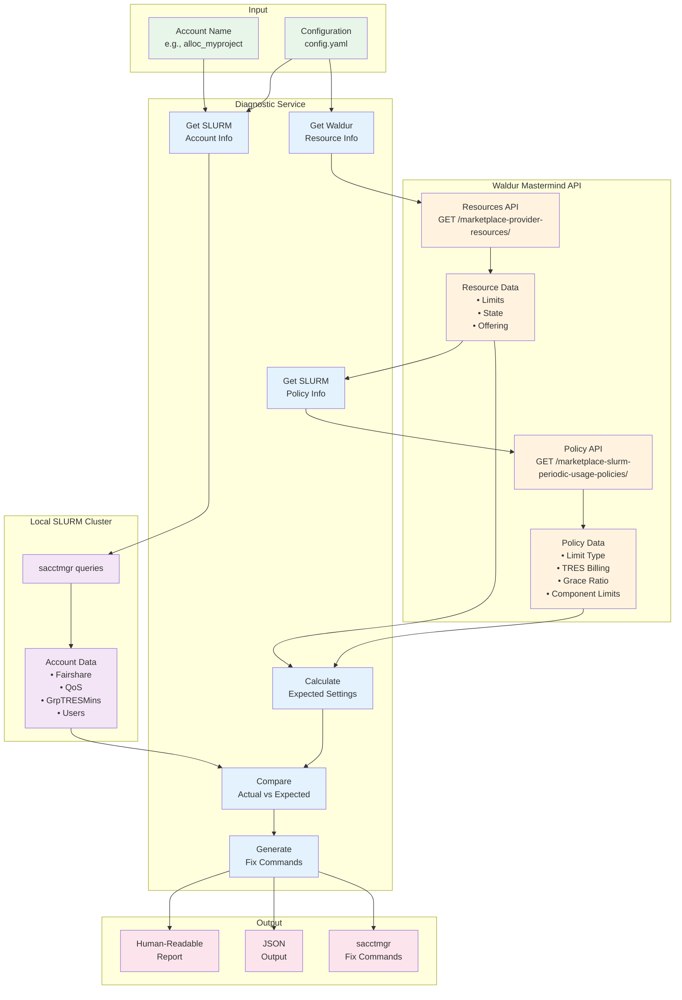
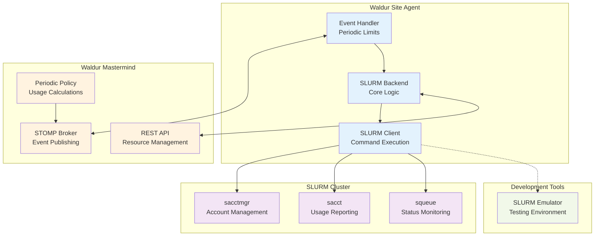

# SLURM Plugin for Waldur Site Agent

The SLURM plugin provides SLURM cluster management capabilities for Waldur Site Agent,
including resource management, usage reporting, periodic limits, and historical data loading.

## Features

### Core SLURM Management

- **Account Management**: Create, delete, list, and manage SLURM accounts
- **User Association**: Add/remove users from SLURM accounts with automatic association management
- **Resource Limits**: Set and manage CPU, memory, GPU, and custom TRES limits
- **Usage Reporting**: Real-time usage data collection and reporting to Waldur
- **Health Monitoring**: Cluster status checking and connectivity validation

### Periodic Limits System

- **Dynamic Fairshare**: Automatic fairshare adjustments based on usage patterns
- **TRES Limits**: GrpTRESMins, MaxTRESMins, and GrpTRES limit management
- **QoS Management**: Threshold-based Quality of Service adjustments
- **Carryover Allocation**: Unused allocation carryover between billing periods
- **Decay Calculations**: Configurable half-life decay for historical usage
- **Event-Driven Updates**: Real-time periodic limits updates via STOMP/MQTT

### Historical Usage Loading

- **Bulk Data Import**: Load historical SLURM usage data into Waldur
- **Monthly Processing**: Automatic monthly billing period handling
- **Staff Authentication**: Secure historical data submission with staff tokens
- **Data Attribution**: User-level and resource-level usage attribution
- **Progress Tracking**: Detailed progress reporting during bulk loads

### Dual-Mode Operation

- **Production Mode**: Direct SLURM cluster integration via `sacctmgr` and `sacct`
- **Emulator Mode**: Development and testing with SLURM emulator integration
- **Seamless Switching**: Configuration-driven mode selection

## Installation

The SLURM plugin is included in the main Waldur Site Agent installation. For specific
installation instructions, see the main [Installation Guide](../../docs/installation.md).

### Dependencies

- **SLURM Tools**: `sacctmgr`, `sacct` commands available on cluster head node
- **Python Packages**: Automatically installed with the plugin
- **Optional**: SLURM emulator for development and testing

## Configuration

### Basic Configuration

```yaml
offerings:
  - name: "My SLURM Cluster"
    backend_type: "slurm"
    backend_settings:
      # Basic SLURM connection
      cluster_name: "my_cluster"
      account_prefix: "waldur_"

      # Component mappings
      cpu_unit_factor: 60000      # CPU-minutes to k-Hours
      mem_unit_factor: 61440      # MB-minutes to GB-Hours
      gpu_unit_factor: 60         # GPU-minutes to GPU-Hours

    backend_components:
      cpu:
        unit: "k-Hours"
        unit_factor: 60000
      mem:
        unit: "GB-Hours"
        unit_factor: 61440
      gpu:
        unit: "GPU-Hours"
        unit_factor: 60
```

### Periodic Limits Configuration

```yaml
backend_settings:
  # Periodic limits system
  periodic_limits:
    enabled: true
    emulator_mode: false              # true for development
    emulator_base_url: "http://localhost:8080"

    # Limit type: GrpTRESMins, MaxTRESMins, or GrpTRES
    limit_type: "GrpTRESMins"

    # TRES billing configuration
    tres_billing_enabled: true
    billing_weights:
      cpu: 1.0                        # 1 CPU-hour = 1 billing unit
      mem: 0.1                        # 10 GB-hours = 1 billing unit
      gpu: 10.0                       # 1 GPU-hour = 10 billing units

    # QoS management
    qos_levels:
      default: "normal"
      slowdown: "slowdown"
      blocked: "blocked"
```

### Event Processing Configuration

```yaml
# Event processing for real-time periodic limits
event_processing:
  enabled: true
  stomp_settings:
    host: "mastermind.example.com"
    port: 61613
    username: "site_agent"
    password: "${STOMP_PASSWORD}"

# Subscribe to periodic limits updates
observable_object_types:
  - "RESOURCE_PERIODIC_LIMITS_UPDATE"
```

## Usage

### Basic Agent Operations

```bash
# Resource management mode
uv run waldur_site_agent -m order_process -c config.yaml

# Usage reporting mode
uv run waldur_site_agent -m report -c config.yaml

# User synchronization mode
uv run waldur_site_agent -m membership_sync -c config.yaml

# Event processing mode (for periodic limits)
uv run waldur_site_agent -m event_process -c config.yaml
```

### Loading Historical Usage

```bash
# Load historical data for specific date range
uv run waldur_site_load_historical_usage \
  --config /etc/waldur/config.yaml \
  --offering-uuid 12345678-1234-1234-1234-123456789abc \
  --user-token staff-user-api-token \
  --start-date 2024-01-01 \
  --end-date 2024-12-31
```

**Requirements for historical loading:**
- **Staff user token** (regular offering tokens cannot submit historical data)
- Resources must already exist in Waldur
- SLURM accounting database must contain historical data for requested periods

### Periodic Limits Management

Periodic limits are managed automatically via event processing when enabled. The system:

1. **Receives signals** from Waldur Mastermind with calculated periodic settings
2. **Applies settings** to SLURM cluster (fairshare, limits, QoS)
3. **Monitors thresholds** and adjusts QoS based on current usage
4. **Reports status** back to Waldur

### Account Diagnostics

The `waldur_site_diagnose_slurm_account` command provides diagnostic information for SLURM
accounts by comparing local cluster state with Waldur Mastermind configuration.

```bash
# Basic diagnostic
waldur_site_diagnose_slurm_account alloc_myproject -c config.yaml

# JSON output for scripting
waldur_site_diagnose_slurm_account alloc_myproject --json

# Verbose output with reasoning
waldur_site_diagnose_slurm_account alloc_myproject -v
```

#### Diagnostic Data Flow



#### Diagnostic Output

The diagnostic provides:

1. **SLURM Cluster Status**: Account existence, fairshare, QoS, limits, users
2. **Waldur Mastermind Status**: Resource state, offering, configured limits
3. **SLURM Policy Status**: Period, limit type, TRES billing, grace ratio
4. **Expected vs Actual Comparison**: Field-by-field comparison with status
5. **Unit Conversion Info**: Shows how Waldur units convert to SLURM units
6. **Remediation Commands**: `sacctmgr` commands to fix any mismatches

#### Unit Conversions

Waldur and SLURM may use different units for resource limits. The diagnostic shows:

- **Waldur units**: e.g., Hours, GB-Hours (from offering configuration)
- **SLURM units**: e.g., TRES-minutes (from limit type: GrpTRESMins, MaxTRESMins)
- **Conversion factor**: The `unit_factor` from backend component configuration

For example, if Waldur uses "k-Hours" (kilo-hours) and SLURM uses "TRES-minutes", with a
`unit_factor` of 60000:

```text
Waldur: 100 k-Hours -> SLURM: 6000000 TRES-minutes (factor: 60000)
```

Use `-v/--verbose` to see detailed unit conversion information for each component.

Example output:

```text
================================================================================
SLURM Account Diagnostic: alloc_myproject_abc123
================================================================================

SLURM CLUSTER
--------------------------------------------------------------------------------
  Account Exists:     Yes
  Fairshare:          1000
  QoS:                normal
  GrpTRESMins:        cpu=6000000,mem=10000000

WALDUR MASTERMIND
--------------------------------------------------------------------------------
  Resource Found:     Yes
  Resource Name:      My Project Allocation
  State:              OK
  Limits:             cpu=100, mem=10

SLURM POLICY
--------------------------------------------------------------------------------
  Policy Found:       Yes
  Period:             quarterly
  Limit Type:         GrpTRESMins
  TRES Billing:       Enabled

EXPECTED vs ACTUAL
--------------------------------------------------------------------------------
  [OK]       qos: normal == normal
  [OK]       GrpTRESMins[cpu]: 6000000 == 6000000
             Units: Waldur: 100.0 k-Hours -> SLURM: 6000000 TRES-minutes (factor: 60000.0)
  [MISMATCH] GrpTRESMins[mem]: 8000000 != 10000000
             Units: Waldur: 10.0 k-GB-Hours -> SLURM: 10000000 TRES-minutes (factor: 1000000.0)

REMEDIATION COMMANDS
--------------------------------------------------------------------------------
  sacctmgr -i modify account alloc_myproject_abc123 set GrpTRESMins=cpu=6000000,mem=10000000

OVERALL: MISMATCH (1 issue found)
================================================================================
```

#### CLI Options

| Option | Description |
|--------|-------------|
| `account_name` | SLURM account name to diagnose (required) |
| `-c, --config` | Path to configuration file (default: waldur-site-agent-config.yaml) |
| `--offering-uuid` | Specific offering UUID (auto-detected if not specified) |
| `--json` | Output in JSON format for scripting |
| `-v, --verbose` | Include detailed reasoning in output |
| `--no-color` | Disable colored output |

## Architecture

### Component Overview



### Backend Methods

The SLURM backend implements all required methods from `BaseBackend`:

#### Account Management

- `create_account(name, description, parent=None)`
- `delete_account(account_id)`
- `list_accounts()`
- `get_account(account_id)`

#### User Management

- `add_user_to_resource(resource_backend_id, user_backend_id)`
- `remove_user_from_resource(resource_backend_id, user_backend_id)`
- `set_resource_user_limits(resource_backend_id, username, limits)`

#### Usage Reporting

- `get_usage_report(start_date, end_date)`
- `get_historical_usage_report(start_date, end_date)`

#### Periodic Limits

- `apply_periodic_settings(resource_id, settings, config=None)`

#### Health Monitoring

- `ping()`

### Client Commands

The SLURM client executes commands via `sacctmgr` and `sacct`:

#### Account Commands

```bash
# Create account
sacctmgr create account waldur_project123 description="Project 123"

# Set limits
sacctmgr modify account waldur_project123 set GrpTRESMins=cpu=60000

# Delete account
sacctmgr delete account waldur_project123
```

#### User Association Commands

```bash
# Add user to account
sacctmgr create user user123 account=waldur_project123

# Remove user from account
sacctmgr delete user user123 account=waldur_project123
```

#### Usage Reporting Commands

```bash
# Get current usage
sacct --accounts=waldur_project123 --starttime=2024-01-01 --endtime=2024-01-31 --allocations

# Get historical usage
sacct --accounts=waldur_project123 --starttime=2024-01-01 --endtime=2024-12-31 --allocations
```

#### Periodic Limits Commands

```bash
# Set fairshare
sacctmgr modify account waldur_project123 set fairshare=500

# Set TRES limits
sacctmgr modify account waldur_project123 set GrpTRESMins=cpu=60000,mem=120000

# Reset raw usage
sacctmgr modify account waldur_project123 set RawUsage=0

# Set QoS
sacctmgr modify account waldur_project123 set QoS=slowdown
```

## Testing

### Test Structure

```text
plugins/slurm/tests/
├── test_periodic_limits/          # Periodic limits functionality
│   ├── test_periodic_limits_plugin.py
│   ├── test_backend_integration.py
│   ├── test_configuration_validation.py
│   ├── test_mock_mastermind_signals.py
│   ├── test_emulator_scenarios_*.py
│   └── README.md
├── test_historical_usage/         # Historical usage loading
│   ├── test_integration.py
│   ├── test_slurm_client_historical.py
│   ├── test_slurm_backend_historical.py
│   └── README.md
├── test_diagnostics.py            # Account diagnostics CLI
├── test_order_processing.py       # Core functionality
├── test_reporing.py               # Usage reporting
├── test_membership_sync.py        # User management
└── conftest.py                    # Test configuration
```

### Running Tests

```bash
# All tests
uv run pytest plugins/slurm/tests/ -v

# Periodic limits tests only
python plugins/slurm/run_periodic_limits_tests.py

# Historical usage tests only
python plugins/slurm/run_historical_tests.py

# With coverage
uv run pytest plugins/slurm/tests/ --cov=waldur_site_agent_slurm --cov-report=html
```

### Test Features

#### Mock Mastermind Integration

The test suite includes complete mocking of Waldur Mastermind's periodic limits policy system:

- **`MockWaldurMastermindPolicy`**: Simulates real policy calculations
- **`MockSTOMPFrame`**: Simulates STOMP message structure
- **End-to-end testing**: Complete workflow validation without external dependencies

#### SLURM Emulator Integration

Tests can use the SLURM emulator for realistic command testing:

- **Development dependency**: `uv add --dev slurm-emulator`
- **Automatic switching**: Tests detect emulator availability
- **Realistic scenarios**: Built-in scenario framework

## Development

### Development Environment

```bash
# Clone the repository
git clone <waldur-site-agent-repo>
cd waldur-site-agent/plugins/slurm

# Install development dependencies
uv add --dev slurm-emulator

# Install plugin in development mode
uv sync --all-packages

# Run tests
python run_periodic_limits_tests.py
```

### Adding New Features

1. **Implement backend methods** in `waldur_site_agent_slurm/backend.py`
2. **Add client commands** in `waldur_site_agent_slurm/client.py`
3. **Write unit tests** with mocked dependencies
4. **Add integration tests** with emulator if needed
5. **Update documentation** in README and docstrings

### Debugging

```bash
# Enable debug logging
export WALDUR_SITE_AGENT_LOG_LEVEL=DEBUG

# Run with verbose output
uv run waldur_site_agent -m order_process -c config.yaml --verbose

# Test specific functionality
python -c "
from waldur_site_agent_slurm.client import SlurmClient
client = SlurmClient()
print(client.list_accounts())
"
```

## Advanced Configuration

### Production Deployment

```yaml
# Production configuration with periodic limits
offerings:
  - name: "HPC Cluster"
    backend_type: "slurm"
    backend_settings:
      cluster_name: "hpc_cluster"
      account_prefix: "waldur_"

      # Periodic limits for production
      periodic_limits:
        enabled: true
        emulator_mode: false
        limit_type: "GrpTRESMins"
        tres_billing_enabled: true

        billing_weights:
          cpu: 1.0
          mem: 0.1
          gpu: 10.0

        qos_levels:
          default: "normal"
          slowdown: "slowdown"
          blocked: "blocked"

# Event processing
event_processing:
  enabled: true
  stomp_settings:
    host: "mastermind.example.com"
    port: 61613
    username: "site_agent"
    password: "${STOMP_PASSWORD}"
```

### Multi-Cluster Setup

```yaml
offerings:
  # Cluster 1: CPU-focused
  - name: "CPU Cluster"
    backend_type: "slurm"
    backend_settings:
      cluster_name: "cpu_cluster"
      periodic_limits:
        limit_type: "MaxTRESMins"
        tres_billing_enabled: false

  # Cluster 2: GPU-focused
  - name: "GPU Cluster"
    backend_type: "slurm"
    backend_settings:
      cluster_name: "gpu_cluster"
      periodic_limits:
        limit_type: "GrpTRESMins"
        tres_billing_enabled: true
        billing_weights:
          cpu: 0.5
          gpu: 20.0
```

### Development/Testing Setup

```yaml
# Development with emulator
offerings:
  - name: "Development Cluster"
    backend_type: "slurm"
    backend_settings:
      periodic_limits:
        enabled: true
        emulator_mode: true
        emulator_base_url: "http://localhost:8080"

# No event processing needed for development
event_processing:
  enabled: false
```

## Troubleshooting

### Common Issues

#### SLURM Commands Not Found

```text
❌ Command 'sacctmgr' not found
```

**Solution**: Install SLURM client tools or use emulator mode for development.

#### Permission Denied

```text
❌ Permission denied executing sacctmgr
```

**Solution**: Ensure site agent runs with appropriate SLURM privileges or configure sudo access.

#### Periodic Limits Not Working

```text
❌ Periodic limits updates not received
```

**Solutions**:
- Verify event processing is enabled
- Check STOMP connection settings
- Ensure offering has `periodic_limits.enabled: true`
- Verify STOMP broker is publishing periodic limits events

#### Historical Loading Errors

```text
❌ Historical usage loading requires staff user privileges
```

**Solution**: Use an API token from a user with `is_staff=True` in Waldur.

### Debug Commands

```bash
# Test SLURM connectivity
sacctmgr list account format=account,description

# Test site agent backend
python -c "
from waldur_site_agent_slurm.backend import SlurmBackend
backend = SlurmBackend({}, {})
print(backend.ping())
"

# Test periodic limits
python -c "
from waldur_site_agent_slurm.backend import SlurmBackend
backend = SlurmBackend({'periodic_limits': {'enabled': True}}, {})
result = backend.apply_periodic_settings('test_account', {'fairshare': 100})
print(result)
"
```

## Support

For issues, bug reports, or feature requests related to the SLURM plugin, please check:

1. **Plugin documentation** - This README and test documentation
2. **Main project documentation** - [Waldur Site Agent docs](../../)
3. **Test coverage** - Run tests to verify expected behavior
4. **Debug logging** - Enable debug mode for detailed troubleshooting

The SLURM plugin provides enterprise-grade SLURM cluster integration with advanced
features like periodic limits and historical data loading, making it suitable for
production HPC environments.
