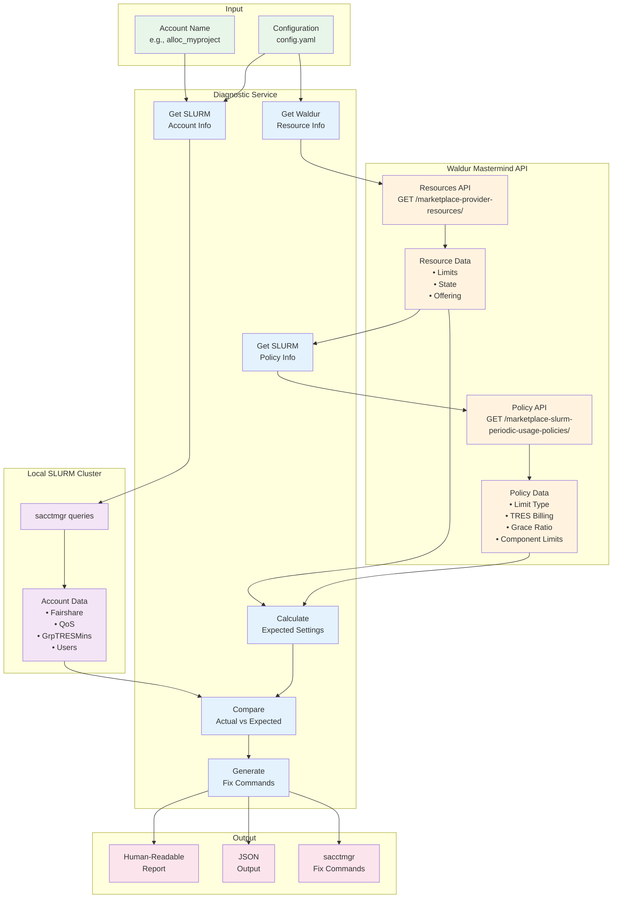
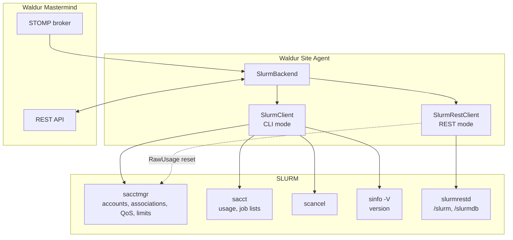

# SLURM Plugin for Waldur Site Agent

The SLURM plugin connects a Waldur offering to a SLURM cluster: it creates and
removes SLURM accounts for Waldur resources, keeps account associations in step
with project membership, applies allocation limits, reports usage back to
Waldur, and applies the periodic settings (fairshare, TRES-minute limits, raw
usage resets) that Waldur Mastermind computes from a periodic usage policy.

## Features

- **Accounts**: a `customer → project → allocation` account tree under a
  configurable root (or a flat layout under one parent), created, re-parented
  and removed as Waldur resources change.
- **Associations**: users are added to and removed from allocation accounts as
  they join and leave the Waldur project, optionally scoped to partitions and
  with a configurable default account policy.
- **Limits**: Waldur component limits become `GrpTRESMins` on the account
  (or on a dedicated per-account QoS), converted with each component's
  `unit_factor`; per-user limits are supported.
- **Usage reporting**: per-account and per-user usage for the current month,
  plus past months for the historical loader.
- **Pause / downscale / restore**: by swapping the account QoS, or with
  `GrpSubmitJobs` when QoS swapping is disabled or QoS enforcement is on.
- **Periodic settings**: fairshare, `GrpTRESMins`/`MaxTRESMins` and
  `RawUsage=0` resets pushed by Waldur over STOMP. The policy itself (grace
  ratio, carryover, billing weights, reset cadence) is computed in Mastermind;
  the agent applies what it receives.
- **Optional extras**: per-user home directories and quotas, project
  directories with Lustre quotas, LDAP project groups.
- **Two execution modes**: the SLURM CLI (`sacctmgr`, `sacct`, `scancel`,
  `sinfo`) or [slurmrestd](https://slurm.schedmd.com/slurmrestd.html).

## Installation

The plugin is a separate package, `waldur-site-agent-slurm`; installing it pulls
in the core agent and `httpx` (used by REST mode). The default
`username_management_backend` (`base`) is another package, so install it too
unless you configure a different username backend:

```bash
pip install waldur-site-agent-slurm waldur-site-agent-basic-username-management
# with LDAP project-group support:
pip install 'waldur-site-agent-slurm[ldap]' waldur-site-agent-basic-username-management
```

See the [Installation Guide](../../docs/installation.md) for running the agent
as a service.

In CLI mode the host needs the SLURM client tools (`sacctmgr`, `sacct`,
`scancel`, `sinfo`) and must be able to reach slurmdbd as a user with
`AdminLevel=Administrator`. In REST mode only RawUsage resets still need
`sacctmgr` on the host (see below).

## Configuration

### Basic configuration

```yaml
offerings:
  - name: "My SLURM Cluster"
    waldur_api_url: "https://waldur.example.com/api/"
    waldur_api_token: "<agent API token>"
    waldur_offering_uuid: "<offering UUID>"
    backend_type: "slurm"
    order_processing_backend: "slurm"
    membership_sync_backend: "slurm"
    reporting_backend: "slurm"
    backend_settings:
      default_account: "root"
      customer_prefix: "hpc_"
      project_prefix: "hpc_"
      allocation_prefix: "hpc_"
    backend_components:
      cpu:
        measured_unit: "k-Hours"
        unit_factor: 60000          # SLURM CPU-minutes per Waldur unit
        accounting_type: "limit"
        label: "CPU"
      mem:
        measured_unit: "GB-Hours"
        unit_factor: 61440          # SLURM MB-minutes per Waldur unit
        accounting_type: "limit"
        label: "RAM"
```

Component keys must match TRES names known to SLURM (`cpu`, `mem`,
`gres/gpu`, …). `unit_factor` converts one Waldur unit into the SLURM
TRES-minutes the account limit is expressed in; usage is divided by the same
factor when it is reported back.

### `backend_settings` reference

Every key the plugin reads. Keys not listed here are ignored.

- `default_account` (**required**) — `DefaultAccount=` given to user associations (see [Account
  settings](#account-settings-users-vs-accounts)); also the fallback for `root_account`.
- `customer_prefix` (**required**) — Prefix of customer-tier account names.
- `project_prefix` (**required**) — Prefix of project-tier account names.
- `allocation_prefix` (**required**) — Prefix of allocation account names (the resource's
  `backend_id`).
- `root_account` (default: `default_account`, then `"root"`) — Parent of the customer tier.
- `parent_account` (default: unset) — Flat layout: create project accounts directly under this
  account, without a customer tier. `root_account` is then unused.
- `default_account_policy` (default: `common`) — `common` (use `default_account`), `individual` (the
  allocation account itself) or `none` (leave it to slurmdbd). See
  [Upgrading](docs/upgrading.md#default_account_policy).
- `slurm_bin_path` (default: `/usr/bin`) — Directory holding the SLURM binaries.
- `cluster_name` (default: unset) — Scope every command / REST payload to one cluster. Required in
  REST mode.
- `execution_mode` (default: `cli`) — `cli` or `rest`.
- `rest_api` (default: unset) — slurmrestd connection, required when `execution_mode: rest` — see
  [REST mode](#rest-api-execution-mode).
- `default_partition` (default: unset) — Partition for user associations when partitions are not
  enforced.
- `enforce_offering_partitions` (default: `false`) — Create one association per partition of the
  Waldur offering — see [Partitions](#partitions).
- `qos_default` (default: `normal`) — Account QoS when the resource is neither paused nor
  downscaled.
- `qos_downscaled` (default: unset) — Account QoS while the resource is downscaled.
- `qos_paused` (default: unset) — Account QoS while the resource is paused.
- `qos_enforcement_enabled` (default: `false`) — Opt-in gate for per-association QoS grants — see
  [QoS enforcement](#qos-enforcement-multi-qos-offerings).
- `enforce_offering_qos` (default: unset) — With the gate on: `true` forces enforcement, `false`
  forces informational mode, unset respects the offering's `plugin_options.enforce_qos`.
- `qos_management` (default: unset) — Dedicated QoS per account — see [Per-account
  QoS](#per-account-qos-qos_management).
- `periodic_limits` (default: unset) — See [Periodic settings](#periodic-settings).
- `project_directory` (default: unset) — Project directories and Lustre quotas — see [Storage
  Quotas](#storage-quotas).
- `ldap` (default: unset) — LDAP project groups — see [LDAP project groups](#ldap-project-groups).
- `enable_user_homedir_account_creation` (default: `true`) — Create a home directory for each user
  added to an account.
- `default_homedir_umask` (default: `0077`) — Umask for created home directories.
- `homedir_base_path` (default: unset) — Home directory parent; when unset the path comes from the
  passwd database.
- `homedir_quota` (default: unset) — Per-user home directory quota — see [Storage
  Quotas](#storage-quotas).
- `soft_delete` (default: `false`) — On termination keep the account but cancel jobs, remove users
  and zero its limits, so it can be restored under the same `backend_id`.
- `check_backend_id_uniqueness` (default: `false`) — Before creating an account, ask Waldur whether
  the `backend_id` was ever used in this offering, so a terminated resource's account name is not
  reused.
- `check_all_offerings` (default: `false`) — With `check_backend_id_uniqueness`, check across all
  the customer's offerings instead of this one.
- `backend_id_max_retries` (default: `50`) — With `check_backend_id_uniqueness` (or project-slug
  naming), how many candidate account names to try before the order fails; otherwise one attempt.

### REST API execution mode

The plugin can talk to [slurmrestd](https://slurm.schedmd.com/slurmrestd.html)
instead of the SLURM CLI. Everything goes over REST — accounts, associations,
users, QoS, limits, job cancellation, health checks, and usage reporting —
except RawUsage resets (of an account or of a per-account QoS), which have no
REST endpoint and still run `sacctmgr` (so raw-usage resets need `sacctmgr` on
the host; without it they fail with an explicit error). The design record is
[docs/slurm-rest-api-design.md](../../docs/slurm-rest-api-design.md).

```yaml
offerings:
  - name: "My SLURM Cluster"
    waldur_api_url: "https://waldur.example.com/api/"
    waldur_api_token: "<agent API token>"
    waldur_offering_uuid: "<offering UUID>"
    backend_type: "slurm"
    order_processing_backend: "slurm"
    membership_sync_backend: "slurm"
    reporting_backend: "slurm"
    backend_settings:
      default_account: "root"
      customer_prefix: "hpc_"
      project_prefix: "hpc_"
      allocation_prefix: "hpc_"
      cluster_name: "mycluster"      # required in REST mode
      execution_mode: "rest"
      rest_api:
        url: "unix:///run/slurmrestd/slurmrestd.sock"   # or http://host:6820
        api_version: "v0.0.43"
        username: "waldur-agent"
        token_file: "/etc/waldur/slurmrestd.token"
        # token_env: SLURM_JWT       # alternative to token_file
    backend_components:
      cpu:
        measured_unit: "k-Hours"
        unit_factor: 60000
        accounting_type: "limit"
        label: "CPU"
```

`rest_api` keys:

- `url` (**required**) — `http(s)://host:port` or `unix:///path/to/socket`. slurmrestd speaks plain
  HTTP; use `https` only through a TLS-terminating proxy.
- `username` (**required**) — Sent as `X-SLURM-USER-NAME`.
- `token_file` / `token_env` (**one required**) — JWT source. `token_file` is re-read on HTTP
  401, so an external rotator (e.g. cron running `scontrol token`) keeps the agent working.
- `api_version` (default: `v0.0.43`) — data_parser version to pin.
- `verify_ssl` (default: `true`) — Verify TLS certificates.
- `timeout` (default: `30`) — Request timeout in seconds.

**Usage reporting differs slightly between modes.** CLI mode runs
`sacct --truncate --allocations --format=Account,ReqTRES,Elapsed,User` and so
bills *requested* TRES. REST mode reads `GET /slurmdb/{version}/jobs/` and
bills the TRES the job was *allocated* (falling back to requested TRES for jobs
that never started), clipped to the reporting month like `sacct --truncate`.
For jobs whose allocation differs from their request (e.g. whole-node
allocation) the two modes report different numbers.

Recommended SLURM version for REST mode: 25.11 or newer.

### Account settings: users vs. accounts

Two settings control how the agent places objects in the SLURM account tree.
They serve **different** purposes and are easy to confuse:

- **`default_account`** applies to **users**. It is the `DefaultAccount=` set
  on every user association — the account a user's jobs charge against when they
  don't pass `-A`. Set it to a restricted account (e.g. `restricted_access`) to
  stop users from submitting under the root account by default.
- **`root_account`** applies to **accounts**. It is the parent under which the
  top-tier (customer) account of the default hierarchy is created — i.e. the
  real root of the account tree. Optional; defaults to the value of
  `default_account`, then to `"root"`.

In the default 3-tier hierarchy the agent creates
`root_account → customer → project → allocation`. Under the default
`default_account_policy: common`, every user association gets
`DefaultAccount=default_account`. The `individual` and `none` policies
change which account (if any) is used — see
[Upgrading](docs/upgrading.md#default_account_policy) for the trade-offs.

Historically a single `default_account` setting was used for **both** roles.
That is correct only when both values are the same (e.g. both `"root"`, as in
the examples above). If you want users to default to a restricted account
**without** parenting the whole account tree under it, set the two
independently:

```yaml
backend_settings:
  default_account: "restricted_access"  # users land here by default
  root_account: "root"                  # account tree is rooted at root
```

> A flat hierarchy (project account created directly under a fixed parent,
> with no customer tier) is configured separately via the `parent_account`
> setting; when `parent_account` is set, `root_account` is not used.

### Partitions

User associations are created without a partition unless one of these applies:

- `enforce_offering_partitions: true` — one association per partition defined
  on the **Waldur offering** (Offering → Partitions). Off by default, so
  partitions recorded in Waldur for other tools (e.g. Open OnDemand) do not
  change SLURM associations.
- otherwise `default_partition` — a single association in that partition.

With QoS enforcement on, the consumer's selected partition takes precedence
(see below).

### Periodic settings

```yaml
backend_settings:
  periodic_limits:
    enabled: true
    limit_type: "GrpTRESMins"     # fallback when a message omits limit_type
    # emulator_mode: true         # development: send settings to the
    # emulator_base_url: "http://localhost:8080"   # SLURM emulator's API
```

`enabled` subscribes the offering to the `RESOURCE_PERIODIC_LIMITS` STOMP topic
(event mode). For each message the agent applies, on the allocation account:

- `fairshare` — skipped when SLURM already holds the value;
- `grp_tres_mins` / `max_tres_mins` — written as `GrpTRESMins` or
  `MaxTRESMins` (the message's `limit_type`, else the setting above), only the
  TRES that differ from what SLURM holds;
- `reset_raw_usage: true` — `RawUsage=0`.

Nothing else: the agent does not compute thresholds, carryover or decay, and
does not change QoS on its own. QoS still follows the resource's `paused` /
`downscaled` flags (see the `qos_*` settings). See also
[Verifying a raw-usage reset](#verifying-a-raw-usage-reset-on-the-cluster).

### QoS enforcement (multi-QoS offerings)

When an offering exposes multiple QoS profiles per partition, the plugin can
switch from the QoS-swap model above to a **per-association QoS grant**: in this
mode `add_user` reads the QoS (and optional partition) the consumer selected at
order time and grants it on the user→account association (`QosLevel` /
`DefaultQOS`), rather than mutating the account-level QoS.

Enforcement is **opt-in on the agent**. It stays off — regardless of any
offering's `plugin_options.enforce_qos` — until the operator enables the
`qos_enforcement_enabled` gate, so a remote flag can never make the agent mutate
SLURM QoS without consent:

```yaml
backend_settings:
  qos_enforcement_enabled: true     # opt-in gate (default false)
  # Once opted in, scope enforcement:
  #   enforce_offering_qos: null    # (default) respect each offering's flag
  #   enforce_offering_qos: true    # force enforcement for every offering
  #   enforce_offering_qos: false   # force informational mode
  # Partition scoping still applies: see "Partitions" above
  # (enforce_offering_partitions / default_partition).
```

- **Partition scope.** The grant is scoped to the consumer's selected
  partition; if none was selected it spans the enforced `offering_partitions`,
  else the `default_partition`. QoS composes with partitions — SLURM stores one
  association row per partition, each carrying the grant.
- **Pause / downscale.** Because the association QoS is a grant (not the
  operational lever), pause/downscale block new submissions with
  `GrpSubmitJobs=0` and restore clears it (`GrpSubmitJobs=-1`), leaving the QoS
  grant untouched. The `qos_paused` / `qos_downscaled` settings are **not** used
  in this mode. Forcing enforcement (`enforce_offering_qos: true`) while they are set
  is reported as a plugin schema warning at start-up; the agent still starts, enforces QoS, and
  ignores them — remove them from such offerings.
- **Execution modes.** Both `cli` and `rest` execution modes implement the QoS
  grant and the `GrpSubmitJobs` lever. In REST mode the grant is a single
  `users_association` POST whose `association` template carries the QoS.

### Per-account QoS (`qos_management`)

```yaml
backend_settings:
  qos_management:
    enabled: true                  # create a QoS named after each account
    flags: "DenyOnLimit,NoDecay"   # default
    grp_tres: "cpu=25600,node=100"
    max_jobs: 100
    max_submit: 200
    max_wall: "2-00:00:00"
    min_tres_per_job: "gres/gpu=1"
    additional_qos: ["2cpu-single-host"]   # also attached to the account
    skip_qos_swap: false           # true: pause/downscale use GrpSubmitJobs=0
    apply_limits_to_qos: false     # true: GrpTRESMins on the QoS, not the account
```

`apply_limits_to_qos` requires `enabled` and `skip_qos_swap`; `skip_qos_swap`
cannot be combined with `qos_paused` / `qos_downscaled` / an explicit
`qos_default`. The agent rejects these combinations at start-up.

### Storage Quotas

The SLURM plugin supports two independent filesystem-quota subsystems:

- **Per-user home directory quota** (`homedir_quota` / `homedir_base_path`)
  with CephFS xattr, XFS, or Lustre user-quota providers.
- **Per-project directory + Lustre group/project quota**
  (`project_directory` with optional nested `lustre_quota`).

See [docs/slurm-storage-quotas.md](../../docs/slurm-storage-quotas.md) for
configuration reference, command flow, prerequisites (Lustre project quotas
require LDAP integration), and operator troubleshooting tips.

### LDAP project groups

With an `ldap` block the plugin keeps an LDAP group per allocation account:
created with the account, members added and removed with the SLURM
associations, deleted with the account. Requires the `[ldap]` extra.

```yaml
backend_settings:
  ldap:
    uri: "ldaps://ldap.example.com"
    bind_dn: "cn=admin,dc=example,dc=com"
    bind_password: "<secret>"
    base_dn: "dc=example,dc=com"
    groups_ou: "ou=Groups"                  # default
    gid_range_start: 10000                  # default
    gid_range_end: 65000                    # default
    project_group_object_classes: ["posixGroup", "top"]   # default
    use_starttls: false                     # default
```

The block is passed to the shared [LDAP client](../ldap-client/README.md)
(`LdapClient`), which the LDAP plugin uses too; the keys and defaults are
documented in the [LDAP plugin README](../ldap/README.md).

### Event Processing Configuration

STOMP event processing is configured with top-level keys **on the offering**
(not in a separate `event_processing` block):

<!-- docs-check: skip -->

```yaml
offerings:
  - name: "My SLURM Cluster"
    backend_type: "slurm"
    # STOMP event processing for real-time periodic limits
    stomp_enabled: true
    stomp_ws_host: "mastermind.example.com"
    stomp_ws_port: 443
    stomp_ws_path: "/ws"          # optional WebSocket path
    websocket_use_tls: true       # default true
    backend_settings:
      periodic_limits:
        enabled: true
```

The set of STOMP topics the agent subscribes to is **derived automatically**
from the offering configuration — there is no user-settable
`observable_object_types` key. When `backend_settings.periodic_limits.enabled`
is `true`, the agent subscribes to the `RESOURCE_PERIODIC_LIMITS` topic
(see `_determine_observable_object_types` in
`waldur_site_agent/event_processing/utils.py`).

## Usage

### Agent modes

```bash
waldur_site_agent -m order_process   -c config.yaml   # create/update/terminate
waldur_site_agent -m membership_sync -c config.yaml   # associations, limits, QoS
waldur_site_agent -m report          -c config.yaml   # usage reporting
waldur_site_agent -m event_process   -c config.yaml   # STOMP events, periodic settings
waldur_site_diagnostics -c config.yaml                # config + cluster check
```

### Loading historical usage

```bash
waldur_site_load_historical_usage \
  --config /etc/waldur/config.yaml \
  --offering-uuid 12345678-1234-1234-1234-123456789abc \
  --user-token <token> \
  --start-date 2024-01-01 \
  --end-date 2024-12-31
```

- `--dry-run` — Log what would be submitted; send nothing.
- `--skip-user-usage` — Submit resource-level totals only.
- `--no-staff-check` — Skip the client-side staff check (service-provider tokens).
- `--reconcile-stale` — Zero Waldur usage records the backend no longer reports (e.g. usage
  previously attributed to the wrong month).
- `--resource-backend-id ID` — Only this resource; repeatable. Useful to verify a correction before
  an offering-wide run.

The loader checks by default that the token belongs to a staff user. A
service-provider token works with `--no-staff-check`, except for
usage-based components in past billing periods: Mastermind only lets staff
backfill those and rejects the submission otherwise. Resources must already
exist in Waldur, and slurmdbd must still hold job records for the period.

### Account Diagnostics

The `waldur_site_diagnose_slurm_account` command provides diagnostic information for SLURM
accounts by comparing local cluster state with Waldur Mastermind configuration.

```bash
# Basic diagnostic
waldur_site_diagnose_slurm_account alloc_myproject -c config.yaml

# JSON output for scripting
waldur_site_diagnose_slurm_account alloc_myproject --json

# Verbose output with reasoning
waldur_site_diagnose_slurm_account alloc_myproject -v
```

#### Diagnostic Data Flow


```mermaid
flowchart TB
    subgraph Input
        ACCOUNT[Account Name<br/>e.g., alloc_myproject]
        CONFIG[Configuration<br/>config.yaml]
    end

    subgraph "Local SLURM Cluster"
        SACCTMGR_Q[sacctmgr queries]
        SLURM_DATA[Account Data<br/>• Fairshare<br/>• QoS<br/>• GrpTRESMins<br/>• Users]
    end

    subgraph "Waldur Mastermind API"
        RESOURCE_API[Resources API<br/>GET /marketplace-provider-resources/]
        POLICY_API[Policy API<br/>GET /marketplace-slurm-periodic-usage-policies/]
        WALDUR_DATA[Resource Data<br/>• Limits<br/>• State<br/>• Offering]
        POLICY_DATA[Policy Data<br/>• Limit Type<br/>• TRES Billing<br/>• Grace Ratio<br/>• Component Limits]
    end

    subgraph "Diagnostic Service"
        FETCH_SLURM[Get SLURM<br/>Account Info]
        FETCH_WALDUR[Get Waldur<br/>Resource Info]
        FETCH_POLICY[Get SLURM<br/>Policy Info]
        CALCULATE[Calculate<br/>Expected Settings]
        COMPARE[Compare<br/>Actual vs Expected]
        GENERATE[Generate<br/>Fix Commands]
    end

    subgraph Output
        HUMAN[Human-Readable<br/>Report]
        JSON[JSON<br/>Output]
        FIX_CMDS[sacctmgr<br/>Fix Commands]
    end

    %% Flow
    ACCOUNT --> FETCH_SLURM
    CONFIG --> FETCH_SLURM
    CONFIG --> FETCH_WALDUR

    FETCH_SLURM --> SACCTMGR_Q
    SACCTMGR_Q --> SLURM_DATA
    SLURM_DATA --> COMPARE

    FETCH_WALDUR --> RESOURCE_API
    RESOURCE_API --> WALDUR_DATA
    WALDUR_DATA --> FETCH_POLICY
    WALDUR_DATA --> CALCULATE

    FETCH_POLICY --> POLICY_API
    POLICY_API --> POLICY_DATA
    POLICY_DATA --> CALCULATE

    CALCULATE --> COMPARE
    COMPARE --> GENERATE
    GENERATE --> HUMAN
    GENERATE --> JSON
    GENERATE --> FIX_CMDS

    %% Styling
    classDef input fill:#e8f5e9
    classDef slurm fill:#f3e5f5
    classDef waldur fill:#fff3e0
    classDef service fill:#e3f2fd
    classDef output fill:#fce4ec

    class ACCOUNT,CONFIG input
    class SACCTMGR_Q,SLURM_DATA slurm
    class RESOURCE_API,POLICY_API,WALDUR_DATA,POLICY_DATA waldur
    class FETCH_SLURM,FETCH_WALDUR,FETCH_POLICY,CALCULATE,COMPARE,GENERATE service
    class HUMAN,JSON,FIX_CMDS output
```

#### Diagnostic Output

The diagnostic provides:

1. **SLURM Cluster Status**: Account existence, fairshare, QoS, limits, users
2. **Waldur Mastermind Status**: Resource state, offering, configured limits
3. **SLURM Policy Status**: Period, limit type, TRES billing, grace ratio
4. **Expected vs Actual Comparison**: Field-by-field comparison with status
5. **Unit Conversion Info**: Shows how Waldur units convert to SLURM units
6. **Remediation Commands**: `sacctmgr` commands to fix any mismatches

#### Unit Conversions

Waldur and SLURM may use different units for resource limits. The diagnostic shows:

- **Waldur units**: e.g., Hours, GB-Hours (from offering configuration)
- **SLURM units**: e.g., TRES-minutes (from limit type: GrpTRESMins, MaxTRESMins)
- **Conversion factor**: The `unit_factor` from backend component configuration

For example, if Waldur uses "k-Hours" (kilo-hours) and SLURM uses "TRES-minutes", with a
`unit_factor` of 60000:

```text
Waldur: 100 k-Hours -> SLURM: 6000000 TRES-minutes (factor: 60000)
```

Use `-v/--verbose` to see detailed unit conversion information for each component.

Example output:

```text
================================================================================
SLURM Account Diagnostic: alloc_myproject_abc123
================================================================================

SLURM CLUSTER
--------------------------------------------------------------------------------
  Account Exists:     Yes
  Fairshare:          1000
  QoS:                normal
  GrpTRESMins:        cpu=6000000,mem=10000000

WALDUR MASTERMIND
--------------------------------------------------------------------------------
  Resource Found:     Yes
  Resource Name:      My Project Allocation
  State:              OK
  Limits:             cpu=100, mem=10

SLURM POLICY
--------------------------------------------------------------------------------
  Policy Found:       Yes
  Period:             quarterly
  Limit Type:         GrpTRESMins
  TRES Billing:       Enabled

EXPECTED vs ACTUAL
--------------------------------------------------------------------------------
  [OK]       qos: normal == normal
  [OK]       GrpTRESMins[cpu]: 6000000 == 6000000
             Units: Waldur: 100.0 k-Hours -> SLURM: 6000000 TRES-minutes (factor: 60000.0)
  [MISMATCH] GrpTRESMins[mem]: 8000000 != 10000000
             Units: Waldur: 10.0 k-GB-Hours -> SLURM: 10000000 TRES-minutes (factor: 1000000.0)

REMEDIATION COMMANDS
--------------------------------------------------------------------------------
  sacctmgr -i modify account alloc_myproject_abc123 set GrpTRESMins=cpu=6000000,mem=10000000

OVERALL: MISMATCH (1 issue found)
================================================================================
```

#### CLI Options

| Option | Description |
|--------|-------------|
| `account_name` | SLURM account name to diagnose (required) |
| `-c, --config` | Path to configuration file (default: waldur-site-agent-config.yaml) |
| `--offering-uuid` | Specific offering UUID (auto-detected if not specified) |
| `--json` | Output in JSON format for scripting |
| `-v, --verbose` | Include detailed reasoning in output |
| `--no-color` | Disable colored output |

## Architecture


```mermaid
graph TB
    subgraph "Waldur Site Agent"
        BACKEND[SlurmBackend]
        CLIENT[SlurmClient<br/>CLI mode]
        REST[SlurmRestClient<br/>REST mode]
    end

    subgraph "SLURM"
        SACCTMGR[sacctmgr<br/>accounts, associations, QoS, limits]
        SACCT[sacct<br/>usage, job lists]
        SCANCEL[scancel]
        SINFO[sinfo -V<br/>version]
        SLURMRESTD[slurmrestd<br/>/slurm, /slurmdb]
    end

    subgraph "Waldur Mastermind"
        API[REST API]
        STOMP[STOMP broker]
    end

    BACKEND --> CLIENT
    BACKEND --> REST
    CLIENT --> SACCTMGR
    CLIENT --> SACCT
    CLIENT --> SCANCEL
    CLIENT --> SINFO
    REST --> SLURMRESTD
    REST -. RawUsage reset .-> SACCTMGR
    BACKEND <--> API
    STOMP --> BACKEND
```

The CLI client also runs `id -u <user>` to check that a user exists on the
host before creating an association.

### Backend methods

`SlurmBackend` extends `BaseBackend`:

- **Lifecycle**: `create_resource` / `delete_resource` (inherited);
  `_pre_create_resource` builds the account tree, LDAP group, QoS and project
  directory; `post_create_resource` creates home directories;
  `_pre_delete_resource` cancels jobs, removes users, QoS and LDAP group.
- **Limits**: `_collect_resource_limits`, `set_resource_limits`,
  `get_resource_limits`, `set_resource_user_limits`.
- **Users**: `add_user`, `add_users_to_resource`, `remove_user`,
  `remove_users_from_resource` (inherited), `process_existing_users`.
- **Usage**: `_get_usage_report`, `get_usage_report_for_period`.
- **State**: `downscale_resource`, `pause_resource`, `restore_resource`,
  `get_resource_metadata` (current QoS).
- **Periodic settings**: `apply_periodic_settings`.
- **Health**: `ping` (lists accounts), `diagnostics`, `list_components`.

### Commands the CLI client runs

`sacctmgr` runs with `--parsable2 --noheader --immediate`. When `cluster_name`
is set, `sacctmgr` commands get a `cluster=` filter and `sacct` / `scancel` get
`--cluster=`.

```bash
# Accounts
sacctmgr add account hpc_alloc1 description="..." organization="..." parent="hpc_proj1"
sacctmgr modify account where name=hpc_alloc1 set parent=hpc_proj2
sacctmgr remove account where name=hpc_alloc1

# Associations
sacctmgr add user alice account=hpc_alloc1 DefaultAccount=root Share=parent
sacctmgr remove user where name=alice and account=hpc_alloc1

# Limits, QoS, periodic settings
sacctmgr modify account hpc_alloc1 set GrpTRESMins=cpu=600000
sacctmgr modify account hpc_alloc1 set qos=normal
sacctmgr modify account hpc_alloc1 set fairshare=500
sacctmgr modify account hpc_alloc1 set RawUsage=0

# Usage for the current month
sacct --noconvert --truncate --allocations --allusers \
  --starttime=2024-01-01T00:00:00 --endtime=2024-01-31T23:59:59 \
  --accounts=hpc_alloc1 --format=Account,ReqTRES,Elapsed,User

# Termination
scancel -A hpc_alloc1 -f
```

## Testing

Unit tests live in `tests/`; `tests/test_periodic_limits/` and
`tests/test_historical_usage/` have their own READMEs, and `tests/e2e/` holds
end-to-end suites gated by `WALDUR_E2E_TESTS` (see
[docs/e2e-testing.md](../../docs/e2e-testing.md)). Tests that need SLURM
commands use [slurm-emulator](https://pypi.org/project/slurm-emulator/), part
of the plugin's `dev` dependency group.

```bash
uv sync --all-packages
cd plugins/slurm
uv run pytest tests/ --ignore=tests/e2e
uv run pytest tests/test_periodic_limits/
uv run pytest tests/ --cov=waldur_site_agent_slurm --cov-report=html
```

The emulator keeps its state in `/tmp/slurm_emulator_db.json` unless
`SLURM_EMULATOR_STATE_FILE` points elsewhere; set it when running tests next to
a live agent or other test runs.

## Troubleshooting

- **`Command not found: … sacctmgr`** — the binaries are not in
  `slurm_bin_path` (default `/usr/bin`).
- **Permission denied / "not an administrator"** — the agent's user needs
  `AdminLevel=Administrator` in slurmdbd.
- **Periodic settings never arrive** — the offering needs `stomp_enabled: true`
  and `periodic_limits.enabled: true`, the agent must run in `event_process`
  mode, and Mastermind must have a periodic usage policy for the offering.
- **Historical load rejected with "backfilling past billing periods"** — use a
  staff token.
- **RawUsage reset fails in REST mode** — install the SLURM client tools on
  the agent host (see [REST mode](#rest-api-execution-mode)).

`waldur_site_diagnostics -c config.yaml` checks the configuration, the SLURM
version, the binaries and the connection to the cluster, and exits non-zero on
failure. For one account, use `waldur_site_diagnose_slurm_account` (above).

### Verifying a raw-usage reset on the cluster

When a periodic policy resets raw usage, Mastermind emits an
`apply_periodic_settings` message with `reset_raw_usage: true`, and this plugin
runs `sacctmgr modify account <account> set RawUsage=0`. The account name is the
Waldur resource's `backend_id`. To confirm what actually happened on SLURM —
independent of what the Waldur UI shows — use these commands (replace
`waldur_project123` with the account):

```bash
# Ground-truth run time and actor of the reset (SLURM's own audit log)
sacctmgr show transactions Start=2024-01-01 \
  format=TimeStamp,Actor,Action,Info,Where

# Current raw (fair-share) usage — refreshed every PriorityCalcPeriod (~5 min),
# so it will not read exactly 0 shortly after a reset
sshare -A waldur_project123 -o Account,User,RawUsage,GrpTRESRaw

# Confirm SLURM is not also auto-resetting usage on its own schedule.
# PriorityUsageResetPeriod = NONE means resets come only from this plugin.
scontrol show config | grep -iE 'Priority(DecayHalfLife|UsageResetPeriod|CalcPeriod)'

# The limit the reset is measured against
sacctmgr show assoc account=waldur_project123 \
  format=Account,User,GrpTRESMins,GrpTRES,Fairshare
```

> **Note:** the `executed_at` timestamp in the Waldur execution log is
> Mastermind's **emit** time, not the cluster run time. `sacctmgr show
> transactions` above is the authoritative source for when the reset actually
> applied. Reconcile all timestamps in UTC before drawing conclusions.

## See also

- [Configuration reference](../../docs/configuration.md)
- [Upgrading the SLURM plugin](docs/upgrading.md)
- [Usage reporting setup](../../docs/slurm-usage-reporting-setup.md)
- [Storage quotas](../../docs/slurm-storage-quotas.md)
- [REST API design](../../docs/slurm-rest-api-design.md)
