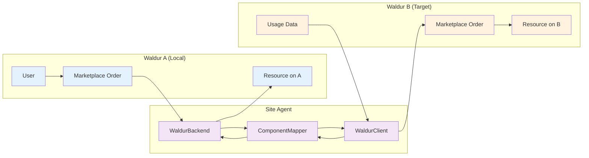
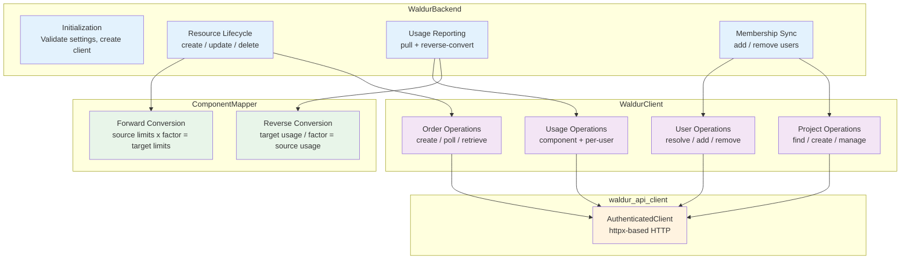
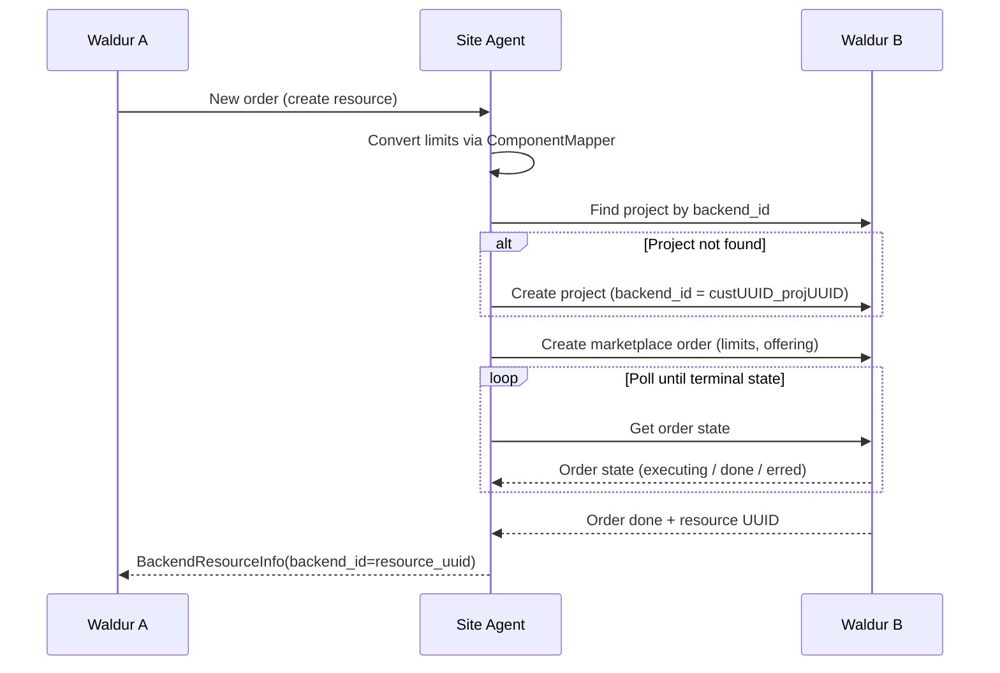
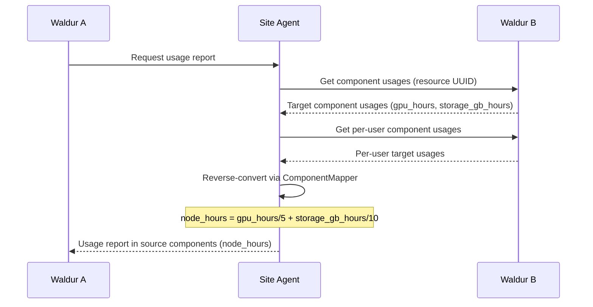
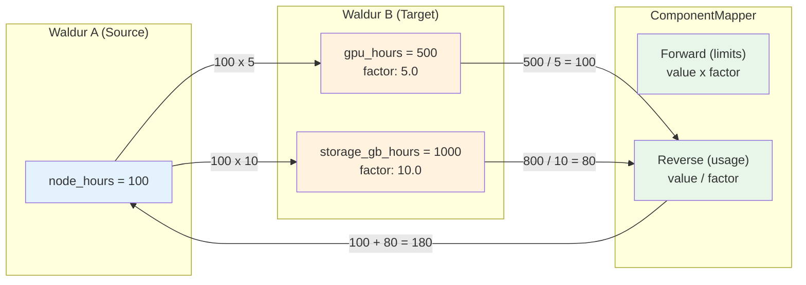

# Waldur Federation Plugin for Waldur Site Agent

Waldur-to-Waldur federation backend plugin for Waldur Site Agent. Enables federating
resources, usage, and memberships between two Waldur instances (Waldur A and Waldur B),
replacing the `marketplace_remote` Django app with a stateless, polling-based approach.

## Overview

The plugin acts as a bridge: Waldur A (the "local" instance) receives orders from users
and delegates resource lifecycle management to Waldur B (the "target" instance) via its
marketplace API. Usage is pulled back from Waldur B and reported to Waldur A, with
optional component type conversion.



## Features

- **Order Forwarding**: Create, update, and terminate resources on Waldur B via marketplace orders
- **Component Mapping**: Configurable conversion factors between Waldur A and Waldur B component types
- **Passthrough Mode**: 1:1 forwarding when no conversion is needed
- **Usage Pulling**: Fetches total and per-user usage from Waldur B, reverse-converts to Waldur A components
- **Membership Sync**: Synchronizes project memberships with configurable user matching (CUID, email, username)
- **Project Tracking**: Automatic project creation on Waldur B with `backend_id` mapping

## Architecture

### Component Overview



### Resource Creation Flow



### Usage Reporting Flow



### Component Mapping

The `ComponentMapper` handles bidirectional conversion between component types
on Waldur A (source) and Waldur B (target).



**Passthrough mode**: When no `target_components` are configured for a component,
it maps 1:1 with the same name and factor 1.0.

**Fan-out**: A single source component can map to multiple target components.

**Fan-in (reverse)**: Multiple target components contributing to the same source
component are summed: `source = SUM(target_value / factor)`.

## Configuration

### Full Example

```yaml
offerings:
  - name: "Federated HPC Access"
    waldur_api_url: "https://waldur-a.example.com/api/"
    waldur_api_token: "token-for-waldur-a"
    waldur_offering_uuid: "offering-uuid-on-waldur-a"
    backend_type: "waldur"
    order_processing_backend: "waldur"
    membership_sync_backend: "waldur"
    reporting_backend: "waldur"
    backend_settings:
      target_api_url: "https://waldur-b.example.com/api/"
      target_api_token: "service-account-token-for-waldur-b"
      target_offering_uuid: "offering-uuid-on-waldur-b"
      target_customer_uuid: "customer-uuid-on-waldur-b"
      user_match_field: "cuid"        # cuid | email | username
      order_poll_timeout: 300          # seconds
      order_poll_interval: 5           # seconds
      user_not_found_action: "warn"    # warn | fail
    backend_components:
      node_hours:
        measured_unit: "Hours"
        unit_factor: 1
        accounting_type: "usage"
        label: "Node Hours"
        target_components:
          gpu_hours:
            factor: 5.0
          storage_gb_hours:
            factor: 10.0
```

### Passthrough Configuration

When Waldur A and Waldur B use the same component types, omit `target_components`:

```yaml
    backend_components:
      cpu:
        measured_unit: "Hours"
        unit_factor: 1
        accounting_type: "usage"
        label: "CPU Hours"
      mem:
        measured_unit: "GB"
        unit_factor: 1
        accounting_type: "usage"
        label: "Memory GB"
```

### Backend Settings Reference

| Setting | Required | Default | Description |
|---------|----------|---------|-------------|
| `target_api_url` | Yes | -- | Base URL for Waldur B API |
| `target_api_token` | Yes | -- | Service account token for Waldur B |
| `target_offering_uuid` | Yes | -- | Offering UUID on Waldur B |
| `target_customer_uuid` | Yes | -- | Customer/organization UUID on Waldur B |
| `user_match_field` | No | `cuid` | User matching strategy: `cuid`, `email`, or `username` |
| `order_poll_timeout` | No | `300` | Max seconds to wait for order completion |
| `order_poll_interval` | No | `5` | Seconds between order state polls |
| `user_not_found_action` | No | `warn` | Behavior when user not found: `warn` (skip) or `fail` (error) |

### Component Target Configuration

Each source component can optionally define `target_components`:

| Field | Required | Default | Description |
|-------|----------|---------|-------------|
| `factor` | No | `1.0` | Conversion factor (must be > 0). Target = source x factor |

## Usage

### Agent Modes

```bash
# Process orders: create/update/terminate resources on Waldur B
uv run waldur_site_agent -m order_process -c config.yaml

# Report usage: pull from Waldur B, reverse-convert, report to Waldur A
uv run waldur_site_agent -m report -c config.yaml

# Sync memberships: resolve users and manage project teams on Waldur B
uv run waldur_site_agent -m membership_sync -c config.yaml
```

### Agent Mode Data Flow

```mermaid
graph TB
    subgraph "order_process mode"
        OP_FETCH[Fetch pending orders<br/>from Waldur A]
        OP_CREATE[Create resource<br/>on Waldur B]
        OP_UPDATE[Update limits<br/>on Waldur B]
        OP_DELETE[Terminate resource<br/>on Waldur B]
        OP_REPORT[Report result<br/>to Waldur A]

        OP_FETCH --> OP_CREATE
        OP_FETCH --> OP_UPDATE
        OP_FETCH --> OP_DELETE
        OP_CREATE --> OP_REPORT
        OP_UPDATE --> OP_REPORT
        OP_DELETE --> OP_REPORT
    end

    subgraph "report mode"
        R_LIST[List resources<br/>on Waldur B]
        R_PULL[Pull component usages<br/>+ per-user usages]
        R_CONVERT[Reverse-convert<br/>via ComponentMapper]
        R_SUBMIT[Submit usage<br/>to Waldur A]

        R_LIST --> R_PULL --> R_CONVERT --> R_SUBMIT
    end

    subgraph "membership_sync mode"
        M_DIFF[Compute membership diff<br/>Waldur A vs Waldur B]
        M_RESOLVE[Resolve users<br/>cuid / email / username]
        M_ADD[Add to project<br/>on Waldur B]
        M_REMOVE[Remove from project<br/>on Waldur B]

        M_DIFF --> M_RESOLVE
        M_RESOLVE --> M_ADD
        M_RESOLVE --> M_REMOVE
    end

    classDef orderMode fill:#e3f2fd
    classDef reportMode fill:#e8f5e9
    classDef memberMode fill:#f3e5f5

    class OP_FETCH,OP_CREATE,OP_UPDATE,OP_DELETE,OP_REPORT orderMode
    class R_LIST,R_PULL,R_CONVERT,R_SUBMIT reportMode
    class M_DIFF,M_RESOLVE,M_ADD,M_REMOVE memberMode
```



## Plugin Structure

```text
plugins/waldur/
├── pyproject.toml                         # Package metadata + entry points
├── README.md
├── waldur_site_agent_waldur/
│   ├── __init__.py
│   ├── backend.py                         # WaldurBackend(BaseBackend)
│   ├── client.py                          # WaldurClient(BaseClient)
│   ├── component_mapping.py               # ComponentMapper (forward + reverse)
│   └── schemas.py                         # Pydantic validation schemas
└── tests/
    ├── __init__.py
    ├── conftest.py                        # Shared test fixtures
    ├── test_backend.py                    # Backend tests (29 tests)
    ├── test_client.py                     # Client tests (20 tests)
    └── test_component_mapping.py          # Mapper tests (22 tests)
```

### Entry Points

The plugin registers three entry points for automatic discovery:

```toml
[project.entry-points."waldur_site_agent.backends"]
waldur = "waldur_site_agent_waldur.backend:WaldurBackend"

[project.entry-points."waldur_site_agent.component_schemas"]
waldur = "waldur_site_agent_waldur.schemas:WaldurComponentSchema"

[project.entry-points."waldur_site_agent.backend_settings_schemas"]
waldur = "waldur_site_agent_waldur.schemas:WaldurBackendSettingsSchema"
```

## User Matching

The plugin supports three strategies for resolving Waldur A users on Waldur B:

| Strategy | Setting | Waldur B API | Use Case |
|----------|---------|-------------|----------|
| eduTeams CUID | `cuid` | `remote_eduteams` endpoint | Both instances use eduTeams federation |
| Email | `email` | `users_list(email=...)` | Shared email addresses between instances |
| Username | `username` | `users_list(username=...)` | Shared usernames between instances |

Resolved user UUIDs are cached for the lifetime of the backend instance to minimize API calls.

When a user cannot be resolved on Waldur B:

- **`warn`** (default): Log a warning and skip the user
- **`fail`**: Raise a `BackendError` (caught per-user, does not abort the batch)

## Project Mapping

Projects on Waldur B are tracked using `backend_id`:

```text
backend_id = "{customer_uuid_on_A}_{project_uuid_on_A}"
```

On each resource creation, the plugin:

1. Searches for an existing project on Waldur B with the matching `backend_id`
2. Creates a new project under the configured `target_customer_uuid` if not found
3. Uses the project for all subsequent operations on that resource

## Testing

```bash
# Run all plugin tests
uv run pytest plugins/waldur/tests/ -v

# Run with coverage
uv run pytest plugins/waldur/tests/ --cov=waldur_site_agent_waldur

# Run specific test class
uv run pytest plugins/waldur/tests/test_backend.py::TestResourceCreation -v
```

### Test Coverage

| Module | Tests | Focus |
|--------|-------|-------|
| `test_component_mapping.py` | 22 | Forward/reverse conversion, passthrough, round-trip |
| `test_client.py` | 20 | API operations with mocked `waldur_api_client` |
| `test_backend.py` | 29 | Resource lifecycle, usage reporting, membership sync |

## Comparison with marketplace_remote

This plugin replaces the `marketplace_remote` Django app from waldur-mastermind:

| Capability | marketplace_remote | This Plugin |
|---|---|---|
| Order forwarding | Celery tasks + Django signals | Polling-based, stateless |
| Project tracking | Django model (ProjectUpdateRequest) | `backend_id` on Waldur B projects |
| Order polling | Celery retries (OrderStatePullTask) | Synchronous polling loop |
| Usage pulling | Direct DB writes (ComponentUsage model) | API fetch + reverse conversion |
| User sync | eduTeams CUID only | Configurable: cuid / email / username |
| Component mapping | 1:1 (same component types) | Configurable conversion factors |
| State management | Django ORM | Stateless (no local DB) |
| Offering sync | Yes (pull offerings, plans, screenshots) | Not needed (configured in YAML) |
| Invoice pulling | Yes | Not applicable (Waldur A handles billing) |
| Robot accounts | Yes | Not applicable |
