# Integration Test Report: Username Sync and STOMP Event Routing

**Date:** 2026-02-26T21:55:00Z
**Branch:** `feature/sync-usernames-waldur`
**Waldur:** `http://localhost:8000/api/`
**RabbitMQ:** `localhost:15674/ws`
**Result:** 18 passed, 0 failed (117.18s)

## Test Suites

| Suite | Tests | Result |
|-------|-------|--------|
| TestUsernameSyncIntegration | 6 | All passed |
| TestIdentityManagerEventRouting | 5 | All passed |
| TestPeriodicReconciliationIntegration | 7 | All passed |

## Permission Model Under Test

| Role | User | Permissions |
|------|------|-------------|
| user_a | OFFERING.MANAGER on A | List/manage offering users, agent identity |
| user_b | CUSTOMER.OWNER on C (non-SP) + IDM | Offering user access via ISD overlap |
| subject_user | Regular user with `active_isds` | Offering user on both offerings |

## Suite 1: TestUsernameSyncIntegration

Polling-based username synchronization from Waldur B to Waldur A.

**Key change:** Offering users are now auto-created via Waldur's natural
`role_granted` -> `create_or_restore_offering_users_for_user` flow instead
of being manually POST'd to `/api/marketplace-offering-users/`.

### test_01 — Environment Setup and Token Verification

Creates all entities, assigns roles, creates resources, triggers offering
user auto-creation, verifies access.

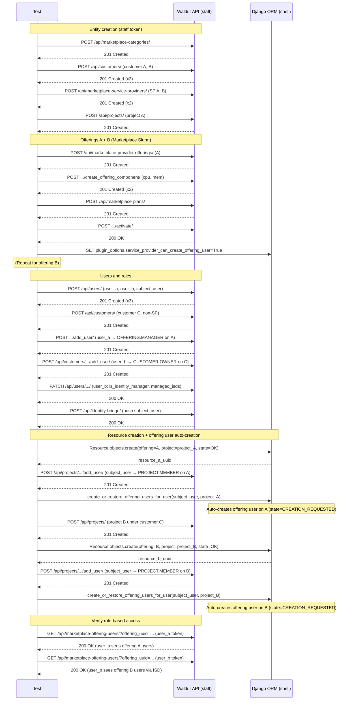

### test_02 — Verify Offering Users Auto-Created

Polls for auto-created offering users on both offerings. Transitions A to OK state.

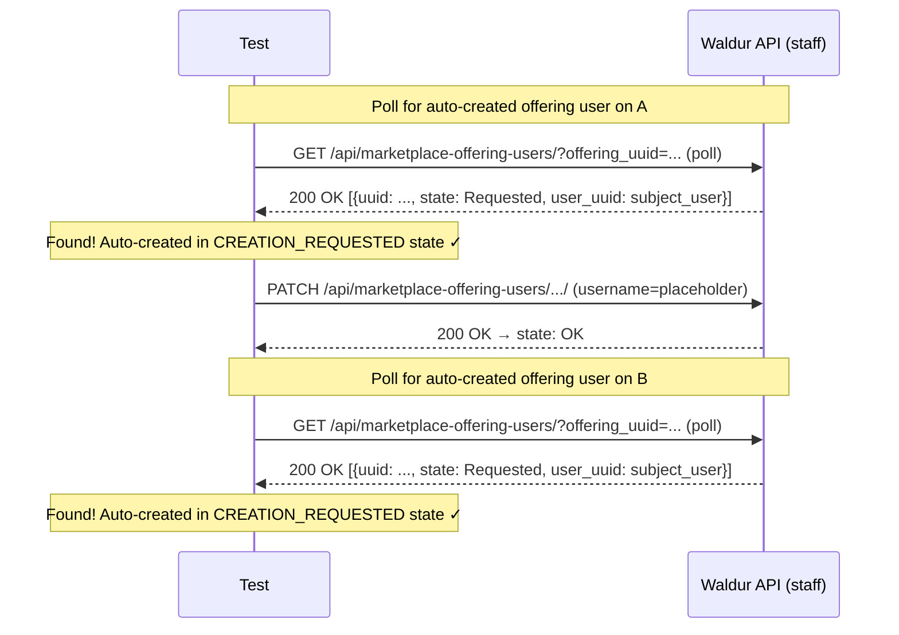

### test_03 — Set Target Username on B

Sets the "real" username on offering B (transitions CREATION_REQUESTED -> OK).

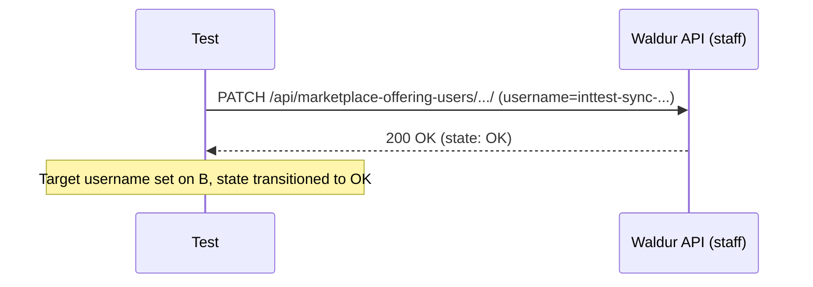

### test_04 — Sync Usernames (B → A)

Calls `sync_offering_user_usernames()` which reads B, compares with A, patches mismatches.

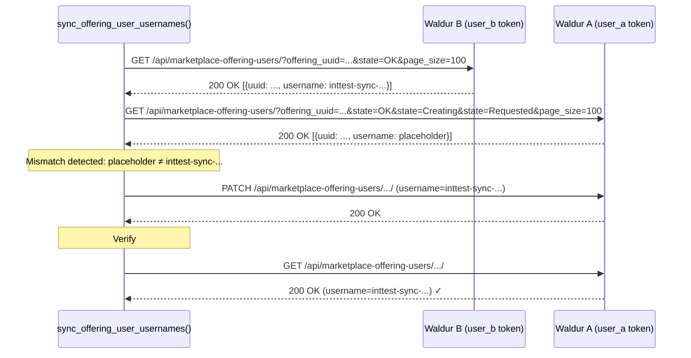

### test_05 — Idempotent Second Sync

Runs sync again — no PATCH needed since usernames already match.

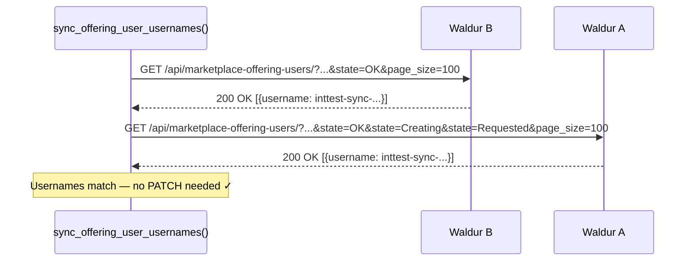

### test_06 — Cleanup

Deletes auto-created offering users and all entities.

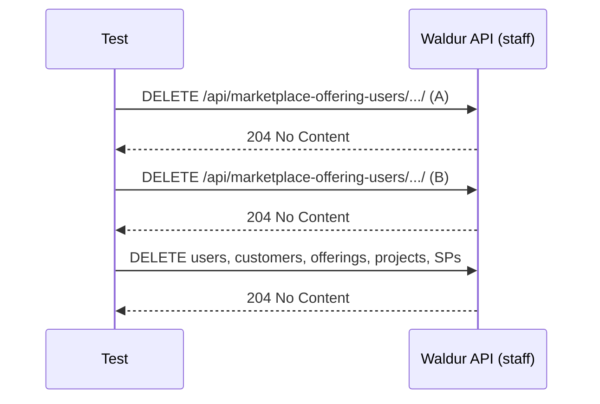

## Suite 2: TestIdentityManagerEventRouting

STOMP event delivery to OFFERING.MANAGER (user_a) and ISD identity manager (user_b).

### test_01 — Verify Prerequisites

Same entity setup as Suite 1 plus STOMP availability check.

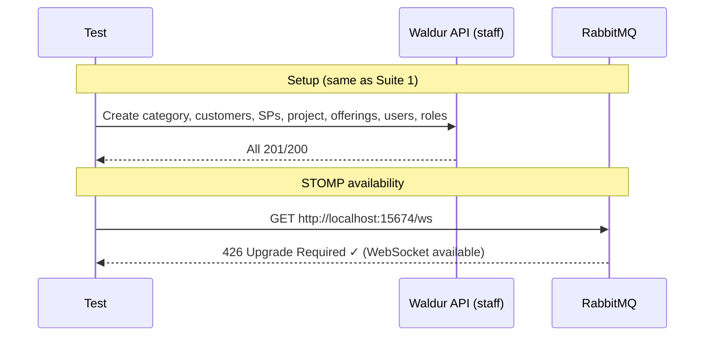

### test_02 — Setup STOMP Subscriptions

Registers agent identities and STOMP subscriptions for both users.

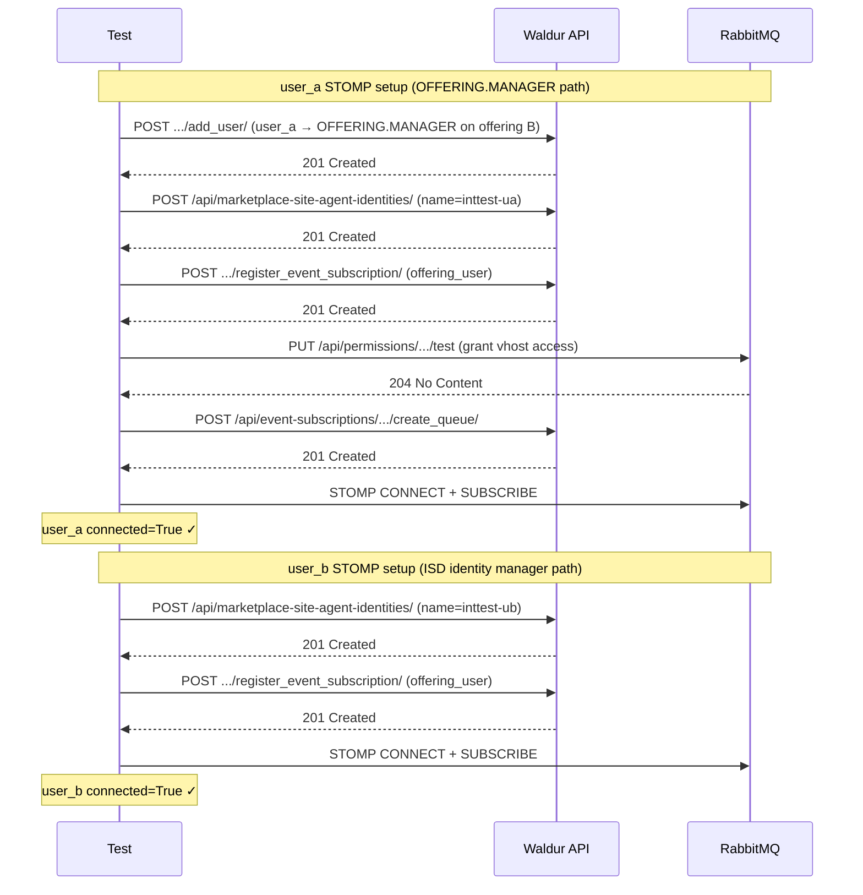

### test_03 — Trigger and Verify Events

Creates an offering user on offering B, patches username, verifies both subscribers receive events.

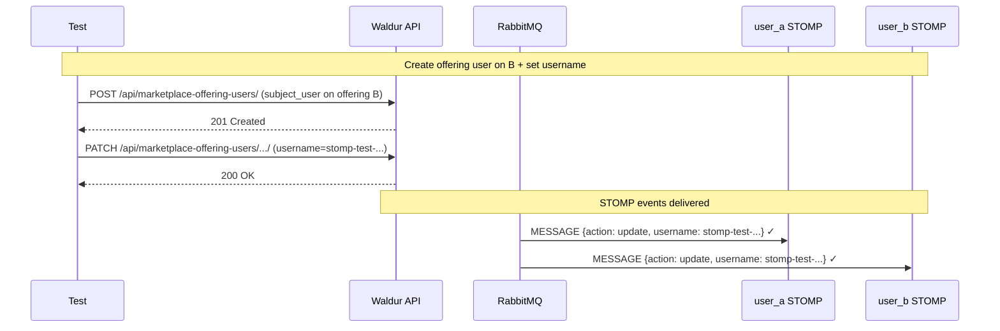

### test_04 — Verify Events After Clearing ISDs

Clears user_b's `managed_isds`, triggers another username change, verifies user_b stops receiving events.

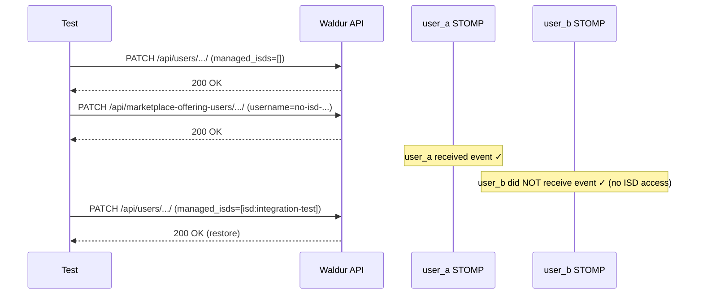

### test_05 — Cleanup

Disconnects STOMP, deletes all entities.

## Suite 3: TestPeriodicReconciliationIntegration

Tests `run_periodic_username_reconciliation()` end-to-end.

### test_01 — Verify Prerequisites (Suite 3)

Same entity setup as Suite 1 (separate env instance).

### test_02 — Create Offering Users (Suite 3)

Creates offering users on both offerings (uses manual POST since this suite
tests reconciliation logic, not auto-creation).

### test_03 — Set Target Username (Suite 3)

Sets username on offering B.

### test_04 — Run Periodic Reconciliation

Calls `run_periodic_username_reconciliation()` which internally calls `sync_offering_user_usernames()`.

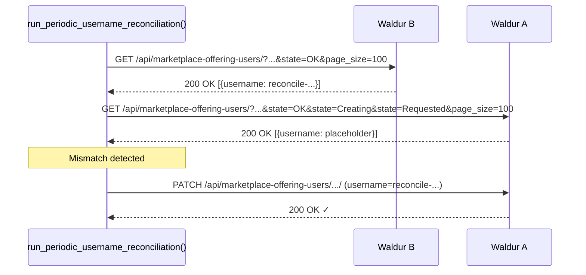

### test_05 — Idempotent Second Reconciliation

Second call is a no-op (usernames already match).

### test_06 — Skips Non-qualifying Offering

Verifies reconciliation skips offerings without `stomp_enabled` or `membership_sync_backend`.

### test_07 — Cleanup

Deletes offering users and entities.

## Key Design Decisions

### Natural Offering User Auto-Creation (Suite 1)

The `env` fixture uses Waldur's natural flow for creating offering users:

1. **Resource creation via Django ORM** — `Marketplace.Slurm` offerings can't create
   orders via API without a real SLURM backend (no `scope`/service_settings). Resources
   are created directly with `state=Resource.States.OK`.

2. **Project role assignment via API** — `POST /api/projects/{uuid}/add_user/` fires
   the `role_granted` signal.

3. **Task invocation via Django shell** — Since there's no Celery worker with `runserver`,
   the `create_or_restore_offering_users_for_user` task is called directly via
   `uv run waldur shell -c "..."`.

This produces offering users in `CREATION_REQUESTED` state with empty username
(`username_generation_policy=service_provider`), matching production behavior.

### STOMP Message Summary (Suite 2)

| # | Action | Received by |
|---|--------|-------------|
| 1-5 | create, update, username_set | user_a + user_b |
| 6-7 | update, username_set (after clearing ISDs) | user_a only |

**Key finding:** After clearing `managed_isds` on user_b, event publishing correctly
filters based on ISD identity manager access.
